## WEB STACK IMPLEMENTATION (LAMP STACK) IN AWS

### Introduction:

__The LAMP stack is a very well-known web development platform, it is open source and it is made up of four main components which are: Linux, Apache, MySQL, and PHP (sometimes Perl or Python). This documentation will show you how to setup, configure and use the LAMP stack for your consumption.__

## Step 0: Getting Ready

_Here, we ensure that the environment (Linux Os) we need to run/serve our website is made ready_

__1.__ Spin up an EC2 instance of t2.micro with the Ubunto 24.04 LTS Operating System in a region closest to you (I used eu-west-2a)

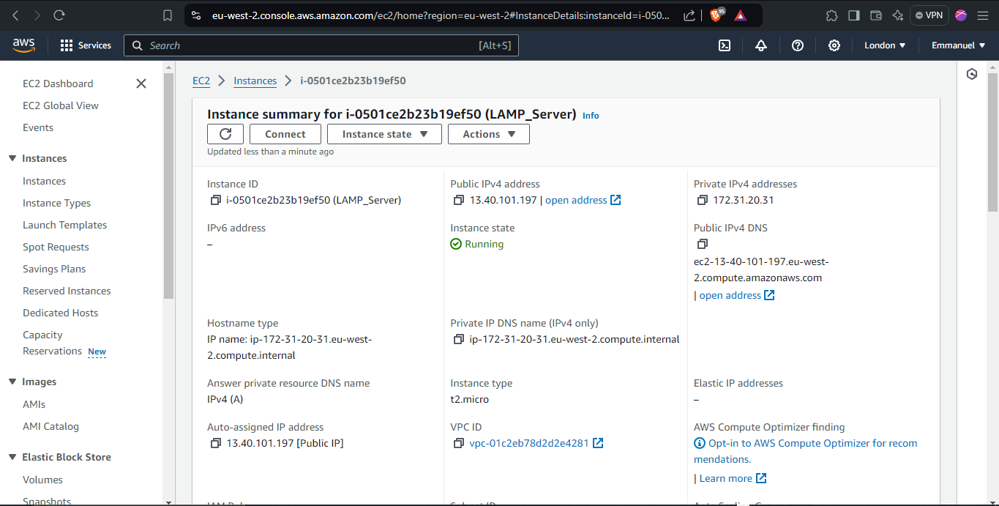
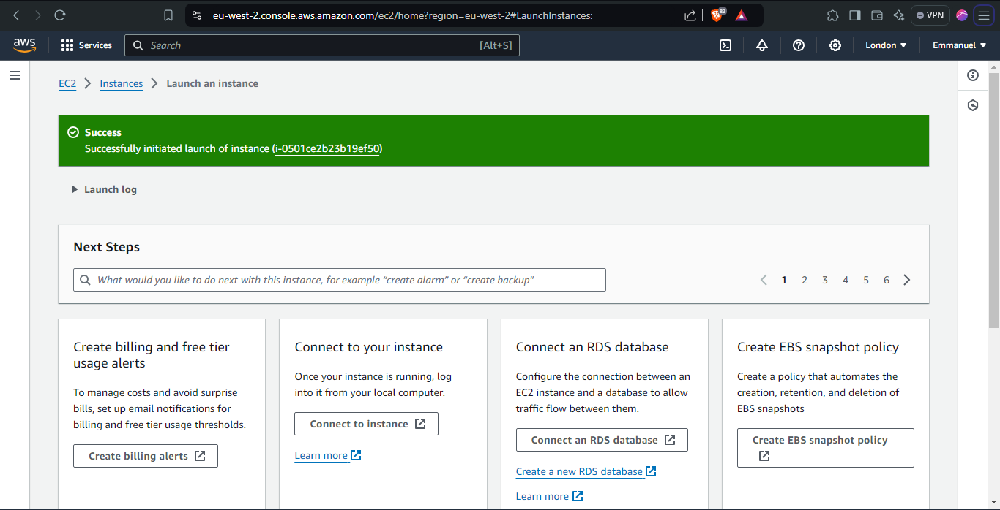

__2.__ Ensure you create an SSH Key pair when launching/creating your instance. This key pair would be crucial in accessing this instance via port 22

__3.__ Also, while creating this EC2 instance, it is important to create a security group configured with the below inbound rules:

- Allow traffic on port 80 (HTTP) from any source IP on the internet
- Allow traffic on port 443 (HTTPS) from any source IP on the internet
- Allow traffic on port 22 (SSH) from any source IP _(This rule is allowed by default)_
 
 __4.__ Ensure that you select the right VPC when creating the EC2 instance (on my case, I used the default VPC).

 __5.__ Download the private ssh key, note the location of download and utilize it to access the EC2 instance from your terminal (a windows OS is assumed here) with the help of running this commmand: 
 ```
 ssh -i "your-ec2-key.pem" <username>@IPAddress
 ```
 in our case, __username=ubuntu__ and __public ip address=35.179.168.126 (this address changes at every shutdown and startup of an instance (Elastic IP))__

 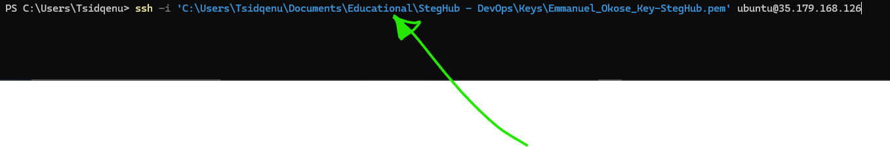


 ## Step 1 - Install Apache and Configure the Firewall
**1.** __First, you have to update and upgrade the package manager's repository__

To achieve this, after connecting to your instance, run this command in your terminal.
```
sudo apt update
sudo apt upgrade -y
```
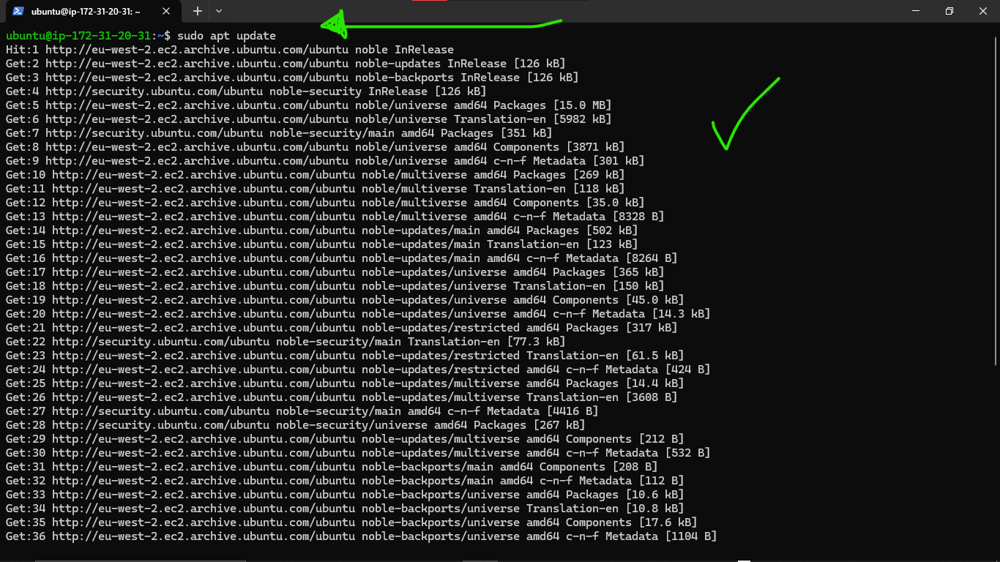

__2.__ __Install Apache2__
```
sudo apt install apache2 -y
```
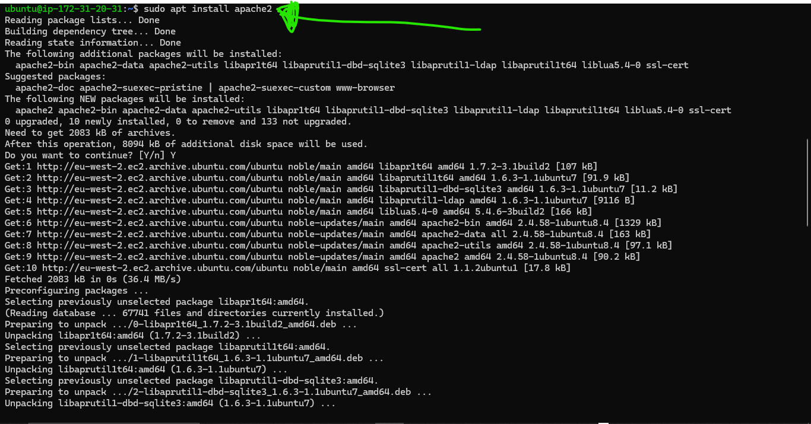

__3.__ __Enable Apache2 and Verify that it is running__
```
sudo systemctl enable apache2
sudo systemctl status apache2
```
after runnnig the `systemctl status` command, if the output is having any green indication _(as shown in the image below)_ , then be rest assured that it is up and running

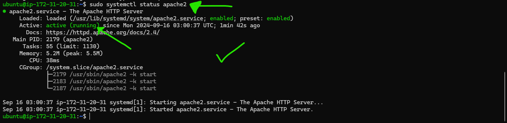


__4.__ __Verify that the server is running and can be accessed locally via your ubuntu shell by running this command__
```
curl http://localhost:80
OR
curl http://127.0.0.1:80
```

__5.__ __Test if you can access the default page apache serves on your server by trying to access your EC2 public IP via a browser__
```
http://35.179.168.126:80
```
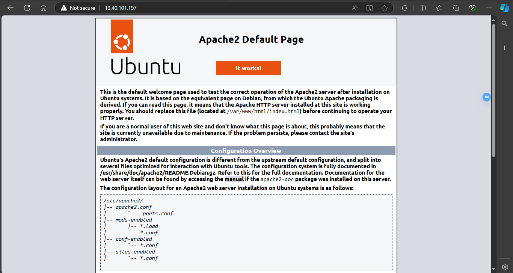
This indicates that the web server has been correctly installed and is now accessible through th firewall.

## Step 2 - Install MySQL
__1.__ __Install a relatioal database (RDB) to handle your webapp__

In our case, we installed MySQL. This is a widely used relational database managemet system that works well within PHP environments.
```
sudo apt install mysql-server
```
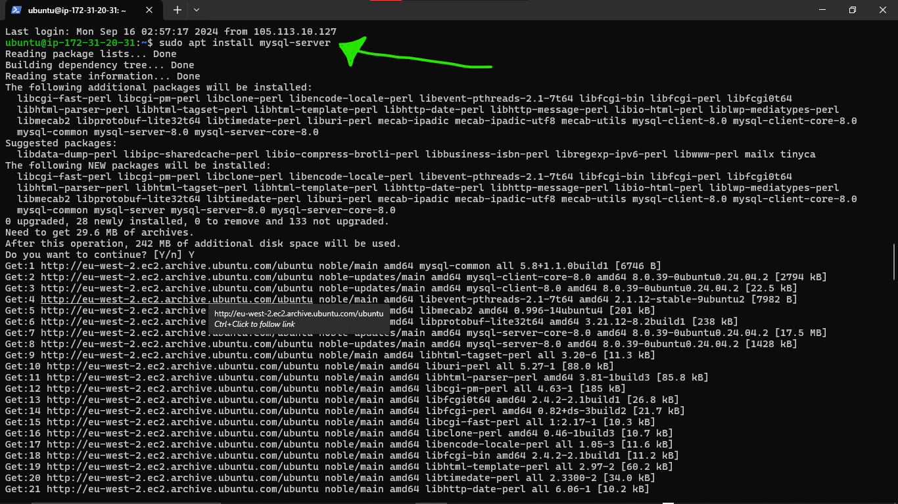 type y and press Enter, when prompted.

__2.__ __Enable mysql and Ensure that it is running by running these commands:__
```
sudo systemctl enable --now mysql
sudo systemctl status mysql
```

__3.__ __Log in to mysql console__
```
sudo mysql
```
Running this command will conect your shell to the MySQL server as the admin database user __root__ assumed by the useof __'sudo'__ when you were executing the __`sudo mysql`__ command.

__4.__ __Assign a password to the root user using the mysql_native_password as the default authetication method.__
The password we assigned to the user for the purpose of this tutorial is "PassW0RD$"
```
ALTER USER 'root'@'localhost' IDENTIFIED WITH mysql_native_password BY 'PassW0RD$';
```
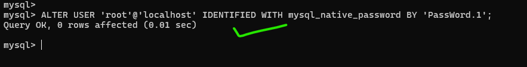
Exit the MySQL shell 
```
exit
```

__5.__ __Run the script to secure MySQL__

This security script comes pre-installed with mysql. This script helps to remove some insecure default settings and locks down access to the database system.
```
sudo mysql_secure_installation
```


Whether or not you set up the Validation password plugin the server will ask you to select and confirm a password for MySQL root user.

__6.__ __Login to the MySQL console as a root user after you have changed the password.__
```
sudo mysql -p
```
you should see a prompt asking you to insert a password (this is because of the -p flag) as shown in the image below:

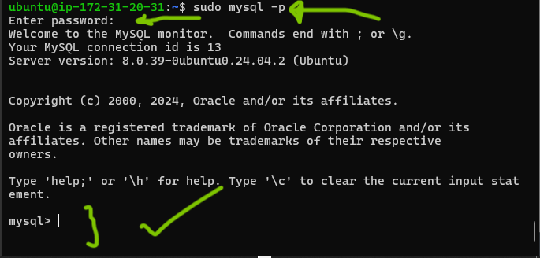


### Step 3 - Install PHP

__1.__ __Install php.__
So far, we have installed Apache to serve our web contents, and we installed Mysql to assist us store and manage our data.
Now, we will install Php to process codes inorder to display dynamic content to the consumer user.

To set up php on our server, we are going to need the following installed:
* php package
* php-mysql _(this is a PHP module that allows PHP to communicate with MySQL databases)_
* libapache2-mod-php _(this helps Apache to handle and understand PHP files)
to get this all set up in the machine, run:
```
sudo apat install php libapache2-mod-php php-mysql
```
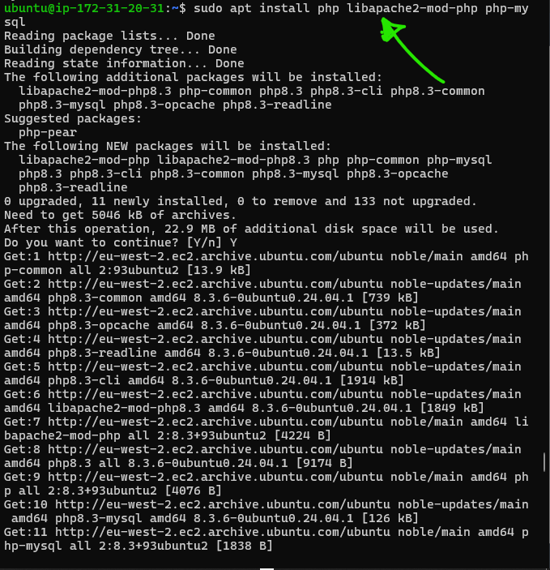

Confirm the PHP version by running:
```
php -v
```
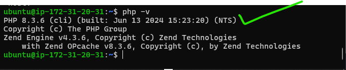
At this point, we have installed and set up the LAMP (Linux, Apache, MySQL, PHP) stack completely.

To test this setup, we would need to setup an Apache Virtual host to hold the website's files and folders.
_(Virtual Hosts makes it possible to have many/different websites located on one machine while abstracting this from the users.)_

## Step 4 - Create a virtual host 
__1.__ __First, create a document directory for the new website you are about to create near the default web dir _(/var/www/html).__
```
sudo mkdir /var/www/my_project_lamp
```
__Assign the ownership of the directory to the current user in the session__
```
sudo chown -R $USER:$USER /var/www/my_project_lamp
```


__2.__ __Create a configuration file for your new website__
```
sudo vim /etc/apche2/sites-available/my_project_lamp.conf
```
Paste the bare-bones configurations stated below into your config file:
```
<VirtualHOst *:80>
  ServerName my_project_lamp 
  ServerAlias www.myprojectlamp
  ServerAdmin webmaster@localhost
  DocumentRoot /var/www/my_project_lamp
  ErrorLog ${APACHE_LOG_DIR}/error.log
  CustomLog ${APACHE_LOG_DIR}/access.log combined
</VirtualHost>
```
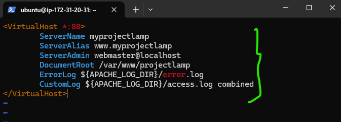

__3.__ __Show the new file in sites-available__
```
sudo ls /etc/apache2/sites-available
```
```
Output->:
000-default.conf
default-ssl.conf
my_project_lamp.conf
```
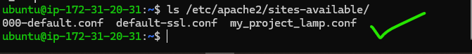

With this configuration setup here (my_project_lamp.conf), the web server (Apache in this case) will serve our webproject (my_project_lamp) utilizing /var/www/my_project_lamp 

__4.__ __Enable the new virtual host__
```
sudo a2ensite projectlamp
```
__5.__ __Disable Apache's default website.__
If we do not disable this default website, Apache's default site will overwrite that in the virtual host, and hence, we won't get to be served the site sitting in the virtual host.
_To disable Apache's default website, run this command_
```
sudo a2dissite 000-default
```
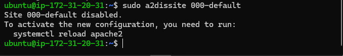

__6.__ __Ensure that the configuration in the configuration file does not contain syntax error__

You can achieve the above by running the command below.
```
sudo apache2ctl configtest
```
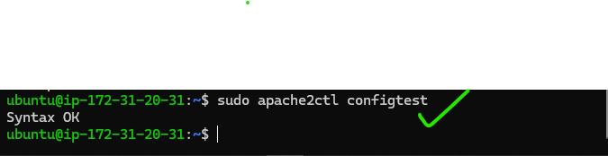

__7.__ __Reload apache for the changes to be applied__
```
sudo systemctl reload apache2
```
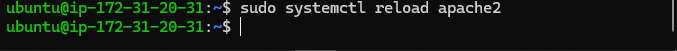

__8.__ __Our site is ready, but Apache needs to serve content from the web root (i.e: /var/www/my_project_lamp), but it is empty. So we will now create an index.html file and then try to access our site via our public IP to test it__

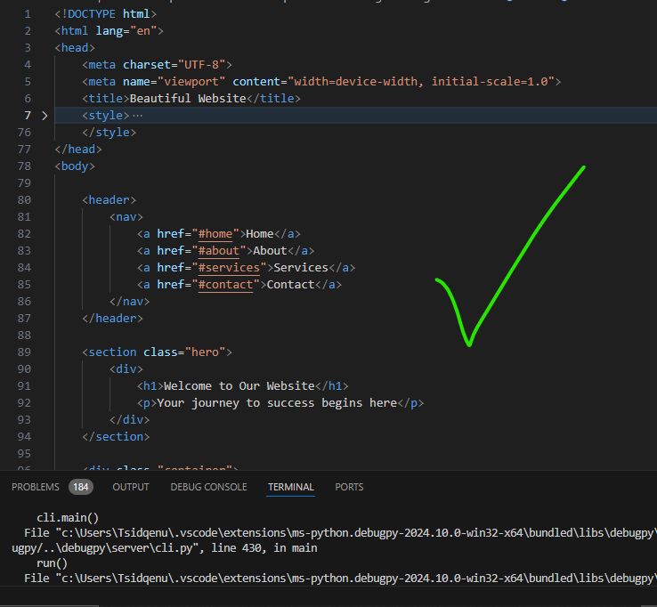

__9.__ __Try to access your new website using your server's public IP__
``` 
http://35.175.119.181:80
```
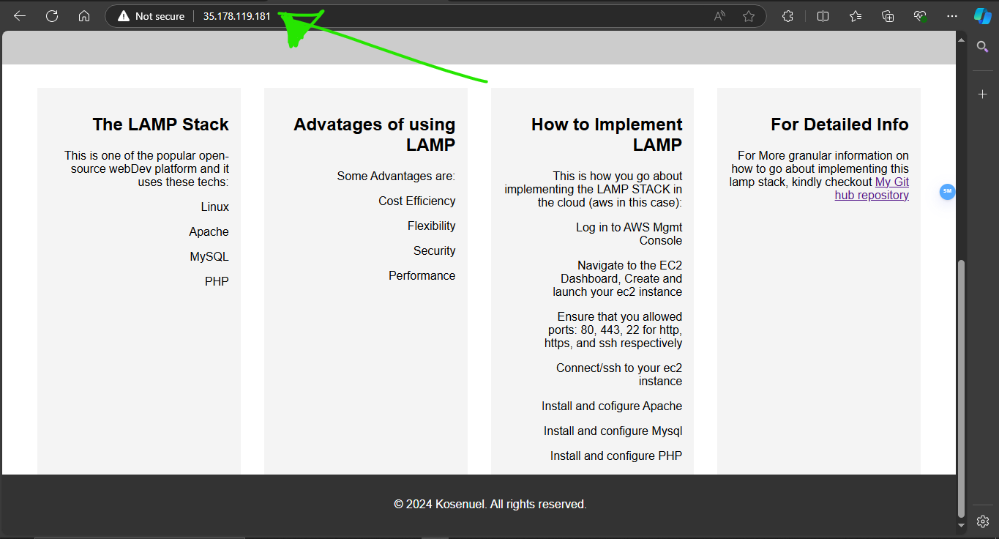

This html file can be used as the temporary landing page of this server pending when the index.php file is created and pasted in this same directory. When this happens, the index.html file should be deleted or renamed, as if present, apache would consider serving it first before considering the index.php

## Step 5 - Enable PHP on the website.

Currently (i.e: by default), the DirectoryIndex setting on the Apache will always tell Apache to take html files more seriously (higher precedence) than php files. (This setting is good such that, when a php file is being served, and one wants to take the site down for maitainance for a while, he/she could easily setup a customized `maintenance` html file an place it in server's site directory and Apache would serve that `maintenance` page, instead of the main `php` file. and when the site maintenance is done, the file could be deleted or removed to resume normal site functions.)

__1.__ __To modify the precedence Apache gives to different file types, modify the dir.conf file to look like this.__
```
sudo vim /etc/apache2/mods-enabled/dir.conf
```
```
<IfModule mod_dir.c>
  # Change this:
  # DirectoryIndex index.html index.cgi index.ppl index.php index.xhtml index.htm
  # To this:
  DirectoryIndex index.php index.html index.cgi index.pl index.xhtml index.htm
</IfModule>
```
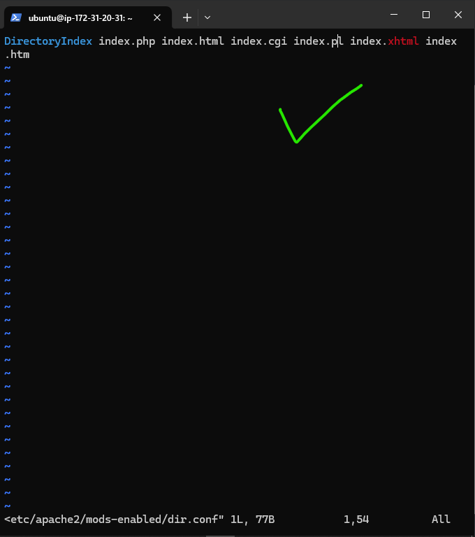

__2.__ __Reload Apache__

You need to reload Apache so that the changes you have made would apply.
```
sudo systemctl reload apache2
```


__3.__ __Utilize the php test script to ensure that you have configured Apache to handle and process requests for PHP files.__

Create a new file inside the custom web root folder (/var/www/my_project_lamp)

```
vim /var/www/my_project_lamp/index.php
```

__Type in the words below into the `index.php` file__
```
<?php
phpinfo();
```
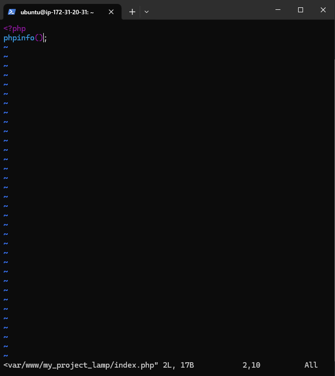

__4.__ __Refresh the page and note down any change you observe__

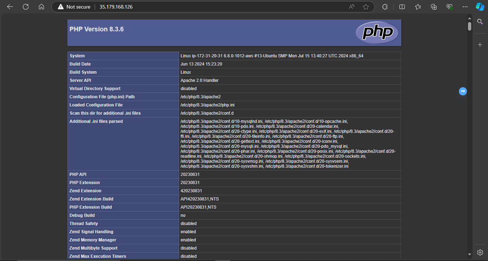
The page served here provides you with information about the server from the perspective of PHP. This is very useful in terms of debugging and to make sure that all necessary settings are applied correctly.

When you are done checking the information about the server through this page, 
It is very important that you remove the file you have created (i.e: index.php) so as to protect the sensitive information about the Php enviroment and the server. This can be repeated when necessary if the information is needed.
```
sudo rm /var/www/my_project_lamp_/index.php
```

__Conclusion__

If you are considering/evaluating what stack to utilize in deploying a website and make it accessible to many people, the LAMP stack we just experienced is a very flexible, robust, and efficient stack to assist you in deploying your developed web applications.

To know how to set up, configure, and maintain a LAMP environment, kindly go through the guidelines stipulated in this documentation and it should help you know how to get the job done.


