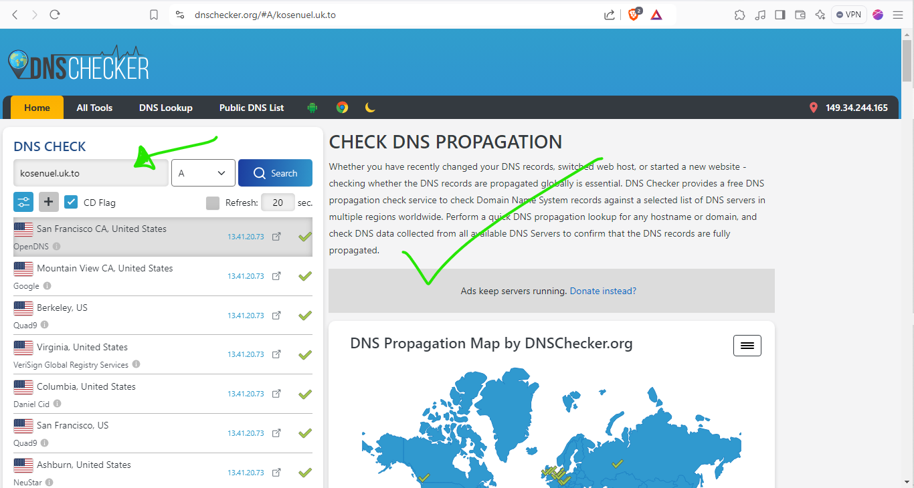

# Load Balancer Solution With Nginx and SSL/TLS

## Introduction

In today's digital landscape, efficiently distributing client requests among web servers is crucial for maintaining optimal performance. This project will focus on implementing a Load Balancer (LB) solution using Nginx, this is a powerful and versatile web server. We will also explore the importance of securing connections through HTTPS and implement SSL/TLS certificates to encrypt data in transit.

## Project Overview

This project is divided into two main parts:

1. Configuring Nginx as a Load Balancer
2. Registering a new domain name and setting up a secure connection

Let us examine the architecture of our solution:


## Part 1: Configuring Nginx As A Load Balancer

### Step 1: Create an EC2 Instance for Nginx LB

1. Launch an EC2 VM based on Ubuntu Server 24.04 LTS.
2. Name the instance "nginx LB".
3. Configure security groups to open TCP port 80 for HTTP and TCP port 443 for HTTPS.


### Step 2: Configure Local DNS

1. Access the instance via SSH:
   ```bash
   ssh -i "my-devec2key.pem" ubuntu@18.119.165.258
   ```

2. Update the `/etc/hosts` file with web servers' names and IP addresses:
   ```bash
   sudo vi /etc/hosts
   ```

   Add entries for `web1` and `web2` with their respective IP addresses.


### Step 3: Install and Configure Nginx

1. Update the instance:
   ```bash
   sudo apt update && sudo apt upgrade -y
   ```

2. Install Nginx:
   ```bash
   sudo apt install nginx
   ```


### Step 4: Configure Nginx as a Load Balancer

1. Open the Nginx configuration file:
   ```bash
   sudo vi /etc/nginx/nginx.conf
   ```

2. Add the following configuration in the `http` section:
   ```nginx
   upstream myproject {
      server Web1 weight=5;
      server Web2 weight=5;
   }

   server {
       listen 80;
       server_name www.domain.com;

       location / {
           proxy_pass http://myproject;
       }
   }
   # Comment out this line
   # include /etc/nginx/sites-enabled/
   ```

3. Test the configuration and restart Nginx:
   ```bash
   sudo nginx -t
   sudo systemctl restart nginx
   sudo systemctl status nginx
   ```


## Part 2: Registering a Domain and Configuring SSL/TLS

### Step 1: Register a Domain Name

Choose a domain registrar (e.g., Godaddy, Domain.com, Bluehost) and register a new domain name. For this project, we used [Cloudns.net](https://www.cloudns.net/).


### Step 2: Assign Elastic IP to Nginx LB

1. Allocate an Elastic IP address.
2. Associate the Elastic IP with your Nginx LB instance.


### Step 3: Update DNS Records

1. Create an A record pointing to your Elastic IP address.
2. Verify the DNS record using a [DNS checker](https://dnschecker.org/).




### Step 4: Configure Nginx for the New Domain

1. Update `nginx.conf` with your domain name:
   ```bash
   sudo vi /etc/nginx/nginx.conf
   ```
   Replace `server_name www.domain.com` with your actual domain.

2. Restart Nginx:
   ```bash
   sudo systemctl restart nginx
   ```


### Now this is how our site looks without SSL/TLS applied.

### Step 5: Install Certbot and Obtain SSL/TLS Certificate

1. Ensure `snapd` is active:
   ```bash
   sudo systemctl status snapd
   ```

2. Install Certbot:
   ```bash
   sudo snap install --classic certbot
   ```

3. Create a symlink for Certbot:
   ```bash
   sudo ln -s /snap/bin/certbot /usr/bin/certbot
   ```

4. Obtain the SSL/TLS certificate:
   ```bash
   sudo certbot --nginx
   ```


### Step 6: Set Up Automatic Certificate Renewal

1. Test the renewal process:
   ```bash
   sudo certbot renew --dry-run
   ```

2. Configure a cronjob for automatic renewal:
   ```bash
   crontab -e
   ```
   Add the following line:
   ```
   * */12 * * *   root /usr/bin/certbot renew > /dev/null 2>&1
   ```


### This is how the site now looks after certificate has been applied


## Conclusion

We have successfully set up a load balancer solution using Nginx and implemented SSL/TLS encryption for secure communication. This configuration enhances the performance, scalability, and security of our web infrastructure.

##  Best Practices

1. **Regular Updates**: Keep your systems and software up to date to ensure security and performance.
2. **Monitoring**: Implement monitoring solutions to track the health and performance of your load balancer and web servers.
3. **Backup and Disaster Recovery**: Regularly backup your configurations and implement a disaster recovery plan.
4. **Security**: Regularly audit your security groups and firewall rules to maintain a secure environment.
5. **Documentation**: Maintain comprehensive documentation of your setup, including network diagrams and configuration details.
6. **Testing**: Regularly test your load balancer configuration and failover scenarios to ensure reliability.
7. **SSL/TLS Best Practices**: Use strong encryption protocols and keep your certificates up to date.
8. **Performance Tuning**: Optimize Nginx configuration based on your specific traffic patterns and requirements.

By following these best practices, you can be sure of a robust, secure, and efficient load balancing solution for your web applications.

## Lessons Learned
1. Put GOD First in all you do.
2. As a website owner, you no longer have any excuse to use http (insecure method of web communication) to communicate with your clients, with the help of the likes of "Let's Encrypt" you can get your site's certificate signed for secure and trusted communication between your server and clients.

3. You can not only use Apache, but also, Nginx in configuring a load balancer for an organization.