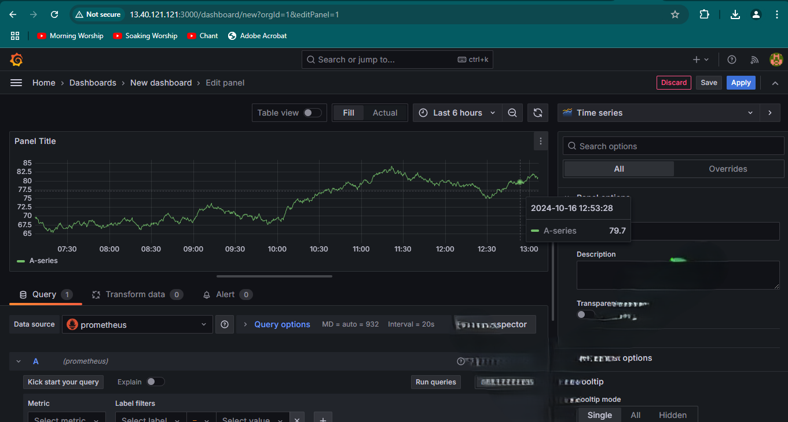

# Implementing a Monitoring Solution for Load Balancer and Web Servers

## Introduction

Monitoring is a crucial aspect of maintaining a robust and reliable web infrastructure. By implementing a comprehensive monitoring solution, we can track the health and performance of our Nginx load balancer and web servers, thus, allowing us to proactively address issues and optimize our system's performance.

In this guide, we will implement a monitoring solution using Prometheus for metrics collection and Grafana for visualization. This setup will provide real-time insights into our infrastructure's performance.

## Project Overview

We will:

1. Install and configure Prometheus on a dedicated EC2 instance
2. Set up Node Exporter on our load balancer and web servers
3. Configure Prometheus to scrape metrics from our servers
4. Install and configure Grafana for data visualization
5. Create dashboards in Grafana to monitor key metrics

## Architecture

This is a high-level overview of our monitoring architecture:


## Step 1: Set Up Prometheus Server

### 1.1 Launch an EC2 Instance for Prometheus

1. Create an EC2 instance based on Ubuntu Server 24.04 LTS.
2. Name it "Prometheus-Server".
3. Ensure it's in the same VPC as your load balancer and web servers.
4. Configure security group to allow inbound traffic on port 9090 (Prometheus web interface).


### 1.2 Install Prometheus

1. SSH into your Prometheus server:
   ```bash
   ssh -i "your-key.pem" ubuntu@your-prometheus-server-ip
   ```

   

2. Update the system and install necessary packages:
   ```bash
   sudo apt update && sudo apt upgrade -y
   sudo apt install -y wget
   ```

    

3. Download and install Prometheus:
   ```bash
   wget https://github.com/prometheus/prometheus/releases/download/v2.37.0/prometheus-2.37.0.linux-amd64.tar.gz
   tar xvfz prometheus-*.tar.gz
   cd prometheus-*
   ```
    
    

4. Move Prometheus files to appropriate directories:
   ```bash
   sudo mv prometheus /usr/local/bin/
   sudo mv promtool /usr/local/bin/
   sudo mv consoles/ console_libraries/ /etc/prometheus/
   sudo mv prometheus.yml /etc/prometheus/prometheus.yml
   ```
    

5. Create a Prometheus user:
   ```bash
   sudo useradd --no-create-home --shell /bin/false prometheus
   sudo chown -R prometheus:prometheus /etc/prometheus
   ```

    

6. Create a systemd service file for Prometheus:
   ```bash
   sudo nano /etc/systemd/system/prometheus.service
   ```

   Add the following content:
   ```
   [Unit]
   Description=Prometheus
   Wants=network-online.target
   After=network-online.target

   [Service]
   User=prometheus
   Group=prometheus
   Type=simple
   ExecStart=/usr/local/bin/prometheus \
       --config.file /etc/prometheus/prometheus.yml \
       --storage.tsdb.path /var/lib/prometheus/ \
       --web.console.templates=/etc/prometheus/consoles \
       --web.console.libraries=/etc/prometheus/console_libraries

   [Install]
   WantedBy=multi-user.target
   ```
    

7. Start and enable Prometheus:
   ```bash
   sudo systemctl daemon-reload
   sudo systemctl start prometheus
   sudo systemctl enable prometheus
   ```

## Step 2: Set Up Node Exporter

We'll install Node Exporter on our Nginx load balancer and web servers to collect system-level metrics.

Repeat these steps for each server:

1. SSH into the server:
   ```bash
   ssh -i "your-key.pem" ubuntu@your-server-ip
   ```

2. Download and install Node Exporter:
   ```bash
   wget https://github.com/prometheus/node_exporter/releases/download/v1.3.1/node_exporter-1.3.1.linux-amd64.tar.gz
   tar xvfz node_exporter-*.tar.gz
   cd node_exporter-*
   sudo cp node_exporter /usr/local/bin/
   ```

3. Create a Node Exporter service:
   ```bash
   sudo nano /etc/systemd/system/node_exporter.service
   ```
   Add the following content:
   ```
   [Unit]
   Description=Node Exporter
   After=network.target

   [Service]
   User=node_exporter
   Group=node_exporter
   Type=simple
   ExecStart=/usr/local/bin/node_exporter

   [Install]
   WantedBy=multi-user.target
   ```


4. Start and enable Node Exporter:
   ```bash
   sudo systemctl daemon-reload
   sudo systemctl start node_exporter
   sudo systemctl enable node_exporter
   ```

5. Update the security group for each server to allow inbound traffic on port 9100 (Node Exporter).

## Step 3: Configure Prometheus to Scrape Metrics

1. SSH into your Prometheus server.

2. Edit the Prometheus configuration file:
   ```bash
   sudo nano /etc/prometheus/prometheus.yml
   ```

3. Add job configurations for your servers:
   ```yaml
   scrape_configs:
     - job_name: 'prometheus'
       static_configs:
         - targets: ['localhost:9090']
     - job_name: 'nginx_lb'
       static_configs:
         - targets: ['172.31.20.55:9090']
     - job_name: 'web_server_1'
       static_configs:
         - targets: ['172.31.10.22:9090']
     - job_name: 'web_server_2'
       static_configs:
         - targets: ['172.31.12.82:9090']
   ```


4. Restart Prometheus:
   ```bash
   sudo systemctl restart prometheus
   ```

## Step 4: Install and Configure Grafana

1. SSH into your Prometheus server (we'll host Grafana on the same instance for simplicity).

2. Install Grafana:
   ```bash
   sudo apt-get install -y software-properties-common
   sudo add-apt-repository "deb https://packages.grafana.com/oss/deb stable main"
   wget -q -O - https://packages.grafana.com/gpg.key | sudo apt-key add -
   sudo apt-get update
   sudo apt-get install grafana
   ```

3. Start and enable Grafana:
   ```bash
   sudo systemctl start grafana-server
   sudo systemctl enable grafana-server
   ```

4. Update the security group to allow inbound traffic on port 3000 (Grafana web interface).

## Step 5: Create Grafana Dashboards

1. Access Grafana web interface at `http://your-prometheus-server-ip:3000`.



2. Log in with default credentials (admin/admin) and change the password.

3. Add Prometheus as a data source:
   - Click "Configuration" (gear icon) > "Data Sources" > "Add data source"
   - Select "Prometheus"
   - Set URL to `http://localhost:9090`
   - Click "Save & Test"

4. Create a new dashboard:
   - Click "Create" (+ icon) > "Dashboard"
   - Add panels for key metrics such as:
     - CPU Usage
     - Memory Usage
     - Disk I/O
     - Network Traffic
     - Nginx Connections (for load balancer)

5. For each panel, use PromQL queries to fetch and visualize data. For example:
   - CPU Usage: `100 - (avg by(instance) (rate(node_cpu_seconds_total{mode="idle"}[5m])) * 100)`
   - Memory Usage: `100 * (1 - ((node_memory_MemFree_bytes + node_memory_Cached_bytes + node_memory_Buffers_bytes) / node_memory_MemTotal_bytes))`

6. Save your dashboard and set up appropriate refresh intervals.


## Conclusion

I did not successfully implemented a monitoring solution using Prometheus and Grafana. I intended to track the health and performance of our Nginx load balancer and web servers. This setup might not be a success at the moment, but soon, I will understand fully the nitty gritty that this needs, comeback to it and fix it for good.

## Best Practices and Lessons Learned
### A good/successfull implementation of Prometheus and Grafana would have the following properties:
1. **Alert Configuration**: Set up alerting in Grafana to notify you of critical issues.
2. **Dashboard Refinement**: Continuously refine your dashboards based on your specific needs and pain points.
3. **Security**: Implement secure access to Grafana and Prometheus interfaces using HTTPS and strong authentication.
4. **Retention Policy**: Configure appropriate data retention policies in Prometheus to manage storage.
5. **Backup**: Regularly backup your Prometheus data and Grafana configurations.
6. **Monitoring the Monitors**: Set up additional checks to ensure your monitoring system itself is functioning correctly.
7. **Documentation**: Keep your monitoring setup well-documented, including the meaning of various metrics and alert thresholds.

When you follow these practices, you will be sure to maintain a robust monitoring system that provides valuable insights into your infrastructure's health and performance.

### One very important lesson I have learnt from this side-quest even though I did not complete it (due to time limitations and activity(ies)) is the need for having allies who are very knowledgeable to guide you when you are treading unknown territories. but I am glad to have underwent this and for sure, I can say that to some extent, I have sharpened my skills.

# " 
He who fights and runs away, lives to fight another day.