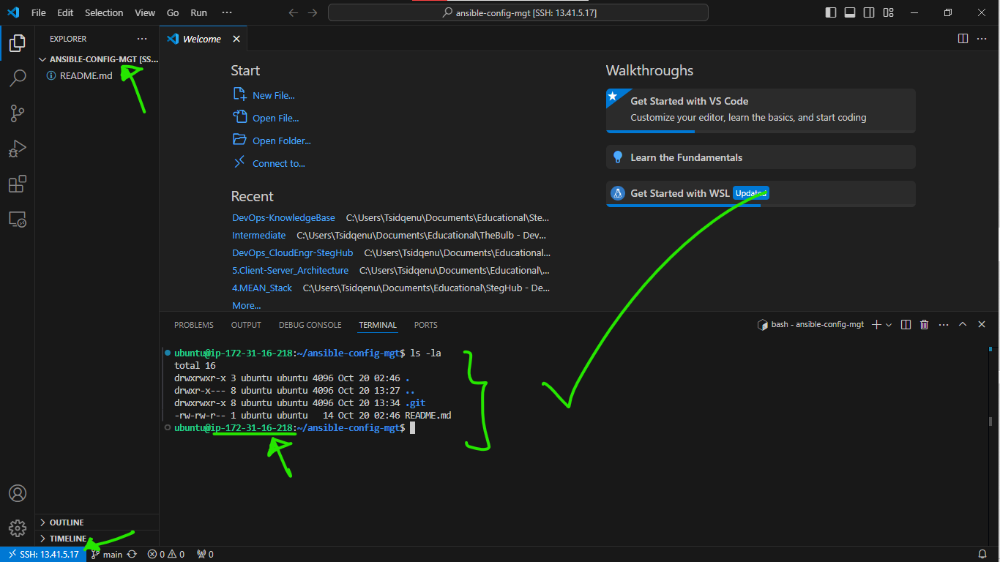

# Ansible Configuration Management: Automating Projects 7 to 10

## Table of Contents
1. [Introduction](#introduction)
2. [Ansible Client as a Jump Server](#ansible-client-as-a-jump-server)
3. [Project Setup](#project-setup)
4. [Ansible Installation and Configuration](#ansible-installation-and-configuration)
5. [Development Environment Preparation](#development-environment-preparation)
6. [Ansible Development](#ansible-development)
7. [Ansible Inventory Setup](#ansible-inventory-setup)
8. [Creating a Common Playbook](#creating-a-common-playbook)
9. [Version Control with Git](#version-control-with-git)
10. [Executing Ansible Playbook](#executing-ansible-playbook)
11. [Conclusion](#conclusion)

## Introduction

This project's goal is to automate the manual operations performed in Projects 7 to 10 using Ansible Configuration Management. By the help of DevOps tools, we will streamline the process of setting up virtual servers, installing and configuring required software, and deploying web applications.

### Objectives
- Automate routine tasks using Ansible
- Gain proficiency in writing declarative code using YAML
- Implement best practices in configuration management

## Ansible Client as a Jump Server

A Jump Server is also known as a Bastion Host, it serves as an intermediary for accessing internal networks securely. In our architecture, the webservers reside in a secured (private) network, inaccessible directly from the Internet. DevOps engineers must use the Jump Server to SSH into the webservers, this practice enhances security and reduces the attack surface.


*Figure 1: Network architecture with Jump Server*

## Project Setup

### Task Overview
1. Install and configure Ansible client as a Jump Server/Bastion Host
2. Create a simple Ansible playbook to automate server configuration

## Ansible Installation and Configuration

### 1. EC2 Instance Preparation

Update the `Name` tag on the Jenkins EC2 Instance to `Jenkins-Ansible`. This server will be used to run Ansible playbooks.


*Figure 2: Renaming EC2 instance to Jenkins-Ansible*

### 2. GitHub Repository Creation

Create a new repository named `ansible-config-mgt` in your GitHub account.


*Figure 3: Creating a new GitHub repository*

### 3. Ansible Installation

Install Ansible on the Jenkins-Ansible server:

```bash
sudo apt update
sudo apt install ansible
```

Verify the installation:

```bash
ansible --version
```


*Figure 4: Verifying Ansible installation*

### 4. Jenkins Job Configuration

Configure a Jenkins job to save your repository content automatically:

1. Set up a webhook in GitHub:
   - Go to your `ansible-config-mgt` repository
   - Navigate to Settings > Webhooks > Add webhook

   
   *Figure 5: Configuring GitHub webhook*

2. Create a new Freestyle project in Jenkins named `ansible`:

   
   *Figure 6: Creating a new Jenkins Freestyle project*

3. Configure Source Code Management:
   - Choose Git
   - Provide the `ansible-config-mgt` repository URL
   - Add credentials for Jenkins to access the repository

   
   *Figure 7: Configuring Source Code Management in Jenkins*

4. Configure Build Triggers:
   - Select "GitHub hook trigger for GITScm polling"

   
   *Figure 8: Setting up GitHub hook trigger*

5. Configure Post-build Actions:
   - Archive all files: `**/*`

   
   
   *Figure 9: Configuring post-build archiving*

### 5. Testing the Setup

Make a change to the README.md file in the `main` branch and ensure that the build starts automatically.


*Figure 10: Editing README.md to trigger build*

Verify the build in Jenkins:


*Figure 11: Jenkins build triggered by README edit*

Check the console output and archived artifacts:

```bash
ls /var/lib/jenkins/jobs/ansible/builds/<build_number>/archive/
```


*Figure 12: Verifying archived artifacts*

> **Tip**: Allocate an Elastic IP to your Jenkins-Ansible server to maintain a consistent IP address for your GitHub webhook configuration.


*Figure 13: Allocating Elastic IP*


*Figure 14: Associating Elastic IP with EC2 instance*

Update the webhook with the new Elastic IP:


*Figure 15: Updating webhook with Elastic IP*

> **Note**: Remember to release the Elastic IP when terminating your EC2 instance to avoid unnecessary charges.

## Development Environment Preparation

### 1. Install Visual Studio Code

Download and install [Visual Studio Code](https://code.visualstudio.com/download) as your Integrated Development Environment (IDE).

### 2. Configure VS Code for GitHub

Connect VS Code to your newly created GitHub repository:


*Figure 16: Cloning repository in VS Code*

### 3. Clone Repository to Jenkins-Ansible Instance

Note: you would have to ssh into the Jenkins-Ansible server via our vscode to clone the repository.
Clone the `ansible-config-mgt` repository to your Jenkins-Ansible instance:

```bash
git clone https://github.com/yourusername/ansible-config-mgt.git
```


*Figure 17: Cloning repository to Jenkins-Ansible server*

## Ansible Development

### 1. Create Feature Branch

Create a new branch for development:

```bash
git checkout -b feature/prj-11-ansible-config
```


*Figure 18: Creating a feature branch*

### 2. Create Directory Structure

Create the necessary directories:

```bash
mkdir playbooks inventory
```

### 3. Create Playbook and Inventory Files

Create the initial playbook and inventory files:

```bash
touch playbooks/common.yml
touch inventory/dev.yml inventory/staging.yml inventory/uat.yml inventory/prod.yml
```


*Figure 19: Creating playbook and inventory files*

## Ansible Inventory Setup

An Ansible inventory file defines the hosts and groups of hosts upon which commands, modules, and tasks in a playbook operate. We will set up the inventory to organize our servers for different environments.

### SSH Agent Configuration

Ansible uses SSH to connect to target servers. Set up SSH agent to manage your SSH keys:

```bash
eval `ssh-agent -s`
ssh-add <path-to-private-key>
ssh-add -l
```
I am using a windows machine, so i used the following command to set up the ssh agent:
```bash
Get-Service ssh-agent | Set-Service -StartupType Automatic

Start-Service ssh-agent

Get-Service ssh-agent

ssh-add "Path/to/key.pem"
```


*Figure 20: Setting up SSH agent*

Connect to your Jenkins-Ansible server using SSH agent:

```bash
ssh -A ubuntu@<public-ip>
```


*Figure 21: Accessing Jenkins-Ansible server with SSH agent*

### Update Inventory File

Update your `inventory/dev.yml` file with the following structure:

```yaml
all:
  children:
    nfs:
      hosts:
        <NFS-Server-Private-IP-Address>:
          ansible_ssh_user: ec2-user
    webservers:
      hosts:
        <Web-Server1-Private-IP-Address>:
          ansible_ssh_user: ec2-user
        <Web-Server2-Private-IP-Address>:
          ansible_ssh_user: ec2-user
    db:
      hosts:
        <Database-Private-IP-Address>:
          ansible_ssh_user: ubuntu
    lb:
      hosts:
        <Load-Balancer-Private-IP-Address>:
          ansible_ssh_user: ubuntu
```


*Figure 22: Updated inventory file*

## Creating a Common Playbook

Create a common playbook to perform tasks on all servers listed in the inventory.

Update your `playbooks/common.yml` file:

```yaml
---
- name: Update web and NFS servers
  hosts: webservers, nfs
  remote_user: ec2-user
  become: true
  become_user: root
  tasks:
    - name: Ensure wireshark is at the latest version
      yum:
        name: wireshark
        state: latest

- name: Update LB and DB servers
  hosts: lb, db
  remote_user: ubuntu
  become: true
  become_user: root
  tasks:
    - name: Update apt repo
      apt:
        update_cache: yes

    - name: Ensure wireshark is at the latest version
      apt:
        name: wireshark
        state: latest
```


*Figure 23: Common playbook in VS Code*

This playbook installs or updates wireshark on both RHEL 9 and Ubuntu servers, using the appropriate package manager for each OS. It then creates a directory named `Kosenuel_directory` and a file named `Kose_file.txt` inside the directory. After that, it runs a script on the webservers to store some dynamic greeting message in a file named `server_greeting.txt` in the `/tmp/` directory.

> **Tip**: For a deeper understanding of Ansible playbooks, watch [this video from RedHat](https://www.youtube.com/watch?v=ZAdJ7CdN7DY) and read [this article on Ansible Playbooks](https://www.redhat.com/en/topics/automation/what-is-an-ansible-playbook).

## Version Control with Git

### Commit and Push Changes

Use Git commands to add, commit, and push your changes:

```bash
git status
git add <selected files>
git commit -m "Initial commit: add inventory and common playbook"
git push origin feature/prj-11-ansible-config
```


*Figure 24: Git workflow*

### Create a Pull Request

Create a Pull Request (PR) on GitHub to merge your changes into the main branch.


*Figure 25: Creating a Pull Request*

### Review and Merge

Act as a reviewer to check the changes:


*Figure 26: Reviewing the Pull Request*

If satisfied, merge the changes into the main branch:


*Figure 27: Confirming no conflicts before merge*


*Figure 28: Successfully merged Pull Request*

### Update Local Repository

After merging, update your local main branch:

```bash
git checkout main
git pull origin main
```


*Figure 29: Updating local main branch*

Jenkins will automatically build and archive the changes:


*Figure 30: Jenkins build triggered by merge*

Verify the archived files:

```bash
ls /var/lib/jenkins/jobs/ansible/builds/<build_number>/archive/
```


*Figure 31: Verifying archived build artifacts*

## Executing Ansible Playbook

### Setup Remote Development in VS Code

1. Install the Remote Development and Remote - SSH extensions in VS Code.


*Figure 32: Installing Remote Development extension*

2. Configure the SSH Host in VS Code.


*Figure 33: Configuring Remote SSH*

3. Connect to the remote server.


*Figure 34: Connected to remote server in VS Code*

### Run Ansible Playbook

Execute the Ansible playbook:

```bash
ansible-playbook -i inventory/dev.yml playbooks/common.yml
```


*Figure 35: Executing Ansible playbook*

### Verify Installation

Check if wireshark is installed on each server:

```bash
which wireshark
# or
wireshark --version
```


*Figure 36: Verifying wireshark installation on Web Server 1*


*Figure 37: Verifying wireshark installation on Web Server 2*

*Figure 37.1: Verifying wireshark installation on Web Server 3*


*Figure 38: Verifying wireshark installation on NFS Server*


*Figure 39: Verifying wireshark installation on Database Server*


*Figure 40: Verifying wireshark installation on Load Balancer Server*

## Conclusion

We have successfully automated our routine tasks by implementing Ansible configurations. The updated architecture now looks like this:


*Figure 41: Updated architecture with Ansible automation*

This setup enable/helps us to manage a fleet of servers of any size with just one command, thus, significantly improving efficiency and reducing the potential for human error in our DevOps processes.
