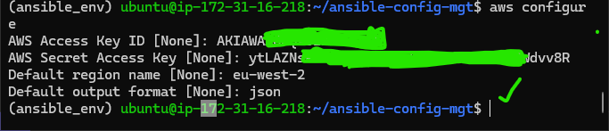
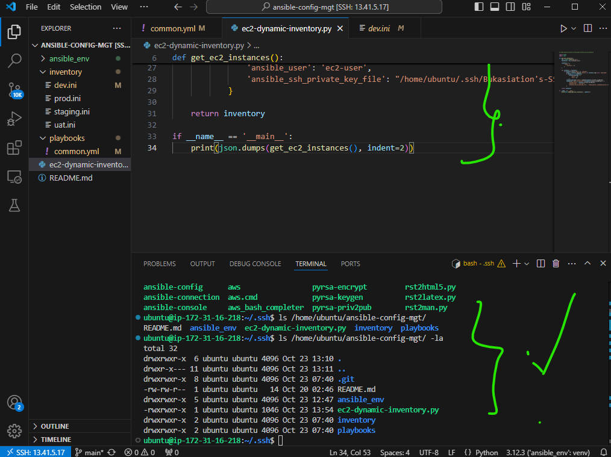
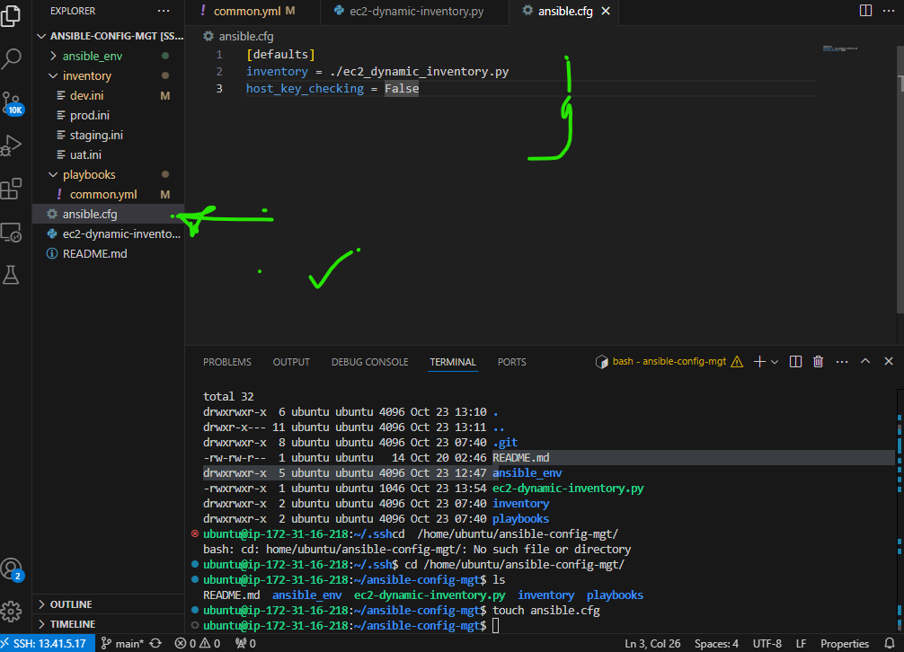
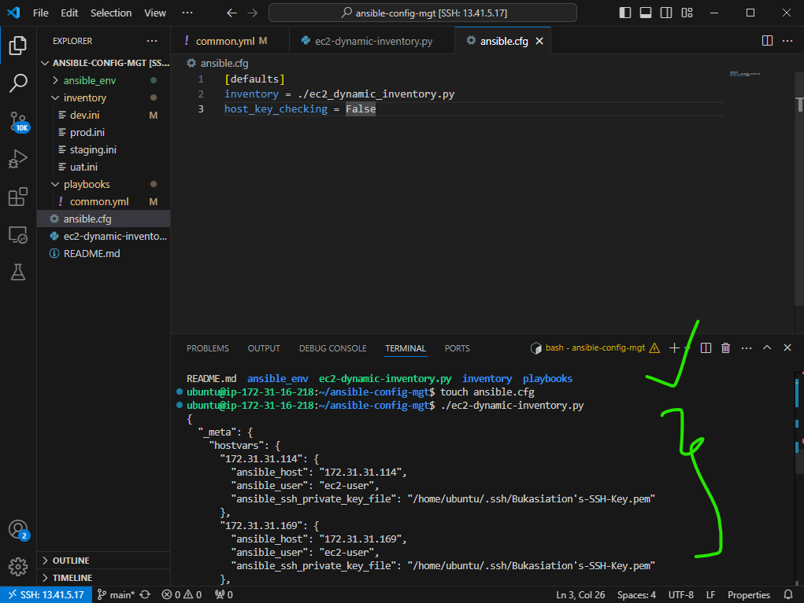
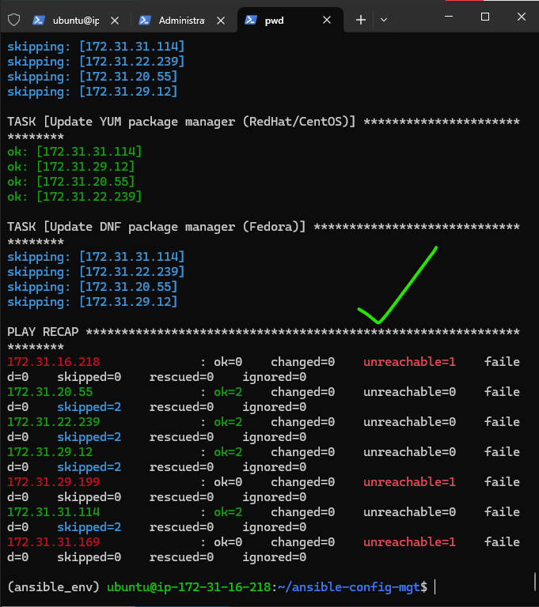
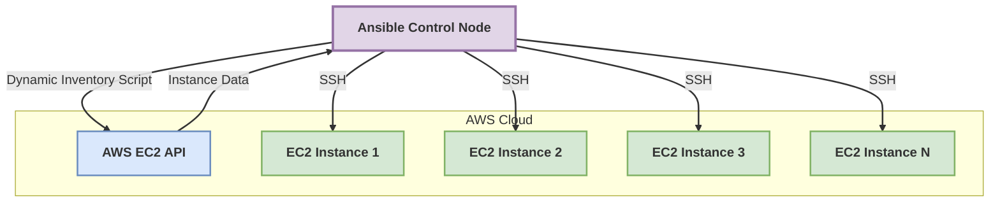

# Implementing Dynamic Inventory for AWS EC2 in Ansible

## Table of Contents
1. [Introduction](#introduction)
2. [Prerequisites](#prerequisites)
3. [Setting Up AWS CLI](#setting-up-aws-cli)
4. [Creating the Dynamic Inventory Script](#creating-the-dynamic-inventory-script)
5. [Configuring Ansible to Use the Dynamic Inventory](#configuring-ansible-to-use-the-dynamic-inventory)
6. [Testing the Dynamic Inventory](#testing-the-dynamic-inventory)
7. [Integrating with Existing Playbooks](#integrating-with-existing-playbooks)
8. [Best Practices](#best-practices)
9. [Troubleshooting](#troubleshooting)
10. [Conclusion](#conclusion)

## Introduction

This guide explains how to implement a dynamic inventory script for AWS EC2 instances in Ansible. This approach allows Ansible to automatically discover and manage EC2 instances, thus, making your infrastructure management more flexible and scalable.

### Objectives
- Set up AWS CLI for authentication
- Create a Python script for dynamic inventory
- Configure Ansible to use the dynamic inventory
- Test and integrate with existing playbooks

## Prerequisites

- Ansible installed on your control node
- AWS account with EC2 instances
- Python 3.x installed
- `boto3` Python library installed (`pip install boto3`)

## Setting Up AWS CLI
On your control node, run the following commands:

0. Create a virtual environment:
```bash
    python3 -m venv ansible_env
    source ansible_env/bin/activate
```

1. Install AWS CLI:
   ```bash
   pip install awscli
   ```

2. Install other required packages:
   ```bash
   pip install boto3 ansible
   ```
3. Configure AWS CLI:
   ```bash
   aws configure
   ```
   Enter your AWS Access Key ID, Secret Access Key, default region, and output format.


*Figure 1: Configuring AWS CLI*

## Creating the Dynamic Inventory Script

1. Create a new file named `ec2_dynamic_inventory.py` in your Ansible project directory:

   ```python
      #!/path/to/your/ansible_env/bin/python3

   import boto3
   import json

   def get_ec2_instances():
       ec2 = boto3.resource('ec2')
       instances = ec2.instances.all()
       
       inventory = {
           '_meta': {
               'hostvars': {}
           }
       }

       for instance in instances:
           if instance.state['Name'] == 'running':
               group = instance.tags[0]['Value'] if instance.tags else 'ungrouped'
               if group not in inventory:
                   inventory[group] = {
                       'hosts': [],
                       'vars': {}
                   }
               inventory[group]['hosts'].append(instance.private_ip_address)
               inventory['_meta']['hostvars'][instance.private_ip_address] = {
                   'ansible_host': instance.private_ip_address,
                   'ansible_user': 'ec2-user',  # Adjust based on your AMI
                   'ansible_ssh_private_key_file': '/path/to/your/key.pem'
               }

       return inventory

   if __name__ == '__main__':
       print(json.dumps(get_ec2_instances(), indent=2))
   ```

2. Make the script executable:
   ```bash
   chmod +x ec2_dynamic_inventory.py
   ```


*Figure 2: Creating the dynamic inventory script*

## Configuring Ansible to Use the Dynamic Inventory

1. Update your `ansible.cfg` file to use the dynamic inventory script:

   ```ini
   [defaults]
   inventory = ./ec2_dynamic_inventory.py
   host_key_checking = False
   ```


*Figure 3: Updating Ansible configuration*

## Testing the Dynamic Inventory

1. Run the inventory script to see the output:
   ```bash
   ./ec2_dynamic_inventory.py
   ```

2. Use Ansible to list all hosts:
   ```bash
   ansible all --list-hosts
   ```


*Figure 4: Testing the dynamic inventory*

## Integrating with Existing Playbooks

1. Update your playbooks to use the dynamic groups:

   ```yaml
   ---
   - name: Update web servers
     hosts: webserver
     tasks:
       - name: Ensure Apache is installed
         yum:
           name: httpd
           state: latest
   ```

2. Run your playbook:
   ```bash
   ansible-playbook -i ec2_dynamic_inventory.py your_playbook.yml
   ```


*Figure 5: Integrating dynamic inventory with existing playbooks*

## Best Practices

1. **Tagging**: Use consistent tagging for your EC2 instances to organize them into meaningful groups.
2. **Security**: Ensure your AWS credentials are securely stored and not exposed in your scripts.
3. **Performance**: For large infrastructures, consider caching the inventory results to improve performance.
4. **Error Handling**: Add proper error handling in your dynamic inventory script to manage API failures gracefully.

## Troubleshooting

- If instances are not appearing in the inventory, check your AWS credentials and region settings.
- Ensure the correct SSH key is specified for each instance in the inventory script.
- Verify that the security groups allow SSH access from your Ansible control node.

## Conclusion

Implementing a dynamic inventory for AWS EC2 instances significantly enhances the flexibility and scalability of your Ansible automation. It allows you to manage a constantly changing cloud infrastructure without manual updates to your inventory files.


*Figure 6: Updated architecture with dynamic inventory*

If you have been following this guide, you would have successfully set up a dynamic inventory system that automatically discovers and manages your EC2 instances, this aids in streamlining your DevOps processes and makes your infrastructure management more efficient.
