# Ansible Refactoring & Static Assignments (Imports and Roles)

## Table of Contents
1. [Introduction](#introduction)
2. [Jenkins Job Enhancement](#jenkins-job-enhancement)
3. [Refactoring Ansible Code](#refactoring-ansible-code)
4. [Configuring UAT Webservers](#configuring-uat-webservers)
5. [Implementing the Webserver Role](#implementing-the-webserver-role)
6. [Testing and Deployment](#testing-and-deployment)

## 1. Introduction

This project focuses on improving our Ansible configuration management setup. We will refactor our Ansible code, create assignments, and utilize the imports functionality. Imports allow us to effectively reuse previously created playbooks in new playbooks, enabling better organization and reusability of our tasks.

## 2. Jenkins Job Enhancement

To streamline our Jenkins setup, we will create a new job to store artifacts in a centralized location. This approach will improve organization and conserve space on the Jenkins server.

### 2.1 Create Artifact Directory

1. SSH into your Jenkins-Ansible server and create a new directory:

   ```bash
   sudo mkdir /home/ubuntu/ansible-config-artifact
   ```

2. Set appropriate permissions so that Jenkins can write to the directory:

   ```bash
   sudo chmod -R 0777 /home/ubuntu/ansible-config-artifact
   ```

### 2.2 Install Copy Artifact Plugin

1. Navigate to Jenkins web console > Manage Jenkins > Manage Plugins
2. Search for "Copy Artifact" in the Available tab and install without restarting Jenkins

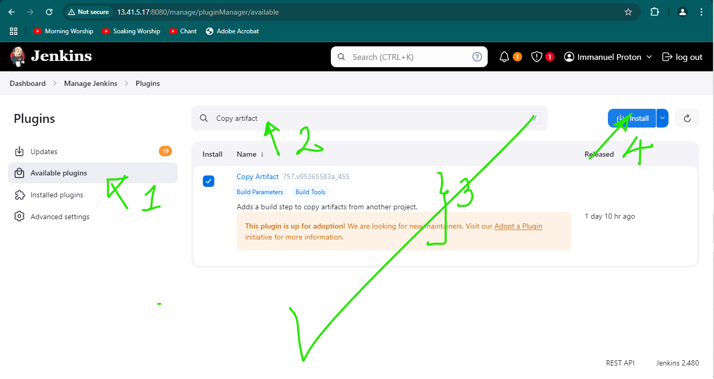
*Figure 1: Copy Artifact Plugin*

### 2.3 Create and Configure save_artifacts Job

1. Create a new Freestyle project named `save_artifacts`
2. In the Build Triggers section, configure it to be triggered upon completion of the existing ansible project
3. In the Build step, choose "Copy artifacts from other project"
   - Source project: `ansible`
   - Target directory: `/home/ubuntu/ansible-config-artifact`

### 2.4 Verify Setup

1. Make a minor change to the README.md file in your ansible-config-mgt repository
2. Observe both Jenkins jobs running sequentially
3. Verify that files are copied to `/home/ubuntu/ansible-config-artifact`

If you encounter permission issues, add the Jenkins user to the ubuntu group:

```bash
sudo usermod -a -G jenkins ubuntu
```

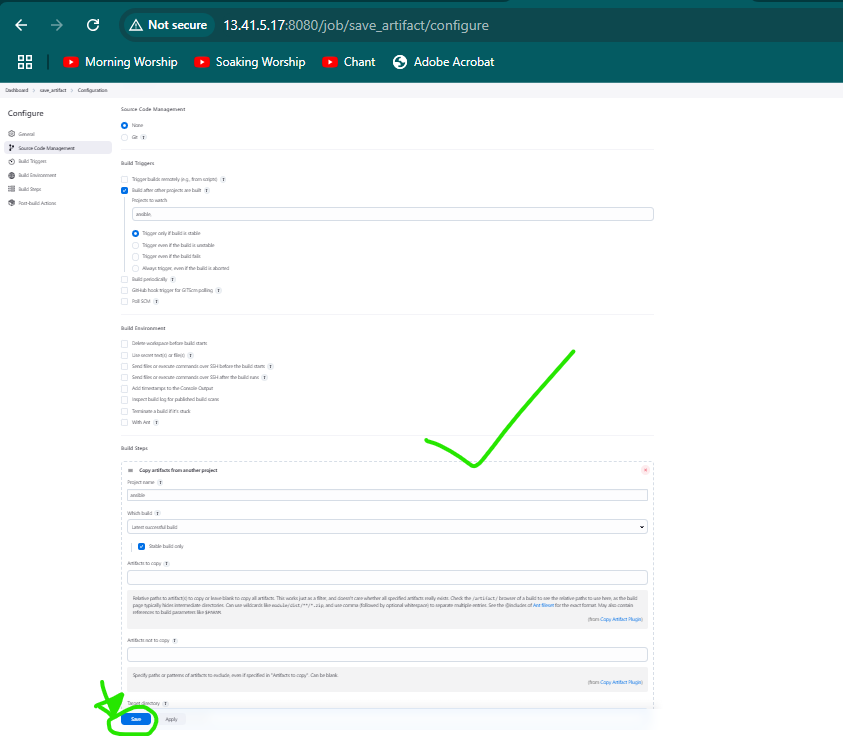
*Figure 1.1: Jenkins job configuration*
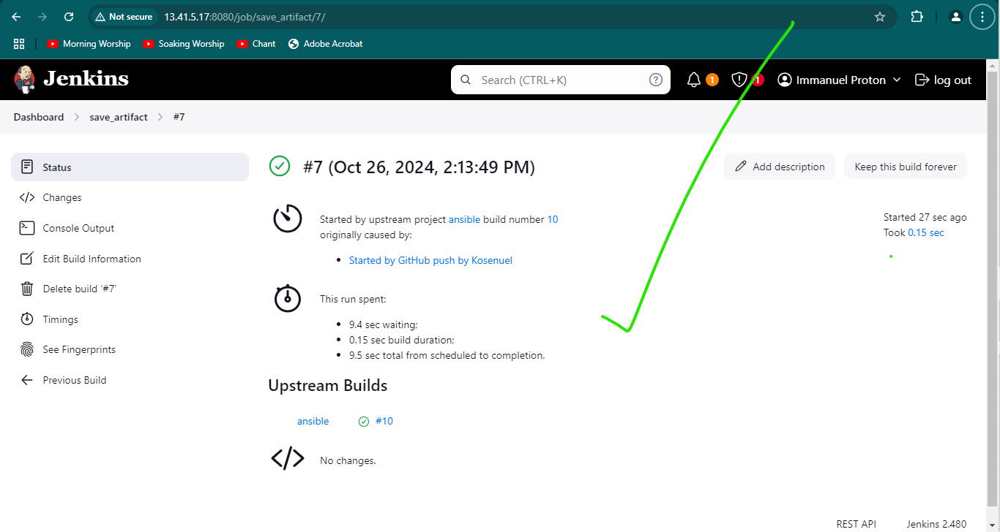
*Figure 1.2: Verify that files were copied to ansible-config-artifact*

## 3. Refactoring Ansible Code

We will refactor our Ansible code to improve organization and reusability.

### 3.1 Create New Branch

Create a new branch named `refactor` in your ansible-config-mgt repository using this command:

```bash
git checkout -b refactor
```

### 3.2 Reorganize Directory Structure

1. Create a new folder named `static-assignments` in the repository root
2. Move the `common.yml` file into the `static-assignments` folder
3. Create a new file `site.yml` in the `playbooks` folder

Your folder structure should now look like this:

```
ansible-config-mgt/
├── static-assignments/
│   └── common.yml
├── inventory/
│   ├── dev
│   ├── stage
│   ├── uat
│   └── prod
└── playbooks/
    └── site.yml
```

### 3.3 Update site.yml

Edit `site.yml` to import the `common.yml` playbook:

```yaml
---
- hosts: all
- import_playbook: ../static-assignments/common.yml
```

### 3.4 Create common-del.yml

1. Create `common-del.yml` in the `static-assignments` folder
2. Add tasks to remove wireshark from all servers:

```yaml
---
- name: Update web, nfs and db servers
  hosts: webservers, nfs, db
  remote_user: ec2-user
  become: yes
  become_user: root
  tasks:
    - name: Delete wireshark
      yum:
        name: wireshark
        state: removed

- name: Update LB server
  hosts: lb
  remote_user: ubuntu
  become: yes
  become_user: root
  tasks:
    - name: Delete wireshark
      apt:
        name: wireshark
        state: absent
        autoremove: yes
        purge: yes
        autoclean: yes
```

3. Update `site.yml` to use `common-del.yml`:

```yaml
---
- hosts: all
- import_playbook: ../static-assignments/common-del.yml
```

### 3.5 Run Playbook

Execute the playbook against the dev environment:

```bash
cd /home/ubuntu/ansible-config-mgt/
ansible-playbook -i inventory/dev.ini playbooks/site.yaml
```

Verify that wireshark has been removed from all servers by running:

```bash
wireshark --version
```
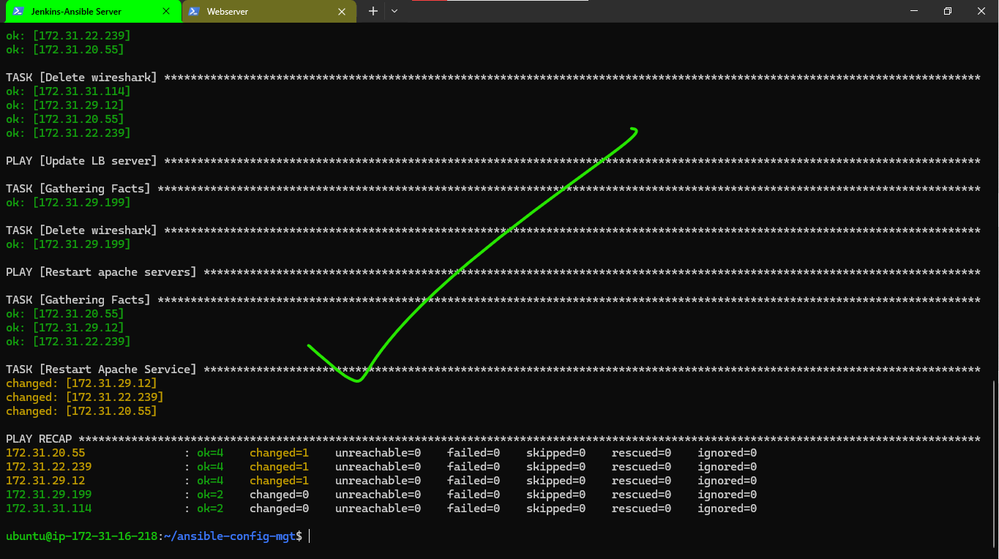
*Figure 2: Playbook execution output*

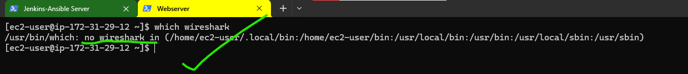
*Figure 2.1: Verify wireshark removal*

## 4. Configuring UAT Webservers

We will now set up two new UAT webservers using a dedicated role.

### 4.1 Launch UAT Instances

Create two EC2 instances using RHEL 9 image. Name them `Web1-UAT` and `Web2-UAT`.

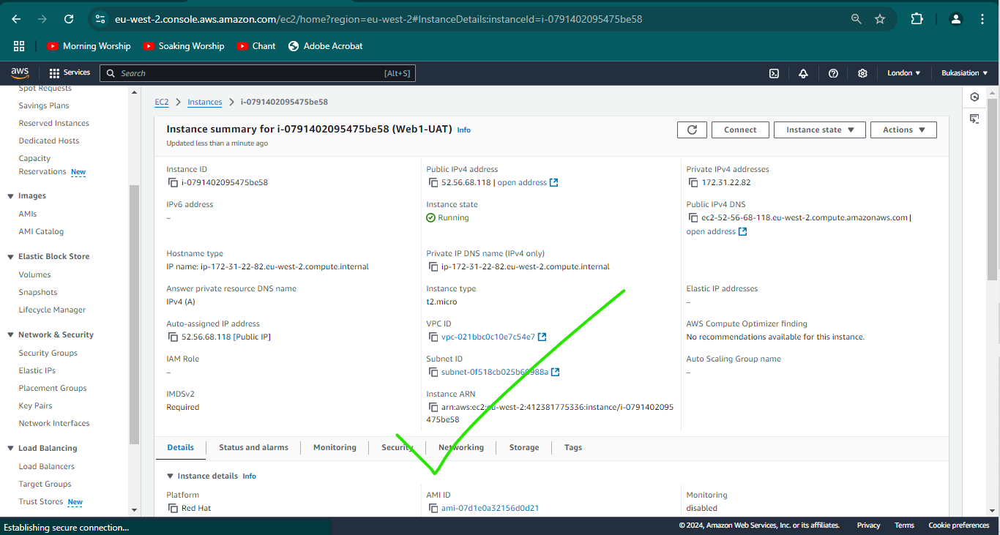
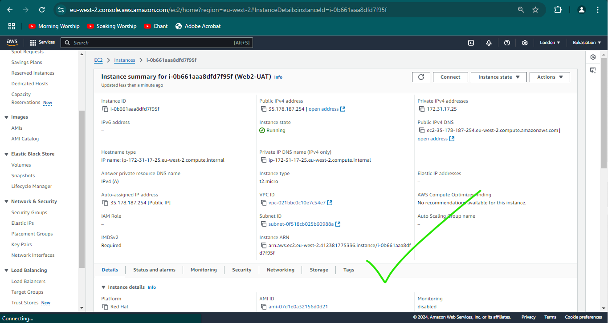
*Figure 3: UAT EC2 instances*

### 4.2 Create Webserver Role

1. Create a `roles` directory in your ansible-config-mgt repository
2. Initialize the webserver role:

```bash
mkdir roles
cd roles
ansible-galaxy init webserver
```

3. Remove unnecessary directories (tests, files, vars)

The final structure should look like this:

```
webserver/
├── README.md
├── defaults/
│   └── main.yml
├── handlers/
│   └── main.yml
├── meta/
│   └── main.yml
├── tasks/
│   └── main.yml
└── templates/
```

### 4.3 Update Inventory

Add the UAT webservers to your inventory file `ansible-config-mgt/inventory/uat.ini`:

```yaml
[uat-webservers]
<Web1-UAT-Server-Private-IP-Address> ansible_ssh_user='ec2-user'
<Web2-UAT-Server-Private-IP-Address> ansible_ssh_user='ec2-user'
```

### 4.4 Configure Ansible

Update `/etc/ansible/ansible.cfg` or `~/.ansible.cfg` or the ansible.cfg file in your playbooks directory to include the roles path:

```ini
roles_path = /home/ubuntu/ansible-config-mgt/roles
```

## 5. Implementing the Webserver Role

### 5.1 Define Webserver Tasks

Edit `roles/webserver/tasks/main.yml`:

```yaml
---
- name: Install Apache
  become: true
  ansible.builtin.yum:
    name: "httpd"
    state: present

- name: Install Git
  become: true
  ansible.builtin.yum:
    name: "git"
    state: present

- name: Clone repository
  become: true
  ansible.builtin.git:
    repo: https://github.com/<your-name>/tooling.git
    dest: /var/www/html
    force: yes

- name: Copy HTML content
  become: true
  ansible.builtin.command: cp -r /var/www/html/html/ /var/www/

- name: Start Apache service
  become: true
  ansible.builtin.service:
    name: httpd
    state: started

- name: Remove cloned directory
  become: true
  ansible.builtin.file:
    path: /var/www/html/html
    state: absent
```

### 5.2 Create UAT Webservers Assignment

Create `static-assignments/uat-webservers.yml`:

```yaml
---
- hosts: uat-webservers
  roles:
     - webserver
```

### 5.3 Update site.yml

Update `playbooks/site.yml` to include the new assignment:

```yaml
---
- hosts: all
- import_playbook: ../static-assignments/common.yml

- hosts: uat-webservers
- import_playbook: ../static-assignments/uat-webservers.yml
```

## 6. Testing and Deployment

### 6.1 Commit Changes

Commit your changes by running this command:

```bash
git commit -m "Refactoring and static assignments"
```

Create a Pull Request by running this command:

```bash
git push --set-upstream origin refactor
```
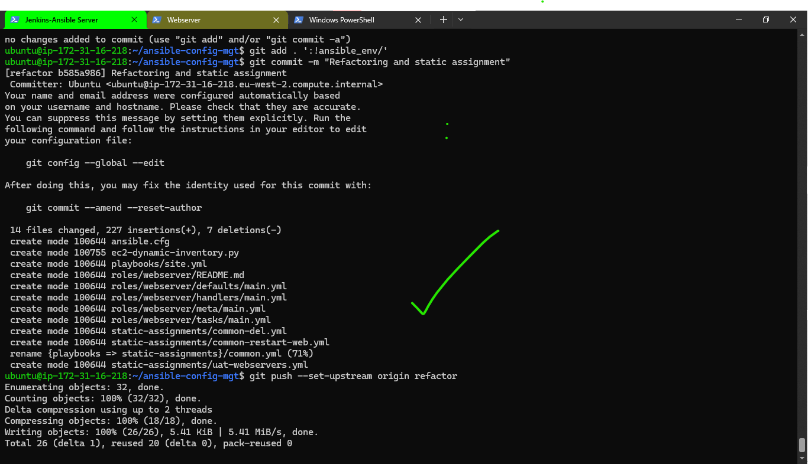
*Figure 3.1: Create Pull Request*

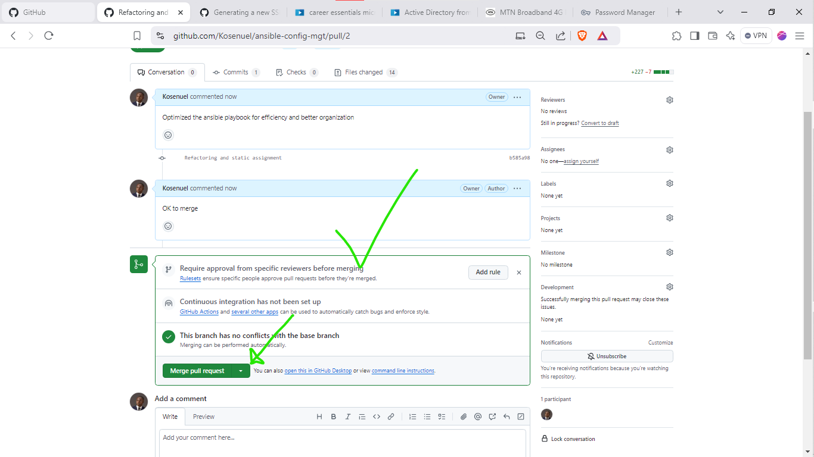
*Figure 3.2: Merge using the web interface*

Merge to the main branch using the GitHub web interface.

### 6.2 Run Jenkins Jobs

Ensure that the webhook triggers two consecutive Jenkins jobs and that they run successfully.

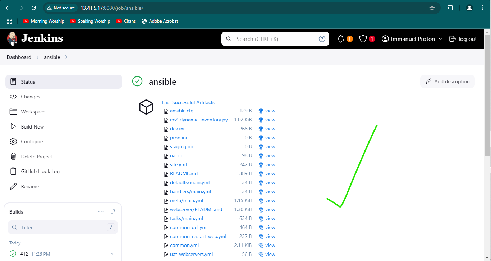

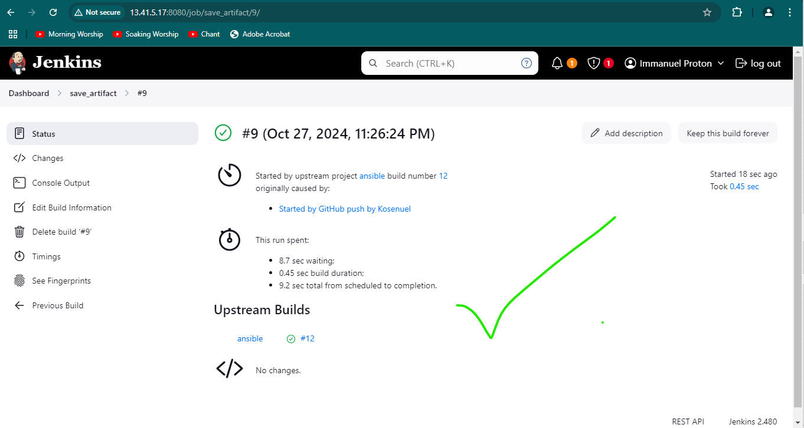
*Figure 3.3: Jenkins jobs*

### 6.3 Execute Playbook

Run the playbook against the UAT inventory:

```bash
cd /home/ubuntu/ansible-config-artifact
ansible-playbook -i inventory/uat.ini playbooks/site.yml
```
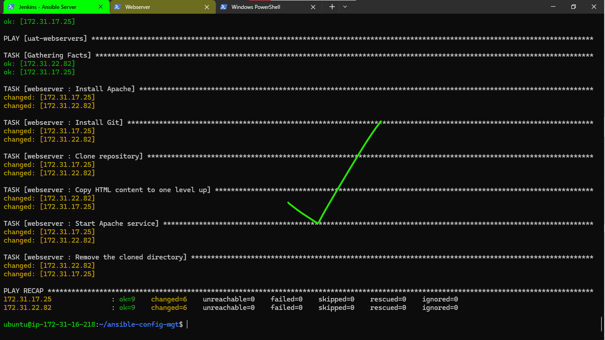
*Figure 3.4: UAT playbook execution*

### 6.4 Verify Deployment

Access the UAT webservers through a web browser:

```
http://<Web1-UAT-Server-Public-IP-or-Public-DNS-Name>/index.php
http://<Web2-UAT-Server-Public-IP-or-Public-DNS-Name>/index.php
```

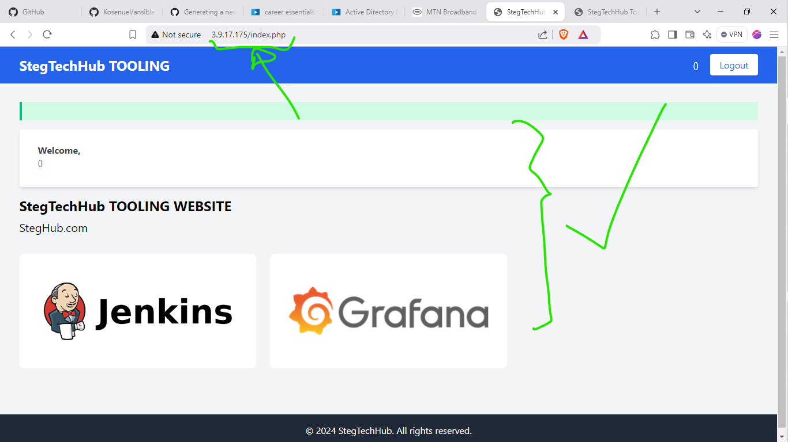


*Figure 4: UAT webserver access*

## Conclusion

With this, we come to the end of the Ansible refactoring and implementation of static assignments/project. This new structure we implemented improves code organization, reusability, and maintainability. The Ansible architecture now includes dedicated roles and a more modular approach to configuration management.

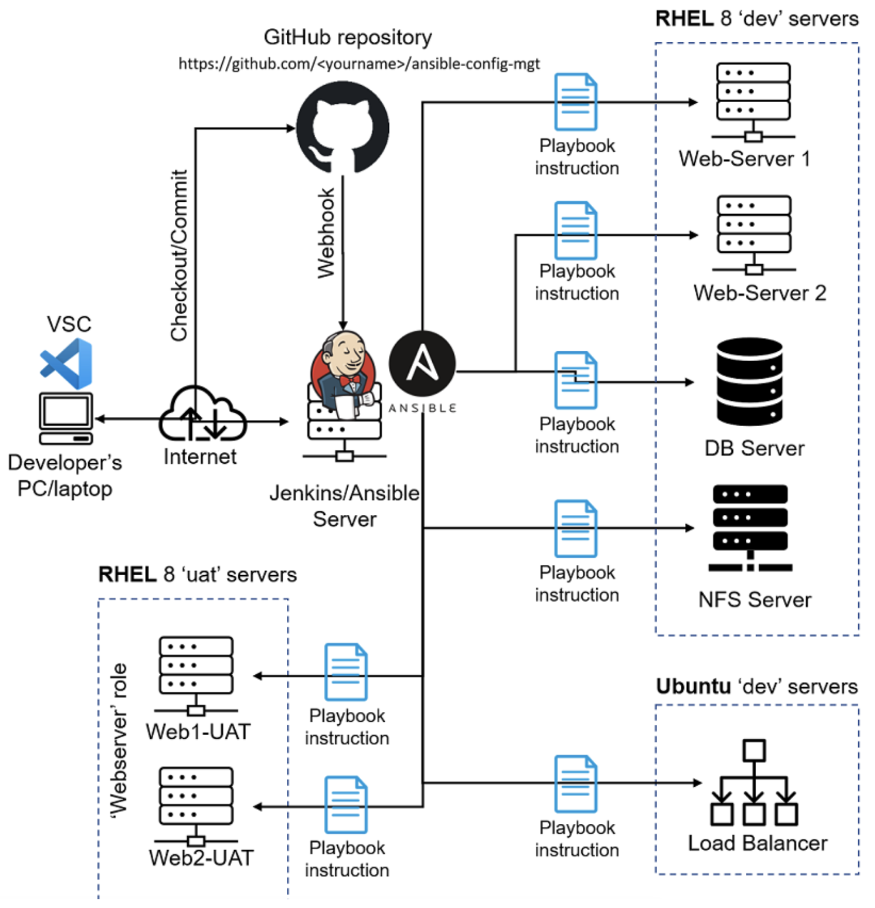
*Figure 5: Updated Ansible architecture diagram*

For further information on Ansible best practices and advanced usage, refer to the [official Ansible documentation](https://docs.ansible.com/).