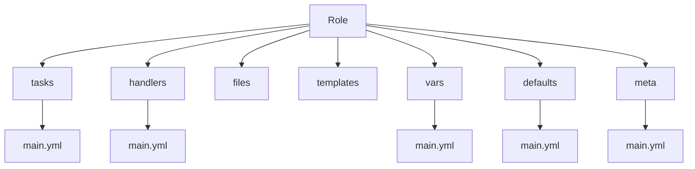
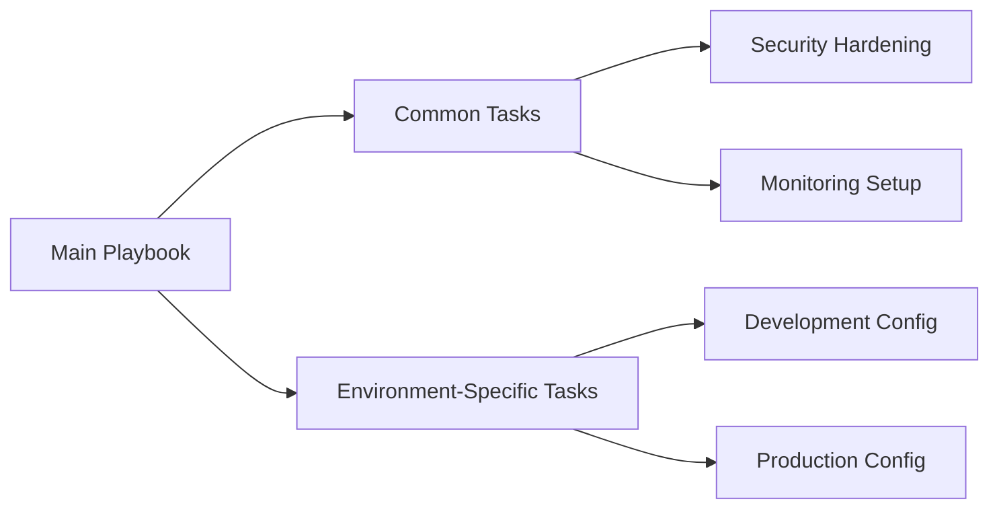

# Self Study: Ansible Artifact Reuse

## Table of Contents
- [Overview](#overview)
- [Core Concepts](#core-concepts)
- [Implementation Guide](#implementation-guide)
- [Advanced Usage](#advanced-usage)
- [Best Practices](#best-practices)
- [Additional Resources](#additional-resources)

## Overview

Ansible artifact reuse is a fundamental practice that enables efficient automation through modular, reusable components. In this guide, we will look at the essential concepts and practical implementations of artifact reuse in Ansible.

> **Note**: This guide assumes basic familiarity with Ansible concepts. For introductory material, refer to the [Ansible Getting Started Guide](https://docs.ansible.com/ansible/latest/getting_started/index.html).

## Core Concepts

### Role Architecture
Roles provide a standardized structure for organizing automation content. Below, you will find a visualization of a typical role structure:



### Include vs Import
Understanding the difference between includes and imports is very important. Below is a table that summarizes some vital differences:

| Feature | Include | Import |
|---------|---------|--------|
| Execution | Dynamic (runtime) | Static (parse-time) |
| Variable Usage | Supports runtime variables | Variables must be predefined |
| Task Numbers | Generated at runtime | Fixed at parse-time |
| Performance | Slight overhead | Better performance |

## Implementation Guide

### 1. Role Management

How to create a new role using the standard structure:

```bash
ansible-galaxy init <role_name>
```

Example of a role implementation:

```yaml
# roles/webserver/tasks/main.yml
- name: Install web server
  apt:
    name: nginx
    state: present
  become: true
```

### 2. Variable Management

```yaml
# group_vars/webservers.yml
http_port: 80
server_name: example.com

# Using variables in playbooks
- hosts: webservers
  vars_files:
    - "vars/{{ environment }}.yml"
```

### 3. Template Usage

Create reusable configuration templates:

```jinja2
# templates/nginx.conf.j2
server {
    listen {{ http_port }};
    server_name {{ server_name }};
    
    location / {
        root {{ web_root }};
        index index.html;
    }
}
```

## Advanced Usage

### Dynamic Role Inclusion

```yaml
- name: Conditionally include roles
  include_role:
    name: "{{ selected_role }}"
  vars:
    selected_role: "{{ 'development' if env == 'dev' else 'production' }}"
```

### Task Reuse Patterns



## Best Practices

1. **Role Organization**
   - Maintain single responsibility principle
   - Use meaningful role names
   - Document role dependencies

2. **Variable Management**
   - Use variable precedence effectively
   - Keep sensitive data in encrypted files
   - Document all variable requirements

3. **Template Design**
   - Create modular templates
   - Use consistent variable naming convention
   - Include template documentation

> **Warning**: Avoid hardcoding values in templates. Use variables for configuration parameters.

## Additional Resources

- [Official Ansible Role Documentation](https://docs.ansible.com/ansible/latest/playbook_guide/playbooks_reuse_roles.html)
- [Ansible Galaxy](https://galaxy.ansible.com/) - Community role repository
- [Ansible Best Practices](https://docs.ansible.com/ansible/latest/tips_tricks/ansible_tips_tricks.html)

---

**Note**: This documentation was mostly based on Ansible best practices. For updates and contributions, please check out the [official Ansible documentation](https://docs.ansible.com/ansible/latest/playbook_guide/playbooks_reuse.html).