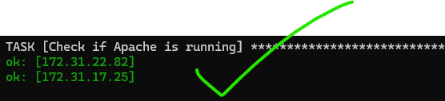

# Side Quest: Apache Server Verification Playbook 

This documentation explains how to implement and use an Ansible playbook for verifying Apache web server status and functionality.

## Overview

The playbook performs three critical checks:
1. Verifies Apache service status
2. Confirms Apache is listening on the specified port
3. Tests webpage response and content

## Prerequisites

- Ansible installed on control node
- Target servers configured in inventory under `uat-webservers` group
- Apache installed on target servers
- `index.php` page available at document root

## Playbook Structure

```yaml
---
- hosts: uat-webservers
  tasks:
    - name: Check if Apache is running
      service_facts:
      register: service_state

    - name: Verify Apache port is listening
      wait_for:
        port: "{{ apache_port }}"
        timeout: 5

    - name: Test webpage response
      uri:
        url: "http://localhost/index.php"
        return_content: yes
      register: webpage
      failed_when: "'Server Information' not in webpage.content"
```

## Task Breakdown

### 1. Apache Service Check
```yaml
- name: Check if Apache is running
  service_facts:
  register: service_state
```
This task collects information about all services on the target system and stores it in the `service_state` variable.


*Diagram shows Ansible querying system services and receiving status information*

### 2. Port Verification
```yaml
- name: Verify Apache port is listening
  wait_for:
    port: "{{ apache_port }}"
    timeout: 5
```
Ensures Apache is listening on the specified port (defined in `apache_port` variable).


*Diagram illustrates port listening check on specified Apache port*

### 3. Webpage Content Test
```yaml
- name: Test webpage response
  uri:
        url: "http://localhost/index.php"
        return_content: yes
  register: webpage
  failed_when: "'Server Information' not in webpage.content"
```
Verifies that the status page is accessible and contains expected content.


*Diagram shows request to status.php and content verification process*

## Implementation Steps

1. **Variable Configuration**
   - Create `group_vars/uat-webservers.yml`  with:
   ```yaml
   apache_port: 80 
   ```

2. **Inventory Setup**
   - Ensure your inventory file includes:
   ```ini
   [uat-webservers]
   server1.example.com
   server2.example.com
   ```

3. **Status Page Setup**
   - Create `status.php` in Apache document root:
   ```php
   <?php
   echo "<h1>Server Information</h1>";
   phpinfo();
   ?>
   ```

4. **Running the Playbook**
   ```bash
   ansible-playbook test-webservers.yml -i /inventory/uat.ini

   ```

## Playbook Output


## Troubleshooting

1. **Service Check Fails**
   - Verify Apache is installed
   - Check service name matches your system (httpd/apache2)
   - Ensure service is started

2. **Port Check Fails**
   - Confirm Apache port configuration
   - Check firewall rules
   - Verify Apache is running

3. **Webpage Test Fails**
   - Ensure status.php exists
   - Check Apache document root configuration
   - Verify PHP is installed and configured

## Best Practices

1. Always set appropriate timeouts for wait_for tasks
2. Use variables for configurable values
3. Include meaningful failure messages
4. Consider adding more detailed content checks

## Security Considerations

1. Limit access to status.php
2. Consider using HTTPS
3. Implement proper firewall rules
4. Use secure authentication where needed

