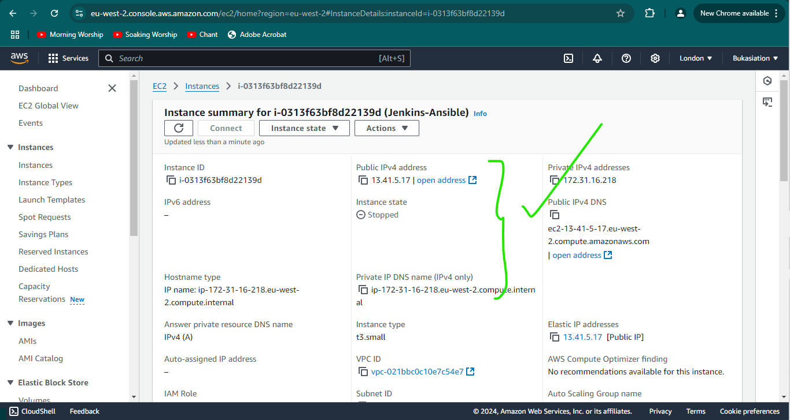
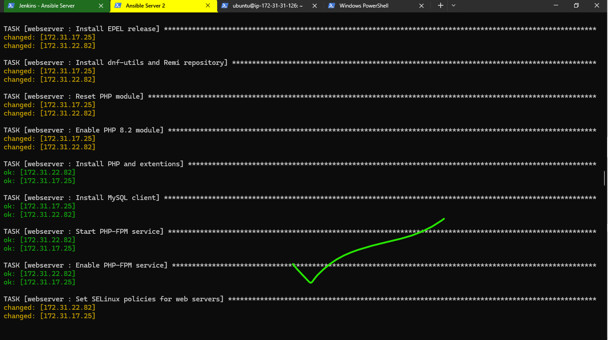
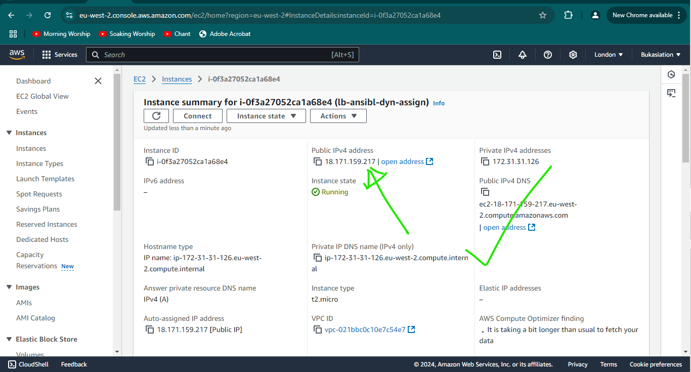

# Ansible Dynamic Assignments and Community Roles Implementation Guide

## Table of Contents
- [Overview](#overview)
- [Prerequisites](#prerequisites)
- [Infrastructure Setup](#infrastructure-setup)
- [Dynamic Assignments Implementation](#dynamic-assignments-implementation)
- [Database Configuration with Community Roles](#download-mysql-ansible-role)
- [Load Balancer Implementation](#load-balancer-roles)
- [Configuration Testing](#configuration-testing)
- [Troubleshooting](#troubleshooting)
- [Conclusion](#conclusion)
- [Best Practices](#best-practices)
- [Reference Documentation](#reference-documentation)

## Overview

This guide outlines the implementation of dynamic assignments in Ansible using the `include` module and demonstrates the integration of community roles for configuring UAT environments. The implementation covers database setup, load balancer configuration, and web server deployment.

### Key Concepts
- Dynamic assignments using `include` module
- Community roles integration
- Multi-environment configuration management
- Load balancer failover setup

## Prerequisites

### Required Infrastructure
- Ansible control node
- UAT web servers (2 instances)
- Load balancer server
- Database server

### Required Tools
- Ansible (version 2.8 or higher)
- Git
- Visual Studio Code (optional)

## Infrastructure Setup

### Server Configuration

1. **Ansible Control Node**
   - Operating System: Ubuntu
   - Purpose: Central management server

2. **UAT Web Servers**
   - Operating System: Amazon Linux
   - Quantity: 2 instances
   - Purpose: Application hosting

3. **Load Balancer**
   - Operating System: Ubuntu
   - Purpose: Traffic distribution
   - Configuration: HTTP/80 inbound access

4. **Database Server**
   - Operating System: Ubuntu
   - Purpose: Data storage and management

### Initial Directory Structure
```
ansible-config-mgt/
├── dynamic-assignments/
├── inventory/
│   ├── dev/
│   ├── prod/
│   ├── staging/
│   └── uat/
├── playbooks/
└── static-assignments/
```

1. **Ansible Control Node**
  

   - Operating System: Ubuntu
   - Purpose: Central management server

2. **UAT Web Servers**
  

    
  

   - Operating System: Amazon Linux
   - Quantity: 2 instances
   - Purpose: Application hosting

3. **Load Balancer**
    
  
   - Operating System: Ubuntu
   - Purpose: Traffic distribution
   - Configuration: HTTP/80 inbound access

4. **Database Server**
  
  
   - Operating System: Ubuntu
   - Purpose: Data storage and management

### Initial Directory Structure
```
ansible-config-mgt/
├── dynamic-assignments/
├── inventory/
│   ├── dev/
│   ├── prod/
│   ├── staging/
│   └── uat/
├── playbooks/
└── static-assignments/
```

## Dynamic Assignments Implementation

### Directory Configuration

1. Create the dynamic assignments structure:
```bash
mkdir dynamic-assignments
touch dynamic-assignments/env-vars.yml
```

2. Create environment variable directories:
```bash
mkdir env-vars
touch env-vars/{dev,stage,uat,prod}.yml
```

### Environment Variables Configuration

1. Configure `env-vars.yml`:
```yaml
---
- name: Load environment variables
  include_vars: "{{ item }}"
  with_first_found:
    - files:
        - dev.yml
        - stage.yml
        - prod.yml
        - uat.yml
      paths:
        - "{{ playbook_dir }}/../env-vars"
  tags:
    - always
```


## Update `site.yml` with dynamic assignments

Update `site.yml` file to make use of the dynamic assignment. (At this point, we cannot test it yet. We are just setting the stage for what is yet to come. So hang on to your hats)

`site.yml` should now look like this.

```yaml
---
- hosts: all
  name: Include dynamic variables
  become: yes
  tasks:
    - include_tasks: ../dynamic-assignments/env-vars.yml
      tags:
        - always

- import_playbook: ../static-assignments/common.yml

- import_playbook: ../static-assignments/uat-webservers.yml

- import_playbook: ../static-assignments/loadbalancers.yml
```

## Community Roles

Utilizing community roles can significantly enhance productivity. For instance, to install MySQL, leverage the `geerlingguy.mysql` role from Ansible Galaxy.


## Download Mysql Ansible Role

You can browse available community roles [here](https://galaxy.ansible.com/ui/)
We will be using a [MySQL role developed by geerlingguy](https://galaxy.ansible.com/ui/standalone/roles/geerlingguy/mysql/).

> __Hint__: To preserve your your GitHub in actual state after you install a new role - make a commit and push to master your `ansible-config-mgt` directory. Of course you must have `git` installed and configured on `Jenkins-Ansible` server and, for more convenient work with codes, you can configure `Visual Studio Code to work with this directory`. In this case, you will no longer need webhook and Jenkins jobs to update your codes on `Jenkins-Ansible` server, so you can disable it - we will be using Jenkins later for a better purpose.

- Configure VSCode to ssh into your Ansible server. Once this is done and you are connected to the ansible server through VSCode, 
the next step is to make sure that `git` is installed with `git --version`, then go to `ansible-config-mgt` directory and run

```bash
git init
git pull https://github.com/<your-name>/ansible-config-mgt.git
git remote add origin https://github.com/<your-name>/ansible-config-mgt.git
git branch roles-feature
git switch roles-feature
```


Inside `roles` directory create your new `MySQL role` with `ansible-galaxy` install `geerlingguy.mysql`

Rename the folder to `mysql`
```bash
mv geerlingguy.mysql/ mysql
```
Read README.md file, and edit roles configuration to use correct credentials for MySQL required for the tooling website.

**Create Database and mysql user (`roles/mysql/vars/main.yml`)**

```yaml
mysql_root_password: ""
mysql_databases:
  - name: tooling
    encoding: utf8
    collation: utf8_general_ci
mysql_users:
  - name: webaccess
    host: "172.31.18.0/20" # The webserver's subnet cidr
    password: testR00t.3
    priv: "tooling.*:ALL"
```


**Create a new playbook inside `static-assignments` folder and name it `db-servers.yml` , update it with `mysql` roles.**

```yaml
- hosts: db_servers
  become: yes
  vars_files:
    - vars/main.yml
  roles:
    - { role: mysql }
```


### Now it is time to upload the changes into your GitHub:

```bash
git add .
git commit -m "Commit new role files into GitHub"
git push --set-upstream origin roles-feature
```


### Now, if you are satisfied with your codes, you can create a Pull Request.

**Merge it to `main` branch on GitHub**


# Load Balancer roles

We want to be able to choose which Load Balancer to use, `Nginx` or `Apache`, so we need to have two roles respectively:

1. Nginx
2. Apache

With our experience on Ansible so far you can:

- Decide if you want to develop your own roles, or find available ones from the community

I would be using the community route.
I can do so using these commands:

```bash
ansible-galaxy role install geerlingguy.nginx

ansible-galaxy role install geerlingguy.apache
```


### Rename the installed Nginx and Apache roles

```bash
mv geerlingguy.nginx nginx

mv geerlingguy.apache apache
```


### The folder structure now looks like this


- ### Update both static-assignment and site.yml files to refer the roles

> __Important Hints:__
> - Since you cannot use both `Nginx` and `Apache` load balancer, you need to add a condition to enable either one - this is where you can make use of variables.
> - Declare a variable in `defaults/main.yml` file inside the `Nginx` and `Apache` roles. Name each variables `enable_nginx_lb` and `enable_apache_lb` respectively.
> - Set both values to `false` like this `enable_nginx_lb: false` and `enable_apache_lb: false`.
> - Declare another variable in both roles `load_balancer_is_required` and set its value to `false` as well

### For nginx

```yaml
# roles/nginx/defaults/main.yml
enable_nginx_lb: false
load_balancer_is_required: false
```


### For apache

```yaml
# roles/apache/defaults/main.yml
enable_apache_lb: false
load_balancer_is_required: false
```


### Update assignment
This role (nginx or apache) is applied if both conditions specified in the `when` statement are met:

`loadbalancers.yml` file

```yaml
#loadbalancers.yml
---
- hosts: lb
  become: yes
  roles:
    - role: nginx
      when: enable_nginx_lb | bool and load_balancer_is_required | bool
    - role: apache
      when: enable_apache_lb | bool and load_balancer_is_required | bool
```


- ### Update `site.yml` files respectively

```yaml
---
- hosts: all
  name: Include dynamic variables
  become: yes
  tasks:
    - include_tasks: ../dynamic-assignments/env-vars.yml
      tags:
        - always

- import_playbook: ../static-assignments/common.yml

- import_playbook: ../static-assignments/uat-webservers.yml

- import_playbook: ../static-assignments/loadbalancers.yml

- import_playbook: ../static-assignments/db-servers.yml
```


Now you can make use of `env-vars\uat.yml` file to define which `loadbalancer` to use in UAT environment by setting respective environmental variable to `true`.

You will activate `load balancer`, and enable `nginx` by setting these in the respective environment's `env-vars` file.

### Enable Nginx

```yaml
enable_nginx_lb: true
load_balancer_is_required: true
```


# Set up for Nginx Load Balancer

### Update `roles/nginx/defaults/main.yml`

__Configure Nginx virtual host__

```yaml
---
nginx_vhosts:
  - listen: "80"
    server_name: "example.com"
    root: "/var/www/html"
    index: "index.php index.html index.htm"
    locations:
              - path: "/"
                proxy_pass: "http://myapp1"

    # Properties that are only added if defined:
    server_name_redirect: "www.example.com"
    error_page: ""
    access_log: ""
    error_log: ""
    extra_parameters: ""
    template: "{{ nginx_vhost_template }}"
    state: "present"

nginx_upstreams:
- name: myapp1
  strategy: "ip_hash"
  keepalive: 16
  servers:
    - "172.31.22.82 weight=5"
    - "172.31.17.25 weight=5"

nginx_log_format: |-
  '$remote_addr - $remote_user [$time_local] "$request" '
  '$status $body_bytes_sent "$http_referer" '
  '"$http_user_agent" "$http_x_forwarded_for"'
become: yes
```


### Update `roles/nginx/templates/nginx.conf.j2`

Comment the line `include {{ nginx_vhost_path }}/*;`


This line renders the `/etc/nginx/sites-enabled/` to the `http` configuration of Nginx.

#### Create a `server block` template in `Nginx.conf.j2` for nginx configuration file to override the default in nginx role.

```jinja

    server {
        listen {{ vhost.listen }};
        server_name {{ vhost.server_name }};
        root {{ vhost.root }};
        index {{ vhost.index }};

    
        location {{ location.path }} {
            proxy_pass {{ location.proxy_pass }};
        }
    
  }

```


### Update `inventory/uat`

```yaml
[lb]
load_balancer ansible_host=172.31.6.105 ansible_ssh_user='ubuntu'

[uat_webservers]
Web1 ansible_host=172.31.35.223 ansible_ssh_user='ec2-user'
Web2 ansible_host=172.31.34.101 ansible_ssh_user='ec2-user'

[db_servers]
db ansible_host=172.31.2.161 ansible_ssh_user='ubuntu'
```


### Update Webservers Role in `roles/webservers/tasks/main.yml` to install Epel, Remi's repoeitory, Apache, PHP and clone the tooling website from your GitHub repository

```yaml
---
- name: install apache
  remote_user: ec2-user
  become: true
  become_user: root
  ansible.builtin.yum:
    name: "httpd"
    state: present

- name: Enable apache
  remote_user: ec2-user
  become: true
  become_user: root
  ansible.builtin.command:
    cmd: sudo systemctl enable httpd

- name: Install EPEL release
  remote_user: ec2-user
  become: true
  become_user: root
  ansible.builtin.command:
    cmd: sudo dnf install https://dl.fedoraproject.org/pub/epel/epel-release-latest-9.noarch.rpm -y

- name: Install dnf-utils and Remi repository
  remote_user: ec2-user
  become: true
  become_user: root
  ansible.builtin.command: 
    cmd: sudo dnf install dnf-utils http://rpms.remirepo.net/enterprise/remi-release-9.rpm -y

- name: Reset PHP module
  remote_user: ec2-user
  become: true
  become_user: root
  ansible.builtin.command:
    cmd: sudo dnf module reset php -y

- name: Enable PHP 8.2 module
  remote_user: ec2-user
  become: true
  become_user: root
  ansible.builtin.command:
    cmd: sudo dnf module enable php:remi-8.2 -y

- name: Install PHP and extensions
  remote_user: ec2-user
  become: true
  become_user: root
  ansible.builtin.yum:
    name:
      - php
      - php-opcache
      - php-gd
      - php-curl
      - php-mysqlnd
    state: present

- name: Install MySQL client
  remote_user: ec2-user
  become: true
  become_user: root
  ansible.builtin.yum:
    name: "mysql"
    state: present

- name: Start PHP-FPM service
  remote_user: ec2-user
  become: true
  become_user: root
  ansible.builtin.service:
    name: php-fpm
    state: started

- name: Enable PHP-FPM service
  remote_user: ec2-user
  become: true
  become_user: root
  ansible.builtin.service:
    name: php-fpm
    enabled: true

- name: Set SELinux policies for web servers
  remote_user: ec2-user
  become: true
  become_user: root
  ansible.builtin.command:
    cmd: sudo setsebool -P httpd_execmem 1
    cmd: sudo setsebool -P httpd_can_network_connect=1
    cmd: sudo setsebool -P httpd_can_network_connect_db=1

- name: install git
  remote_user: ec2-user
  become: true
  become_user: root
  ansible.builtin.yum:
    name: "git"
    state: present

- name: clone a repo
  remote_user: ec2-user
  become: true
  become_user: root
  ansible.builtin.git:
    repo: https://github.com/francdomain/tooling.git
    dest: /var/www/html
    force: yes

- name: copy html content to one level up
  remote_user: ec2-user
  become: true
  become_user: root
  command: cp -r /var/www/html/html/ /var/www/

- name: Start service httpd, if not started
  remote_user: ec2-user
  become: true
  become_user: root
  ansible.builtin.service:
    name: httpd
    state: started

- name: recursively remove /var/www/html/html/ directory
  remote_user: ec2-user
  become: true
  become_user: root
  ansible.builtin.file:
    path: /var/www/html/html
    state: absent
```


### Update `roles/nginx/tasks/main.yml` with the code below to create a task that check and stop apache if it is running

```yaml
---
- name: Check if Apache is running
  ansible.builtin.service_facts:

- name: Stop and disable Apache if it is running
  ansible.builtin.service:
    name: apache2
    state: stopped
    enabled: no
  when: "'apache2' in services and services['apache2'].state == 'running'"
  become: yes
```


## Configuration Testing
### Now run the playbook against your uat inventory

```bash
ansible-playbook -i inventory/uat playbooks/site.yml --extra-vars "@env-vars/uat.yml"
```





### Confirm that Nginx is enabled and running and Apache is disabled

__Access load balancer server__

```bash
ssh -i "my-devec2key.pem" ubuntu@<Loadbalancer IP>
```


### Check Nginx and Apache status


### Check ansible configuration for Nginx

```bash
sudo vi /etc/nginx/nginx.conf
```


### Update the website's configuration with the database and user credentials to connect to the database (in /var/www/html/function.php file)

```bash
sudo vi /var/www/html/functions.php
```


### Apply tooling-db.sql command on the webservers

```bash
sudo mysql -h 172.31.2.161 -u webaccess -p tooling < tooling-db.sql
```

### Access the database server from Web Server

```bash
sudo mysql -h 172.31.2.161 -u webaccess -p
```

### Create in MyQSL a new admin user with username: myuser and password: password

```SQL
INSERT INTO users(id, username, password, email, user_type, status) VALUES (2, 'myuser', '5f4dcc3b5aa765d61d8327deb882cf99', 'user@mail.com', 'admin', '1');
```

### Access the tooling website using the LB's Public IP address on a browser




In thesame vein, we must work with apache LB, so you can switch it by setting respective environmental variable to true and other to false.

To test this, you can update inventory for each environment and run Ansible against each environment.


# Set up for Apache Load Balancer

__Update `roles/apache/tasks/configure-Debian.yml`__

Configure Apache virtual host

```yaml
---
- name: Add apache vhosts configuration.
  template:
    src: "{{ apache_vhosts_template }}"
    dest: "{{ apache_conf_path }}/sites-available/{{ apache_vhosts_filename }}"
    owner: root
    group: root
    mode: 0644
  notify: restart apache
  when: apache_create_vhosts | bool
  become: yes

- name: Enable Apache modules
  ansible.builtin.shell:
    cmd: "a2enmod {{ item }}"
  loop:
    - rewrite
    - proxy
    - proxy_balancer
    - proxy_http
    - headers
    - lbmethod_bytraffic
    - lbmethod_byrequests
  notify: restart apache
  become: yes

- name: Insert load balancer configuration into Apache virtual host
  ansible.builtin.blockinfile:
    path: /etc/apache2/sites-available/000-default.conf
    block: |
      <Proxy "balancer://mycluster">
        BalancerMember http://172.31.35.223:80
        BalancerMember http://172.31.34.101:80
        ProxySet lbmethod=byrequests
      </Proxy>
      ProxyPass "/" "balancer://mycluster/"
      ProxyPassReverse "/" "balancer://mycluster/"
    marker: "# {mark} ANSIBLE MANAGED BLOCK"
    insertbefore: "</VirtualHost>"
  notify: restart apache
  become: yes
```


### Enable Apache (in `env-vars/uat.yml`)

#### Switch Apache to true and nginx to false


__Update `roles/apache/tasks/main.yml` to create a task that check and stop nginx if it is running__

```yaml
---
- name: Check if nginx is running
  ansible.builtin.service_facts:

- name: Stop and disable nginx if it is running
  ansible.builtin.service:
    name: nginx
    state: stopped
    enabled: no
  when: "'nginx' in services and services['nginx'].state == 'running'"
  become: yes
```


> ## Note: 
> **Comment out the references for the db-servers and uat-webservers playbook in site.yml file in order not to rerun the tasks. Only the reference to import the load balancer playbook should be left.**

### Now run the playbook against the uat inventory

```bash
ansible-playbook -i inventory/uat playbooks/site.yml --extra-vars "@env-vars/uat.yml"
```


### Confirm that Apache is running and enabled and Nginx is disabled

Access the Load balancer

```bash
ssh -i "my-devec2key.pem" ubuntu@3.145.48.108
```


__Check Apache and Nginx status__


### Check ansible configuration for Apache

```bash
sudo vi /etc/apache2/sites-available/000-default.conf
```


### Access the tooling website using the LB's Public IP address


## Troubleshooting

### Common Issues
- Load balancer service conflicts
- Database connectivity issues
- Web server configuration errors

### Resolution Steps
1. Check service status
2. Verify configuration files
3. Review log files
4. Validate network connectivity


## Conclusion

In this guide, we have successfully navigated the complexities of implementing dynamic assignments and community roles in Ansible for configuring a UAT environment. We looked at the essential components required for setting up infrastructure, including web servers, load balancers, and database servers, etc... while utilizing community roles to beef-up our productivity.

When we were carrying out this project, the following was touched on:

- **Dynamic Assignments**: We learned how to utilize the `include` module to manage dynamic variables effectively, thus allowing for a more flexible and scalable configuration management approach.
- **Community Roles**: When we integrated community roles from Ansible Galaxy, we simplified the installation and configuration of services like MySQL, Nginx, and Apache, thus reducing the time and effort required for setup.
- **Load Balancer Configuration**: We then explored how to configure both Nginx and Apache as load balancers, which assisted us to switch between them based on our environment's needs, thus ensuring high availability and efficient traffic management.
- **Best Practices**: When carrying out this kind of project it is important to note that pre-defining key variables, testing dynamically loaded tasks, and maintaining backups of configuration files are non-negotiables to prevent potential issues during deployment.


## Best Practices

- **Pre-Define Key Variables**: Avoid runtime errors by defining essential variables in advance.
- **Test Dynamically Loaded Tasks**: Regularly test playbooks with dynamic tasks to ensure functionality under various conditions.
- **Backup Configuration Files**: Backup important configuration files before making significant changes.
- **Refer to Official Documentation**: For advanced configurations, refer to the [Ansible Documentation](https://docs.ansible.com/).


## Reference Documentation
- [Ansible Dynamic Assignments](https://docs.ansible.com/ansible/latest/playbook_guide/playbooks_reuse.html#includes-dynamic-re-use)
- [Ansible Galaxy](https://galaxy.ansible.com/ui/)
- [Nginx Documentation](https://nginx.org/en/docs/)
- [Apache Documentation](https://httpd.apache.org/docs/)    
