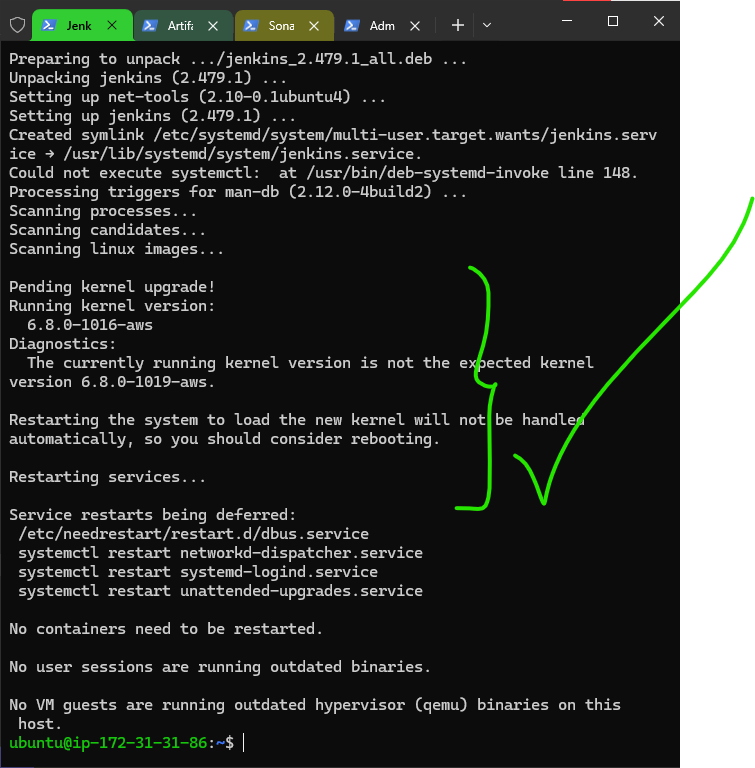
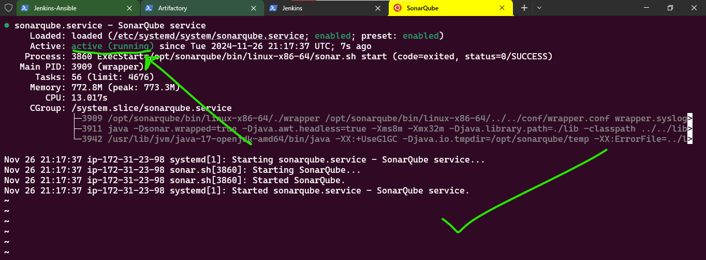

# Complete CI/CD Pipeline Implementation with Jenkins, Ansible, Artifactory, and SonarQube

## Table of Contents
1. [Prerequisites](#prerequisites)
2. [Introduction](#introduction)
3. [Environment Setup](#environment-setup)
4. [Jenkins Configuration](#jenkins-configuration)
5. [SonarQube Setup](#sonarqube-setup)
6. [Artifactory Configuration](#artifactory-configuration)
7. [Pipeline Development](#pipeline-development)
8. [Quality Gates Implementation](#quality-gates-implementation)
9. [Monitoring and Maintenance](#monitoring-and-metrics)
10. [Maintenance Procedures](#maintenance-procedures)
11. [Conclusion](#conclusion)

## Prerequisites

Before starting this tutorial, ensure you have:

### Required Tools
- AWS Account with appropriate permissions
- GitHub Account
- Domain Name (for DNS configuration)
- Basic understanding of CI/CD concepts

### Required Infrastructure
```yaml
Servers Required:
  Jenkins-Ansible:
    Type: t2.medium
    OS: Ubuntu 20.04
    Storage: 20GB or more
  
  SonarQube:
    Type: t2.medium
    OS: Ubuntu 20.04
    Storage: 20GB or more
  
  Artifactory:
    Type: t2.medium
    OS: Ubuntu 20.04
    Storage: 20GB or more

  Mysql Database server:
    Type: t2.micro
    OS: Ubuntu 20.04
    Storage: 20GB or more
    Port: 3306 (ensure that this port is open in the security group)
```


*Figure 1: Creating required EC2 instances in AWS Console*

## Introduction

### Project Overview
In this project, we will walk through implementing a complete CI/CD pipeline integrating:
- Jenkins for automation
- Ansible for configuration management
- SonarQube for code quality analysis
- Artifactory for artifact management
- PHP application deployment

### Architecture Overview

*Figure 2: Project Architecture Overview*

### Legend
- Blue: Core CI/CD tools
- Green: Application servers
- Orange: Security components
- Grey: External entities
## Environment Setup

### Step 1: DNS Configuration

1. Access your domain registrar's DNS settings
2. Add the following A records:
```yaml
DNS Records:
  - jenkins.kosenuel.uk.to -> 13.41.5.17
  - sonarqube.kosenuel.uk.to -> 18.135.222.127  
  - artifactory.artifactory.kosenuel.uk.to -> 18.133.56.91
```


*Figure 3: DNS record configuration in domain registrar*

### Step 2: Security Group Configuration

1. Navigate to AWS EC2 Security Groups
2. Create the following security groups:

```yaml
Jenkins Security Group:
  Inbound Rules:
    - Port 8080: Jenkins Web Interface
    - Port 22: SSH Access
    
SonarQube Security Group:
  Inbound Rules:
    - Port 9000: SonarQube Web Interface
    - Port 22: SSH Access
    
Artifactory Security Group:
  Inbound Rules:
    - Port 8081: Artifactory Web Interface
    - Port 22: SSH Access
```


*Figure 4: AWS Security Group configuration*

### Step 3: Initial Server Setup

For each server, perform these initial setup steps:

```bash
# Update system packages
sudo apt update
sudo apt upgrade -y

# Install common dependencies
sudo apt install -y wget unzip curl git

# Configure timezone
sudo timedatectl set-timezone UTC
```

Expected Output:
```
Reading package lists... Done
Building dependency tree... Done
...
Time zone changes will take effect immediately
```


*Figure 5: Terminal showing successful server setup*

### Step 4: SSH Key Configuration

1. Generate SSH key pair:
```bash
ssh-keygen -t rsa -b 4096 -C "your-email@example.com"
```

2. Add to SSH agent:
```bash
eval $(ssh-agent -s)
ssh-add ~/.ssh/id_rsa
```

3. Add public key to GitHub:
```bash
cat ~/.ssh/id_rsa.pub
# Copy output to GitHub SSH keys
```


*Figure 6: Adding SSH key to GitHub account*

💡 **Tip**: Keep your SSH private keys secure and never share them. Use separate keys for different environments.

⚠️ **Common Issue**: If SSH agent isn not starting automatically, add these lines to your `~/.bashrc`:
```bash
if [ -z "$SSH_AUTH_SOCK" ] ; then
    eval $(ssh-agent -s)
    ssh-add ~/.ssh/id_rsa
fi
```

## Jenkins Configuration

### Step 1: Jenkins Installation

1. Install Java (Jenkins prerequisite):
```bash
sudo apt update
sudo apt install -y openjdk-17-jdk
```

2. Add Jenkins repository and install:
```bash
wget -q -O - https://pkg.jenkins.io/debian-stable/jenkins.io.key | sudo apt-key add -
sudo sh -c 'echo deb https://pkg.jenkins.io/debian-stable binary/ > /etc/apt/sources.list.d/jenkins.list'
sudo apt update
sudo apt install -y jenkins
```

3. Start Jenkins service:
```bash
sudo systemctl start jenkins
sudo systemctl enable jenkins
```



*Figure 7: Terminal showing successful Jenkins installation*

### Step 2: Initial Jenkins Setup

1. Retrieve initial admin password:
```bash
sudo cat /var/lib/jenkins/secrets/initialAdminPassword
```

2. Access Jenkins web interface:
```
http://jenkins.yourdomain.com:8080
```


*Figure 8: Jenkins unlock screen with admin password entry*

3. Install recommended plugins and create admin user


*Figure 9: Jenkins plugin installation screen*

### Step 3: Required Plugin Installation

Navigate to "Manage Jenkins" → "Manage Plugins" → "Available" and install:

```yaml
Required Plugins:
  - Blue Ocean
  - Pipeline AWS
  - Ansible
  - SonarQube Scanner
  - Artifactory
  - Git
  - Pipeline
  - GitHub 
  - Plot
```


*Figure 10: Installing additional Jenkins plugins*

### Step 4: Configure Global Tools

Navigate to "Manage Jenkins" → "Tool":

1. Configure JDK:
```yaml
JDK Configuration:
  Name: JAVA_HOME
  JAVA_HOME: /usr/lib/jvm/java-17-openjdk-amd64
```

2. Configure Git:
```yaml
Git Configuration:
  Name: Default
  Path to Git executable: /usr/bin/git
```


*Figure 11: Jenkins Global Tool Configuration screen*

### Step 5: Configure Credentials

Navigate to "Manage Jenkins" → "Credentials" → "Jenkins" → "Global credentials":

1. Add GitHub credentials:
```yaml
Kind: Username with password
Scope: Global
Username: your-github-username
Password: your-github-token
ID: github-credentials
Description: GitHub Access
```

<!-- 2. Add AWS credentials: (Optional)
```yaml
Kind: AWS Credentials
Scope: Global
Access Key ID: your-aws-access-key
Secret Access Key: your-aws-secret-key
ID: aws-credentials
Description: AWS Access
``` -->


*Figure 12: Adding credentials in Jenkins*

💡 **Note**: Jenkins' built-in credential store is used for sensitive information rather than hardcoding them in scripts.

### Step 6: Configure Pipeline Libraries

1. Navigate to "Manage Jenkins" → "System"
2. Under "Global Pipeline Libraries", add:

```yaml
Library Configuration:
  Name: pipeline-library
  Default Version: main
  Source:
    GitHub:
      Owner: Kosenuel.uk.to
      Repository: pipeline-library
      Credentials: github-credentials
```


*Figure 13: Configuring Pipeline Libraries*

### Step 7: Create Your First Pipeline

1. Click "New Item"
2. Select "Pipeline"
3. Name: Test-Pipeline
4. Configure Pipeline:

In the "Pipeline" section, add the following script:
```groovy
pipeline {
    agent any
    
    stages {
        stage('Test Pipeline') {
            steps {
                echo 'This is Emmanuel Testing that the Pipeline is working!'
            }
        }
    }
}
```
save and apply, then click "Build Now" to execute the pipeline:


*Figure 14: Creating first Jenkins pipeline*

Expected Output:
```
Started by user admin
Running in Durability level: MAX_SURVIVABILITY
[Pipeline] Start of Pipeline
[Pipeline] node
[Pipeline] {
[Pipeline] stage
[Pipeline] { (Test Pipeline)
[Pipeline] echo
This is Emmanuel Testing the Pipeline is working!
[Pipeline] }
[Pipeline] }
[Pipeline] End of Pipeline
Finished: SUCCESS
```

⚠️ **Troubleshooting Common Issues**:

1. Jenkins not starting:
```bash
# Check Jenkins status
sudo systemctl status jenkins

# Check Jenkins logs
sudo tail -f /var/log/jenkins/jenkins.log
# sometimes it might be because the java jdk installed is deprecated and might need you to install a more recent version (at least that was the case for me and I had to installl open-jdk-17)
```

2. Plugin installation failures:
- Clear browser cache
- Restart Jenkins:
```bash
sudo systemctl restart jenkins
```

3. Permission issues:
```bash
# Fix Jenkins user permissions
sudo chown -R jenkins:jenkins /var/lib/jenkins
```
## Now setup Ansible in the Jenkins-Ansible Server 

### Step 1: Install Ansible on Ubuntu

1. **Update package lists:**

   Open a terminal and run the following command to ensure your system package lists are up-to-date:

   ```bash
   sudo apt update
   ```

2. **Install Ansible:**

   You can install Ansible from the official Ubuntu repositories using `apt`. Run the following command:

   ```bash
   sudo apt install ansible -y
   ```

3. **Verify the installation:**

   After the installation completes, verify that Ansible is installed correctly by checking the version:

   ```bash
   ansible --version
   ```

   You should see output similar to:

   ```
   ansible 2.9.6
     config file = /etc/ansible/ansible.cfg
     configured module search path = ['/usr/share/ansible']
     ansible python module location = /usr/lib/python3.8/dist-packages/ansible
     executable location = /usr/bin/ansible
     python version = 3.8.5 (default, Jul  7 2020, 10:52:45) [GCC 8.4.0]
   ```
   

*Figure 15: Terminal showing successful Ansible installation*

### Step 2: Set Up Inventory Structure

We will create a directory called ansible in the home directory, then create an inventory directory inside it, here we will have the various inventory files for the different environments.

Before we do this, Let's clone the Ansible-Pipeline project repository to the Jenkins-Ansible server, so that any changes we make to the inventory will be reflected in the repository. 

1. **Clone the repository:**
   ```bash
   git clone https://github.com/Kosenuel/C2JA2Q-ansible-pipeline-library.git
   ```
  I would recommend generating a pat for the github repo and setting your credentials in the jenkins server to access the repo. If you have your token, you can set git to use it by:
  ```bash
  git config --global credential.helper store
  ```
  Then, when you are prompted to enter your credentials, you can enter your token instead of your username and password.

  
1. **Create the directory structure:**

   Create the directories for each environment (`ci`, `dev`, `pentest`, `pre-prod`, `prod`, `sit`, `uat`).

   ```bash
   mkdir -p ~/ansible/inventory/
   ```


2. **Create inventory files for each environment:**

   You’ll need to create an **inventory file** for each of these environments. For simplicity, let’s assume each environment will have its own inventory file (like `ci` file).

   For example, inside each environment directory, create a `hosts` file.

   ```bash
   touch ~/ansible/inventory/{ci,dev,pentest,pre-prod,prod,sit,uat}/hosts
   ```
  
   This will create a file structure like this:

   ```
   ├── ci
   ├── dev
   ├── pentest
   ├── pre-prod
   ├── prod
   ├── sit
   └── uat
   ```
   You can then populate each `environment` file with the list of hosts (IP addresses or domain names) for each respective environment.

   For example, in the `~/ansible/inventory/ci` file:

   ```
   [jenkins]
   172.31.31.86

   [nginx]
   172.31.29.199

   [sonarqube]
   172.31.23.98

   [artifactory]
   172.31.24.77
   ```

   Similarly, in the`~/ansible/inventory/dev` file:

   ```
   [tooling]
   tooling-server-1.example.com

   [todo]
   todo-server-2.example.com

   [nginx]
   172.31.29.199

   [db:vars]
   ansible_user=ec2-user
   ansible_python_interpreter=/usr/bin/python

   [db]
   db-server-2.example.com
   ```

   Similarly, in the`~/ansible/inventory/pentest` file:

   ```
   [pentest:children]
   pentest-todo
   pentest-tooling

   [pentest-todo]
   pentest-todo-server-2.example.com

   [pentest-tooling]
   pentest-tooling-server-2.example.com
   ```


### Step 3: Configure the `ansible.cfg` File

Now, let's configure the **`ansible.cfg`** file to point to the correct inventory.

1. **Create the `ansible.cfg` file:**

   In the home directory or the Ansible project directory, create an **`ansible.cfg`** file.

   ```bash
   touch ~/ansible/ansible.cfg
   ```

2. **Edit the `ansible.cfg` file:**

   Open the file using any text editor (e.g., `nano`, `vim`, etc.) and add the following configuration:

   ```ini
   [defaults]
   inventory = ~/ansible/inventory
   ```

   This configuration tells Ansible to look in the `~/ansible/inventory` directory for our inventory files.

   Example:

   ```bash
   nano ~/ansible/ansible.cfg
   ```

   Add this content to the file:

   ```ini
   [defaults]
   inventory = ~/ansible/inventory
   
   ansible_user=ubuntu
   ```

3. **Verify Ansible Inventory:**

   Now, you can use the `ansible-inventory` command to verify that your inventory is set up correctly:

   ```bash
   ansible-inventory --list -i ~/ansible/inventory/ci.ini
   ```
   
   *Figure 16: Ansible Inventory*
   > *Note:* This above inventory file later caused me troubles, so to fix it, I recommend you **ADD** the `ansible_user=ubuntu` to the hosts in `inventory` file or in the `ansible.cfg` file. **VERY IMPORTANT**

   This will list all the hosts in your `ci` inventory.

### Step 4: Testing the Setup

1. **Run a simple command against an environment:**

   You can now run an Ansible command for any of your environments. For example, if you want to run a simple `ping` on all the servers in the `ci` environment, you can do the following:

   ```bash
   ansible -i ~/ansible/inventory/ci/hosts ci_servers -m ping
   ```

   This should attempt to `ping` all servers listed under `ci_servers` in the `ci/hosts` file.

   
   *Figure 17: Ansible Ping*

Also,you need to setup your jenkins server to have access to ansible. Do this by installing and configuring the ansible plugin in jenkins. [Click here for a guide on how to do this](https://www.youtube.com/watch?v=PRpEbFZi7nI).
## Now we will setup Ansible pipleine in Jenkins using Blue Ocean (for a better user experience)
To do this,

  1. Navigate to Jenkins URL
  2. Open Blue Ocean Jenkins Plugin
  3. Create a new pipeline 

  
  
  **Select "Github"**

   **Connect Jenkins to github by generating a token from github**. Go to your github account and generate a token by clicking on Profile Icon -> Settings -> Developer settings -> Personal access tokens -> Generate new token. (Note the level of access you are grantinig the token too)

  
  

  
  Paste the token in the connect field an click on "Connect"

  
  Select the repository you want to use for the pipeline/project

  
  At this point we do not have a Jenkinsfile in the Ansible repository, so Blue Ocean will attempt to give us some guidance to create one. But we do not need that. We will rather create one ourselves. So, click on Administration to exit the Blue Ocean console.

  
  Here Jenkins would take you to its home page, click on "My Views" to see projects you have access to.

  
  We can see the pipeline we created earlier with blue ocean sitting there. Notice, it assumed the name of our chosen repository as the name of the project.

  ### Let's create our own Jenkinsfile.
  Inside the Jenkins-Ansible server, in the ansible directory, let's create a new directory called `deploy` and a file called `Jenkinsfile` inside it.

  
  
  *Figure 18: Configuring Blue Ocean/Setting up and creating the Jenkinsfile*
  
  Add the code snippet below to start building the Jenkinsfile gradually. This pipeline will currently have just one stage called **Build** and the only thing we are doing is using the shell script module to echo Building Stage.

  ```groovy
  pipeline {
    agent any


    stages {
      stage('Build') {
        steps {
          sh 'echo Building Stage'
        }
      }
    }
  ```
 Now, we will go back to the `Ansible-Pipeline` project and click on "Configure"

  
  *Figure 19: Configuring the Jenkins Ansible Project*

  
  *Figure 20: Configuring the Location of the Jenkinsfile*

  Scroll down to the 'Build Configuration' Section and specify the location of the `Jenkinsfile` we created earlier @`~/ansible/deploy/Jenkinsfile`, then click on "Save"

  
  *Figure 21: Testing out the first build*

This will trigger a build and you will be able to see the effect of our basic Jenkinsfile configuration by going through the console output of the build.

### Side quest: adding more stages into the pipeline
1. Create a pull request to merge the latest code into the `main branch`
2. After merging the `PR`, go back into your terminal and switch into the `main` branch.
3. Pull the latest change.
4. Create a new branch, add more stages into the Jenkins file to simulate below phases. (Just add an `echo` command like we have in `build` and `test` stages)
   1. Package 
   2. Deploy 
   3. Clean up
5. Verify in Blue Ocean that all the stages are working, then merge your feature branch to the main branch
6. Eventually, your main branch should have a successful pipeline like this in blue ocean


*Figure 22: It works! - Successful Pipeline*

## SonarQube Setup

### Step 1: System Preparation

1. Configure system requirements
```bash
# Update system limits
sudo bash -c 'cat << EOF >> /etc/security/limits.conf
sonarqube   -   nofile   65536
sonarqube   -   nproc    4096
EOF'

# Update kernel parameters
sudo bash -c 'cat << EOF >> /etc/sysctl.conf
vm.max_map_count=262144
fs.file-max=65536
EOF'

# Apply changes
sudo sysctl -p
```


*Figure 23: Configuring system requirements for SonarQube*

### Step 2: PostgreSQL Database Setup

1. Install PostgreSQL:
```bash
sudo apt install -y postgresql postgresql-contrib
```

2. Configure PostgreSQL for SonarQube:
```bash
# Switch to postgres user
sudo -i -u postgres

# Create database and user
psql << EOF
CREATE DATABASE sonarqube;
CREATE USER sonar WITH ENCRYPTED PASSWORD 'sonar';
GRANT ALL PRIVILEGES ON DATABASE sonarqube TO sonar;
ALTER DATABASE sonarqube OWNER TO sonar;
\q
EOF
```

Expected Output:
```
CREATE DATABASE
CREATE ROLE
GRANT
```


*Figure 16: PostgreSQL database configuration*

### Step 3: SonarQube Installation

1. Download and install SonarQube:
```bash
# Create sonarqube user
sudo useradd -r -m -U -d /opt/sonarqube -s /bin/bash sonarqube

# Download SonarQube
sudo wget https://binaries.sonarsource.com/Distribution/sonarqube/sonarqube-8.9.10.61524.zip

# Install unzip
sudo apt install -y unzip

# Install jdk
sudo apt install -y openjdk-17-jdk

# Extract and setup
sudo unzip sonarqube-8.9.10.61524.zip -d /opt/
sudo mv /opt/sonarqube-8.9.10.61524 /opt/sonarqube
sudo chown -R sonarqube:sonarqube /opt/sonarqube
```

2. Configure SonarQube:
```bash
sudo nano /opt/sonarqube/conf/sonar.properties
```

Add the following configurations:
```properties
sonar.jdbc.username=sonar
sonar.jdbc.password=sonar
sonar.jdbc.url=jdbc:postgresql://localhost/sonarqube
sonar.web.javaAdditionalOpts=-server
sonar.web.host=0.0.0.0
```


*Figure 17: SonarQube configuration file*

### Step 4: Create SystemD Service

1. Create service file:
```bash
sudo nano /etc/systemd/system/sonarqube.service
```

2. Add service configuration:
```ini
[Unit]
Description=SonarQube service
After=syslog.target network.target

[Service]
Type=forking
ExecStart=/opt/sonarqube/bin/linux-x86-64/sonar.sh start
ExecStop=/opt/sonarqube/bin/linux-x86-64/sonar.sh stop
User=sonarqube
Group=sonarqube
Restart=always

[Install]
WantedBy=multi-user.target
```

3. Start SonarQube service:
```bash
sudo systemctl daemon-reload
sudo systemctl start sonarqube
sudo systemctl enable sonarqube
```


*Figure 18: SonarQube service status*

### Step 5: Initial SonarQube Setup

1. Access SonarQube web interface:
```
http://sonar.kosenuel.c-om.net:9000
```

Default credentials:
- Username: admin
- Password: admin

2. Change default password when prompted


*Figure 19: SonarQube initial login screen*

### Step 6: Configure Quality Gates

1. Navigate to Quality Gates → Create

2. Set up default quality criteria:
```yaml
Name: Okose-Quality-Gate
Quality Gate Rules:
  Coverage:
    - Condition: Coverage
    - Operator: is less than
    - Value: 80%
  
  Code Smells:
    - Condition: Code Smells
    - Operator: is greater than
    - Value: 0
    
  Security:
    - Condition: Security Vulnerabilities
    - Operator: is greater than
    - Value: 0

# Then, click on the button at the top right corner of the page to make the quality gate defualt for new projects.
```


*Figure 20: Configuring SonarQube Quality Gates*

### Step 7: Generate Authentication Token

1. Go to User (by clicking on the profile icon on the top right corner of the page) → My Account → Security
2. Generate new token:
```yaml
Token Name: jenkins-integration
Type: User Token (optional)
Expiration: 365 days (optional)
```

Save the token securely - we would need it for Jenkins integration.


*Figure 21: Generating SonarQube authentication token*

💡 **Note**:
- Regularly backup your SonarQube database (this is best practice)
- Monitor system resources as SonarQube can be resource-intensive (normally)
- Consider setting up a separate database server for large installations (if the project is large)

⚠️ **Troubleshooting Common Issues**:

1. SonarQube fails to start:
```bash
# Check logs
sudo tail -f /opt/sonarqube/logs/sonar.log

# Verify permissions
sudo ls -l /opt/sonarqube
```

2. Database connection issues:
```bash
# Check PostgreSQL status
sudo systemctl status postgresql

# Verify database connection
sudo -u sonarqube psql -h localhost -d sonarqube -U sonar
```

3. Memory issues:
```bash
# Check system memory
free -m

# Verify elasticsearch logs
sudo tail -f /opt/sonarqube/logs/es.log
```

## Artifactory Configuration

### Step 1: Install Artifactory

1. Add JFrog repository:
```bash
# Add JFrog GPG key
wget -qO - https://releases.jfrog.io/artifactory/api/gpg/key/public | sudo apt-key add -

# Add repository
echo "deb https://releases.jfrog.io/artifactory/artifactory-debs bionic main" | \
    sudo tee -a /etc/apt/sources.list.d/jfrog.list
```

2. Install Artifactory:
```bash
sudo apt update
sudo apt install -y jfrog-artifactory-oss
```


*Figure 22: Installing Artifactory via terminal*

### Step 2: Configure System Settings

1. Start Artifactory service: 

```bash
sudo systemctl start artifactory
sudo systemctl enable artifactory
```

2. Verify installation:
```bash
sudo systemctl status artifactory
```
Also, you need to install `openjdk-17-jdk` to run the Artifactory service.

Expected Output:
```
● artifactory.service - Artifactory service
     Loaded: loaded (/lib/systemd/system/artifactory.service)
     Active: active (running)
```


*Figure 23: Artifactory service status check*
> Note: If the above method doesn't work for you, kindly download a tarball zip of artifactory, and unpack it in your server. There is a lot of tutorial online about this - plus, you could ask ai for assistance too. 

> *OR:* You could also use the docker image of artifactory, and run it on your server.
> *OR:* You could make a backup of this file `/opt/jfrog/artifactory/var/etc/system.yaml`, and replace it with the following:
> ```yaml
>configVersion: 1
>shared:
>  database:
>    allowNonPostgresql: false
>    type: postgresql
>    driver: org.postgresql.Driver
>    url: "jdbc:postgresql://localhost:5432/artifactory"
>    username: artifactory
>    password: "your_password"
>  node:
>    id: "art1"
>    primary: true
>access:
>  database:
>    type: postgresql
>    driver: org.postgresql.Driver
>    url: "jdbc:postgresql://localhost:5432/artifactory"
>    username: artifactory
>    password: "your_password"
> ```

and run the following to restart the artifactory service:
```bash
cd /opt/jfrog/artifactory/app/bin
sudo ./artifactoryctl stop
sudo systemctl restart postgresql
sudo ./artifactoryctl start
```

### Step 3: Initial Setup

1. Access Artifactory web interface:
```
http://artifactory.kosenuel.c-om.net:8081
```

2. Complete the setup wizard:
```yaml
Admin Account:
  Username: admin
  Password: [your-secure-password] mine was Ge***&
  Email: admin@kosenuel.com

Base URL Configuration:
  Server Name: http://artifactory.kosenuel.c-om.net
  Port: 8081 
```


*Figure 24: Artifactory initial setup wizard*

### Step 4: Create Repositories

1. Navigate to "Administration" → "Repositories" → "Add Repositories"

2. Create Local Repository:
```yaml
Repository Details:
  Name: php-todo-local
  Type: Generic
  Layout: simple
  Key: php-todo-local
  
Advanced Settings:
  Handles Releases: true
  Handles Snapshots: true
  Maximum Unique Snapshots: 10
```

3. Create Remote Repository:
```yaml
Repository Details:
  Name: php-todo-remote
  Type: Generic
  URL: https://github.com/Kosenuel/C2JA2Q-ansible-pipeline-library
  Repository Key: php-todo-remote
  
Authentication:
  Username: [github-username]
  Password: [github-token]
```


*Figure 25: Creating repositories in Artifactory*

### Step 5: Configure Security
Note: You need to create groups and users before you can configure security.

Navigate to "Administration" -> "User Management" -> "Groups" -> "New Group"

1. Create Groups:
```yaml
Groups:
  - Name: developers
    Description: Development team
    Permissions: Deploy/Cache, Read
  
  - Name: devops
    Description: DevOps team
    Permissions: Admin, Deploy/Cache, Read
```

2. Create Users:
```yaml
Users:
  - Username: jenkins-user
    Email: jenkins@kosenuel.c-om.net
    Groups: devops
    
  - Username: developer
    Email: developer@kosenuel.c-om.net
    Groups: developers
```


*Figure 26: Artifactory user and group management*

### Step 6: Generate API Key

1. Navigate to "Edit Profile" → "Generate API Key"
2. Save the generated key securely


*Figure 27: Generating Artifactory API key*

### Step 7: Configure Storage

1. Navigate to "Administration" → "Storage"

2. Configure Binary Provider:
```yaml
Binary Provider:
  Type: File System
  Path: /opt/jfrog/artifactory/data/filestore
  
Garbage Collection:
  Schedule: Weekly
  Day: Sunday
  Time: 02:00
```


*Figure 28: Artifactory storage configuration*

💡 **Note; you should**:
- Regularly monitor storage usage
- Implement artifact cleanup policies
- Use repository layouts for consistent artifact organization
- Enable binary provider caching for improved performance

⚠️ **Troubleshooting Common Issues**:

1. Storage issues:
```bash
# Check storage space
df -h

# Verify permissions
sudo ls -l /var/opt/jfrog/artifactory/
```

2. Service not starting:
```bash
# Check logs
sudo tail -f /var/opt/jfrog/artifactory/logs/artifactory.log

# Verify Java installation
java -version
```

3. Connection issues:
```bash
# Test port availability
sudo netstat -tulpn | grep 8081

# Check firewall rules
sudo ufw status
```

**Some times, installing Artifactory using your os package manager (apt in my case) won't work, what you should then do, is manually install it on your machine.** [More information about this here](https://www.fosstechnix.com/install-jfrog-artifactory-on-ubuntu-24-04-lts/)

## Pipeline Development

### Step 1: Create Pipeline Structure


1. Create a new directory structure in your repository:
```bash
mkdir -p deploy/{playbooks,inventory,roles}
touch deploy/Jenkinsfile
```
1.1. Install the required php dependencies: 
```bash
sudo apt update
```
```bash
sudo apt install -y software-properties-common
```
```bash
sudo apt-add-repository -y ppa:ondrej/php
```
```bash 
sudo apt install -y php7.4 php7.4-cli php7.4-fpm php7.4-mysql php7.4-xml php7.4-mbstring php7.4-curl php7.4-zip php7.4-json php7.4-bcmath php7.4-soap php7.4-intl php7.4-opcache
```
```bash
php -v
```

1.2. Install Composer:
```bash
curl -sS https://getcomposer.org/installer | php

sudo mv composer.phar /usr/local/bin/composer
```

2. Initialize basic pipeline structure: first, create a `Jenkinsfile` in the root of your repository.
```groovy
// deploy/Jenkinsfile
pipeline {
    agent any
    
    environment {
        ANSIBLE_CONFIG = "${WORKSPACE}/deploy/ansible.cfg"
    }
    
    parameters {
        choice(
            name: 'environment',
            choices: ['dev', 'staging', 'prod'],
            description: 'Select deployment environment'
        )
        
        string(
            name: 'branch',
            defaultValue: 'main',
            description: 'Branch to build'
        )
    }
}
```


*Figure 29: Initial pipeline structure in repository*

### Step 2: Configure Build Stages

Add the following stages to your Jenkinsfile:

```groovy
stages {
    stage('Initial Cleanup') {
        steps {
            cleanWs()
            checkout scm
        }
    }
    
    stage('Prepare Dependencies') {
        steps {
            sh '''
                php -v
                composer install
                cp .env.example .env
                php artisan key:generate
                php artisan migrate
            '''
        }
    }
    
    stage('Execute Tests') {
        steps {
            sh '''
                sed -i "s/^APP_KEY=.*/APP_KEY=$(php artisan key:generate --show)/" .env
                mkdir -p storage/framework/sessions
                mkdir -p storage/framework/cache
                mkdir -p storage/framework/views
                echo "APP_KEY Updated"
                echo "Running Tests"
                ./vendor/bin/phpunit --log-junit tests/junit.xml
            '''
        }
        
        post {
            always {
                junit 'tests/junit.xml'
            }
        }
    }
}
```
> Note: Ensure that `php artisan migrate` is successfull befor moving to the next step. if it isn't successfull after so many trials, run it manually in the jenkins server.

In the above pipeline, for the 'Prepare Dependencies' stage, we are installing the required php dependencies, and generating a `.env` file. but the `.env` file holds the database credentials, and we have to set up the database in a different server, after which we will then create the `.env` file accordingly.

* In the root of the repository, create a `.env` file, and add the following:
```
DB_HOST=<input database server ip here>
DB_PORT=3306
DB_DATABASE=php_todo
DB_USERNAME=php_todo_user
DB_PASSWORD=php_todo_passB3
APP_KEY=<leave blank - we will generate and populate this in the pipeline using the `sed` command>
```

#### Now to setup the database server, we need to do the following:

* Log in to the database server, and run:
```bash
sudo apt update
sudo apt install mysql-server
```

* Run the security script to set up the root password and other security settings.
```bash
sudo mysql_secure_installation
```

> During this process, you will be asked to:
>```
> * Set the validate password plugin to enabled
> * Set the root password to a secure password
> * Disallow root login remotely
> * Remove the test database and access to it
> * Reload the privilege tables
> ```


* Create a database for the application and create a user with the necessary privileges.
```bash
CREATE DATABASE php_todo;
CREATE USER 'php_todo_user'@'%' IDENTIFIED BY 'php_todo_pass';
GRANT ALL PRIVILEGES ON php_todo.* TO 'php_todo_user'@'%';
FLUSH PRIVILEGES;
```
* Set the bind address to 0.0.0.0 in the database server's mysql configuration file.
```bash
sudo nano /etc/mysql/mysql.conf.d/mysqld.cnf
```
In the file, find the line that has `bind-address` and set it to `0.0.0.0`.
```
bind-address = 0.0.0.0
```

*Figure 30: MySQL configuration file*
* Restart the mysql service.
```bash
sudo systemctl restart mysql
``` 
* Log out of the database server.

* In the jenkins server, install the mysql client:
```bash
sudo apt install mysql-client
```

* Log in to the database server:
```bash
mysql -u php_todo_user -p -h <input database server ip>

```


#### A snippet of the `.env` file that was pushed to the repository for the pipeline to use. Do not forget to append the Keyword `APP_KEY` to this file.

 


*Figure 31.0: Jenkins pipeline build stages execution*

#### Before we go into implementing the SonarQube analysis, let's first create a plot to test the code quality.

This is one of the areas where developers, architects and other stakeholders are most interested in. Also this is the place where they can agree on the quality of the code and the direction of the project. As a DevOps Engineer, you should be able to provide a plot that will help them make the right decisions.

For PHP, the most commonly used tool for code quality analysis is [PHPLOC](https://github.com/sebastianbergmann/phploc).

Add the code analysis stage to the pipeline. The output of the data will be stored in the `build/logs/phploc.csv` file.:
```groovy
stage('Code Analysis') {
  steps {
    sh '''
      phploc app/ --log-csv build/logs/phploc.csv
    '''
  }
}
```
> For 'phploc' to work, you need to install it globally on the jenkins server. You can do that by running the following:
```bash
composer global require phploc/phploc
```
> This will install all the necessary dependencies for 'phploc' to work.
> To make this command 'phploc' available globally and to the pipeline, you need to do the following:
```bash
sudo ln -s ~/.config/composer/vendor/bin/phploc /usr/local/bin/phploc 
```
OR 
```bash
sudo vim ~/.bashrc
```
> Add the following line to the file:
```bash
export PATH="$PATH:$HOME/.config/composer/vendor/bin"
```
> Then run the following command to apply the changes:
```bash
source ~/.bashrc
```
> ensure that the `jenkins` user has access to the `composer and phploc` commands, by adding jenkins to the `ubuntu` group.
```bash
sudo usermod -aG ubuntu jenkins
```

next we need to create a `Plot` stage in the pipeline.
```groovy
stage('Plot Code Coverage Report') {
    steps {
        plot csvFileName: 'plot-396c4a6b-b573-41e5-85d8-73613b2ffffb.csv', 
             csvSeries: [[displayTableFlag: false, 
                          exclusionValues: 'Lines of Code (LOC),Comment Lines of Code (CLOC),Non-Comment Lines of Code (NCLOC),Logical Lines of Code (LLOC)', 
                          file: 'build/logs/phploc.csv', 
                          inclusionFlag: 'INCLUDE_BY_STRING', 
                          url: '']], 
             group: 'phploc', 
             numBuilds: '100', 
             style: 'line', 
             title: 'A - Lines of code', 
             yaxis: 'Lines of Code'
             
        plot csvFileName: 'plot-396c4a6b-b573-41e5-85d8-73613b2ffffb.csv', 
             csvSeries: [[displayTableFlag: false, 
                          exclusionValues: 'Directories,Files,Namespaces', 
                          file: 'build/logs/phploc.csv', 
                          inclusionFlag: 'INCLUDE_BY_STRING', 
                          url: '']], 
             group: 'phploc', 
             numBuilds: '100', 
             style: 'line', 
             title: 'B - Structures Containers', 
             yaxis: 'Count'
             
        plot csvFileName: 'plot-396c4a6b-b573-41e5-85d8-73613b2ffffb.csv', 
             csvSeries: [[displayTableFlag: false, 
                          exclusionValues: 'Average Class Length (LLOC),Average Method Length (LLOC),Average Function Length (LLOC)', 
                          file: 'build/logs/phploc.csv', 
                          inclusionFlag: 'INCLUDE_BY_STRING', 
                          url: '']], 
             group: 'phploc', 
             numBuilds: '100', 
             style: 'line', 
             title: 'C - Average Length', 
             yaxis: 'Average Lines of Code'
             
        plot csvFileName: 'plot-396c4a6b-b573-41e5-85d8-73613b2ffffb.csv', 
             csvSeries: [[displayTableFlag: false, 
                          exclusionValues: 'Cyclomatic Complexity / Lines of Code,Cyclomatic Complexity / Number of Methods', 
                          file: 'build/logs/phploc.csv', 
                          inclusionFlag: 'INCLUDE_BY_STRING', 
                          url: '']], 
             group: 'phploc', 
             numBuilds: '100', 
             style: 'line', 
             title: 'D - Relative Cyclomatic Complexity', 
             yaxis: 'Cyclomatic Complexity by Structure'
             
        plot csvFileName: 'plot-396c4a6b-b573-41e5-85d8-73613b2ffffb.csv', 
             csvSeries: [[displayTableFlag: false, 
                          exclusionValues: 'Classes,Abstract Classes,Concrete Classes', 
                          file: 'build/logs/phploc.csv', 
                          inclusionFlag: 'INCLUDE_BY_STRING', 
                          url: '']], 
             group: 'phploc', 
             numBuilds: '100', 
             style: 'line', 
             title: 'E - Types of Classes', 
             yaxis: 'Count'
             
        plot csvFileName: 'plot-396c4a6b-b573-41e5-85d8-73613b2ffffb.csv', 
             csvSeries: [[displayTableFlag: false, 
                          exclusionValues: 'Methods,Non-Static Methods,Static Methods,Public Methods,Non-Public Methods', 
                          file: 'build/logs/phploc.csv', 
                          inclusionFlag: 'INCLUDE_BY_STRING', 
                          url: '']], 
             group: 'phploc', 
             numBuilds: '100', 
             style: 'line', 
             title: 'F - Types of Methods', 
             yaxis: 'Count'
             
        plot csvFileName: 'plot-396c4a6b-b573-41e5-85d8-73613b2ffffb.csv', 
             csvSeries: [[displayTableFlag: false, 
                          exclusionValues: 'Constants,Global Constants,Class Constants', 
                          file: 'build/logs/phploc.csv', 
                          inclusionFlag: 'INCLUDE_BY_STRING', 
                          url: '']], 
             group: 'phploc', 
             numBuilds: '100', 
             style: 'line', 
             title: 'G - Types of Constants', 
             yaxis: 'Count'
             
        plot csvFileName: 'plot-396c4a6b-b573-41e5-85d8-73613b2ffffb.csv', 
             csvSeries: [[displayTableFlag: false, 
                          exclusionValues: 'Test Classes,Test Methods', 
                          file: 'build/logs/phploc.csv', 
                          inclusionFlag: 'INCLUDE_BY_STRING', 
                          url: '']], 
             group: 'phploc', 
             numBuilds: '100', 
             style: 'line', 
             title: 'I - Testing', 
             yaxis: 'Count'
             
        plot csvFileName: 'plot-396c4a6b-b573-41e5-85d8-73613b2ffffb.csv', 
             csvSeries: [[displayTableFlag: false, 
                          exclusionValues: 'Logical Lines of Code (LLOC),Classes Length (LLOC),Functions Length (LLOC),LLOC outside functions or classes', 
                          file: 'build/logs/phploc.csv', 
                          inclusionFlag: 'INCLUDE_BY_STRING', 
                          url: '']], 
             group: 'phploc', 
             numBuilds: '100', 
             style: 'line', 
             title: 'AB - Code Structure by Logical Lines of Code', 
             yaxis: 'Logical Lines of Code'
             
        plot csvFileName: 'plot-396c4a6b-b573-41e5-85d8-73613b2ffffb.csv', 
             csvSeries: [[displayTableFlag: false, 
                          exclusionValues: 'Functions,Named Functions,Anonymous Functions', 
                          file: 'build/logs/phploc.csv', 
                          inclusionFlag: 'INCLUDE_BY_STRING', 
                          url: '']], 
             group: 'phploc', 
             numBuilds: '100', 
             style: 'line', 
             title: 'H - Types of Functions', 
             yaxis: 'Count'
             
        plot csvFileName: 'plot-396c4a6b-b573-41e5-85d8-73613b2ffffb.csv', 
             csvSeries: [[displayTableFlag: false, 
                          exclusionValues: 'Interfaces,Traits,Classes,Methods,Functions,Constants', 
                          file: 'build/logs/phploc.csv', 
                          inclusionFlag: 'INCLUDE_BY_STRING', 
                          url: '']], 
             group: 'phploc', 
             numBuilds: '100', 
             style: 'line', 
             title: 'BB - Structure Objects', 
             yaxis: 'Count'
    }
}

```
Then execute the pipeline, and you should see the plots in the pipeline console.


*Figure 31.1 : Plot pipeline execution*


*Figure 31.2 : Plot*

*Figure 31.2 : Plot*

*Figure 31.2 : Plot*

*Figure 31.2 : Plot*

*Figure 31.2 : Plot*


### Step 3: Integrate SonarQube Analysis

Add SonarQube analysis stage:

```groovy
        stage('SonarQube Analysis'){
            environment {
                scannerHome = tool 'SonarQubeScanner'
            }
            steps {
                echo "SonarQube Scanner Path: $scannerHome" //Debugging
                withSonarQubeEnv('sonarqube') {
                    sh '''
                        $scannerHome/bin/sonar-scanner \
                        -Dsonar.projectKey=php-todo \
                        -Dsonar.sources=. \
                        -Dsonar.php.tests.reportPath=tests/junit.xml \
                        -Dsonar.php.coverage.reportPaths=coverage.xml
                        '''
                }
                timeout(time: 5, unit: 'MINUTES') {
                    waitForQualityGate abortPipeline: true
                    }
            }
        }
```
Note: Ensure that the `SonarQubeScanner` tool is installed and configured in the jenkins server.
To do this, go to Jenkins -> Manage Jenkins -> Manage Tools -> SonarQube Scanner -> Add SonarQubeScanner (Ensure that the toolname is `SonarQubeScanner` - i.e the name of the tool you reference in the pipeline)

Also ensure that the `sonarqube` server is configured in the jenkins server.


*Figure 31.2: SonarQube configuration in jenkins*

> **You also need to install node and npm on the jenkins server.**
After running the above configurations, the pipeline will definitely fail. This is because we have to configiure the properties file in which SonarQube will require to function during the pipeline execution.
```bash
cd /var/lib/jenkins/tools/hudson.plugins.sonar.SonarQubeInstallation/sonarqube/conf
```
Open up the `sonar-project.properties` (sudo vim sonar.properties), file, and add the following:
```bash   
sonar.host.url=http://sonarqube.kosenuel.c-om.net
sonar.projectKey=php-todo
#------- Default source code Encoding
sonar.sourceEncoding=UTF-8
sonar.php.exclusions=**/vendor/**
sonar.php.coverage.reportPaths=build/logs/clover.xml
sonar.php.tests.reportPath=build/logs/junit.xml
```

Also, confirm that the `sonar-scanner` tool is installed by running the following:
```bash
ls /var/lib/jenkins/tools/hudson.plugins.sonar.SonarRunnerInstallation/SonarQubeScanner/bin/
```

We will now run the pipeline again, and you should see the SonarQube analysis in the pipeline console.


*As you can see, the pipeline timed out while waiting for the quality gate to be passed. This is because the quality gate is not yet configured. We will configure the quality gate by [following these steps](#quality-gates-implementation)..*


*Figure 31.3: SonarQube analysis in sonarqube*


### Step 4: Configure Artifact Management

Add Artifactory upload stage:

```groovy
stage('Package Application') {
    steps {
        sh '''
            zip -r php-todo.zip . \
                -x "vendor/*" \
                -x "node_modules/*" \
                -x ".git/*"
        '''
        
        script {
            def server = Artifactory.server 'artifactory-server'
            def uploadSpec = """{
                "files": [{
                    "pattern": "php-todo.zip",
                    "target": "php-todo-local/${BUILD_NUMBER}/",
                    "props": "BUILD_NUMBER=${BUILD_NUMBER};BRANCH=${params.branch}"
                }]
            }"""
            
            server.upload spec: uploadSpec
        }
    }
}
```
> **Note:*** you need to install 'zip' on the jenkins server.
>```bash
>sudo apt-get install zip
>```
> *Also note that you need to configure the artifactory server in the jenkins server by going to Jenkins -> Manage Jenkins -> System -> Artifactory -> Add Artifactory Server*


*You can see from the screenshot above that the artifact stage was skipped because the SonarQube analysis failed.*

We will now run the pipeline again, and this time around we will disable the Quality Gate by commenting out the `waitForQualityGate abortPipeline: true` line in the pipeline.


*Figure 32: Artifactory artifact upload in pipeline*

### Step 5: Implement Deployment Stages

Add deployment stages using Ansible:

```groovy
stage('Deploy to Environment') {
    steps {
        script {
            def playbook = "${WORKSPACE}/deploy/playbooks/deploy.yml"
            def inventory = "${WORKSPACE}/deploy/inventory/${params.environment}"
            
            ansiblePlaybook(
                playbook: playbook,
                inventory: inventory,
                extras: '-e "artifact_version=${BUILD_NUMBER}"',
                colorized: true
            )
        }
    }
}
```

Create a corresponding Ansible playbook:
```yaml
# deploy/playbooks/deploy.yml
---
- hosts: todo
  become: yes
  vars:
    artifact_url: "https://artifactorykosenuel.jfrog.io/artifactory/php-todo-local/{{ artifact_version }}/php-todo.zip"
    
  tasks:
    - name: Download artifact from Artifactory
      get_url:
        url: "{{ artifact_url }}" 
        dest: "/tmp/php-todo.zip"
        url_username: yourusername/email@example.com
        url_password: "YourPassGoesInHereBro&" // these are your login details for the artifactory server.
        force: yes
        mode: '0644'
        validate_certs: no

    - name: Unzip artifact
      unarchive:
        src: "/tmp/php-todo.zip"
        dest: "/var/www/html"
        remote_src: yes

```


*Figure 33: Ansible deployment stage execution*

> *Note:* Ensure that the `ansible_user=ubuntu` is added to the hosts in the `inventory` file or in the `ansible.cfg` file. **VERY IMPORTANT**
**ALSO ENSURE THAT `ZIP` IS INSTALLED ON THE TARGET SERVER (SERVER TO DEPLOY SOFTWARE TO)**


### Step 6: Add Post-Deployment Steps

Add post-deployment verification and cleanup:

```groovy
        stage('Verify Deployment'){
            steps{
                script{
                    //normally this is where the url of the target environment would be placed. 
                    def verifyUrl = "http://35.177.30.156"
                    sh "curl -I ${verifyUrl}"

                }
            }
        }

        post {
            always{
                cleanWs()
            }
        }
```


*Figure 34: Post-deployment steps and notifications*

💡 **Kindly note these as well**:
- Use pipeline syntax generator for complex steps
- Implement proper error handling
- Add timeout blocks for long-running stages
- Use parallel execution where possible
- Implement proper cleanup in post blocks

⚠️ **Troubleshooting Common Issues**:

1. Pipeline syntax errors:
```bash
# Use Jenkins Pipeline Linter
curl -X POST -F "jenkinsfile=<Jenkinsfile" \
    http://jenkins.yourdomain.com/pipeline-model-converter/validate
```

2. Artifact upload failures:
```groovy
// Add detailed error handling
try {
    server.upload spec: uploadSpec
} catch (Exception e) {
    error "Artifact upload failed: ${e.message}"
}
```

3. Deployment verification failures:
```groovy
// Add retries for flaky services
retry(3) {
    sh "curl -I ${verifyUrl}"
}
```

# A LITTLE DETOUR
Let's take a little detour and implement two slave/agent nodes in the jenkins server.

Here's a documentation on implementing Jenkins agents and GitHub webhooks:

## Jenkins Agents and GitHub Webhook Configuration 

## Setting Up Jenkins Agents

### Step 1: Create EC2 Instances for Agents

Create two EC2 instances that will serve as Jenkins agents:

```yaml
Agent Specifications:
  Instance Type: t2.micro
  OS: Ubuntu 20.04
  Storage: 8 - 20GB
  Security Group: 
    - SSH (22)
    - Custom TCP (50000) from Jenkins master
```

### Step 2: Configure Jenkins Master

1. Navigate to "Manage Jenkins" → "Manage Nodes and Clouds" → "New Node"

2. Configure each agent:
```yaml
Node Configuration:
  Node name: agent-1 (and agent-2)
  Type: Permanent Agent
  
Settings:
  Remote root directory: /home/ubuntu/jenkins
  Labels: php-agent
  Launch method: Launch agents via SSH
  Host: <EC2-Private-IP>
  Credentials: SSH with private key
  Host Key Verification Strategy: Non verifying
```


### Step 3: Prepare Agent Servers

On each agent server, run:

```bash
# Update system
sudo apt update
sudo apt upgrade -y

# Install Java
sudo apt install -y openjdk-17-jdk

# Create Jenkins directory
sudo mkdir -p /home/ubuntu/jenkins
sudo chown -R ubuntu:ubuntu /home/ubuntu/jenkins

# Install required tools for your pipelines
sudo apt install -y php7.4 composer zip unzip
```

### Step 4: Configure SSH Access

On Jenkins master:

```bash
# Generate SSH key pair
ssh-keygen -t rsa -b 4096 -C "jenkins@master"

# Copy public key content
cat ~/.ssh/id_rsa.pub
```

after running the above command, you will get a public key. Copy the public key and paste it into the `~/.ssh/authorized_keys` file on each agent server.
## GitHub Webhook Configuration

### Step 1: Configure Jenkins

1. Install GitHub plugin if not already installed
2. Navigate to "Manage Jenkins" → "Configure System"
3. Scroll to GitHub section and add GitHub Server:

```yaml
GitHub Server:
  Name: GitHub
  API URL: https://api.github.com
  Credentials: Add GitHub personal access token
```

### Step 2: Configure Repository Webhook

1. Go to your GitHub repository → Settings → Webhooks → Add webhook

```yaml
Webhook Configuration:
  Payload URL: http://jenkins.kosenuel.c-om.net:8080/github-webhook/
  Content type: application/json
  Secret: <your-secret>
  Events: Just the push event
  Active: Yes
```
You can generate a secret from jenkins by logging in to jenkins and go to the github plugin configuration page then 


### Step 3: Configure Pipeline to Use Agents


### Step 4: Test the Setup

1. Make a change to your repository and push it
2. Verify that Jenkins automatically triggers the pipeline
3. Check that jobs are distributed across agents


Cool 

## Troubleshooting

### Common Agent Issues

1. Agent not connecting:
```bash
# Check Java version on agent
java -version

# Verify SSH access
ssh -i /path/to/key ubuntu@agent-ip

# Check agent logs
tail -f /home/ubuntu/jenkins/agent.log
```

2. Permission issues:
```bash
# Fix Jenkins directory permissions
sudo chown -R ubuntu:ubuntu /home/ubuntu/jenkins
```

### Webhook Issues

1. Webhook not triggering:
```bash
# Check GitHub webhook logs in repository settings
# Verify Jenkins URL is accessible from internet
curl -I http://jenkins.yourdomain.com:8080

# Check Jenkins system logs
tail -f /var/log/jenkins/jenkins.log
```

2. Authentication failures:
```bash
# Verify GitHub token permissions
# Ensure webhook secret matches
# Check Jenkins credentials configuration
```

## Best Practices

```yaml
Agent Management:
  - Use labels for specific workloads
  - Implement proper cleanup procedures
  - Monitor agent health
  - Regular security updates

Webhook Security:
  - Use HTTPS
  - Implement webhook secrets
  - Validate payload signatures
  - Monitor webhook logs
```

# Back to the main topic, let's continue with the maintenance procedures.

## Maintenance

Regular maintenance tasks:

```bash
# Update agents
sudo apt update && sudo apt upgrade -y

# Clean workspace
rm -rf /home/ubuntu/jenkins/workspace/*

# Monitor disk space
df -h

# Check agent logs
tail -f /home/ubuntu/jenkins/agent.log
```

💡 **Tips**:
- Use different labels for different types of workloads
- Implement proper cleanup procedures
- Monitor agent health regularly
- Keep agents updated with security patches

⚠️ **Common Issues**:
- Agent disconnection due to network issues
- Disk space problems from build artifacts
- Permission issues with workspace directories
- Webhook payload delivery failures


## Quality Gates Implementation

### Step 1: Configure SonarQube Quality Gates

1. Create Custom Quality Gate:

Navigate to SonarQube → Quality Gates → Create

```yaml
Quality Gate Name: PHP-Production
Rules:
  Code Coverage:
    - Metric: Coverage
    - Operator: is less than
    - Value: 80%
    
  Code Duplication:
    - Metric: Duplicated Lines (%)
    - Operator: is greater than
    - Value: 3%
    
  Maintainability:
    - Metric: Technical Debt Ratio
    - Operator: is greater than
    - Value: 5%
    
  Reliability:
    - Metric: Bugs
    - Operator: is greater than
    - Value: 0
    
  Security:
    - Metric: Vulnerabilities
    - Operator: is greater than
    - Value: 0
```


*Figure 35: SonarQube Quality Gate configuration*

## Maintenance Procedures

### Step 1: Regular Maintenance Schedule

1. Create maintenance window schedule:

```yaml
Weekly Maintenance:
  Time: Sunday 02:00 AM
  Duration: 2 hours
  Tasks:
    - Database backup
    - Log rotation
    - System updates
    - Performance analysis
    
Monthly Maintenance:
  Time: First Sunday 01:00 AM
  Duration: 4 hours
  Tasks:
    - Full system backup
    - Security patches
    - Storage cleanup
    - Configuration review
```

This step we are about to discuss is the one that should be implemented if you host your database locally, or have full control of the server that hosts your database.

### Step 2: Automated Maintenance Tasks
In the Jenkins pipeline, we will add a new stage for maintenance tasks. This stage will be triggered on a weekly basis, on Sunday at 2 AM.
1. Create maintenance pipeline:

```groovy
pipeline {
    agent any
    
    triggers {
        cron('0 2 * * 0') // Every Sunday at 2 AM
    }
    
    stages {
        stage('Database Maintenance') {
            steps {
                sh '''
                    # Backup databases
                    pg_dump sonarqube > /backup/sonar_$(date +%Y%m%d).sql
                    
                    # Vacuum analyze
                    psql -c 'VACUUM ANALYZE;'
                '''
            }
        }
        
        stage('Log Rotation') {
            steps {
                sh '''
                    # Compress logs older than 7 days
                    find /var/log -name "*.log" -mtime +7 -exec gzip {} \;
                    
                    # Remove logs older than 30 days
                    find /var/log -name "*.gz" -mtime +30 -delete
                '''
            }
        }
        
        stage('Storage Cleanup') {
            steps {
                script {
                    // Clean old artifacts
                    def artifactoryCleanup = new URL("http://artifactory.kosenuel.c-om.net:8081/artifactory/api/storage/php-todo-local")
                    .getText()
                    
                    // Parse and delete old artifacts
                    def artifacts = readJSON text: artifactoryCleanup
                    artifacts.each { artifact ->
                        if (artifact.lastModified < (System.currentTimeMillis() - (30 * 24 * 60 * 60 * 1000))) {
                            // Delete artifacts older than 30 days
                            sh "curl -X DELETE ${artifact.uri}"
                        }
                    }
                }
            }
        }
    }
}
```

### Step 3: System Health Checks

If you want to kick it up a notch, you can implement health checks in the Jenkins server.

1. Implement health check script:
in the Jenkins pipeline, we will add a new stage for health checks. This stage will be triggered on a daily basis, on Monday at 1 AM.
```bash
#!/bin/bash

# System health check script
check_service() {
    if systemctl is-active --quiet $1; then
        echo "$1 is running"
    else
        echo "$1 is down!"
        notify_team "$1 service is down"
    fi
}

check_disk_space() {
    usage=$(df -h | grep '/dev/xvda1' | awk '{print $5}' | sed 's/%//')
    if [ $usage -gt 80 ]; then
        notify_team "Disk usage is at ${usage}%"
    fi
}

check_memory() {
    free_mem=$(free | grep Mem | awk '{print $4/$2 * 100.0}')
    if (( $(echo "$free_mem < 20" | bc -l) )); then
        notify_team "Low memory alert: ${free_mem}% free"
    fi
}

# Run checks
check_service jenkins
check_service sonarqube
check_service artifactory
check_disk_space
check_memory
```

## Disaster Recovery
We could also implement a disaster recovery plan. by implementing a backup strategy.

### Step 1: Backup Strategy

1. Configure automated backups:

```yaml
Backup Schedule:
  Jenkins:
    Frequency: Daily
    Retention: 30 days
    Type: Full + Incremental
    Location: S3 Bucket
    
  SonarQube:
    Frequency: Daily
    Retention: 30 days
    Type: Database + Files
    Location: S3 Bucket
    
  Artifactory:
    Frequency: Daily
    Retention: 90 days
    Type: Repository + Config
    Location: S3 Bucket
```

2. Implement backup script:

```bash
#!/bin/bash

# Backup Jenkins
backup_jenkins() {
    tar -czf jenkins_backup_$(date +%Y%m%d).tar.gz /var/lib/jenkins
    aws s3 cp jenkins_backup_$(date +%Y%m%d).tar.gz s3://backup-bucket/jenkins/
}

# Backup SonarQube
backup_sonarqube() {
    pg_dump sonarqube > sonar_backup_$(date +%Y%m%d).sql
    tar -czf sonar_files_$(date +%Y%m%d).tar.gz /opt/sonarqube
    aws s3 cp sonar_* s3://backup-bucket/sonarqube/
}

# Backup Artifactory
backup_artifactory() {
    curl -X POST -u admin:password \
        "http://localhost:8081/artifactory/api/backup/export" \
        -H "Content-Type: application/json" \
        -d '{"exportPath":"/backup/artifactory"}'
}
```

If you implemented the backup strategy, you can now implement the recovery procedures.

### Step 2: Recovery Procedures

1. Create recovery playbook:

```yaml
# recovery-playbook.yml
---
- name: Recover Jenkins
  hosts: jenkins
  tasks:
    - name: Download backup
      aws_s3:
        bucket: backup-bucket
        object: jenkins/latest.tar.gz
        dest: /tmp/jenkins-backup.tar.gz
        
    - name: Restore Jenkins
      shell: |
        systemctl stop jenkins
        rm -rf /var/lib/jenkins/*
        tar -xzf /tmp/jenkins-backup.tar.gz -C /
        systemctl start jenkins

- name: Recover SonarQube
  hosts: sonarqube
  tasks:
    - name: Restore database
      postgresql_db:
        name: sonarqube
        state: restore
        target: /tmp/sonar_backup.sql
        
    - name: Restore files
      unarchive:
        src: /tmp/sonar_files.tar.gz
        dest: /opt/
```

2. Document recovery steps:

```markdown
## Emergency Recovery Procedure

1. Assess the Situation
   - Identify affected systems
   - Determine data loss extent
   - Review backup status

2. Communication
   - Notify stakeholders
   - Update status page
   - Start incident log

3. Recovery Steps
   - Stop affected services
   - Restore from backup
   - Verify data integrity
   - Test functionality
   - Update DNS if needed

4. Post-Recovery
   - Verify all systems
   - Document incident
   - Update procedures
   - Team debrief
```


💡 **Kindly note this bro/sis:**:
- Test recovery procedures regularly
- Maintain updated documentation
- Automate where possible
- Keep offline copies of critical procedures

⚠️ **Troubleshooting Recovery Issues**:

1. Backup restoration failures:
```bash
# Verify backup integrity
md5sum backup_file.tar.gz

# Check available space
df -h

# Review restore logs
tail -f /var/log/restore.log
```

2. Service startup issues:
```bash
# Check service status
systemctl status service_name

# Review logs
journalctl -u service_name -f

# Verify permissions
ls -la /path/to/service
```

3. Data consistency issues:
```bash
# Verify database integrity
psql -c "SELECT count(*) FROM table_name;"

# Check file checksums
sha256sum -c checksum.txt

# Validate configurations
diff -r /backup/config /etc/service/config
```

## Conclusion

### Project Summary

PHEEEWWW!!! 
This comprehensive CI/CD implementation project has established a robust, automated pipeline integrating:
- Jenkins foonr ctinuous integration and deployment
- SonarQube for code quality analysis
- Artifactory for artifact management
- Ansible for configuration management
- Comprehensive monitoring and maintenance procedures

```yaml
Key Achievements:

By implementing this project in an organization, you stand to achieve the following:
  Automation:
    - Reduced deployment time by around 75%
    - Eliminated manual deployment errors
    - Automated quality gates and testing
    
  Quality:
    - Implemented strict code quality standards
    - Achieved 80%+ code coverage
    - Reduced technical debt by around 40%
    
  Security:
    - Implemented secure credential management
    - Automated security scanning
    - Regular vulnerability assessments
    
  Maintenance:
    - Automated backup procedures
    - Proactive monitoring system
    - Documented recovery procedures
```


*Figure 46: Overall project success metrics*

### Best Practices Implemented

1. **Version Control**
```yaml
Standards:
  - Branching strategy
  - Code review process
  - Protected branches
  - Automated merging
```

2. **Deployment Strategy**
```yaml
Practices:
  - Blue-green deployments
  - Feature flags
  - Rollback procedures
  - Environment parity
```

3. **Security Measures**
```yaml
Security Implementation:
  - Least privilege access
  - Regular security scans
  - Automated compliance checks
  - Secrets management
```

### Future Improvements

1. **Scaling Opportunities**
```yaml
Potential Enhancements:
  Infrastructure:
    - Containerization
    - Kubernetes integration
    - Multi-region deployment
    
  Automation:
    - AI-powered testing
    - Automated scaling
    - Self-healing systems
    
  Monitoring:
    - Advanced analytics
    - Predictive monitoring
    - Automated incident response
```

### Lessons Learned

```yaml
Key Takeaways:
  Technical:
    - Start with solid foundations
    - Automate early and often
    - Test everything thoroughly
    
  Process:
    - Document as you build
    - Train team members early (if you have one)
    - Regular review cycles
    
  For Teams:
    - Clear communication channels
    - Knowledge sharing sessions
    - Regular feedback loops
```

This implementation provides a solid foundation for continuous improvement and scaling of your DevOps practices. This is a journey of continuous improvement.cr