# AWS Cloud Solution for Hosting Two Company-Owned Websites

## Table of Contents
1. [Introduction](#introduction)
2. [Prerequisites](#prerequisites)
3. [Architecture Overview](#architecture-overview)
4. [AWS Account Setup](#aws-account-setup)
5. [Network Infrastructure](#network-infrastructure)
6. [Security Configuration](#security-configuration)
7. [TLS Certificate Management](#tls-certificate-management)
8. [Amazon Elastic File System (EFS) Setup](#amazon-elastic-file-system-efs-setup)
9. [Amazon Relational Database Service (RDS) Configuration](#amazon-relational-database-service-rds-configuration)
10. [Compute Resources Setup](#compute-resources-setup)
11. [Load Balancer Configuration](#load-balancer-configuration)
12. [Auto Scaling Groups Configuration](#auto-scaling-groups-configuration)
13. [DNS Configuration with Route 53](#dns-configuration-with-route-53)
14. [Health Checks and Monitoring](#health-checks-and-monitoring)
15. [Maintenance and Best Practices](#maintenance-and-best-practices)
16. [Conclusion](#conclusion)

## Introduction

This project outlines the comprehensive deployment of a secure, scalable, and highly available AWS infrastructure designed to host two distinct websites owned by a company:

- **WordPress Website:** The primary business-facing website.
- **Tooling Website:** An internal tool for managing DevOps operations.

By utilizing NGINX as a reverse proxy, this solution ensures optimized traffic management, enhanced security, and efficient resource utilization. The architecture adheres to AWS best practices, thus, ensuring robustness and scalability to handle varying workloads.


*Figure 1: High-Level Architecture Diagram*

## Prerequisites

### AWS Knowledge Requirements
- **Virtual Private Cloud (VPC):** Understanding of VPC setup and management.
- **EC2 Instances:** Familiarity with launching, configuring, and managing EC2 instances.
- **Elastic Load Balancing (ELB):** Knowledge of configuring Application Load Balancers (ALB).
- **Security Groups and Network ACLs:** Ability to create and manage security groups and network ACLs.
- **AWS Certificate Manager (ACM):** Experience with requesting and managing TLS certificates.
- **Amazon RDS:** Understanding of setting up and managing relational databases.
- **Amazon EFS:** Knowledge of configuring and mounting Elastic File Systems.

### Technical Requirements

```yaml
AWS Resources:
  - VPC with Public and Private Subnets across two Availability Zones (AZs)
  - Internet Gateway and NAT Gateway
  - EC2 Instances for;
      - NGINX, 
      - Bastion Hosts, and 
      - Webservers.
  - Application Load Balancers (External and Internal)
  - Amazon RDS for MySQL
  - Amazon EFS for shared storage
  - Security Groups for each component
  - AWS Certificate Manager for TLS certificates

Tools and Software:
  - NGINX
  - Apache Web Server
  - PHP
  - MySQL
  - Git
  - AWS CLI
```

## Architecture Overview

This infrastructure is designed to ensure high availability, scalability, and security by distributing resources across multiple Availability Zones and implementing strong networking configurations.


*Figure 1: High-Level Architecture Diagram*

## AWS Account Setup

### 1. AWS Master Account and Sub-Accounts

- **Create AWS Master Account:**
  - Ensure Multi-Factor Authentication (MFA) is enabled on the root account.

- **Organize AWS Organizations:**
  - Navigate to [AWS Organizations](https://console.aws.amazon.com/organizations/home).
  - Create organizational units (OUs) for structured resource management (e.g., Development, Production). i.e 'Create an organization'


- **Create a Sub-Account Named `DevOps`:**
  - Navigate to **Add an AWS Account** > Fill in the name (`DevOps`).


- **Create an AWS Organization Unit (OU) Named `Dev`:**
  - From the AWS Organization page, click on 'Root' > Action > Create new.


- **Move the `DevOps` Account into the `Dev` OU:**
  - Select the account to move, then click Action > Move.
  - Select the OU to move the account to and click **Move AWS account**.


  
  

- **Login to the Newly Created AWS Account:**
  - Use the new email address to access the `DevOps` account.
  - You are going to be asked to input a password for the account.
  - Click on "Forget Password" and then click on "Continue".
  - Follow the instructions to Create/Reset the password for this new account. Voila! You are now logged in.


### 2. Domain Registration and Hosted Zone Setup

- **Register a Free Domain:**
  - Use [cloudns ](https://https://www.cloudns.net/) or [Freenom](https://www.freenom.com) to register a free domain for your fictitious company - though freenom no longer offers free domains.    
  - I used cloudns, so you can register a free domain name by:
    - Click on **_Create Zone_**, -> **_Free Zone**_
      - Type in the name of your choice
      - Click on **"Create"**
    - And Voila, you've gotten a domain name registered.


- **Create a Hosted Zone in AWS and Map It to Your Domain:**
  - Navigate to `Route 53` and select **Create Hosted Zone**.


- **Map the Hosted Zone to Your Domain:**
  - Copy the Name Server (NS) values from AWS.
  - Update the default `NS` values in your domain registrar with the values from AWS.


## Network Infrastructure
> I will also be showing you the AWS CLI commands to create the resources in the AWS Cloud, while I am creating the resources in the AWS Cloud using GUI.

### VPC Configuration

1. **Create a VPC:**

    ```yaml
    VPC Settings:
      Name: Production-VPC
      CIDR Block: 10.0.0.0/16
      Tenancy: Default
      DNS Hostnames: Enabled
      DNS Resolution: Enabled
    ```

    ```bash
    aws ec2 create-vpc --cidr-block 10.0.0.0/16 --tag-specifications 'ResourceType=vpc,Tags=[{Key=Name,Value=Production-VPC}]'
    ```
    
    

    💡 **Tip:** Choose a CIDR block that avoids overlap with existing networks you might connect to.

### Subnet Architecture

2. **Create Subnets Across Two Availability Zones:**

    ```yaml
    Subnets:
      Public:
        - Name: Public-AZ1
          CIDR: 10.0.1.0/24
          AZ: eu-west-2a 
          Type: Public
          
        - Name: Public-AZ2
          CIDR: 10.0.2.0/24
          AZ: eu-west-2b 

          Type: Public
          
      Private:
        - Name: Private-AZ1
          CIDR: 10.0.3.0/24
          AZ: eu-west-2a 
          Type: Private
          
        - Name: Private-AZ2
          CIDR: 10.0.4.0/24
          AZ: eu-west-2b 
          Type: Private
          
      Data:
        - Name: Data-AZ1
          CIDR: 10.0.5.0/24
          AZ: eu-west-2a 
          Type: Data
          
        - Name: Data-AZ2
          CIDR: 10.0.6.0/24
          AZ: eu-west-2b 
          Type: Data
    ```

    ```bash
    aws ec2 create-subnet --vpc-id <vpc-id> --cidr-block 10.0.1.0/24 --availability-zone eu-west-2a --tag-specifications 'ResourceType=subnet,Tags=[{Key=Name,Value=Public-AZ1}]'
    # Repeat for other subnets with appropriate CIDR blocks and AZs
    ```

    💡 **Best Practice:** Distribute subnets across multiple AZs to ensure high availability.

  Navigate to VPC -> Subnets -> Create Subnet,
  then create as follows:


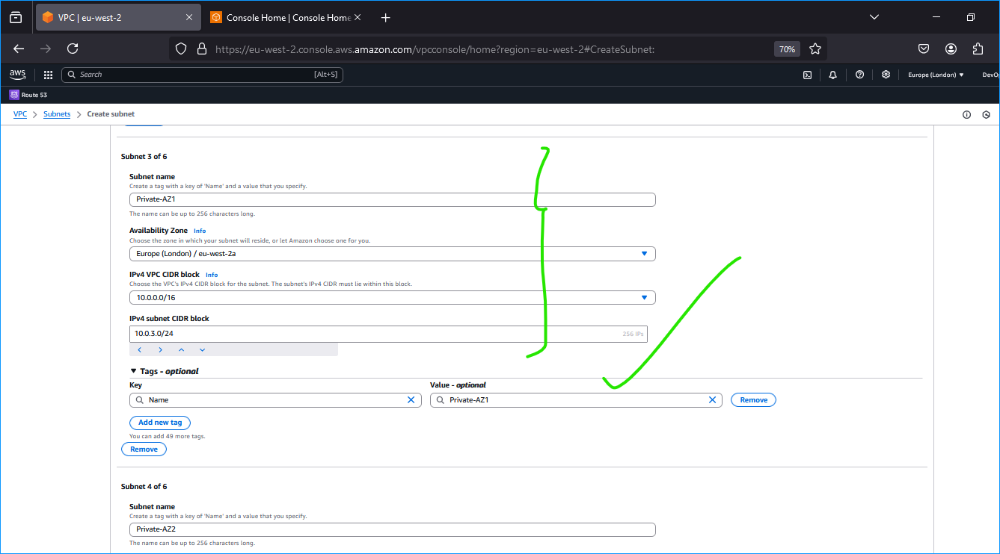


Do not forget to edit all public subnet to enable auto-assign public ipv4 address (as shown in the screenshot below):


### Route Tables Configuration

  Navigate to VPC -> Route Tables -> Create route table, then create the table as follows:

3. **Create and Associate Route Tables:**
    - **Public Route Table:**
    
        ```yaml
        Routes:
          - Destination: 0.0.0.0/0
            Target: Internet Gateway
          - Destination: 10.0.0.0/16
            Target: Local
        ```
        
        ```bash
        aws ec2 create-route-table --vpc-id <vpc-id> --tag-specifications 'ResourceType=route-table,Tags=[{Key=Name,Value=Public-RT}]'
        aws ec2 associate-route-table --subnet-id <public-subnet-id> --route-table-id <public-rt-id>
        aws ec2 create-route --route-table-id <public-rt-id> --destination-cidr-block 0.0.0.0/0 --gateway-id <igw-id>
        ```
        If you are creating via gui, don't forget to associate the public-RT to the public subnets after you've created it.
        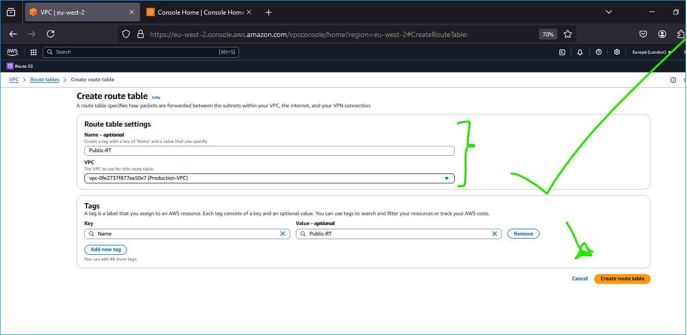
        While on the Route table you just created, click on Actions -> Edit subnet associations -> Select subnets of your choice.
        
    
    - **Private Route Table:**
    
        ```yaml
        Routes:
          - Destination: 0.0.0.0/0
            Target: NAT Gateway
          - Destination: 10.0.0.0/16
            Target: Local
        ```
        
        ```bash
        aws ec2 create-route-table --vpc-id <vpc-id> --tag-specifications 'ResourceType=route-table,Tags=[{Key=Name,Value=Private-RT}]'
        aws ec2 associate-route-table --subnet-id <private-subnet-id> --route-table-id <private-rt-id>
        aws ec2 create-route --route-table-id <private-rt-id> --destination-cidr-block 0.0.0.0/0 --nat-gateway-id <nat-gw-id>
        ```
    If you are creating via gui, don't forget to associate the public-RT to the public subnets after you've created it.
        
        While on the Route table you just created, click on Actions -> Edit subnet associations -> Select subnets of your choice.
        

    💡 **Best Practice:** Clearly name route tables and associate them correctly to avoid routing issues.

    ⚠️ **Common Issues:**
    - Missing routes can lead to connectivity problems.
    - Ensure NAT Gateway is deployed in a public subnet.

### Internet Connectivity

4. **Configure Internet Gateway and NAT Gateway:**
    - **Internet Gateway:**
    
        ```yaml
        Configuration:
          Name: Prod-IGW
          Attached VPC: Production-VPC
        ```
        
        ```bash
        aws ec2 create-internet-gateway --tag-specifications 'ResourceType=internet-gateway,Tags=[{Key=Name,Value=Prod-IGW}]'
        aws ec2 attach-internet-gateway --internet-gateway-id <igw-id> --vpc-id <vpc-id>
        ```
    
      If you are creating via gui, proceed as follows:
      Navigate to VPC -> Internet gateways -> Create internet gateway

      
      Don't forget to attach the Internet gateway to the Virtual Private Cloud of choice - VPC - (in our case = Production-VPC).

      While on the Internet gateway you just created, click on Actions -> Attach to VPC -> Select the VPC of your choice.

      

    - **Link Public Route Table to the Internet Gateway**

        Go to VPC -> Route Tables -> Public-RT -> Actions -> Edit Routes -> Add route
        
        Since we want to route traffic to the internet from the public subnet (public route table), the record we are going to add will have its `Destination` field value to be `0.0.0.0/0`, and its `target` field would be the `id of the internet gateway` we just created

        
      
    - **Create 3 Elastic IP's**

        These Ip addresses are going to be used by first the Nat gateway, then the bastion hosts.

        

    - **NAT Gateway:**
    
        ```yaml
        Configuration:
          Name: Prod-NAT
          Subnet: Public-AZ1
          Allocation ID: <eip-allocation-id>
        ```
        
        ```bash
        aws ec2 create-nat-gateway --subnet-id <public-subnet-id> --allocation-id <eip-allocation-id> --tag-specifications 'ResourceType=natgateway,Tags=[{Key=Name,Value=Prod-NAT}]'
        ```

        If you are creating it via gui, proceed as follows:

        Navigate to VPC -> NAT gateways -> Create NAT gateway -> (see screenshot for configurations):

        

      **We Will also associate our private route table with this NAT**
      
      We can do this by: Navigating to VPC -> Route Tables -> Private-RT -> Actions -> Edite Routes -> (see screenshot for configurations)

      


    💡 **Note:**It is Important allocate an Elastic IP to the NAT Gateway to ensure a consistent IP address for outbound traffic.

    ⚠️ **Common Issues:**
    - NAT Gateway limits can affect scalability.
    - Ensure the NAT Gateway resides in a public subnet.

### Security Group Setup

5. **Create Security Groups with Least Privilege Access:**

    - **External Application Load Balancer (ALB) Security Group:**
    
        ```yaml
        Inbound Rules:
          - Protocol: TCP
            Port: 443
            Source: 0.0.0.0/0
          - Protocol: TCP
            Port: 80
            Source: 0.0.0.0/0
        
        Outbound Rules:
          - Protocol: All
            Port: All
            Destination: 0.0.0.0/0
        ```
        
        ```bash
        aws ec2 create-security-group --group-name External-ALB-SG --description "Security group for External ALB" --vpc-id <vpc-id>
        # Add inbound rules using aws ec2 authorize-security-group-ingress
        ```
        If you are using gui, create the groups follows:

        Navigate to your VPC dashboard -> Security -> Security groups -> Create security group -> (see screenshot for configs):

        
    - **Bastion Host Security Group:**
    
        ```yaml
        Inbound Rules:
          - Protocol: TCP
            Port: 22
            Source: <Your_IP>/32 or 0.0.0.0/0
        
        Outbound Rules:
          - Protocol: All
            Port: All
            Destination: 0.0.0.0/0
        ```

        ```bash
        aws ec2 create-security-group --group-name Bastion-SG --description "Security group for Bastion Hosts" --vpc-id <vpc-id>
        # Add inbound SSH rule
        ```

        
    
    - **NGINX Security Group:**
    
        ```yaml
        Inbound Rules:
          - Protocol: TCP
            Port: 80
            Source: External-ALB-SG
          - Protocol: TCP
            Port: 443
            Source: External-ALB-SG
          - Protocol: TCP
            Port: 22
            Source: Bastion-SG
        
        Outbound Rules:
          - Protocol: All
            Port: All
            Destination: 0.0.0.0/0
        ```
        
        ```bash
        aws ec2 create-security-group --group-name NGINX-SG --description "Security group for NGINX Servers" --vpc-id <vpc-id>
        # Add inbound rules for HTTP, HTTPS, and SSH
        ```

        
    
    - **Internal Application Load Balancer (ALB) Security Group:**
    
        ```yaml
        Inbound Rules:
          - Protocol: TCP
            Port: 443
            Source: NGINX-SG
          - Protocol: TCP
            Port: 80
            Source: NGINX-SG
        
        Outbound Rules:
          - Protocol: All
            Port: All
            Destination: 0.0.0.0/0
        ```
        
        ```bash
        aws ec2 create-security-group --group-name Internal-ALB-SG --description "Security group for Internal ALB" --vpc-id <vpc-id>
        # Add inbound rules for HTTP and HTTPS from NGINX-SG
        ```

        
    
    - **Webserver Security Group:**
    
        ```yaml
        Inbound Rules:
          - Protocol: TCP
            Port: 80
            Source: Internal-ALB-SG
          - Protocol: TCP
            Port: 443
            Source: Internal-ALB-SG
          - Protocol: TCP
            Port: 22
            Source: Bastion-SG
        
        Outbound Rules:
          - Protocol: All
            Port: All
            Destination: 0.0.0.0/0
        ```
        
        ```bash
        aws ec2 create-security-group --group-name Webserver-SG --description "Security group for Webservers" --vpc-id <vpc-id>
        # Add inbound rules for HTTP, HTTPS, and SSH
        ```

        
    
    - **Data Layer Security Group:**
    
        ```yaml
        Inbound Rules:
          - Protocol: TCP
            Port: 3306
            Source: Webserver-SG
          - Protocol: TCP
            Port: 2049
            Source: NGINX-SG
          - Protocol: TCP
            Port: 2049
            Source: Webserver-SG
        
        Outbound Rules:
          - Protocol: All
            Port: All
            Destination: 0.0.0.0/0
        ```
        
        ```bash
        aws ec2 create-security-group --group-name Data-Layer-SG --description "Security group for Data Layer" --vpc-id <vpc-id>
        # Add inbound rules for MySQL and NFS from respective security groups
        ```
        

    💡 **Security Best Practices:**
    - **Least Privilege:** Only open necessary ports and restrict access using specific IP ranges.
    - **Regular Audits:** Periodically review and update security group rules to adhere to best practices.
    - **Network Segmentation:** Isolate different layers of the application to minimize the impact of potential breaches.

    ⚠️ **Common Issues:**
    - **Port Conflicts:** Ensure no overlapping or conflicting port rules exist.
    - **Unrestricted Access:** Avoid using `0.0.0.0/0` except for public-facing services.
    - **Incorrect Associations:** Verify that security groups are correctly associated with their respective resources.


## TLS Certificate Management

### Amazon Certificate Manager (ACM) Setup

To ensure secure communication between clients and the load balancers, TLS certificates are managed using AWS Certificate Manager (ACM).

1. **Requesting a Public Wildcard Certificate:**

    ```bash
    aws acm request-certificate \
      --domain-name "*.kosenuel.ip-ddns.com" \
      --validation-method DNS \
      --subject-alternative-names "kosenuel.ip-ddns.com" \
      --idempotency-token 1234
    ```

    ```yaml
    Certificate Configuration:
      Type: Public Wildcard
      Domain Names:
        - *.kosenuel.ip-ddns.com
        - kosenuel.ip-ddns.com
      Validation: DNS
    ```

    If you prefer using gui, then follow along:
    Navigate to Aws Certificate Manager (ACM) -> Certificates -> Request Certificate -> Request public certificates

    - Request a public wildcard certificate for the domain name we registered on Cloudns.
    - Use Dns to validate the domain name
    - Give the resource a tag.

    
    

2. **DNS Validation:**
    - **Create CNAME Records:**
        After requesting the certificate, Ensure to create a record on Route 53 after so as to generate a CNAME record type in Route 53. We will attach this certificate to all the load balancer later on.

        ```bash
        # Example command to add a CNAME record
        aws route53 change-resource-record-sets --hosted-zone-id <hosted-zone-id> --change-batch file://dns-validation.json
        ```
        
        *dns-validation.json:*
        ```json
        {
          "Changes": [
            {
              "Action": "CREATE",
              "ResourceRecordSet": {
                "Name": "_*.kosenuel.ip-ddns.com.",
                "Type": "CNAME",
                "TTL": 300,
                "ResourceRecords": [
                  {
                    "Value": "_def.acm-validations.aws."
                  }
                ]
              }
            }
          ]
        }
        ```

    - **Gui Process:**

      Click on *"Create records in Route 53"* -> Create records

      
      

    - **Copy** the CNAME name and the CNAME value generated by Acm, then Go to Cloudns, Click on `Dns hosting -> your dns CNAME -> Add new record -> type: CNAME`. Paste the CNAME name and value to validate the record for AWS to issue the certificate. (For now, the Certificate status will remain pending unitl the record is validated by the Domain provider)

      
      
      *One thing to note when pasting the values in your dns configs is this: 
        - **Remove** the ending "yourdomain.com" at the end of your cname name.
        - **Remove** the "." (dot) at the end of your cname value


    - **Validation Completion:**
        Once DNS records are in place, ACM automatically validates and issues the certificate. *(i.e After validating the record, AWS will issue the Certificate and the status changes to issued.)*

        


3. **Tagging the Certificate:**

    ```bash
    aws acm add-tags-to-certificate --certificate-arn <certificate-arn> --tags Key=Project,Value=MultiWebsiteDeployment
    ```
    **For Gui:**
    


    💡 **Best Practices:**
    - **Automate Renewal:** ACM automatically renews certificates before expiration.
    - **Use Wildcard Certificates:** Simplifies management of multiple subdomains.
    - **Tag Resources:** This Helps in organizing and managing certificates within AWS.

    ⚠️ **Common Issues:**
    - **DNS Propagation Delays:** You might experience some delay certificate issuance.
    - **Incorrect CNAME Entries:** Ensure accurate copying of CNAME records provided by ACM.
    - **Wildcard Limitations:** Ensure that wildcard certificates meet all application requirements.

## Amazon Elastic File System (EFS) Setup

### Overview

Amazon EFS provides scalable and fully managed Network File System (NFS) storage, ideal for shared file storage across multiple EC2 instances.

### Step-by-Step Setup

1. **Create an EFS Filesystem:**

    ```bash
    aws efs create-file-system \
      --creation-token my-production-efs \
      --performance-mode generalPurpose \
      --encrypted
    ```

    ```yaml
    EFS Configuration:
      Name: Production-EFS
      Performance Mode: General Purpose
      Throughput Mode: Bursting
      Encryption: Enabled
    ```

2. **Create EFS Mount Targets:**
    - **For Each Availability Zone:**

        ```bash
        aws efs create-mount-target \
          --file-system-id <efs-id> \
          --subnet-id <private-subnet-id> \
          --security-groups <data-layer-sg-id>
        ```

        ```yaml
        Mount Targets:
          - AZ1:
              Subnet: Private-AZ1
              Security Group: Data-Layer-SG
              
          - AZ2:
              Subnet: Private-AZ2
              Security Group: Data-Layer-SG
        ```


3. **Create EFS Access Points:**
    - **WordPress Access Point:**

        ```bash
        aws efs create-access-point \
          --file-system-id <efs-id> \
          --posix-user Uid=1001,Gid=1001 \
          --root-directory '{"Path":"/wordpress","CreationInfo":{"OwnerUid":1001,"OwnerGid":1001,"Permissions":"0755"}}'
        ```

    - **Tooling Access Point:**

        ```bash
        aws efs create-access-point \
          --file-system-id <efs-id> \
          --posix-user Uid=1002,Gid=1002 \
          --root-directory '{"Path":"/tooling","CreationInfo":{"OwnerUid":1002,"OwnerGid":1002,"Permissions":"0755"}}'
        ```

    ```yaml
    Access Points:
      - Name: wordpress-ap
        Path: /wordpress
        POSIX User: UID=1001, GID=1001
        Permissions: 0755
        
      - Name: tooling-ap
        Path: /tooling
        POSIX User: UID=1002, GID=1002
        Permissions: 0755
    ```


- **For Gui:**

  1. Create an EFS filesystem: Navigate to; _Amazon EFS_ -> _Create file system_:

  - Give the Elastic File System (EFS) a name,
  _ Choose the VPC (Virtual Private Cloud) to deploy the EFS in,
  - Click on _"Create"_.

  

  2. Create an EFS mount target per AZ in the VPC, associate it with both subnets dedicated for data layer.
  > __NB:__ The amazon EFS becomes available in any subnet we specify in our mount target, and as such, we will specify that this efs be created in the private webserver subnets so that all the resources in that subnet will have the ability to mount to the file system.

    

  3. Associate the Security groups created earlier for data layer.
    _(See the above picture for how this has been accomplished)_

  4. Create Efs Access points:

       This is necessary to specify where the webservers would be situated/mounted on, therefore, we are going to be creating 2 mount points. One for `Wordpress`, the other for `Tooling`.

       - **Access Point for `Wordpress` server:**

          
          *Fig: Configuring EFS access point for `wordpress` server*

        - **Access Point for `Tooling` Webserver:**

          
          *Fig: Configuring EFS access point for `tooling` server*


          
          *Fig: Overview of EFS Access Points*

    💡 **Best Practices:**
    - **Use Access Points:** This simplifies permission management for different applications.
    - **Enable Encryption:** Protects data at rest.
    - **Monitor Usage:** Utilize CloudWatch to monitor EFS metrics.

    ⚠️ **Common Issues:**
    - **Mounting Failures:** Ensure that the security groups allow NFS traffic (port 2049).
    - **Permission Denied Errors:** Verify POSIX user configurations on access points.

## Amazon Relational Database Service (RDS) Configuration

### Overview

Amazon RDS offers a managed relational database service, simplifying database setup, operation, and scaling.

### Step-by-Step Setup

1. **Create a KMS Key for Encryption:**

    ```bash
    aws kms create-key --description "RDS Encryption Key" --key-usage ENCRYPT_DECRYPT --origin AWS_KMS
    aws kms create-alias --alias-name alias/prod-rds-key --target-key-id <key-id>
    ```

    ```yaml
    KMS Key Configuration:
      Alias: prod-rds-key
      Description: Key for encrypting RDS instances
      Usage: Encrypt/Decrypt
      Origin: AWS KMS
    ```
    - **For GUI**
      
      Navigate to: `KMS -> Customer managed keys -> Create key` and follow the configurations in the screenshot:

      
      
      
      
      
      
      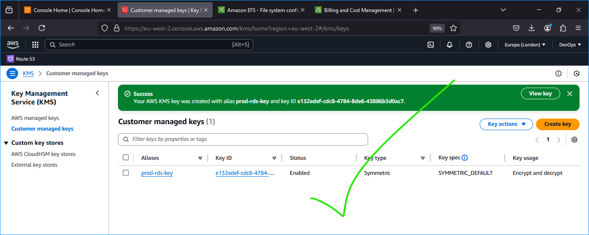

2. **Create an RDS Subnet Group:**

    ```bash
    aws rds create-db-subnet-group \
      --db-subnet-group-name prod-db-subnet-group \
      --db-subnet-group-description "Production DB Subnet Group" \
      --subnet-ids <data-subnet-az1-id> <data-subnet-az2-id>
    ```

    ```yaml
    DB Subnet Group:
      Name: prod-db-subnet-group
      Description: Subnets for RDS instances
      Subnets:
        - Data-AZ1
        - Data-AZ2
    ```

    - **For GUI**
      
      To begin, we will start by preparing the subnets needed for setting up rds. Navigate to: `RDS -> Subnet groups -> Create DB subnet group`, then replicate the following configurations:

      
      

3. **Launch an RDS Instance:**

    ```bash
    aws rds create-db-instance \
      --db-instance-identifier prod-mysql-db \
      --db-instance-class db.t3.medium \
      --engine mysql \
      --engine-version 8.0.28 \
      --allocated-storage 20 \
      --storage-type gp2 \
      --multi-az \
      --vpc-security-group-ids <data-layer-sg-id> \
      --db-subnet-group-name prod-db-subnet-group \
      --master-username adminuser \
      --master-user-password Admin123$ \
      --backup-retention-period 7 \
      --kms-key-id alias/prod-rds-key \
      --publicly-accessible false \
      --monitoring-interval 60 \
      --enable-cloudwatch-logs-exports '["error","slowquery"]' \
      --no-publicly-accessible
    ```

    ```yaml
    RDS Configuration:
      Identifier: prod-mysql-db
      Engine: MySQL 8.0.28
      Instance Class: db.t3.medium
      Storage: 20GB GP2
      Multi-AZ: Enabled
      Security Group: Data-Layer-SG
      Subnet Group: prod-db-subnet-group
      Master Username: adminuser
      Master Password: Admin123$
      Backup Retention: 7 days
      Encryption: Enabled with prod-rds-key
      Monitoring: CloudWatch enabled with 60s interval
      Logs Exported: Error, Slow Query
    ```

   4. **For GUI**
    
    Navigate to: `RDS -> Create database`, and follow the configurations in the screenshots below:
      

    To fulfil our architectural structure/diagram, we will need to select either `Dev/Test` or `Production` Sample Template.
    Also, to minimize AWS cost, we can select the `Do not create a standby instance` option under **Availability & durability** sample template (The production template will enable Multi-AZ deployment)

      

    5., Now, **Configure** other settings accordingly _{Leave `instance configuration` section **as is**}_ _(For test purposes, most of the default settings are cool to be left `as is`)_. In the real world, we would need to size the database appropriately. we would need to get some information about the usage. If it is a highly transactional database that grows at 10GB weekly, we must bear that in mind while configuring the initial storage allocation, storage autoscaling, and maximum storage threshold. `{user: admin, pass: G*****&}`

    

    Configure VPC and security (ensure the database is not available from the Internet)

    

    - Configure backups and retention
    - Encrypt the database using the KMS key created earlier
    - Enable CloudWatch monitoring and export Error and Slow Query logs (for production, and also Audit).

    


    💡 **Best Practices:**
    - **Enable Multi-AZ:** This ensures high availability and failover support.
    - **Automate Backups:** Protects against data loss.
    - **Encrypt Data:** Secures sensitive information.

    ⚠️ **Common Issues:**
    - **Connectivity Problems:** Ensure correct security group settings and subnet configurations.
    - **Performance Bottlenecks:** Monitor RDS metrics and adjust instance sizes as needed.
    - **Backup Failures:** Verify backup settings and storage availability.


*RDS Created*

## Compute Resources Setup

### Base Server Configuration
> **NB:** To create the `Autoscaling Groups`, we need Launch `Templates and Load Balancers`. The Launch Templates requires `AMI` and `Userdata` while the Load balancer requires `Target Group`

6. **Provision EC2 Instances for NGINX, Bastion, and Webservers:**

    ```yaml
    EC2 Instance Configuration:
      OS: CentOS 9
      Instance Type: t2.micro (scalable based on load)
      Storage: 10GB GP2 (thereabout)
      Security Group: Corresponding SGs (NGINX-SG, Bastion-SG, Webserver-SG)
      Key Pair: Pre-configured for SSH access
    ```

    ```bash
    aws ec2 run-instances \
      --image-id ami-0abcdef1234567890 \
      --count 1 \
      --instance-type t2.micro \
      --key-name MyKeyPair.pem # this is where you input your key name (mine was: B***m) \
      --security-group-ids <sg-id> \
      --subnet-id <subnet-id> \
      --tag-specifications 'ResourceType=instance,Tags=[{Key=Name,Value=NGINX-Server}]'
    # Repeat for Bastion and Webserver instances
    ```

    - **For GUI**
      
      Navigate to: `EC2 -> Launch an instance`, and create the ec2 instances with the specifications above _(see screenshots for more context)_: 

      
      
      

      > 💡 **Information:** Repeat the above steps to create instances for `webservers` and `nginx` servers

    

### Software Installation and Configuration

7. **Install Essential Software on All Servers:**
  Make sure you install the essential softwares these in each of the above servers by running the following command;
    ```bash
    sudo yum update -y
     sudo yum install -y   wget   vim   python3   telnet   htop   epel-release   dnf-utils
    sudo yum install -y \
      openssl-devel \
      cargo \
      mysql \
      git
    sudo systemctl start chronyd
    sudo systemctl enable chronyd
    ```

    💡 **Tip:** You can automate software installation using User Data scripts or configuration management tools like Ansible.

    I am going to do this manually in this illustration, and I will begin with the **Bastion Server**:

      
      
      
      > **Note:** You have to also repeat the above steps for the Nginx and Webserver instances

### NGINX Specific Configuration

8. **Set SELinux Policies for NGINX:**

    ```bash
    sudo setsebool -P httpd_can_network_connect=1
    sudo setsebool -P httpd_can_network_connect_db=1
    sudo setsebool -P httpd_execmem=1
    sudo setsebool -P httpd_use_nfs=1
    ```

    ```yaml
    Below, is what the above command does;
    SELinux Policies:
      - Allow network connections
      - Permit database connections
      - Enable memory execution for HTTPD
      - Allow NFS usage
    ```

    

    💡 **Best Practice:** Regularly audit SELinux policies to maintain security without hindering functionality.

### Amazon EFS Utilities Installation

9. **Install EFS Utilities for Mounting EFS:**

    ```bash
    git clone https://github.com/aws/efs-utils
    cd efs-utils
    sudo yum install -y make rpm-build
    sudo yum install -y linux-headers-$(uname -r)
    sudo make rpm
    sudo yum install -y ./build/amazon-efs-utils*rpm
    ```

    ```yaml
    The above commands achieves the following;
    EFS Utilities Installation:
      - Clone repository
      - Install dependencies
      - Build and install EFS utilities
    ```

    
    *Fig: Cloning Repository*

    
    *Fig: Installing Dependencies*

    
    *Fig: Building and Installing EFS utilities*

    > **Note:** Repeat the above steps for the **_Webservers_** Instance as well

    💡 **Tip:** Ensure EFS utilities are up-to-date to support the latest features and security patches.

### SSL Certificate Setup

  We are using an ACM (Amazon Certificate Manager) certificate for both our external and internal load balancers. But for some reasons, we might want to add a self-signed certificate:

  Compliance Requirements:

  Certain industry regulations and standards (e.g., PCI DSS, HIPAA) require end-to-end encryption, including between internal load balancers and backend servers (within a private network).
  Defense in Depth:

  Adding another layer of security by encrypting traffic between internal load balancers and web servers can provide additional protection.
  When generating the certificate, In the common name, enter the private IPv4 dns of the instance (for Webserver and Nginx). We use the certificate by specifying the path to the file `kos.crt` and `kos.key` in the nginx configuration.

10. **Generate Self-Signed Certificates for NGINX and Apache:**
    - **For NGINX:**

        ```bash
        sudo mkdir /etc/ssl/private
        sudo chmod 700 /etc/ssl/private
        sudo openssl req -x509 -nodes -days 365 -newkey rsa:2048 \
          -keyout /etc/ssl/private/kos.key \
          -out /etc/ssl/certs/kos.crt
        sudo openssl dhparam -out /etc/ssl/certs/dhparam.pem 2048
        ```

    - **For Apache:** *But we not using Apache, we using Nginx*

        ```bash
        sudo yum install -y mod_ssl
        sudo openssl req -newkey rsa:2048 -nodes \
          -keyout /etc/pki/tls/private/kos.key \
          -x509 -days 365 \
          -out /etc/pki/tls/certs/kos.crt
        
        # Update SSL configuration
        sudo vim /etc/httpd/conf.d/ssl.conf
        # Set SSLCertificateFile and SSLCertificateKeyFile to the generated certificates
        ```

    ```yaml
    SSL Configuration:
      - Self-signed certificates for NGINX and Apache
      - Key permissions set to enhance security
      - DH parameters generated for enhanced encryption
    ```

    ⚠️ **Common Issues:**
    - **Certificate Mismatch:** Ensure certificate paths in configurations are correct.
    - **SELinux Denials:** Verify SELinux policies allow SSL operations.
    - **Firewall Restrictions:** Confirm that SSL ports (443) are open in security groups.


*Fig: Self Signing a cert and key in Nginx*

Run  `sudo openssl dhparam -out /etc/ssl/certs/dhparam.pem 2048`


*Fig: Finishing touches*

## Load Balancer Configuration

### External Application Load Balancer (ALB)

> **Please:** Before continuing with this, [**create AMI's of the instances you've just created**](#create-amis-from-ec2-instances) and [**Setup Target Groups**](#configure-target-groups). This would facilitate the creation of our Application Load Balancer (ALB).

11. **Configure External ALB to Route Traffic to NGINX:**

    Now, notice that we have configured our Nginx EC2 Instances to have configurations that accepts incoming traffic only from the Load Balancers, No request should go directly to Nginx servers. With this kind of setup, we will benefit from intelligent routing of requests from the ALB to Nginx servers across the 2 Availability Zones. We will also be able to [offload](https://avinetworks.com/glossary/ssl-offload/) SSL/TLS certificates on the ALB instead of Nginx. Therefore, Nginx will be able to perform faster since it will not require extra compute resources to validate certificates for every request. So in a nutshell/recap, this is what we are going to do:

    1. Create an Internet facing ALB
    2. Ensure that it listens on HTTPS protocol (TCP port 443)
    3. Ensure the ALB is created within the appropriate VPC | AZ | Subnets
    4. Choose the Certificate from ACM
    5. Select Security Group
    6. Select Nginx Instances as the target group


    ```yaml
    External ALB Configuration:
      Name: External-ALB
      Scheme: internet-facing
      Subnets: Public-AZ1, Public-AZ2
      Security Group: External-ALB-SG
      Listeners:
        - Protocol: HTTPS
          Port: 443
          Certificates: ACM Certificate
          Default Action: Forward to NGINX Target Group
    ```

    ```bash
    aws elbv2 create-load-balancer \
      --name External-ALB \
      --subnets <public-subnet-az1-id> <public-subnet-az2-id> \
      --security-groups <external-alb-sg-id> \
      --scheme internet-facing \
      --type application
    ```

    💡 **Tip:** Utilize host-based routing to direct traffic to the appropriate target groups based on the requested hostname.
  
    If you want to achieve this using **GUI** method, kindly follow these steps:

    - Navigate to `EC2 -> Load balancers -> Create load balancer -> Application load balancer` and apply the configurations like so:
    
    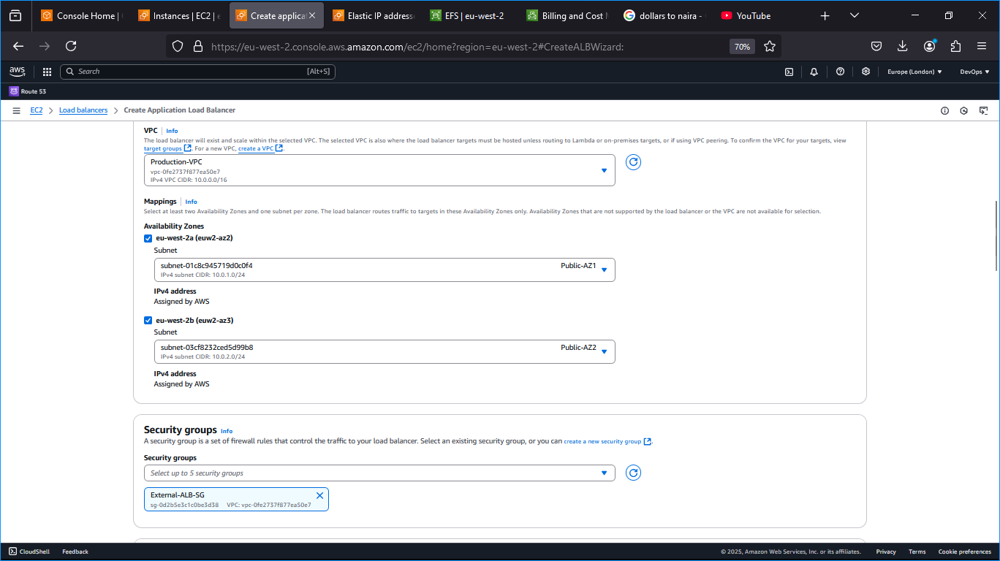
    
    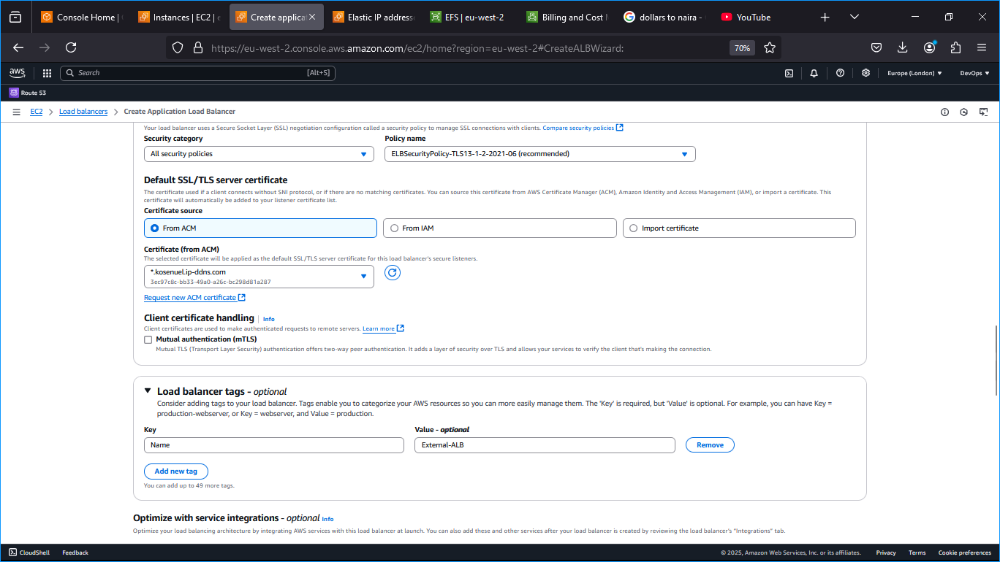
    
    
    
    *Fig: External ALB Created*

### Internal Application Load Balancer (ALB) for Webservers
Since the webservers are configured for auto-scaling, there is going to be a problem if servers get dynamically scalled out or in. Nginx will not know about the new IP addresses, or the ones that get removed. Hence, Nginx will not know where to direct the traffic.

To solve this problem, we must use a load balancer. But this time, it will be an internal load balancer. Not Internet facing since the webservers are within a private subnet, and we do not want direct access to them.

1. Create an Internal ALB
2. Ensure that it listens on HTTPS protocol (TCP port 443)
3. Ensure the ALB is created within the appropriate VPC | AZ | Subnets
4. Choose the Certificate from ACM
5. Select Security Group
6. Select webserver Instances as the target group
7. Ensure that health check passes for the target group

> **Note:** This process must be repeated for both WordPress and Tooling websites.

12. **Configure Internal ALB to Route Traffic to Webservers:**

    ```yaml
    Internal ALB Configuration:
      Name: Internal-ALB
      Scheme: internal
      Subnets: Private-AZ1, Private-AZ2
      Security Group: Internal-ALB-SG
      Listeners:
        - Protocol: HTTPS
          Port: 443
          Certificates: ACM Certificate
          Rules:
            - Condition: Host Header = tooling.kosenuel.ip-ddns.com
              Action: Forward to Tooling Target Group
            - Condition: Host Header = wordpress.kosenuel.ip-ddns.com
              Action: Forward to WordPress Target Group
    ```

    ```bash
    aws elbv2 create-load-balancer \
      --name Internal-ALB \
      --subnets <private-subnet-az1-id> <private-subnet-az2-id> \
      --security-groups <internal-alb-sg-id> \
      --scheme internal \
      --type application
    ```

    **For The GUI Process,** follow these instruction:

    Ensure you are Navigated  to `EC2 -> Load balancers -> Create load balancer -> Application load balancer`, then apply the configurations like so:

    
    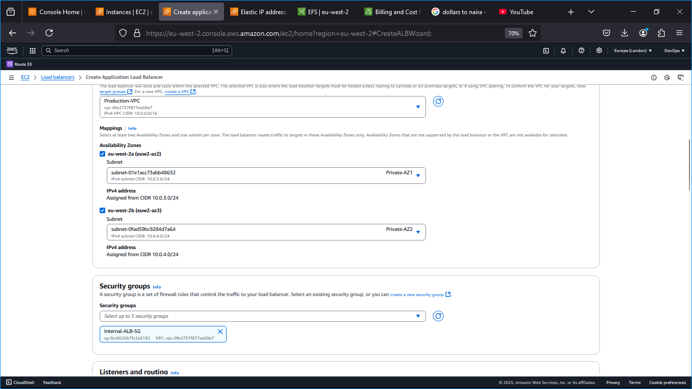
    
    
    
    

    >💡 **Tip:** Use host-based routing to direct traffic to the appropriate target groups based on the requested hostname.

    The default target configured on the listener while creating the internal load balancer is configured to forward traffic to `wordpress` on port 443. Now, we need to create a rule to route traffic to `tooling` as well.

    **1.	Select** internal load balancer from the list of load balancers created: `Navigate to EC2 -> Load balancers -> "your internal load balancer"`
      -	Choose the load balancer where you want to add the rule.

      
      *Fig: Selected and started the config of the Internal load Balancer*

    **2.	Listeners Tab:**
      -	Click on the Listeners tab.
      -	Select the listener - **HTTPS:443** - and click Manage rules -> Add rule -> Add Condition -> `Host header` type. After configuring, click *"next"*

      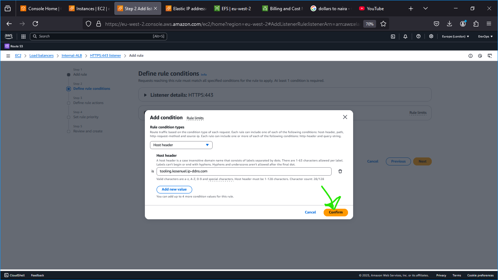
      *Fig: Adding Condition*

    **4.	Configure the Rule:**
      -	Choose the appropriate target group for the `hostname`.
      - Select the priority for the rule.

      
      *Fig: Selecting the appropriate target group*
      
      *Fig: Selecting the appropriate priority for the rule*


    **3.	Add Rules:**
      -	Review and create rule.

      
      *Fig: Reviewing and creating the rule*

    ⚠️ **Common Issues:**
    - **SSL Certificate Errors:** Ensure ACM certificates are correctly associated with ALBs.
    - **Routing Misconfigurations:** Verify host header conditions match the intended subdomains.
    - **Security Group Restrictions:** Confirm ALBs can communicate with their target groups.


*Fig: All ALBs Overview*

- **Configure Listener Rules for Internal ALB:**
    - The default target is WordPress. Add rules to route `tooling.kosenuel.ip-ddns.com` to the Tooling target group.

## Compute Resources Setup

### Provision EC2 Instances for NGINX, Bastion, and Webservers

```markdown
```bash:path/to/configuration-script.sh
#!/bin/bash
# Example User Data Script
sudo yum update -y
sudo yum install -y nginx
# Additional installation commands
```


### User Data Configuration

Navigate to: `EC2 -> Lauch Templates -> Create Launch Template`, and follow the configurations you see in the screenshot below:


*Fig: Configuring Lauch Template for Nginx*

*Fig: Configuring Lauch Template for Nginx*


*Fig: Configuring Lauch Template for Nginx*

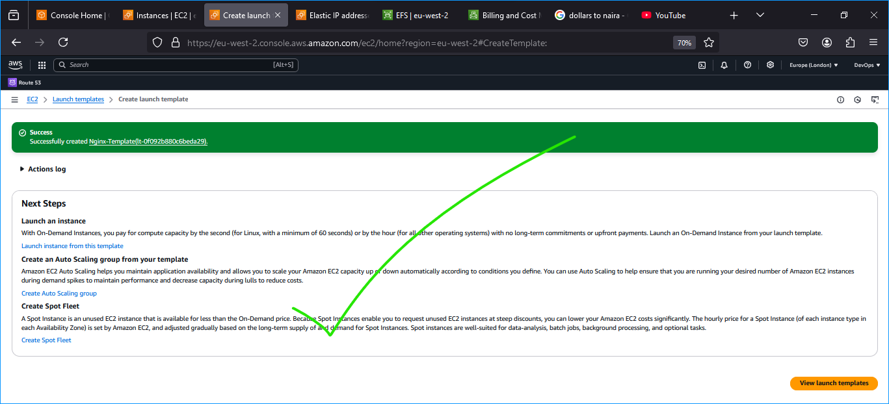
*Fig: Created Lauch Template for Nginx*

> ⚠️**Very Important:** We need to update the **`reverse.conf`** file by updating the `proxy_pass` value to contain the `end point of the internal load balancer` - a.k.a **DNS name**. *This value can be gotten by navigating to [EC2 -> Load balancers -> your internal load balancer -> details -> DNS Name]* - before using the userdata, so as to clone the updated repository with the correct information in its config file(s).


*Fig: Configuring Lauch Template for Nginx*

> **Repeat** the above steps to create the **`Bastion-Template`**, the only thing you will have to do differently when configuring the Bastion-Template Launch Template is to set the AMI to `Bastion AMI` and configure the `User data` field differently as shown in the screenshot below:


*Fig: User data script for bastion lauch template*

- **WordPress User Data:**

  Before we jump into configuring the templates for our webserver instances (Wordpress and Tooling), we have to do some home-keeping.
  The webserver instances needs to communicate with the database and efs, and as such we need to configure the database and make it ready to attend to such requests it is about to get without spewing out errors.

  - Navigate to your terminal, connect to the bastion instance, and jump from there to your webserver instance.
  Now log into your RDS database like so:
  ```bash
  mysql -h <the end point of your rds instance> -u admin (or the name of your configured user) -p 
  ```

  - Create some databases (wordpressdb and tooling db) as shown in the screenshot:

  
  *Fig: Creating Databases*

- Now create a user and grant this user access to the databases

  
  *Fig: Creating Databases*

  Now we are done with setting up the foundation, it's time for configuring the Launch Template for Wordpress.
  Navigate to `EC2 -> Launch templates -> Create launch template`. Follow the steps we observed in creating the preivious lauch template, only that the **AMI** to use here would be your **Webserver-AMI** and not the **Nginx-AMI** we used in the 1st launch template created. Also, the user data configuration script would greatly differ this time around to look like this:

    ```bash
    #!/bin/bash

    sudo mount -t efs -o tls,accesspoint=fsap-0a21d16ea88d06d40 fs-00391886ce8ea46f4:/ /var/www/

    yum install -y httpd
    systemctl start httpd
    systemctl enable httpd

    yum module reset php -y
    yum module enable php:remi-7.4 -y

    yum install -y php php-common php-mbstring php-opcache php-intl php-xml php-gd php-curl php-mysqlnd php-fpm php-json wget

    systemctl start php-fpm
    systemctl enable php-fpm

    wget http://wordpress.org/latest.tar.gz

    tar xzvf latest.tar.gz
    rm -rf latest.tar.gz

    cp wordpress/wp-config-sample.php wordpress/wp-config.php
    mkdir /var/www/html/
    cp -R /wordpress/* /var/www/html/
    cd /var/www/html/
    touch healthstatus

    sed -i "s/localhost/database-1.cnquc6icq2na.eu-west-2.rds.amazonaws.com/g" wp-config.php
    sed -i "s/username_here/kosenuel/g" wp-config.php
    sed -i "s/password_here/devopsacts/g" wp-config.php
    sed -i "s/database_name_here/wordpressdb/g" wp-config.php

    chcon -t httpd_sys_rw_content_t /var/www/html/ -R

    systemctl restart httpd
    ```
    > ⚠️ **Important:** The command for attaching the mountpoint _**(sudo mount -t efs ...)**_ for your specific efs can be gotten from going to `Amazon EFS -> Access Points -> Your Access Point -> Attach`.
    And also, your rds endpoint value can be gotten from going to `RDS -> Databases -> Your database name -> Connectivity & Security -> Endpoint & Port -> Endpoint`

    
    *Fig: Configuring Launch Template for Wordpress*

    
    *Fig: Configuring Launch Template for Wordpress*

    
    *Fig: Configuring Launch Template for Wordpress*

    
    *Fig: Configuring Launc Template for Wordpress - Final*

- **Tooling User Data:**

    ```bash:path/to/tooling-userdata.sh
    #!/bin/bash

    mkdir /var/www/

    sudo mount -t efs -o tls,accesspoint=fsap-01dc000d3b226bc66 fs-00391886ce8ea46f4:/ /var/www/

    yum install -y httpd
    systemctl start httpd
    systemctl enable httpd

    yum module reset php -y
    yum module enable php:remi-7.4 -y

    yum install -y php php-common php-mbstring php-opcache php-intl php-xml php-gd php-curl php-mysqlnd php-fpm php-json

    systemctl start php-fpm
    systemctl enable php-fpm

    git clone https://github.com/kosenuel/tooling.git

    mkdir /var/www/html
    cp -R /tooling/html/*  /var/www/html/
    cd /tooling

    mysql -h database-1.cnquc6icq2na.eu-west-2.rds.amazonaws.com -u admin -p toolingdb < tooling-db.sql

    cd /var/www/html/
    touch healthstatus

    sed -i "s/$db = mysqli_connect('127.0.0.1', 'admin', 'admin', 'tooling');/$db = mysqli_connect('database-1.cnquc6icq2na.eu-west-2.rds.amazonaws.com', 'kosenuel', 'devopsacts', 'toolingdb');/g" functions.php

    chcon -t httpd_sys_rw_content_t /var/www/html/ -R

    mv /etc/httpd/conf.d/welcome.conf /etc/httpd/conf.d/welcome.conf_backup

    systemctl restart httpd
    ```

    
    *Fig: Configuring the Launch Template for Tooling Instance(s)*

    
    *Fig: Configuring the Launch Template for Tooling Instance(s)*
    
    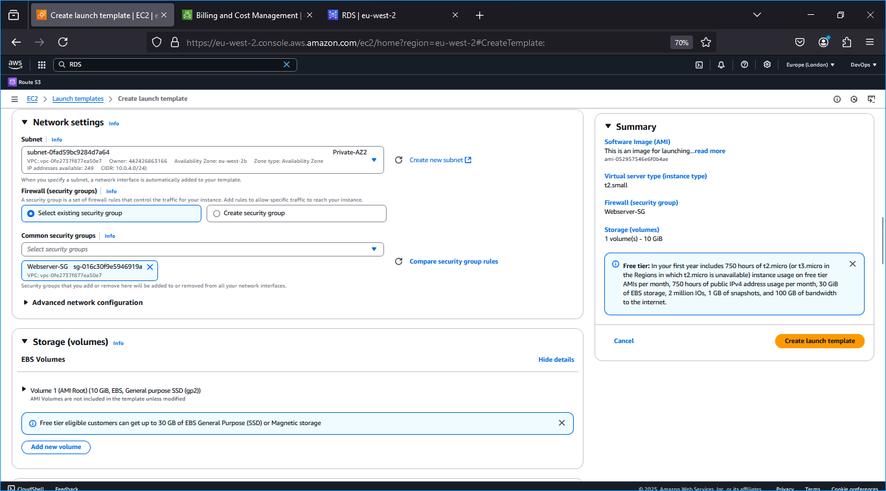
    *Fig: Configuring the Launch Template for Tooling Instance(s)*

    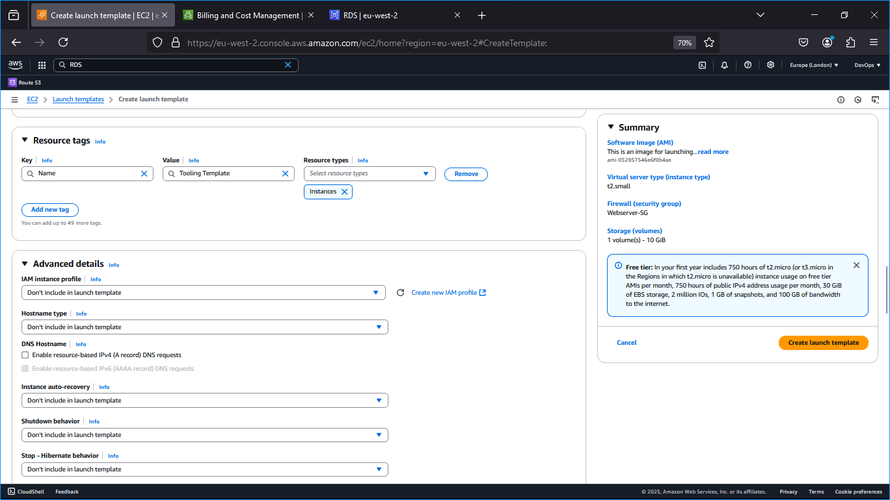
    *Fig: Configuring the Launch Template for Tooling Instance(s)*

    
    *Fig: Tooling launch template user-data script configuration*
  

*Fig: Launch Templates Overview*

### Create AMIs from EC2 Instances

1. **Create an AMI for Bastion Hosts:**
    
    Navigate to `EC2 -> instances -> right-click on an instance and select **Image and templates** -> Create image *(see screenshot for context)*
    
    
    *Fig: Bastion AMI* 

2. **Create an AMI for NGINX Servers:**
    
    
    *Fig: Nginx AMI*

3. **Create an AMI for Webservers:**
    
    
    *Fig: Webserver AMI*

4. **View All AMIs:**
    
      
      *Fig: All AMI's Overview* 


### Configure Target Groups

1. **Create Target Groups for NGINX, WordPress, and Tooling:**
    Navigate to: EC2 -> Load balancing -> Target groups -> Create target group

    - **NGINX Target Group:**

        
        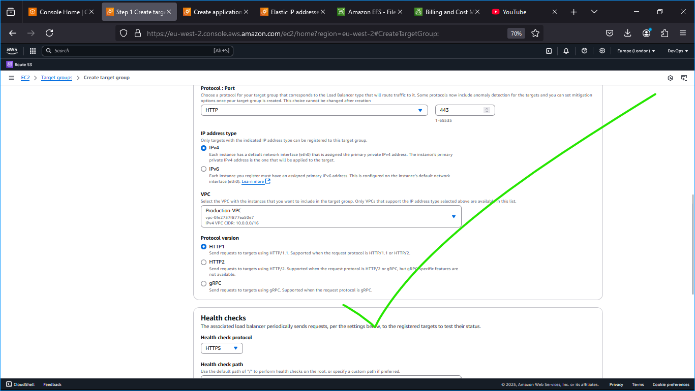
        
        
        
        *Fig: Nginx Target Group Created*

    - **WordPress Target Group:**

        
        
        
        
        *Fig: Wordpress Target Group is created*

    - **Tooling Target Group:**

        
        
        
        
        *Fig: Tooling Tagrget Group now created*

## Auto Scaling Groups Configuration

### 13. Set Up Auto Scaling Groups (ASGs)

1. **Bastion Hosts ASG:**

    Config info:
    ```yaml
    Bastion-ASG Configuration:
      Name: Bastion-ASG
      Launch Template: Bastion-Launch-Template
      VPC: Production-VPC
      Subnets: Public-AZ1, Public-AZ2
      Desired Capacity: 2
      Min Size: 2
      Max Size: 4
      Scaling Policy:
        - Metric: CPU Utilization
          Threshold: 90%
          Adjustment: +1
      Health Checks:
        - Type: EC2
    ```

    ```bash
    aws autoscaling create-auto-scaling-group \
      --auto-scaling-group-name Bastion-ASG \
      --launch-template LaunchTemplateName=Bastion-Launch-Template,Version=1 \
      --vpc-zone-identifier "<public-subnet-az1-id>,<public-subnet-az2-id>" \
      --min-size 2 \
      --max-size 4 \
      --desired-capacity 2 \
      --health-check-type EC2 \
      --target-group-arns <bastion-tg-arn>
    
    # Attach scaling policies as needed
    ```

    

    

    
    *Fig: Created Bastion Auto SG*

2. **NGINX ASG:**
    
    Config info:
    ```yaml
    NGINX-ASG Configuration:
      Name: NGINX-ASG
      Launch Template: NGINX-Launch-Template
      VPC: Production-VPC
      Subnets: Public-AZ1, Public-AZ2
      Desired Capacity: 2
      Min Size: 2
      Max Size: 4
      Scaling Policy:
        - Metric: CPU Utilization
          Threshold: 90%
          Adjustment: +1
      Health Checks:
        - Type: ELB
    ```

    ```bash
    aws autoscaling create-auto-scaling-group \
      --auto-scaling-group-name NGINX-ASG \
      --launch-template LaunchTemplateName=NGINX-Launch-Template,Version=1 \
      --vpc-zone-identifier "<private-subnet-az1-id>,<private-subnet-az2-id>" \
      --min-size 2 \
      --max-size 4 \
      --desired-capacity 2 \
      --health-check-type ELB \
      --health-check-grace-period 300 \
      --target-group-arns <nginx-tg-arn>
    ```

    
    
    
    
    
    
    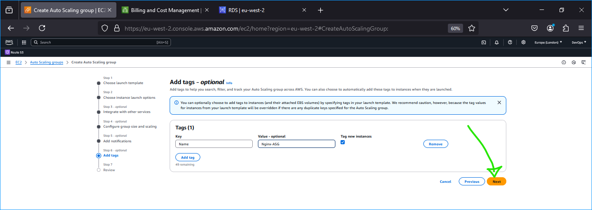
    
    *Fig: Nginx Asg Review and Creation*

3. **WordPress ASG:**

    Config info:
    ```yaml
    WordPress-ASG Configuration:
      Name: WordPress-ASG
      Launch Template: WordPress-Launch-Template
      VPC: Production-VPC
      Subnets: Private-AZ1, Private-AZ2
      Desired Capacity: 2
      Min Size: 2
      Max Size: 4
      Scaling Policy:
        - Metric: CPU Utilization
          Threshold: 90%
          Adjustment: +1
      Health Checks:
        - Type: ELB
    ```

    ```bash
    aws autoscaling create-auto-scaling-group \
      --auto-scaling-group-name WordPress-ASG \
      --launch-template LaunchTemplateName=WordPress-Launch-Template,Version=1 \
      --vpc-zone-identifier "<private-subnet-az1-id>,<private-subnet-az2-id>" \
      --min-size 2 \
      --max-size 4 \
      --desired-capacity 2 \
      --health-check-type ELB \
      --health-check-grace-period 300 \
      --target-group-arns <wordpress-tg-arn>
    ```
    
    
    
    
    
    
    
    
    
    
    *Fig: Review and Create Wordpress ASG*

4. **Tooling ASG:**

    Config info:
    ```yaml
    Tooling-ASG Configuration:
      Name: Tooling-ASG
      Launch Template: Tooling-Launch-Template
      VPC: Production-VPC
      Subnets: Private-AZ1, Private-AZ2
      Desired Capacity: 2
      Min Size: 2
      Max Size: 4
      Scaling Policy:
        - Metric: CPU Utilization
          Threshold: 90%
          Adjustment: +1
      Health Checks:
        - Type: ELB
    ```

    ```bash
    aws autoscaling create-auto-scaling-group \
      --auto-scaling-group-name Tooling-ASG \
      --launch-template LaunchTemplateName=Tooling-Launch-Template,Version=1 \
      --vpc-zone-identifier "<private-subnet-az1-id>,<private-subnet-az2-id>" \
      --min-size 2 \
      --max-size 4 \
      --desired-capacity 2 \
      --health-check-type ELB \
      --health-check-grace-period 300 \
      --target-group-arns <tooling-tg-arn>
    ```

    
    
    
    
    
    
    
    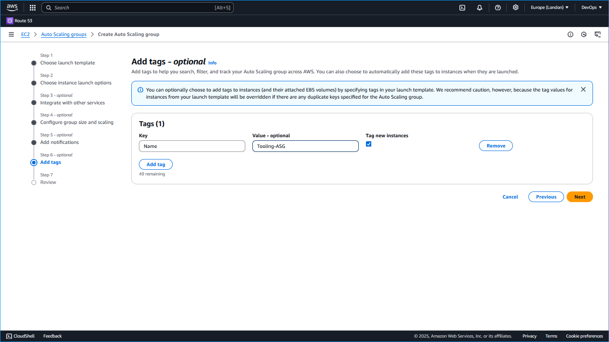
    

    💡 **Best Practices:**
    - **Balanced Resource Allocation:** Distribute instances evenly across Availability Zones.
    - **Appropriate Scaling Policies:** Set thresholds based on application performance and load.
    - **Health Checks:** Utilize both EC2 and ELB health checks for robust instance monitoring.

    ⚠️ **Common Issues:**
    - **Scaling Delays:** Adjust cooldown periods to better match application response times.
    - **Improper Target Group Attachment:** Ensure ASGs are correctly associated with their respective target groups.
    - **Instance Launch Failures:** Verify launch template configurations and IAM permissions.


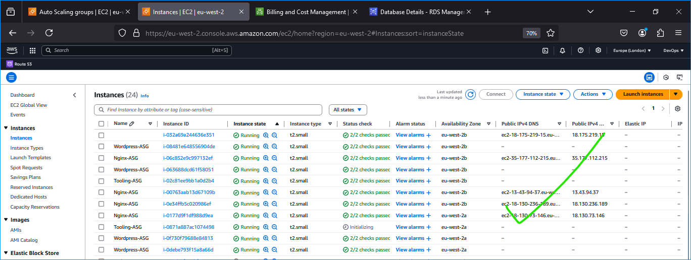

## DNS Configuration with Route 53

You remembered when we registered a free domain with Cloudns and configured a hosted zone in Route53. But that is not all that needs to be done as far as DNS configuration is concerned.

We need to ensure that the main domain for the WordPress website can be reached, and the subdomain for Tooling website can also be reached using a browser.

Create other records such as CNAME, alias and A records.

> **NOTE:** You can use either `CNAME` or `alias records` to achieve the same thing. But `alias record` has better functionality because it is a faster to resolve DNS record, and can coexist with other records on that name. Read [here](https://support.dnsimple.com/articles/differences-between-a-cname-alias-url/#:~:text=The%20A%20record%20maps%20a,a%20name%20to%20another%20name.&text=The%20ALIAS%20record%20maps%20a,the%20HTTP%20301%20status%20code) to get to know more about the differences.

Create an alias record for the root domain and direct its traffic to the ALB DNS name.
Create an alias record for tooling.fncloud.dns-dynamic.net and direct its traffic to the ALB DNS name.

### 14. Configure DNS Records

1. **Set Up DNS Records for Websites:**
    
    Config info:
    ```yaml
    DNS Records:
      - Name: wordpress.kosenuel.ip-ddns.com
        Type: A
        Alias: Yes
        Alias Target: External-ALB DNS
    
      - Name: tooling.kosenuel.ip-ddns.com
        Type: A
        Alias: Yes
        Alias Target: External-ALB DNS
    
      - Name: www.kosenuel.ip-ddns.com
        Type: CNAME
        Value: kosenuel.ip-ddns.com
    ```

    ```bash
    aws route53 change-resource-record-sets \
      --hosted-zone-id <hosted-zone-id> \
      --change-batch file://dns-records.json
    ```

    *dns-records.json:*
    ```json
    {
      "Changes": [
        {
          "Action": "CREATE",
          "ResourceRecordSet": {
            "Name": "wordpress.kosenuel.ip-ddns.com",
            "Type": "A",
            "AliasTarget": {
              "HostedZoneId": "<ALB-hosted-zone-id>",
              "DNSName": "external-alb-dns-name",
              "EvaluateTargetHealth": false
            }
          }
        },
        {
          "Action": "CREATE",
          "ResourceRecordSet": {
            "Name": "tooling.kosenuel.ip-ddns.com",
            "Type": "A",
            "AliasTarget": {
              "HostedZoneId": "<ALB-hosted-zone-id>",
              "DNSName": "external-alb-dns-name",
              "EvaluateTargetHealth": false
            }
          }
        },
        {
          "Action": "CREATE",
          "ResourceRecordSet": {
            "Name": "www.kosenuel.ip-ddns.com",
            "Type": "CNAME",
            "TTL": 300,
            "ResourceRecords": [
              {
                "Value": "kosenuel.ip-ddns.com"
              }
            ]
          }
        }
      ]
    }
    ```
    Navigate to **`Route53 -> Hosted Zones -> Your hosted zone name -> Create record`**, then follow the configurations in the screenshot below:

    
    
    

    💡 **Best Practices:**
    - **Use Alias Records:** Prefer alias records over CNAMEs for root domains to optimize DNS resolution.
    - **Implement Multi-AZ DNS Failover:** Configure Route 53 health checks to route traffic only to healthy endpoints.
    - **Consistent Naming Conventions:** Maintain clear and consistent DNS naming for easier management.

    ⚠️ **Common Issues:**
    - **Incorrect Hosted Zone IDs:** Ensure that the AliasTarget HostedZoneId matches the ALB's hosted zone.
    - **Propagation Delays:** Allow time for DNS changes to propagate globally before verifying accessibility.


*Fig: Accessing the wordpress site*


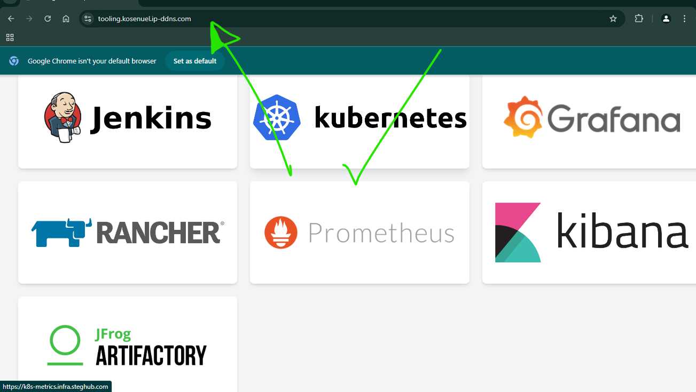
*Fig: Accessing the tooling site*

### Health Checks for Target Groups

2. **Ensure Health Checks Pass for the Target Groups:**
    - **NGINX Target Group Health Check:**

        ```yaml
        Health Check Settings:
          Protocol: HTTPS
          Path: /healthcheck
          Interval: 30 seconds
          Timeout: 5 seconds
          Healthy Threshold: 2
          Unhealthy Threshold: 2
        ```

        ```bash
        aws elbv2 modify-target-group \
          --target-group-arn <tg-arn> \
          --health-check-protocol HTTPS \
          --health-check-path /healthcheck \
          --health-check-interval-seconds 30 \
          --health-check-timeout-seconds 5 \
          --healthy-threshold-count 2 \
          --unhealthy-threshold-count 2
        ```

    - **WordPress Target Group Health Check:**

        ```yaml
        Health Check Settings:
          Protocol: HTTPS
          Path: /healthcheck
          Interval: 30 seconds
          Timeout: 5 seconds
          Healthy Threshold: 2
          Unhealthy Threshold: 2
        ```

        ```bash
        aws elbv2 modify-target-group \
          --target-group-arn <wordpress-tg-arn> \
          --health-check-protocol HTTPS \
          --health-check-path /healthcheck \
          --health-check-interval-seconds 30 \
          --health-check-timeout-seconds 5 \
          --healthy-threshold-count 2 \
          --unhealthy-threshold-count 2
        ```

    - **Tooling Target Group Health Check:**

        ```yaml
        Health Check Settings:
          Protocol: HTTPS
          Path: /healthcheck
          Interval: 30 seconds
          Timeout: 5 seconds
          Healthy Threshold: 2
          Unhealthy Threshold: 2
        ```

        ```bash
        aws elbv2 modify-target-group \
          --target-group-arn <tooling-tg-arn> \
          --health-check-protocol HTTPS \
          --health-check-path /healthcheck \
          --health-check-interval-seconds 30 \
          --health-check-timeout-seconds 5 \
          --healthy-threshold-count 2 \
          --unhealthy-threshold-count 2
        ```

    ⚠️ **Configuration Note:** Ensure that the health check paths are correctly implemented in your application to return a successful status.

## Health Checks and Monitoring

### 15. Implement Health Checks

1. **Configure Health Checks for Target Groups:**

    ```yaml
    Health Check Settings:
      Protocol: HTTPS
      Path: /healthcheck
      Interval: 30 seconds
      Timeout: 5 seconds
      Healthy Threshold: 2
      Unhealthy Threshold: 2
    ```

    ```bash
    aws elbv2 modify-target-group \
      --target-group-arn <tg-arn> \
      --health-check-protocol HTTPS \
      --health-check-path /healthcheck \
      --health-check-interval-seconds 30 \
      --health-check-timeout-seconds 5 \
      --healthy-threshold-count 2 \
      --unhealthy-threshold-count 2
    ```

### 16. Set Up AWS CloudWatch Monitoring

2. **Monitor Key Metrics:**

    ```yaml
    CloudWatch Metrics:
      - EC2 Instances:
          CPU Utilization
          Disk I/O
          Network In/Out
        
      - RDS:
          CPU Utilization
          Free Storage Space
          Database Connections
        
      - EFS:
          Throughput
          IOPS
          Storage Used
    ```

3. **Configure Alarms and Notifications:**

    ```yaml
    CloudWatch Alarms:
      - Alarm Name: High-CPU-Utilization
        Metric: CPUUtilization
        Threshold: 80%
        Comparison: GreaterThanThreshold
        Evaluation Periods: 2
        Actions: Notify via SNS
        
      - Alarm Name: Low-Free-Storage
        Metric: FreeStorageSpace
        Threshold: 20GB
        Comparison: LessThanThreshold
        Evaluation Periods: 2
        Actions: Notify via SNS
    ```

    ```bash
    aws cloudwatch put-metric-alarm \
      --alarm-name High-CPU-Utilization \
      --metric-name CPUUtilization \
      --namespace AWS/EC2 \
      --statistic Average \
      --period 60 \
      --threshold 80 \
      --comparison-operator GreaterThanThreshold \
      --evaluation-periods 2 \
      --alarm-actions <sns-topic-arn> \
      --dimensions Name=InstanceId,Value=<instance-id>
    ```

    💡 **Best Practices:**
    - **Proactive Monitoring:** Continuously monitor critical metrics to anticipate and mitigate issues.
    - **Automated Responses:** Utilize AWS Lambda or Auto Scaling to respond to specific alarm triggers.
    - **Centralized Logging:** Implement centralized logging using AWS CloudWatch Logs or the ELK stack for comprehensive visibility.

    ⚠️ **Common Issues:**
    - **Throttling Alarms:** Avoid setting overly sensitive alarms that trigger frequently.
    - **Notification Delays:** Ensure SNS topics and subscriptions are correctly configured for timely alerts.
    - **Insufficient Metrics:** Regularly review and adjust monitored metrics to align with evolving application needs.

## Maintenance and Best Practices

### 17. Backup Procedures

1. **Automate Backups for RDS and EFS:**

    ```yaml
    Backup Strategy:
      RDS:
        Automated Backups: Enabled
        Retention Period: 7 days
        Backup Window: 03:00-04:00 UTC
      
      EFS:
        Backup Solutions:
          - AWS Backup integration
          - Snapshot schedule: Daily backups
          - Retention Policy: 30 days
    ```

    ```bash
    # Enable automated backups for RDS
    aws rds modify-db-instance \
      --db-instance-identifier prod-mysql-db \
      --backup-retention-period 7 \
      --apply-immediately
    ```

    ```yaml
    Backup Configuration:
      EFS Name: Production-EFS
      Backup Schedule: Daily at midnight
      Retention Policy: 30 backups retained
    ```

    💡 **Best Practices:**
    - **Automate Backups:** Reduce the risk of data loss by scheduling regular backups.
    - **Verify Backups:** Periodically test backup restoration processes to ensure reliability.
    - **Secure Storage:** Encrypt backups and restrict access to authorized personnel only.

### 18. Regular Maintenance Tasks

2. **System Updates and Patches:**

    ```bash
    sudo yum update -y
    sudo yum upgrade -y
    ```

    ```yaml
    Maintenance Tasks:
      - Schedule regular OS updates
      - Apply security patches promptly
      - Monitor for vulnerability advisories
    ```

3. **Log Management:**

    ```bash
    # Configure log rotation
    sudo vim /etc/logrotate.d/nginx
    # Example logrotate configuration for NGINX logs
    /var/log/nginx/*.log {
        daily
        missingok
        rotate 14
        compress
        delaycompress
        notifempty
        create 0640 nginx adm
        sharedscripts
        postrotate
            systemctl reload nginx > /dev/null 2>&1 || true
        endscript
    }
    ```

    ```yaml
    Log Management:
      - Implement log rotation to prevent disk space exhaustion
      - Centralize logs using CloudWatch Logs or ELK stack
      - Monitor logs for anomalies and errors
    ```

    💡 **Best Practices:**
    - **Automate Maintenance:** Use automation tools like Ansible for consistent and repeatable maintenance tasks.
    - **Monitor Disk Usage:** Prevent services from failing due to full disk partitions by monitoring storage metrics.
    - **Secure Logs:** Restrict access to logs to maintain confidentiality and integrity.

    ⚠️ **Common Issues:**
    - **Failed Updates:** Verify internet connectivity and repository configurations.
    - **Log Rotation Errors:** Ensure correct permissions and configurations for log files.
    - **Unmonitored Logs:** Implement alerts for critical log events to enable prompt responses.

## Best Practices & Conclusion

### Best Practices Implemented

- **Infrastructure as Code (IaC):**
  - Utilize AWS CloudFormation or Terraform to define and manage infrastructure components consistently.
  
- **Automation:**
  - Automate repetitive tasks such as deployments, scaling, and backups using scripts and AWS services.
  
- **Security-First Approach:**
  - Implement least privilege principles for IAM roles and security groups.
  - Regularly audit security configurations and access logs.
  
- **Scalability and High Availability:**
  - Deploy resources across multiple Availability Zones to ensure redundancy.
  - Configure Auto Scaling Groups to handle traffic fluctuations effectively.
  
- **Monitoring and Logging:**
  - Integrate AWS CloudWatch for comprehensive monitoring of resources and applications.
  - Centralize logging for easier troubleshooting and audit trails.
  
- **Documentation:**
  - Maintain detailed documentation for all configurations and procedures to facilitate maintenance and onboarding.

### Future Enhancements

- **Containerization:**
  - Migrate web applications to Docker containers and manage them using Amazon ECS or EKS for improved scalability and portability.
  
- **CI/CD Integration:**
  - Implement CI/CD pipelines using Jenkins, GitHub Actions, or AWS CodePipeline to automate deployments and testing.
  
- **Advanced Monitoring:**
  - Integrate Prometheus and Grafana for enhanced metrics visualization and alerting capabilities.
  
- **Disaster Recovery:**
  - Establish a comprehensive disaster recovery plan, including cross-region backups and failover strategies.

### Lessons Learned

- **Thorough Planning:** Comprehensive planning of network and security architectures ensures robustness and minimizes vulnerabilities.
  
- **Automation Benefits:** Automating deployments and maintenance tasks reduces human error and increases operational efficiency.
  
- **Monitoring is Crucial:** Effective monitoring and alerting enable proactive identification and resolution of issues before they impact users.
  
- **Security Must Be Integral:** Incorporating security best practices from the outset is essential for protecting assets and maintaining trust.

## Conclusion

This AWS cloud solution effectively hosts two company-owned websites by utilizing solid architecture designs, automation, and security best practices. Once you have implemented multi-Availability Zone deployments, reverse proxy configurations with NGINX, and secure database management with Amazon RDS, the infrastructure ensures high availability, scalability, and security. Continuous monitoring and maintenance will further reinforce the reliability and performance of the deployed services, thereby positioning the company for sustained operational excellence.

---

📧 **Contact Information:**
For any inquiries or feedback, please reach out to me at [kosenuel@gmail.com](mailto:kosenuel@gmail.com).

🔗 **Connect with Me:**
- [LinkedIn](https://www.linkedin.com/in/emmanuel-okose/)
- [GitHub](https://github.com/Kosenuel)

⭐ **Feel free to star this repository if you find it useful!**

