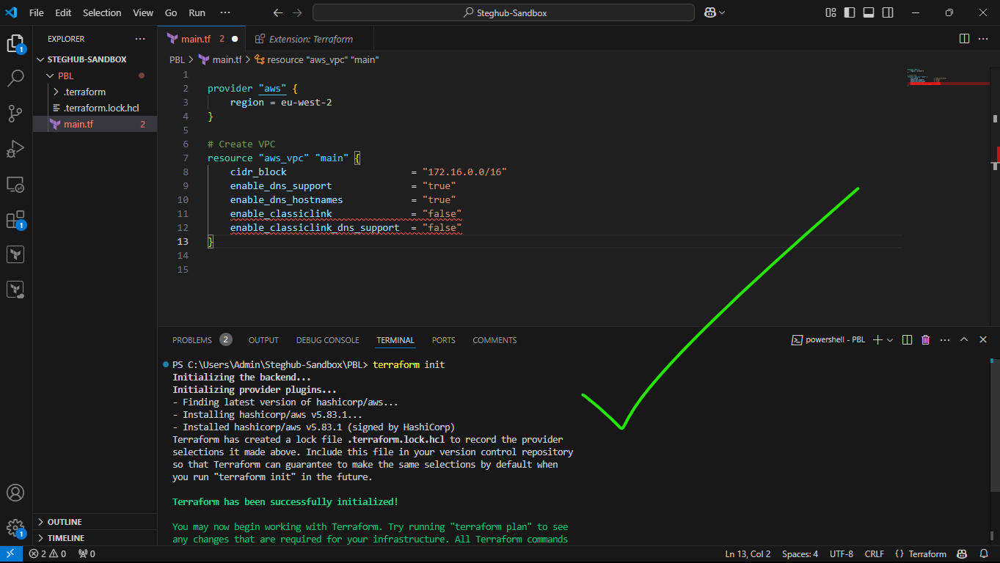
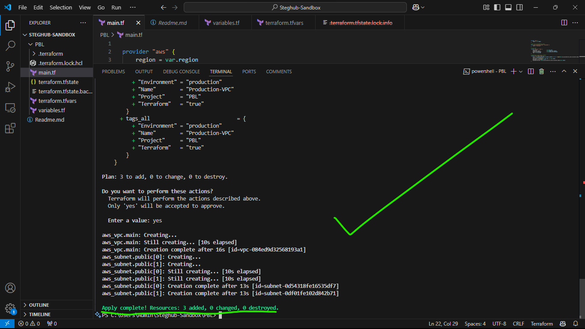

# Automating AWS Infrastructure Using Terraform

After successfully building AWS infrastructure manually for 2 websites, we will now automate the entire process using Terraform. This automation will ensure consistency, repeatability, and easier maintenance of our infrastructure.

## Table of Contents
1. [Prerequisites](#prerequisites)
   - [Required Tools](#required-tools)
   - [Knowledge Requirements](#knowledge-requirements)

2. [AWS IAM Setup](#aws-iam-setup)
   - [Creating the Terraform IAM User](#creating-the-terraform-iam-user)
   - [Common IAM Setup Issues](#common-iam-setup-issues-and-solutions)

3. [AWS CLI and SDK Configuration](#aws-cli-and-sdk-configuration)
   - [AWS CLI Setup](#aws-cli-setup)
   - [Python SDK Installation](#python-sdk-boto3-installation)

4. [S3 Backend Configuration](#s3-backend-configuration)
   - [Creating S3 Bucket for Terraform State](#creating-s3-bucket-for-terraform-state)
   - [S3 Backend Security Best Practices](#s3-backend-security-best-practices)

5. [Understanding Terraform Concepts](#understanding-terraform-concepts)
   - [Key Terraform Terminology](#key-terraform-terminology)
   - [Common Terraform Concept Issues](#common-terraform-concept-issues)

6. [Infrastructure Code Structure](#infrastructure-code-structure)
   - [Project Directory Setup](#project-directory-setup)
   - [File Organization](#file-organization)

7. [VPC and Networking Configuration](#vpc-and-networking-configuration-hardcoded-version)
   - [Provider Configuration](#provider-configuration)
   - [Subnet Configuration](#subnet-configuration)
   - [Understanding Dynamic Subnet Creation](#understanding-the-dynamic-subnet-creation)
   - [Best Practices for VPC Configuration](#best-practices-for-vpc-configuration)

8. [Understanding Terraform Configuration Segmentation](#understanding-terraform-concepts)


9. [Testing and Verification](#testing-your-configuration)
   - [Validation Steps](#validate-configuration)
   - [Resource Verification](#verify-resources)


10. [Conclusion](#conclusion)
    - [Project Achievements](#project-achievements)
    - [Benefits Realized](#benefits-realized)
    - [Lessons Learned](#lessons-learned)
    - [Future Considerations](#future-considerations)

## Prerequisites

Before diving into Terraform configuration, ensure you have the following prerequisites in place:

### Required Tools
- AWS Account with administrative access
- [Terraform CLI](https://developer.hashicorp.com/terraform/tutorials/aws-get-started/install-cli) (latest version)
- [AWS CLI](https://awscli.amazonaws.com/AWSCLIV2.msi) (version 2.x or later)
- [Python 3.6 or higher](https://www.python.org/ftp/python/3.13.1/python-3.13.1-amd64.exe) (for boto3)
- A code editor (VS Code recommended)

### Knowledge Requirements
- Basic understanding of AWS services (VPC, EC2, IAM)
- Familiarity with command line operations
- Basic understanding of JSON/YAML formats

## AWS IAM Setup

### Creating the Terraform IAM User

1. **Navigate to IAM Dashboard:**
   - Log into AWS Console
   - Search for "IAM" or find it under Services
   - Click "Users" → "Create user"

2. **Configure User Details:**
   ```yaml
   User Configuration:
     Name: terraform
     Access type: Programmatic access only
     Permissions: AdministratorAccess (via policy attachment)
   ```

   
   
   

3. **Create Access Keys:**
   - After user creation, create access keys
   - Store these securely - they will be used for AWS CLI configuration

   
   
   

4. **Save Credentials:**
   - Download or copy the access key ID and secret access key
   - Store these securely for CLI configuration

   

⚠️ **Security Best Practices:**
- Never commit access keys to version control
- Rotate access keys regularly
- Use the principle of least privilege when assigning permissions
- Enable MFA for the IAM user if possible

### Common IAM Setup Issues and Solutions:

| Issue | Solution |
|-------|----------|
| Permission Denied Errors | Verify the attached IAM policy includes necessary permissions |
| Access Key Issues | Ensure access keys are active and not expired |
| MFA Problems | Check if MFA is properly configured and tokens are correct |

## AWS CLI and SDK Configuration

### AWS CLI Setup

1. **Configure AWS CLI with Credentials:**
   ```bash
   aws configure
   ```

2. **Enter the Required Information:**
   ```bash
   AWS Access Key ID [None]: <Your-Access-Key-ID>
   AWS Secret Access Key [None]: <Your-Secret-Access-Key>
   Default region name [None]: eu-west-2
   Default output format [None]: json
   ```

3. **Verify Configuration:**
   ```bash
   cat ~/.aws/credentials
   # OR
   cat C:/Users/<Your User>/.aws/credentials
   ``` 

   Expected Output:
   ```ini
   [default]
   aws_access_key_id = YOUR_ACCESS_KEY
   aws_secret_access_key = YOUR_SECRET_KEY
   ```

### Python SDK (boto3) Installation

1. **Install boto3 using pip:**
   ```bash
   pip install boto3
   ```

   

2. **Verify Installation:**
   ```python
   import boto3
   s3 = boto3.resource('s3')
   for bucket in s3.buckets.all():
       print(bucket.name)
   ```

   

⚠️ **Common Configuration Issues:**

| Issue | Solution |
|-------|----------|
| `AWS credentials not found` | Check if credentials file exists in `~/.aws/credentials` |
| `Region not specified` | Ensure default region is set in AWS CLI configuration |
| `boto3 import error` | Verify Python and pip are correctly installed |
| `Permission denied` | Check file permissions on credentials file |

## S3 Backend Configuration

### Creating S3 Bucket for Terraform State

1. **Create an S3 Bucket:**
   Navigate to `Amazon S3 -> Buckets -> Create bucket`
   - Name format: `<yourname>-dev-terraform-bucket`
   - Note: S3 bucket names must be globally unique

   
   
   *Fig: Creating Bucket*
2. **Verify Bucket Creation:**
   ```python
   import boto3
   s3 = boto3.resource('s3')
   for bucket in s3.buckets.all():
       print(bucket.name)
   ```

   

### S3 Backend Security Best Practices

```hcl
# Example S3 backend configuration
terraform {
  backend "s3" {
    bucket         = "<yourname>-dev-terraform-bucket"
    key            = "terraform.tfstate"
    region         = "eu-west-2"
    encrypt        = true
    dynamodb_table = "terraform-lock"
  }
}
```

⚠️ **S3 Backend Considerations:**
- Enable versioning on the S3 bucket
- Configure server-side encryption
- Use DynamoDB for state locking
- Implement appropriate bucket policies

## Understanding Terraform Concepts

### Key Terraform Terminology

1. **Attribute:**
   - These are properties of resources that are either set by the provider or computed during execution
   ```bash
   resource "aws_vpc" "main" {
     # cidr_block is an argument
     cidr_block = "10.0.0.0/16"
     
     # `id` is an attribute (computed by AWS)
     # accessed as `aws_vpc.main.id`
   }
   ```

2. **Resource:**
   - Are infrastructure objects managed by Terraform
   ```bash
   resource "aws_instance" "example" {
     ami           = "ami-0c55b159cbfafe1f0"
     instance_type = "t2.micro"
   }
   ```

3. **Interpolation:**
   - These are references to other resource attributes or variables
   ```bash
   resource "aws_subnet" "example" {
     vpc_id = aws_vpc.main.id  # This is an interpolation
   }
   ```

4. **Provider:**
   - This is a plugin for managing resources in a specific cloud platform
   ```bash
   provider "aws" {
     region = "eu-west-2"
   }
   ```

5. **Variables:**
   - These are like containers/boxes to help you store reusable values through out your configuration file.
   ```bash
   # Variable declaration
   variable "environment" {
     description = "Environment name"
     type        = string
     default     = "development"
   }

   # Variable usage
   resource "aws_vpc" "main" {
     tags = {
       Environment = var.environment
     }
   }
   ```

⚠️ **Common Terraform Concept Issues:**

| Issue | Solution |
|-------|----------|
| Interpolation syntax errors | Ensure correct syntax: `${var.name}` or `var.name` |
| Provider version conflicts | Specify provider versions in required_providers block |
| Variable type mismatches | Check and verify that the variable declarations match the expected types |
| Resource dependencies | Use `depends_on` for explicit dependencies |

## Infrastructure Code Structure

### Project Directory Setup

1. **Create Project Directory:**
   ```bash
   mkdir PBL
   cd PBL
   ```

2. **Create Basic File Structure:**
   ```bash
   touch main.tf
   ```

   
  

### File Organization

```plaintext
PBL/
├── main.tf           # Main configuration file
└── .gitignore       # Git ignore file (if exists)
```

## VPC and Networking Configuration (HARDCODED VERSION)

### Provider Configuration

1. **Set up AWS Provider and Create VPC:**
   ```bash
   provider "aws" {
     region = eu-west-2
   }

   # Create VPC
   resource "aws_vpc" "main" {
      cidr_block                       = "172.16.0.0/16"
      enable_dns_support               = "true"
      enable_dns_hostnames             = "true"
      enable_classic_link              = "false" # Do not include this, as Terraform-Aws no longer support these attributes.
      enable_classic_link_dns_support  = "false" # Do not include this, as Terraform-Aws no longer 
      tags = {
         Name = "main"
      }
   }
   ```
   Now for us to create this VPC in our aws cloud, terraform would need to download some plugins to enable it communicate properly with aws in the creation of our specs above. 
   To download this plugins, we run `terraform init`

2. **Initialize and Plan:**
   ```bash
   terraform init
   terraform plan
   ```

   
   

### Observations:

   1. A new file - `terraform.tfstate` - was created and immediately destroyed _(at least in my case)_. Housed in this file is how Terraform keeps itself up to date with the exact state of your infrastructure. It reads this file to know what resource(s) already exists, what should be added, or destroyed based on the entire terraform code that is being developed.

   2. Also, another file - `terraform.tfstate.lock.info` - got created during planning and apply operation. But this file got deleted immediately. This file is what Terraform uses to track, who is running its code against the infrastructure at any point in time. This is very important for teams working on the same Terraform repository at the same time. The lock prevents a user from executing Terraform configuration against the same infrastructure when another user is doing the same - it helps to avoid duplicates and conflicts.

   Its content is usually like this: 
   ```json
   {
  "ID":"e5e5ad0e-9cc5-7af1-3547-77bb3ee0958b",
  "Operation":"OperationTypePlan","Info":"",
  "Who":"user@Machine","Version":"0.13.4",
  "Created":"2020-10-28T19:19:28.261312Z",
  "Path":"terraform.tfstate"
   }
   ```


### Subnet Configuration

According to our architectural design, we require 6 subnets:

- 2 public
- 2 private for webservers
- 2 private for data layer

Let us create the first 2 public subnets.

Add below configuration to the `main.tf` file:

```bash
# Create public subnets1
  resource "aws_subnet" "public1" {
  vpc_id                     = aws_vpc.main.id
  cidr_block                 = "172.16.0.0/24"
  map_public_ip_on_launch    = true
  availability_zone          = "eu-west-2a"

}

# Create public subnet2
  resource "aws_subnet" "public2" {
  vpc_id                     = aws_vpc.main.id
  cidr_block                 = "172.16.1.0/24"
  map_public_ip_on_launch    = true
  availability_zone          = "eu-west-2b"
}
```
- We are creating 2 subnets and that is why we are declaring 2 resource blocks - one for each of the subnets.
- We are using the `vpc_id` argument to interpolate the value of the VPC id by setting it to `aws_vpc.main.id`. This way, Terraform knows what VPC to create the subnet within.

Run `terraform plan` and `terraform apply`


⚠️ **Common VPC Configuration Issues:**

| Issue | Solution |
|-------|----------|
| CIDR Block Conflicts | Ensure CIDR blocks don't overlap with existing networks |
| AZ Availability | Check if desired AZs are available in your region |
---
---
---
---


## VPC and Networking Configuration (SoftCoded - Introducing Variable - VERSION)
Now, we will run `terraform destroy` to remove all the resources we have created in our aws account through terraform so that we can redo it, this time around, in a more flexible, dynamic way.


*Fig: Destroying resources earlier created using `terraform destroy`*

Create a file called `variables.tf`, in this file is where we will declare our variables to use in the `main.tf` file.
We could declare these variables in the `main.tf` file, but for the sake of making our work orderly and easy to read, we are separating the files for their respective purpose.

### Why is this segmentation important?
1. **Separation of Concerns**
   - Configuration logic (main.tf)
   - Variable declarations (variables.tf)
   - Variable values (terraform.tfvars)

2. **Reusability**
   - Same configuration can be used with different variables
   - Easy to replicate infrastructure across environments

3. **Maintainability**
   - Easier to read and understand
   - Simpler to update specific components
   - Better version control management

4. **Security**
   - Sensitive values can be kept separate
   - Different access controls for different files
   - Easier to implement GitOps practices

```bash
sudo touch variables.tf
```

1. **Variable Definition:**
   ```bash
   # variables.tf
   variable "region" {
     default = "eu-central-1"
   }

   variable "vpc_cidr" {
     default = "172.16.0.0/16"
   }

   variable "enable_dns_support" {
     default = "true"
   }

   variable "enable_dns_hostnames" {
     default = "true"
   }

   variable "preferred_number_of_public_subnets" {
     default = null
   }

   variable "vpc_tags"{
    description = "Tags to be applied to the VPC"
    type        = map(string)
    default = {
        Environment = "production"
        Terraform   = "true"
        Project     = "PBL"
    }
   }
   ```

2. **Explicit variable Definitions**

   Create another file called `terraform.tfvars`
   ```bash
   touch terraform.tfvars
   ```
   This file sets actual values for the variables declared in variables.tf. It's used to:
      - Override specific default values
      - Set environment-specific configurations
      - Keep sensitive values separate from main code

   Find below and replicate the content of the `terraform.tfvars` file:

   ```bash
   # terraform.tfvars
   region = "eu-central-1"
   vpc_cidr = "172.16.0.0/16"
   enable_dns_support = true
   enable_dns_hostnames = true
   preferred_number_of_public_subnets = 2
   vpc_tags = {
      Name = "Production-VPC"
      Environment = "production"
      Terraform = "true"
      Project = "PBL"
   }
   ```

3. **Main Configuration Updates:**
   Once you have applied the values in the  `terraform.tfvars` file, we will now proceed to the `main.tf` file.
   This file contains the primary infrastructure configuration. It:
      - References variables using the `var.` prefix
      - Defines resources and their relationships
      - Contains provider configurations

   ```bash
   # main.tf
   provider "aws" {
     region = var.region
   }

   # Get list of availability zones
   data "aws_availability_zones" "available" {
     state = "available"
   }

   # Create VPC
   resource "aws_vpc" "main" {
     cidr_block                     = var.vpc_cidr
     enable_dns_support             = var.enable_dns_support
     enable_dns_hostnames           = var.enable_dns_hostnames
     tags = {
         Name        = "Production-VPC"
         Environment = "production"
         Terraform   = "true"
         Project     = "PBL"
   }
   }

   # Dynamically create public subnets
   resource "aws_subnet" "public" {
     count                   = var.preferred_number_of_public_subnets == null ? length(data.aws_availability_zones.available.names) : var.preferred_number_of_public_subnets
     vpc_id                  = aws_vpc.main.id
     cidr_block              = cidrsubnet(var.vpc_cidr, 4, count.index)
     map_public_ip_on_launch = true
     availability_zone       = data.aws_availability_zones.available.names[count.index]
   }
   ```
    
   *Fig: The file that holds our variable declarations*

    
   *Fig: The file that holds our variable values*
   
    
   *Fig: The file that holds our configuration logic*

   At the end, our file structure should look somewhat like this:

   ```bash
   PBL/
   ├── main.tf           # Main configuration file
   ├── variables.tf      # Variable declarations
   ├── terraform.tfvars  # Variable values
   ```

   
   *Fig: Our Tf File structure*
   ### Understanding the Dynamic Subnet Creation

   Let us break down the subnet configuration:

   ```bash
   resource "aws_subnet" "public" {
   count                   = var.preferred_number_of_public_subnets == null ? length(data.aws_availability_zones.available.names) : var.preferred_number_of_public_subnets
   vpc_id                  = aws_vpc.main.id
   cidr_block              = cidrsubnet(var.vpc_cidr, 4, count.index)
   map_public_ip_on_launch = true
   availability_zone       = data.aws_availability_zones.available.names[count.index]
   }
   ```

   #### Key Parts:

   1. **Count Parameter**
      ```hcl
      count = var.preferred_number_of_public_subnets == null ? length(data.aws_availability_zones.available.names) : var.preferred_number_of_public_subnets
      ```
      - This is a conditional expression (ternary operator)
      - If `preferred_number_of_public_subnets` is null, it uses the number of available AZs
      - If not null, it uses the specified number from terraform.tfvars
      - Controls how many subnets are created

   2. **VPC Association**
      ```hcl
      vpc_id = aws_vpc.main.id
      ```
      - Links the subnet to the VPC we created
      - Uses interpolation (the method of referencing/assigning values) to reference the VPC's ID

   3. **CIDR Block Calculation**
      ```hcl
      cidr_block = cidrsubnet(var.vpc_cidr, 4, count.index)
      ```
      - `cidrsubnet()` is a built-in function that calculates subnet CIDR blocks
      - Parameters:
      - `var.vpc_cidr`: The VPC's CIDR block (e.g., "172.16.0.0/16")
      - `4`: Number of additional bits for subnet (creates /20 subnets)
      - `count.index`: Current subnet number (0, 1, 2, etc.)
      - Example outputs:
      - First subnet (index 0): 172.16.0.0/20
      - Second subnet (index 1): 172.16.16.0/20
      - Third subnet (index 2): 172.16.32.0/20

   4. **Public IP Assignment**
      ```hcl
      map_public_ip_on_launch = true
      ```
      - Automatically assigns public IPs to instances in this subnet
      - Makes the subnet "public"

   5. **Availability Zone Assignment**
      ```hcl
      availability_zone = data.aws_availability_zones.available.names[count.index]
      ```
      - Distributes subnets across available AZs
      - Uses `count.index` to cycle through AZs
      - Ensures high availability by spreading across zones

   This configuration creates a dynamic number of public subnets, each in a different availability zone, with automatically calculated CIDR blocks. It is flexible enough to adapt to different regions and requirements while it strives to maintain best practices for high availability.

⚠️ **Common VPC Configuration Issues:**

| Issue | Solution |
|-------|----------|
| CIDR Block Conflicts | Ensure CIDR blocks don't overlap with existing networks |
| AZ Availability | Check if desired AZs are available in your region |
| Subnet Count Mismatch | Verify preferred_number_of_public_subnets value |
| CIDR Calculation Errors | Test cidrsubnet calculations in terraform console first |

### Best Practices for VPC Configuration

1. **CIDR Block Selection:**
   - Use private IP ranges (10.0.0.0/8, 172.16.0.0/12, 192.168.0.0/16)
   - Plan for future growth when selecting CIDR ranges
   - Document your IP addressing scheme

2. **Subnet Design:**
   - Distribute subnets across multiple AZs
   - Size subnets according to expected workload
   - Keep some IP ranges in reserve for future use (if and when necessary - as this costs money to store/keep)

3. **Tagging:**
   Multiple tagging is strongly advised
   ```bash
   tags = {
     Name        = "Production-VPC"
     Environment = "production"
     Terraform   = "true"
     Project     = "PBL"
   }
   ```

### Testing Your Configuration

1. **Validate Configuration:**
   ```bash
   terraform validate
   ```

2. **Review Plan:**
   ```bash
   terraform plan
   ```

3. **Apply Configuration:**
   ```bash
   terraform apply
   ```

   
   *Fig: Running Terraform Validate*

   
   *Fig: Running Terraform Plan*

   
   *Fig: Applying Terraform Configurations to our AWS env*

4. **Verify Resources:**
   ```bash
   terraform show
   ```
   
   *Fig: Show  ing our AWS resources created in our env*

   ### Now This is the result from our Aws console point of view

   
   *Fig: Showing our AWS resources created in our env*


.
.
.
.
---
---
---
---
---
## Conclusion

### Project Achievements
Through this Infrastructure as Code (IaC) implementation with Terraform, we have successfully:
- Automated the creation of a production-grade VPC infrastructure
- Implemented dynamic subnet allocation across availability zones
- Established a maintainable and scalable code structure
- Applied AWS best practices for networking and security

### Benefits Realized
1. **Automation**
   - Reduced manual configuration errors
   - Consistent infrastructure deployment
   - Faster provisioning and teardown of resources

2. **Maintainability**
   - Clear separation of configuration files
   - Well-documented variable definitions
   - Reusable code components

3. **Scalability**
   - Dynamic resource creation
   - Flexible subnet allocation
   - Easy adaptation to different environments

4. **Cost Management**
   - Infrastructure can be easily destroyed when not needed
   - Resource optimization through code
   - Better control over AWS resource usage

### Lessons Learned
1. Proper planning of variable structure is crucial for long-term maintenance
2. Dynamic resource creation provides better flexibility than static configurations
3. Separating configuration files improves code organization and reusability
4. Understanding AWS networking concepts is essential for proper IaC implementation


### Final Thoughts
This project demonstrates the power of Infrastructure as Code using Terraform. By automating our infrastructure deployment, we have not only improved efficiency but also established a foundation for future scaling and maintenance. The practices and patterns established here can serve as a template for future infrastructure projects and continue to evolve with changing requirements and best practices.

Thank you for taking the time to go through my work.

---
