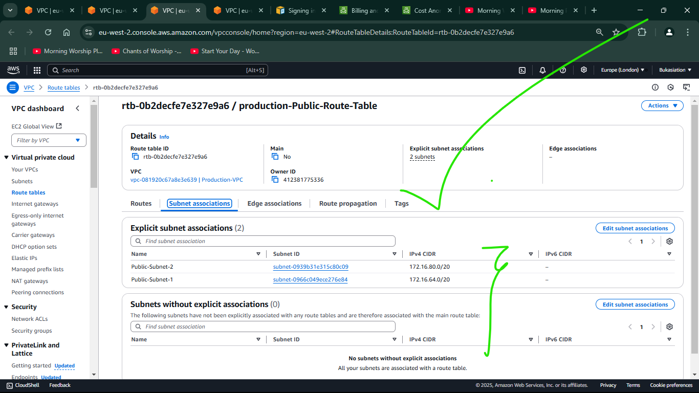

# (Iac) Automating AWS Infrastructure with Terraform - Part 2

### 📚 Table of Contents

#### Infrastructure Setup
- [Introduction](#introduction)
- [Project Objectives](#-project-objectives)
- [Required Tools](#-required-tools)
- [Project File Structure](#-project-file-structure)
- [Key File Descriptions](#-key-file-descriptions)
- [Understanding Networking Fundamentals](#-understanding-networking-fundamentals)
- [Infrastructure Overview](#-infrastructure-overview)

#### Network Configuration
- [Private Subnets & Tagging Best Practices](#private-subnets--tagging-best-practices)
- [Internet Gateway Configuration](#-internet-gateway-configuration)
- [NAT Gateway Configuration](#nat-gateway-configuration)
- [AWS Route Configuration](#aws-route-configuration)

#### Security & Access
- [AWS Identity and Access Management (IAM)](#aws-identity-and-access-management-iam)
- [IAM Roles Configuration](#iam-roles-configuration)

#### Storage & Resources
- [Storage Configuration - EFS and RDS](#storage-configuration---efs-and-rds)
  - [Amazon Elastic File System (EFS)](#amazon-elastic-file-system-efs)
  - [RDS Configuration](#rds-configuration)

#### Verification & Testing
- [Final Verification and Testing](#final-verification-and-testing)
  - [Infrastructure Verification Checklist](#1--network-components)
  - [Testing Procedures](#testing-procedures)
  - [Performance Monitoring](#performance-monitoring)
  - [Cleanup Procedure](#cleanup-procedure-if-needed)
  - [Documentation and Handover](#documentation-and-handover)

#### Project Completion
- [Conclusion](#-conclusion)
  - [Project Summary](#project-summary)
  - [Key Achievements](#-key-achievements)
  - [Best Practices Implemented](#-best-practices-implemented)
  - [Maintenance Guidelines](#-maintenance-guidelines)
  - [Future Improvements](#-future-improvements)
  - [Lessons Learned](#-lessons-learned)
  - [Next Steps](#-next-steps)

#### File Structure
- [Project File Structure After Resources](#-project-file-structure)
- [Main Configuration File](#main-terraform-configuration-maintf)


## Introduction
Welcome to Part 2 of our Infrastructure as Code (IaC) journey with Terraform! In this guide, we'll expand on our previous infrastructure automation by implementing additional AWS services and best practices.

> 📘 **Prerequisites**: Please complete [Part 1](../16.(Iac)_Automating_Infrastructure_Using_Terraform/README.md) before starting this guide.

## 🎯 Project Objectives
By the end of this guide, you will:
- Understand advanced networking concepts
- Create a complete multi-tier AWS infrastructure
- Implement security best practices
- Master Terraform resource management

## 🛠 Required Tools
- AWS Account with administrative access
- Terraform (latest version)
- AWS CLI (v2 or later)
- Git (latest version)
- Code editor (VS Code recommended)

## 📚 Understanding Networking Fundamentals

Before diving deeper into infrastructure automation, let us strengthen our networking knowledge.

### Recommended Learning Resources

#### 🎥 Video Resources
- [Introduction to Networking](https://www.youtube.com/watch?v=rL8RSFQG8do) by Eli the Computer Guy
- [TCP/IP and Subnet Masking](https://www.youtube.com/watch?v=EkNq4TrHP_U) by Eli the Computer Guy
- [Complete Networking Playlist](https://www.youtube.com/playlist?list=PLF360ED1082F6F2A5)

#### 📖 Reading Materials
1. [Networking Fundamentals Part 1](https://www.digitalocean.com/community/tutorials/an-introduction-to-networking-terminology-interfaces-and-protocols)
2. [Understanding IP Addresses & CIDR](https://www.digitalocean.com/community/tutorials/understanding-ip-addresses-subnets-and-cidr-notation-for-networking)

> ⚠️ **Note**: Don't worry if these concepts are new to you at first. Take your time to understand them - they are crucial for cloud infrastructure design.

## 🏗 Infrastructure Overview


Our infrastructure consists of:

| Component | Purpose |
|-----------|----------|
| External ALB | Routes external traffic |
| NGINX Servers | Reverse proxy |
| Internal ALB | Routes internal traffic |
| WordPress Servers | Hosts WordPress application |
| Tooling Servers | Hosts internal tools |
| RDS | Database service |
| EFS | Shared file storage |
| Bastion Host | Secure access point |

### 🔐 Security Groups Structure
Here's what we're going to build:


## 🌐 Networking Configuration

## Vpc creation
> ⚠️ **NOTE:** **All the files we will be creating should be in thesame directory.**

Create a new file `provider.tf` and populate it with the following:
```bash
provider "aws" {
  region = var.region
}
```

Create a new file `vpc.tf`, populate it with this content:

```bash
# Get list of availability zones in the region
data "aws_availability_zones" "available" {
    state          = "available"
}

resource "aws_vpc" "main" {
  cidr_block = var.vpc_cidr
  enable_dns_support = true
  enable_dns_hostnames = true

  tags = merge(
    var.tags,
    {
      Name = "Production-VPC"
    }
  )

}
```
## Private Subnets & Tagging Best Practices

### Creating Private Subnets

Let's create 4 private subnets following these principles:

#### We are going to be utilizing;

1. **Dynamic AZ Utilization**
   ```hcl
   # Use variables or length() function for AZ count
   count = length(data.aws_availability_zones.available.names)
   ```

2. **Automated CIDR Allocation**
   ```hcl
   # Use cidrsubnet() function for subnet ranges
   cidr_block = cidrsubnet(var.vpc_cidr, 4, count.index)
   ```

   > 💡 **Tip**: Always use `cidrsubnet()` function for automatic subnet calculations to avoid IP range conflicts.

Create a new file `subnets.tf`.
This a sample of my terraform code for creating 4 private subnet and 2 public subnets:
```bash
# Dynamically Create Private Subnets
resource "aws_subnet" private {
    count = var.preferred_number_of_private_subnets == null? length(data.aws_availability_zones.available.names) : var.preferred_number_of_private_subnets
    vpc_id = aws_vpc.main.id
    cidr_block = cidrsubnet(var.vpc_cidr, 4, count.index)
    availability_zone = data.aws_availability_zones.available.names[count.index % length(data.aws_availability_zones.available.names)]
    map_public_ip_on_launch = false
    
    tags = merge(
        var.tags,
        {
            Name = format("Private-Subnet-%s", count.index + 1)
            
        }
    )
}

# Dynamically Create Public Subnets
resource "aws_subnet" public {
    count = var.preferred_number_of_public_subnets == null ? length(data.aws_availability_zones.available.names) : var.preferred_number_of_public_subnets
    vpc_id = aws_vpc.main.id
    cidr_block = cidrsubnet(var.vpc_cidr, 4, count.index + 4) # We added `+4` to the index to avoid overlapping with the private subnets CIDR blocks 
    map_public_ip_on_launch = true
    availability_zone = data.aws_availability_zones.available.names[count.index]

    tags = merge(
        var.tags,
        {
            Name = format("Public-Subnet-%s", count.index + 1)
            
        }
    )
}

```
And make sure to create a `variables.tf` file and let it have the content:
```bash
variable "region"{
    default = "eu-west-2"
}

variable "vpc_cidr"{
    default = "172.16.0.0/16"
}

variable "enable_dns_support"{
    default = "true"
}

variable "enable_dns_hostnames"{
    default = "true"
}

variable "preferred_number_of_private_subnets"{
    default = null
}

variable "tags"{
    description = "Tags to be applied to the resources"
    type        = map(string)
    default = {
        Environment = "production"
        Owner       = "I.T. Admin"
        Terraform   = "true"
        Project     = "PBL"
    }
}

```

Then go ahead to create a `terraform.tfvars` file with contents akin to this:
```bash
region = "eu-west-2"
vpc_cidr = "172.16.0.0/16"
enable_dns_support = "true"
enable_dns_hostnames = "true"
preferred_number_of_private_subnets = 4
preferred_number_of_public_subnets = 2
tags = {
    Environment = "production"
    Owner       = "Emmanuel@kosenuel.com"
    Terraform   = "true"
    Project     = "PBL"
}

```


*Fig: Private Subnet Configuration in Terraform*

#### Now let's run `terraform apply` and see what gets created from our aws console.

*Fig: Private Subnets Created in AWS Console*

### 🏷️ Resource Tagging Strategy

Tagging is crucial for:
- Resource organization
- Cost tracking
- Access control
- Resource lifecycle management

#### Default Tags Configuration - an example
```hcl
tags = {
  Environment      = "production"
  Owner-Email     = "Emmanuel@kosenuel.com"
  Managed-By      = "Terraform"
  Billing-Account = "1234567890"
}
```

#### Using merge() Function for Tags
```hcl
tags = merge(
    var.tags,
    {
      Name = format("%s-%s", var.name, "private-subnet")
    },
  )
```

> 💡 **Useful Tip**: Store common tags in variables to maintain consistency across resources.

## 🌐 Internet Gateway Configuration

### Creating the Internet Gateway

Create a new file `internet_gateway.tf`:

```bash
resource "aws_internet_gateway" "igw" {
    vpc_id = aws_vpc.main.id

    tags = merge(
        var.tags,
        {
            Name = format("%s-%s", aws_vpc.main.tags["Name"], "IGW")
        }
    )
}
```


*Fig: Internet Gateway Configuration in Terraform*


*Fig: Terraform Plan Showing IGW Creation*


### Understanding format() Function

The `format()` function helps create dynamic resource names:
```hcl
format("%s-%s!", aws_vpc.main.id, "IG")
# Example output: vpc-1234567890-IG!
```

> 🔍 **Note**: The `format()` function is especially useful when:
> - Creating unique resource names
> - Maintaining naming conventions
> - Generating dynamic tags

### Common Issues and Solutions

| Issue | Solution |
|-------|----------|
| IGW attachment fails | Verify VPC ID and permissions |
| Duplicate IGW error | Check existing IGWs in the VPC |
| Tag formatting errors | Validate format() syntax |


*Fig: Internet Gateway Created in AWS Console*

## NAT Gateway Configuration

A NAT Gateway enables private subnet resources to access the internet while remaining private. Let's create one NAT Gateway and its required Elastic IP.

### Creating Elastic IP and NAT Gateway

Create a new file `natgateway.tf`:

```bash
# Create Elastic IP for NAT Gateway
resource "aws_eip" "nat_eip" {
  vpc        = true
  depends_on = [aws_internet_gateway.ig]

  tags = merge(
    var.tags,
    {
      Name = format("%s-EIP", var.name)
    },
  )
}

# Create NAT Gateway
resource "aws_nat_gateway" "nat" {
  allocation_id = aws_eip.nat_eip.id
  subnet_id     = element(aws_subnet.public.*.id, 0)
  depends_on    = [aws_internet_gateway.ig]

  tags = merge(
    var.tags,
    {
      Name = format("%s-Nat", var.name)
    },
  )
}
```


*Fig: NAT Gateway and EIP Configuration in Terraform*


*Fig: Elastic IP Created in AWS Console*


*Fig: NAT Gateway Created in AWS Console*

> 💡 **Important**: Notice the use of `depends_on`, doing this:
> - Ensures Internet Gateway exists before EIP creation
> - Prevents resource creation timing issues
> - Follows AWS resource dependencies

### Best Practices for NAT Gateway

1. **Placement**
   - Deploy in public subnet
   - Use a subnet with reliable internet connectivity
   - Consider availability zone distribution

2. **High Availability**
   - Consider multiple NAT Gateways for production
   - One NAT Gateway per AZ for critical workloads
   - Balance cost vs. availability requirements

3. **Cost Optimization**
   - Monitor NAT Gateway usage
   - Consider NAT Instances for dev/test environments
   - Use proper subnet routing to minimize traffic

## AWS Route Configuration

Let's create route tables for both public and private subnets. Create a new file `route_tables.tf`:

```bash
# Create Private Route Table
resource "aws_route_table" "private-rtb" {
  vpc_id = aws_vpc.main.id

  route {
    cidr_block = "0.0.0.0/0"
    nat_gateway_id = aws_nat_gateway.nat.id
  }
  tags = merge(
    var.tags,
    {
      Name = format("%s-Private-Route-Table", var.tags["Environment"])
    }
  )
}

# Private Subnet Associations
resource "aws_route_table_association" "private-subnets-assoc" {
  count          = length(aws_subnet.private[*].id)
  subnet_id      = element(aws_subnet.private[*].id, count.index)
  route_table_id = aws_route_table.private-rtb.id
}

# Public Route Table
resource "aws_route_table" "public-rtb" {
  vpc_id = aws_vpc.main.id

  tags = merge(
    var.tags,
    {
      Name = format("%s-Public-Route-Table", var.name)
    },
  )
}

# Public Route
resource "aws_route" "public-rtb-route" {
  route_table_id         = aws_route_table.public-rtb.id
  destination_cidr_block = "0.0.0.0/0"
  gateway_id             = aws_internet_gateway.ig.id
}

# Public Subnet Associations
resource "aws_route_table_association" "public-subnets-assoc" {
  count          = length(aws_subnet.public[*].id)
  subnet_id      = element(aws_subnet.public[*].id, count.index)
  route_table_id = aws_route_table.public-rtb.id
}
```


*Fig: Route Tables Configuration in Terraform*


*Fig: Route Tables Created in AWS Console*

### Public Route Table Details

*Fig: Public Route Configuration*


*Fig: Public Subnet Associations*

### Private Route Table Details

*Fig: Private Route Configuration*


*Fig: Private Subnet Associations*

> 🔍 **Verification**: After applying these configurations, Ensure that you have these resources:
> - [x] VPC
> - [x] 2 Public Subnets
> - [x] 4 Private Subnets
> - [x] Internet Gateway
> - [x] NAT Gateway
> - [x] Elastic IP
> - [x] Route Tables


> **Note:** Always destroy resources using `terraform destroy` intermittently, to prevent racking costs for your self

# AWS Identity and Access Management (IAM)

## IAM Roles Configuration

We need to create IAM roles to grant EC2 instances appropriate AWS resource access. Here we go:

### 1. Creating AssumeRole

Create a new file `roles-and-policy.tf`:

```bash
resource "aws_iam_role" "ec2_instance_role" {
  name = "ec2_instance_role"
  assume_role_policy = jsonencode({
    Version = "2012-10-17"
    Statement = [
      {
        Action = "sts:AssumeRole"
        Effect = "Allow"
        Sid    = ""
        Principal = {
          Service = "ec2.amazonaws.com"
        }
      },
    ]
  })

  tags = merge(
    var.tags,
    {
      Name = "aws assume role"
    },
  )
}
```

> 💡 **Understanding AssumeRole**: 
> - Uses Security Token Service (STS) API
> - Provides temporary security credentials
> - Enables secure cross-service access

### 2. Creating IAM Policy

```bash
# Create a resource role
resource  "aws_iam_role" "ec2_instance_role"{
    name = "ec2_instance_role"
    assume_role_policy = jsonencode({
        Version = "2012-10-17"
        Statement = [
            {
                Action      = "sts:AssumeRole"
                Effect      = "Allow"
                Sid         = ""
                Principal   = {
                    Service = "ec2.amazonaws.com"
                }
            }
        ]
    })

    tags = merge(
        var.tags,
        {
            Name = "aws assume role"
        }
    )
}

# Create an IAM Policy
resource "aws_iam_policy" "ec2_policy" {
    name                    = "ec2_instance_policy"
    description             = "This is a policy to grant access to all ec2 resource(s)" 
    policy                  = jsonencode({
        Version             = "2012-10-17"
        Statement           =[
            {
                Action      = [
                    "ec2:Describe*"
                ]
                Effect      = "Allow"
                Resource    = "*"
            }
        ]
    })

    tags = merge(
        var.tags,
        {
            Name    = "aws assume policy"
        }
    )
}

# Create KMS decrypt policy
resource "aws_iam_role_policy" "efs_kms_decrypt" {
    name = "AllowEFSToDecryptKMSKey"
    role = aws_iam_role.ec2_instance_role.name
    
    policy = jsonencode({
        Version          = "2012-10-17"
        Statement        = [
            {
                Action   = "kms:Decrypt"
                Effect   = "Allow"
                Resource = aws_kms_key.project-kms.arn
            }
        ]
    })
}
```

### 3. Attaching Policy to Role

```bash
resource "aws_iam_role_policy_attachment" "test-attach" {
  role       = aws_iam_role.ec2_instance_role.name
  policy_arn = aws_iam_policy.policy.arn
}
```

### 4. Creating Instance Profile

```bash
resource "aws_iam_instance_profile" "ip" {
  name = "aws_instance_profile_test"
  role = aws_iam_role.ec2_instance_role.name
}
```


*Fig: IAM Roles and Policies in the Code Phase `i.e: before tf-plan and tf-apply`*


*Fig: IAM Roles and Policies in AWS Console*

### IAM Best Practices

1. **Principle of Least Privilege**
   - Grant minimum permissions needed
   - Regularly review and revoke unused permissions
   - Use specific resource ARNs when possible

2. **Role Usage**
   - Use roles instead of access keys
   - Rotate credentials regularly
   - Never hardcode credentials

3. **Security Considerations**
   ```hcl
   # Example of restricted policy
   {
     "Version": "2012-10-17",
     "Statement": [
       {
         "Effect": "Allow",
         "Action": ["s3:GetObject"],
         "Resource": ["arn:aws:s3:::my-bucket/*"],
         "Condition": {
           "StringEquals": {"aws:PrincipalTag/Environment": "Production"}
         }
       }
     ]
   }
   ```

 ### ⚠️ **Common IAM Issues and Solutions**:
| Issue | Solution |
|-------|----------|
| Permission Denied | Verify policy statements and resource ARNs |
| Role Not Found | Check role name and path |
| Policy Attachment Fails | Ensure role exists before attachment |
| Instance Profile Issues | Verify profile name uniqueness |


# Security Groups Configuration

Security Groups act as virtual firewalls for our AWS resources. Let's create all necessary security groups in a single file.

## Creating Security Groups

Create a new file `security.tf`:

### 1. External Load Balancer Security Group
```bash
# Create Kms key
resource "aws_kms_key" "project-kms" {
    description     = "KMS key for EFS"
    key_usage       = "ENCRYPT_DECRYPT"
}

# Security group for external ALB
resource "aws_security_group" "ext-alb-sg" {
  name        = "ext-alb-sg"
  vpc_id      = aws_vpc.main.id
  description = "Allow HTTP/HTTPS inbound traffic"

  ingress {
    description = "Allow HTTP connections"
    from_port   = 80
    to_port     = 80
    protocol    = "tcp"
    cidr_blocks = ["0.0.0.0/0"]
  }

  ingress {
    description = "Allow SSH connections"
    from_port   = 22
    to_port     = 22
    protocol    = "tcp"
    cidr_blocks = ["0.0.0.0/0"]
  }

  egress {
    description = "Allow all traffic"
    from_port   = 0
    to_port     = 0
    protocol    = "-1"
    cidr_blocks = ["0.0.0.0/0"]
  }

  tags = merge(
    var.tags,
    {
      Name = "ext-alb-sg"
    },
  )
}
```

### 2. Bastion Host Security Group
```bash
resource "aws_security_group" "bastion_sg" {
  name        = "bastion_sg"
  vpc_id      = aws_vpc.main.id
  description = "Security group for bastion host SSH access"

  ingress {
    description = "SSH"
    from_port   = 22
    to_port     = 22
    protocol    = "tcp"
    cidr_blocks = ["0.0.0.0/0"]
  }

  egress {
    from_port   = 0
    to_port     = 0
    protocol    = "-1"
    cidr_blocks = ["0.0.0.0/0"]
  }

  tags = merge(
    var.tags,
    {
      Name = "Bastion-SG"
    },
  )
}
```

### 3. Nginx Security Group
```bash
resource "aws_security_group" "nginx-sg" {
  name   = "nginx-sg"
  vpc_id = aws_vpc.main.id

  egress {
    from_port   = 0
    to_port     = 0
    protocol    = "-1"
    cidr_blocks = ["0.0.0.0/0"]
  }

  tags = merge(
    var.tags,
    {
      Name = "nginx-SG"
    },
  )
}

# Nginx Security Group Rules
resource "aws_security_group_rule" "inbound-nginx-https" {
  type                     = "ingress"
  from_port                = 443
  to_port                  = 443
  protocol                 = "tcp"
  source_security_group_id = aws_security_group.ext-alb-sg.id
  security_group_id        = aws_security_group.nginx-sg.id
}

resource "aws_security_group_rule" "inbound-bastion-ssh" {
  type                     = "ingress"
  from_port                = 22
  to_port                  = 22
  protocol                 = "tcp"
  source_security_group_id = aws_security_group.bastion_sg.id
  security_group_id        = aws_security_group.nginx-sg.id
}
```

### 4. Internal ALB Security Group
```bash
resource "aws_security_group" "int-alb-sg" {
  name   = "int-alb-sg"
  vpc_id = aws_vpc.main.id

  egress {
    from_port   = 0
    to_port     = 0
    protocol    = "-1"
    cidr_blocks = ["0.0.0.0/0"]
  }

  tags = merge(
    var.tags,
    {
      Name = "int-alb-sg"
    },
  )
}

resource "aws_security_group_rule" "inbound-ialb-https" {
  type                     = "ingress"
  from_port                = 443
  to_port                  = 443
  protocol                 = "tcp"
  source_security_group_id = aws_security_group.nginx-sg.id
  security_group_id        = aws_security_group.int-alb-sg.id
}
```

### 5. Webserver Security Group
```bash
resource "aws_security_group" "webserver-sg" {
  name   = "webserver-sg"
  vpc_id = aws_vpc.main.id

  egress {
    from_port   = 0
    to_port     = 0
    protocol    = "-1"
    cidr_blocks = ["0.0.0.0/0"]
  }

  tags = merge(
    var.tags,
    {
      Name = "webserver-sg"
    },
  )
}

# Webserver Security Group Rules
resource "aws_security_group_rule" "inbound-web-https" {
  type                     = "ingress"
  from_port                = 443
  to_port                  = 443
  protocol                 = "tcp"
  source_security_group_id = aws_security_group.int-alb-sg.id
  security_group_id        = aws_security_group.webserver-sg.id
}

resource "aws_security_group_rule" "inbound-web-ssh" {
  type                     = "ingress"
  from_port                = 22
  to_port                  = 22
  protocol                 = "tcp"
  source_security_group_id = aws_security_group.bastion_sg.id
  security_group_id        = aws_security_group.webserver-sg.id
}
```

### 6. Data Layer Security Group
```bash
resource "aws_security_group" "datalayer-sg" {
  name   = "datalayer-sg"
  vpc_id = aws_vpc.main.id

  egress {
    from_port   = 0
    to_port     = 0
    protocol    = "-1"
    cidr_blocks = ["0.0.0.0/0"]
  }

  tags = merge(
    var.tags,
    {
      Name = "datalayer-sg"
    },
  )
}

# Data Layer Security Group Rules
resource "aws_security_group_rule" "inbound-nfs-port" {
  type                     = "ingress"
  from_port                = 2049
  to_port                  = 2049
  protocol                 = "tcp"
  source_security_group_id = aws_security_group.webserver-sg.id
  security_group_id        = aws_security_group.datalayer-sg.id
}

resource "aws_security_group_rule" "inbound-mysql-bastion" {
  type                     = "ingress"
  from_port                = 3306
  to_port                  = 3306
  protocol                 = "tcp"
  source_security_group_id = aws_security_group.bastion_sg.id
  security_group_id        = aws_security_group.datalayer-sg.id
}

resource "aws_security_group_rule" "inbound-mysql-webserver" {
  type                     = "ingress"
  from_port                = 3306
  to_port                  = 3306
  protocol                 = "tcp"
  source_security_group_id = aws_security_group.webserver-sg.id
  security_group_id        = aws_security_group.datalayer-sg.id
}
```

> 🔒 **Security Group Best Practices**:
> - Follow principle of least privilege
> - Use security group references instead of CIDR blocks where possible
> - Document all rule changes
> - Regular audit of security group rules

### Security Group Relationships


*Fig: Security Groups in the Code Phase `i.e: before tf-plan and tf-apply`*

*Fig: Security Groups in AWS Console*

### Common Security Group Issues and Solutions

| Issue | Solution |
|-------|----------|
| Connection Timeout | Check inbound rules for correct port/source |
| SSH Access Failed | Verify Bastion SG rules and key pairs |
| Database Connection Failed | Confirm MySQL port (3306) is open from correct source |
| NFS Mount Failed | Check NFS port (2049) access from webservers |

# Target Groups and Load Balancer Configuration

## Target Groups Setup

Target Groups are used to route requests to registered targets (EC2 instances). We will now create three target groups for our infrastructure:
- Nginx Target Group
- WordPress Target Group
- Tooling Target Group

Create a new file `target-groups.tf`:

```bash
# Nginx Target Group
resource "aws_lb_target_group" "nginx-tgt" {
  name        = "nginx-tgt"
  port        = 80
  protocol    = "HTTP"
  vpc_id      = aws_vpc.main.id
  target_type = "instance"
  
  health_check {
    interval            = 10
    path               = "/healthz"
    healthy_threshold   = 2
    unhealthy_threshold = 2
    timeout             = 5
  }

  tags = merge(
    var.tags,
    {
      Name = "nginx-tgt"
    },
  )
}

# WordPress Target Group
resource "aws_lb_target_group" "wordpress-tgt" {
  name        = "wordpress-tgt"
  port        = 80
  protocol    = "HTTP"
  vpc_id      = aws_vpc.main.id
  target_type = "instance"
  
  health_check {
    interval            = 10
    path               = "/healthz"
    healthy_threshold   = 2
    unhealthy_threshold = 2
    timeout             = 5
  }

  tags = merge(
    var.tags,
    {
      Name = "wordpress-tgt"
    },
  )
}

# Tooling Target Group
resource "aws_lb_target_group" "tooling-tgt" {
  name        = "tooling-tgt"
  port        = 80
  protocol    = "HTTP"
  vpc_id      = aws_vpc.main.id
  target_type = "instance"
  
  health_check {
    interval            = 10
    path               = "/healthz"
    healthy_threshold   = 2
    unhealthy_threshold = 2
    timeout             = 5
  }

  tags = merge(
    var.tags,
    {
      Name = "tooling-tgt"
    },
  )
}
```


*Fig: Target Groups Created in AWS Console*


*Fig: Target Groups Created in AWS Console*

> 💡 **Health Check Configuration Tips**:
> - Keep intervals short for faster failure detection
> - Use appropriate health check paths
> - Set reasonable thresholds based on application behavior

## 🥇SSL/TLS Certificate

Before creating load balancers, let us set up an SSL certificate using AWS Certificate Manager (ACM), then create a public hosted zone and the necessary records.

Create a new file `cert.tf`:

```bash
# Create ACM Certificate
# The wild card in the domain name is to register the cert to all the subdomains under the domain name specified in the variable.tf or terraform.tfvars file.
resource "aws_acm_certificate" "project_cert" {
    domain_name = format("*.%s", var.domain_name)
    validation_method = "DNS"
    key_algorithm = "RSA_2048"

    tags = merge(
        var.tags,
        {
            Name = format("%s-project-cert", var.domain_name)
        }
    )

    lifecycle {
        create_before_destroy = true
    }
    depends_on   = [aws_route53_zone.project_zone]
}

# Call in the hosted zone
# "aws_route53_zone" "project_zone" {
#     name = var.domain_name
#     private_zone = false
# }

# Create a public hosted zone
resource "aws_route53_zone" "project_zone" {
    name = var.domain_name
    comment = "Public hosted zone managed by Terraform"
}

# Create the DNS record for the ACM certificate
resource "aws_route53_record" "project_cert_validation" {
    for_each = {
        for record in aws_acm_certificate.project_cert.domain_validation_options : record.domain_name => {
            name    = record.resource_record_name
            record  = record.resource_record_value
            type    = record.resource_record_type
        }
    }

    allow_overwrite = true
    name            = each.value.name
    records         = [each.value.record]
    ttl             = 60
    type            = each.value.type
    zone_id         = aws_route53_zone.project_zone.zone_id
    depends_on      = [aws_acm_certificate.project_cert, aws_route53_zone.project_zone]
}

# Validate the ACM certificate through DNS validation method
resource "aws_acm_certificate_validation" "project_cert" {
    certificate_arn         = aws_acm_certificate.project_cert.arn 
    validation_record_fqdns = [for record in aws_route53_record.project_cert_validation : record.fqdn]
    depends_on              = [aws_route53_record.project_cert_validation]
}

# Create Records for tooling
resource "aws_route53_record" "tooling" {
    zone_id = aws_route53_zone.project_zone.zone_id
    name    = format("tooling.%s", var.domain_name)
    type    = "A"

    alias {
        name                    = aws_lb.ext-alb.dns_name
        zone_id                 = aws_lb.ext-alb.zone_id
        evaluate_target_health  = true
    }
}

# Create Records for Wordpress
resource "aws_route53_record" "wordpress" {
    zone_id = aws_route53_zone.project_zone.zone_id
    name    = format("wordpress.%s", var.domain_name)
    type    = "A"

    alias {
        name                    = aws_lb.ext-alb.dns_name
        zone_id                 = aws_lb.ext-alb.zone_id
        evaluate_target_health  = true
    }
}
```


*Fig: SSL Certificate in AWS Certificate Manager*


*Fig: Route53 Public Hosted Zone*


*Fig: SSL Certificate in AWS Certificate Manager*

> ✍️ **Note:** for this `cert.tf` terraform config to work, you have to create the necessary loadbalancers, then run `terraform plan && terraform apply`. 

> To create the loadbalancers, kindly proceed below and help yourself with the instructions.

> 📝**P.S:** for the `certificate validation` to be successful, you have to navigate to your hosted zone e.g: `Route53 -> Hosted zones -> kosenuel.ip-ddns.com` and then copy all the `Name server (NS)` and `CNAME` records; one by one over to your domain provider's management page, and add them to your domain's name records _(see attached screenshot below for context)_.


*Fig: Copying NS records to DNS Provider's records*
## ⚖️Load Balancer Configuration

Now let us create both external and internal load balancers. Create `loadbalancers.tf`:

```bash
# Create External Application Load Balancer
resource "aws_lb" "ext-alb" {
    name               = "ext-alb"
    internal           = false
    load_balancer_type = "application"
    security_groups    = [aws_security_group.ext-alb-sg.id]
       subnets            = [for subnet in aws_subnet.public : subnet.id]


    tags = merge(
        var.tags,
        {
            Name = "ext-alb"
        }
    ) 
}

# Create External ALB Listener
resource "aws_lb_listener" "ext-alb-listener" {
    load_balancer_arn   = aws_lb.ext-alb.arn
    port                = 443
    protocol            = "HTTPS"
    ssl_policy          = "ELBSecurityPolicy-2016-08"
    certificate_arn     = aws_acm_certificate.project_cert.arn

    default_action {
        type             = "forward"
        target_group_arn = aws_lb_target_group.nginx-tgt.arn
    }
    depends_on            = [aws_acm_certificate.project_cert]
}

# Create Internal Application Load Balancer
resource "aws_lb" "int-alb" {
    name                 = "int-alb"
    internal             = true
    load_balancer_type   = "application"
    security_groups      = [aws_security_group.int-alb-sg.id]
    subnets              = [
        aws_subnet.private[0].id,
        aws_subnet.private[1].id,
        aws_subnet.private[2].id
    ]


    tags = merge(
        var.tags,
        {
            Name = "int-alb"
        }
    )
}

# Create Internal ALB Listener
resource "aws_lb_listener" "int-alb-listener" {
    load_balancer_arn   = aws_lb.int-alb.arn
    port                = 443
    protocol            = "HTTPS"
    ssl_policy          = "ELBSecurityPolicy-2016-08"
    certificate_arn     = aws_acm_certificate.project_cert.arn

    default_action {
        type             = "forward"
        target_group_arn = aws_lb_target_group.wordpress-tgt.arn
    }
}

```

### 📖Load Balancer Rules
```bash
## Listener Rule for tooling
resource "aws_lb_listener_rule" "tooling-listener" {
    listener_arn = aws_lb_listener.int-alb-listener.arn
    priority     = 99

    action {
        type             = "forward"
        target_group_arn = aws_lb_target_group.tooling-tgt.arn
    }

    condition {
        host_header {
            values = [format("tooling.%s", var.domain_name)]
        }
    }
}
```

*Fig: Load Balancers in Terraform Code Phase*


*Fig: Load Balancers in AWS Console*

> ⚠️ **Common Load Balancer Issues and Solutions**:

| Issue | Solution |
|-------|----------|
| Health Check Failures | Verify target group health check settings |
| Certificate Issues | Check ACM certificate validation status |
| Routing Problems | Confirm listener rules and priorities |
| Connection Timeouts | Check security group configurations |

### Output file(s)
Kindly ensure to create output files so as to export useful variables to use across our configs. Follow the instruction below for more details:

Create a file `output.tf`, populate it with the content below:
```bash
output "alb_dns_name" {
  value = aws_lb.ext-alb.dns_name
}

output "alb_target_group_arn" {
  value = aws_lb_target_group.nginx-tgt.arn
}
```

*Fig: Content of `output.tf` File*


# 📜Launch Templates Configuration

Launch Templates provide the configuration for EC2 instances that will be launched by our Auto Scaling Groups. We will create templates for both our WordPress and Tooling servers.

## Create Launch 
> 💡**Note:** You have to create all the files/configs from here to the `rds` config before terraform would start responding to your `terraform apply` command with success codes. This is because from here on, each component most likely have `inter-dependency(ies)` on components in other section. Kindly keep this in mind as we proceed.

Create a new file `launch-templates.tf`:

### 1. WordPress Launch Template

```bash
# Prepare Wordpress user data
locals {
  wordpress_userdata = templatefile("${path.module}/scripts/wordpress.sh", {
    LOG_FILE="/var/log/wp-install.log"
    TMP_MYSQL_CNF="/tmp/.mysql.cnf"
    EFS_MOUNT="/var/www"
    WORDPRESS_DIR = "/var/www/html/"
    WP_CONFIG     ="/var/www/html/wp-config.php"
    domain_name   = var.domain_name
    EFS_ID        = aws_efs_file_system.project-efs.id
    ACCESS_POINT  = aws_efs_access_point.wordpress.id
    access_point  = aws_efs_access_point.wordpress.id
    RDS_ENDPOINT  = replace(aws_db_instance.project-rds.endpoint, ":3306", "")
    DB_USER       = var.db_user
    DB_PASSWORD   = var.db_password
    RDS_USER      = var.rds_user
    RDS_PASSWORD  = var.rds_password
  })
}

# Create Wordpress Launch Template
resource "aws_launch_template" "wordpress-launch-template" {
    name                  = "wordpress-launch-template"
    image_id              = var.ami_id
    instance_type         = var.instance_type
    vpc_security_group_ids  = [aws_security_group.webserver-sg.id]
    key_name              = var.key_name

    iam_instance_profile {
        name = aws_iam_instance_profile.ip.name
    }

    placement {
        availability_zone = random_shuffle.az_list.result[0]
    }

    lifecycle {
        create_before_destroy = true
    }

    tag_specifications {
        resource_type = "instance"
        tags = merge(
            var.tags,
            {
                Name = "wordpress-launch-template"
            }
        )
    }

    user_data = base64encode(local.wordpress_userdata)
}

```

### 2. Tooling Launch Template
```bash
# Prepare Tooling user data
locals {
    tooling_userdata = templatefile("${path.module}/scripts/tooling.sh",
    {
        domain_name  = var.domain_name
        DB_HOST      = replace(aws_db_instance.project-rds.endpoint, ":3306", "")
        DB_USER      = var.rds_user
        DB_PASS      = var.rds_password
        APP_DB_USER  = var.db_user
        APP_DB_PASS  = var.db_password
        EFS_ID      = aws_efs_file_system.project-efs.id
        ACCESS_POINT = aws_efs_access_point.tooling.id
        LOG_FILE="/var/log/userdata.log"
        TMP_MYSQL_CNF="/tmp/.mysqlcnf"
        WEB_ROOT="/var/www/html"
        EFS_MOUNT="/var/www"
        REPO_URL="https://github.com/kosenuel/tooling.git"
        APP_DB_NAME="toolingdb"

    })
}

# Create Tooling Launch Template
resource "aws_launch_template" "tooling-launch-template" {
    name                    = "tooling-launch-template"
    image_id                = var.ami_id
    instance_type           = var.instance_type
    vpc_security_group_ids  = [aws_security_group.webserver-sg.id]
    key_name                = var.key_name

    iam_instance_profile {
        name = aws_iam_instance_profile.ip.name 
    }

    placement {
        availability_zone = random_shuffle.az_list.result[0]
    }

    lifecycle {
        create_before_destroy = true
    }

    tag_specifications {
        resource_type = "instance"
        tags = merge(
            var.tags,
            {
                Name = "tooling-launch-template"
            }
        )
    }

    user_data = base64encode(local.tooling_userdata)
}
```

### 3. Nginx Launch Template
```bash
# Create Nginx Launch Template
# Create Nginx Launch Template
resource "aws_launch_template" "nginx-launch-template" {
    name                    = "nginx-launch-template"
    image_id                = var.ami_id
    instance_type           = var.instance_type
    vpc_security_group_ids  = [aws_security_group.webserver-sg.id]
    key_name                = var.key_name

    iam_instance_profile {
        name = aws_iam_instance_profile.ip.name
    }

    placement {
        availability_zone = random_shuffle.az_list.result[0]
    }

    lifecycle {
        create_before_destroy = true
    }

    tag_specifications {
        resource_type = "instance"
        tags = merge(
            var.tags,
            {
                Name = "nginx-launch-template"
            }
        )
    }

    user_data = base64encode(file("${path.module}/scripts/nginx.sh"))
}
```

### User Data Scripts

Create three shell scripts for instance initialization:

1. `wordpress.sh`:
```bash
#!/bin/bash
set -eo pipefail
shopt -s inherit_errexit

# Configuration


# Required environment variables
# REQUIRED_VARS="${EFS_ID} ${ACCESS_POINT} ${RDS_ENDPOINT} ${RDS_USER} ${RDS_PASSWORD} ${DB_USER} ${DB_PASSWORD}"

# Logging and error handling 
trap 'error_handler $? $LINENO' ERR
exec > >(tee -a "${LOG_FILE}") 2>&1

error_handler(){
    local exit_code=$1
    local line_no=$2
    echo "Error occurred at line $line_no with exit code $exit_code" >&2
    cleanup
    exit "$exit_code"
}

cleanup(){
    rm -f "${TMP_MYSQL_CNF}" || true
    rm -rf ./efs-utils ./wordpress latest.tar.gz || true
}

validate_environment(){
    local missing=""
    for var in $REQUIRED_VARS; do
        # Use eval to dynamically access the value of the variable
        if [[ -z "$(eval echo \$$var)" ]]; then 
            missing="$missing $var"
        fi
    done

    if [[ -n "$missing" ]]; then 
        echo "Missing required environment variables: $missing" >&2
        exit 1
    fi
}

install_efs_utils(){
    echo "Installing EFS utilities..."
    yum update -y
    yum install -y \
        git make rpm-build cargo openssl-devel rust        
    
    git clone --depth 1 https://github.com/aws/efs-utils || {
        echo "EFS utils clone failed" >&2
        return 1
    }

    pushd efs-utils >/dev/null
    make rpm || {
        echo "EFS utils build failed" >&2
        return 1
    }

    yum install -y ./build/amazon-efs-utils*rpm || {
        echo "EFS utils installation failed" >&2
        return 1
    }

    popd >/dev/null
}

mount_efs() {
    echo "Mounting EFS filesystem..."
    mkdir -p "${EFS_MOUNT}"
    local mount_options="tls,accesspoint=${ACCESS_POINT},_netdev"

    if ! mountpoint -q "${EFS_MOUNT}"; then
        mount -t efs -o "$mount_options" "${EFS_ID}:/" "${EFS_MOUNT}" || {
            echo "EFS mount failed" >&2
            return 1
        }
    fi

    if ! grep -q "${EFS_ID}" /etc/fstab; then
        echo "${EFS_ID}:/ ${EFS_MOUNT} efs $mount_options 0 0" >>/etc/fstab
    fi
}

install_apache_php() {
    echo "Installing Apache and PHP..."
    yum install -y \
        httpd mysql php php-mysqlnd php-fpm php-json php-gd php-mbstring \
        php-xml php-opcache php-intl php-curl php-zip

    systemctl enable --now httpd php-fpm
}

configure_wordpress(){
    echo "Configuring WordPress..."
    [[ -d "${WORDPRESS_DIR}" ]] || mkdir -p "${WORDPRESS_DIR}"

    if [[ ! -f "${WORDPRESS_DIR}/index.php" ]]; then
        curl -sSL https://wordpress.org/latest.tar.gz | tar xz -C /tmp
        cp -a /tmp/wordpress/* "${WORDPRESS_DIR}"
    fi

    cp "${WORDPRESS_DIR}/wp-config-sample.php" "${WP_CONFIG}"
    chown -R apache:apache "${WORDPRESS_DIR}"
    chmod 0755 "${WORDPRESS_DIR}"
}

setup_database() {
    echo "Initializing database..."
    local max_retries=10
    local retry=0

    # Create secure MySQL configuration file
    cat <<EOF >"${TMP_MYSQL_CNF}"
[client]
user="${RDS_USER}"
password="${RDS_PASSWORD}"
host="${RDS_ENDPOINT}"
EOF

    echo "Trying to connect to the database..."
    while [[ $retry -lt $max_retries ]]; do
        if mysql --defaults-extra-file="${TMP_MYSQL_CNF}" -e "SELECT 1" &>/dev/null; then
            echo "Database connection successful."
            break
        fi
        ((retry++))
        echo "Database connection failed. Retry $retry/$max_retries. Waiting for $((retry * 2)) seconds before trying again..."
        sleep $((retry * 2))
    done

    if [[ $retry -eq $max_retries ]]; then
        echo "Failed to connect to the database after $max_retries attempts." >&2
        return 1
    fi

    echo "Running SQL commands to set up the database..."
    mysql --defaults-extra-file="${TMP_MYSQL_CNF}" <<SQL
CREATE DATABASE IF NOT EXISTS wordpressdb;
CREATE USER IF NOT EXISTS '${DB_USER}'@'%' IDENTIFIED BY '${DB_PASSWORD}';
GRANT ALL PRIVILEGES ON wordpressdb.* TO '${DB_USER}'@'%';
FLUSH PRIVILEGES;
SQL
    echo "Database setup completed."
}

configure_wp_settings() {
    echo "Updating WordPress configuration..."
    # local salts
    # salts=$(curl -sS https://api.wordpress.org/secret-key/1.1/salt/)

    sed -i "s/define( 'DB_NAME', 'database_name_here' );/define( 'DB_NAME', 'wordpressdb' );/" "${WP_CONFIG}"
    sed -i "s/define( 'DB_USER', 'username_here' );/define( 'DB_USER', '${DB_USER}');/" "${WP_CONFIG}"
    sed -i "s/define( 'DB_PASSWORD', 'password_here' );/define( 'DB_PASSWORD', '${DB_PASSWORD}' );/" "${WP_CONFIG}"
    sed -i "s/define( 'DB_HOST', 'localhost' );/define( 'DB_HOST', '${RDS_ENDPOINT}' );/" "${WP_CONFIG}"
    
    # sed -i "/AUTH_KEY/d" "${WP_CONFIG}"
    # echo "$salts" >> "${WP_CONFIG}"

    # Configure FS_METHOD for proper filesystem permissions
    # echo "define('FS_METHOD', 'direct');" >> "${WP_CONFIG}"
}

security_hardening() {
    echo "Applying security settings..."
    # SELinux configuration
    sudo setsebool -P httpd_can_network_connect=1
    sudo setsebool -P httpd_can_network_connect_db=1
    sudo setsebool -P httpd_execmem=1
    sudo setsebool -P httpd_use_nfs=1
    # Install the necessary dependencies to allow the smooth running of the 'SE' commands below
    dnf install -y policycoreutils-python-utils
    semanage fcontext -a -t httpd_sys_rw_content_t "${WORDPRESS_DIR}(/.*)?"
    restorecon -rv "${WORDPRESS_DIR}"

    # Firewall configuration
    if command -v firewall-cmd &>/dev/null; then
        firewall-cmd --permanent --add-service=http
        firewall-cmd --permanent --add-service=https
        firewall-cmd --reload
    fi

    # Create health check endpoint
    mkdir -p "${WORDPRESS_DIR}/healthz"
    echo "OK and Healthy" > "${WORDPRESS_DIR}/healthz/index.html"
    chown apache:apache "${WORDPRESS_DIR}/healthz/index.html"
    mv /etc/httpd/conf.d/welcome.conf /etc/httpd/conf.d/welcome.conf_backup
}

main() {
    validate_environment
    install_efs_utils
    mount_efs
    install_apache_php
    configure_wordpress
    setup_database
    configure_wp_settings
    security_hardening
    cleanup

    systemctl restart httpd
    echo "WordPress installation completed successfully!"
}

main "$@"
```

2. `tooling.sh`:
```bash
#!/bin/bash
set -euo pipefail # Exit on error, undefined variables, and pipeline failures
shopt -s inherit_errexit # Ensure errors propagate in subshells
exec > >(tee /var/log/userdata.log) 2>&1 #Log all output

# ------------------------------------------------
# Configuration
# ------------------------------------------------

# ------------------------------------------------
# Helper Functions
# ------------------------------------------------
function log {
    echo "[$(date '+%Y-%m-%d %H:%M:%S')] $1" | tee -a "${LOG_FILE}"
}

function retry {
    local retries=5
    local delay=10
    local attempt=1
    until "$@"; do
        log "Command failed (attempt $attempt/$retries). Retrying in $delay seconds..."
        sleep "$delay"
        if ((attempt++ >= retries)); then
            log "Command failed after $retries attempts. Exiting..."
            return 1
        fi
    done
}

function validate_command {
    if ! command -v "$1" &>/dev/null; then
        log "Required command '$1' is not installed. Exiting..."
        exit 1
    fi
}

function secure_mysql {
    # Create a secure MySQL configuration file
    cat <<EOF > "${TMP_MYSQL_CNF}"
[client]
host=${DB_HOST}
user=${DB_USER}
password=${DB_PASS}
EOF
    chmod 600 "${TMP_MYSQL_CNF}"
}

# ------------------------------------------------
# System Updates & Base Packages
# ------------------------------------------------
log "Updating system and Installing dependencies..."
retry yum update -y
retry yum install -y git mysql make rpm-build cargo openssl-devel rust wget policycoreutils-python-utils

# ------------------------------------------------
# Install and Configure EFS Utils
# ------------------------------------------------
log "Setting up EFS..."
if ! rpm -q amazon-efs-utils; then
    log "Installing EFS utilities..."
    retry git clone https://github.com/aws/efs-utils
    pushd efs-utils >/dev/null
    retry make rpm
    retry yum install -y ./build/amazon-efs-utils*rpm
    popd >/dev/null
fi

# Create and Mount EFS (with idempotency)
mkdir -p "${EFS_MOUNT}"
if ! mountpoint -q "${EFS_MOUNT}"; then
    log "Mounting EFS..."
    retry mount -t efs -o tls,accesspoint="${ACCESS_POINT}" "${EFS_ID}":/ "${EFS_MOUNT}"
    # Add to fstab for persistence
    echo "${EFS_ID}:/ ${EFS_MOUNT} efs _netdev,tls,accesspoint=${ACCESS_POINT} 0 0" >> /etc/fstab
fi

# ------------------------------------------------
# Install Web Stack
# ------------------------------------------------
log "Installing Apache and PHP..."
# Install Remi repo
dnf install -y https://dl.fedoraproject.org/pub/epel/epel-release-latest-9.noarch.rpm
retry dnf install -y dnf-utils http://rpms.remirepo.net/enterprise/remi-release-9.rpm
yum module reset php -y
yum module enable php:remi-8.2 -y

#Install packages
retry yum install -y httpd php php-common php-mbstring php-opcache php-intl \
    php-xml php-gd php-curl php-mysqlnd php-zip php-fpm php-json

# ------------------------------------------------
# Configure Apache & PHP
# ------------------------------------------------
log "Configuring web server..."
sed -i 's/;cgi.fix_pathinfo=1/cgi.fix_pathinfo=0/' /etc/php.ini
systemctl enable --now php-fpm httpd

# Firewall configuration
if systemctl is-active --quiet firewalld; then
    log "Configuring firewall..."
    firewall-cmd --permanent --add-service={http,https}
    firewall-cmd --reload
fi

# ------------------------------------------------
# Application Deployment
# ------------------------------------------------
log "Deploying Application"

# Clone repo (with idempotency)
if [[ ! -d "tooling" ]]; then
    log "Cloning application repository..."
    retry git clone "${REPO_URL}"
fi

# Copy files if directory is empty
# if [[ -z "$(ls -A "${WEB_ROOT}")" ]]; then  
#     log "Copying application files..."
#     cp -R tooling/html/* "${WEB_ROOT}/"
# fi

# Check if the directory is empty
if [ "$(ls -A "${WEB_ROOT}")" == "" ]; then
    log "Copying application files..."
    cp -R tooling/html/* "${WEB_ROOT}/"
else
    log "WEB_ROOT directory is not empty. No files copied."
fi

# Set permissions
log "Setting permissions..."
chown -R apache:apache "${WEB_ROOT}"

# SELinux configuration
log "Applying SELinux settings..."
setsebool -P httpd_can_network_connect=1
setsebool -P httpd_can_network_connect_db=1
setsebool -P httpd_execmem=1
setsebool -P httpd_use_nfs=1
semanage fcontext -a -t httpd_sys_rw_content_t "${WEB_ROOT}(/.*)?"
restorecon -Rv "${WEB_ROOT}"

# Health check file
mkdir -p "${WEB_ROOT}/healthz"
echo "Healthy" > "${WEB_ROOT}/healthz/index.html"
chmod 644 "${WEB_ROOT}/healthz/index.html"
mv /etc/httpd/conf.d/welcome.conf /etc/httpd/conf.d/welcome.conf_backup

# ------------------------------------------------
# Database Configuration
# ------------------------------------------------
log "Configuring database..."
secure_mysql

# Wait for RDS to be available
log "Waiting for database connection..."
until mysql --defaults-extra-file="${TMP_MYSQL_CNF}" -e 'SELECT 1'; do
    log "Database not yet available. Retrying in 10 seconds..."
    sleep 10
done

# Execute SQL commands
log "Setting up database and user..."
mysql --defaults-extra-file="${TMP_MYSQL_CNF}" <<EOF
CREATE DATABASE IF NOT EXISTS ${APP_DB_NAME};
CREATE USER IF NOT EXISTS '${APP_DB_USER}'@'%' IDENTIFIED BY '${APP_DB_PASS}';
GRANT ALL PRIVILEGES ON ${APP_DB_NAME}.* TO '${APP_DB_USER}'@'%';
FLUSH PRIVILEGES;
EOF

# Import schema
log "Importing database schema..."
mysql --defaults-extra-file="${TMP_MYSQL_CNF}" "${APP_DB_NAME}" < tooling/tooling-db.sql

# Update application configuration
log "Updating application configuration..."
sed -i "s/\$db = mysqli_connect('127.0.0.1', 'admin', 'admin', 'tooling');/\$db =mysqli_connect('${DB_HOST}', '${APP_DB_USER}', '${APP_DB_PASS}', '${APP_DB_NAME}');/" "${WEB_ROOT}/functions.php"

# Create a new user in the database table
log "Creating a user in the database"
mysql --defaults-extra-file="${TMP_MYSQL_CNF}" <<EOF
USE ${APP_DB_NAME};
INSERT INTO users(id, username, password, email, user_type, status) VALUES (2, '${APP_DB_USER}', '5f4dcc3b5aa765d61d8327deb882cf99', 'immanuel@kosenuel.com', 'admin', '1');
EOF

# ------------------------------------------------
# Finalization :)
# ------------------------------------------------
log "Restarting services..."
systemctl restart httpd php-fpm

log "Provisioning Tooling Website completed successfully!"
```
3. `nginx.sh`
```bash
#!/bin/bash

# Update repo index
yum update -y

# Install and setup nginx
yum install -y nginx
systemctl start nginx
systemctl enable nginx  # Ensure service starts on boot

# Setup health check file
mkdir -p /var/www/html/
echo "Healthy" > /var/www/html/healthz
chmod 644 /var/www/html/healthz  # Set correct permissions for health check

# Create nginx.conf => This is our configurations for reverse proxy-ing and health checking, LOOK WELL into it.
cat <<EOF > /etc/nginx/nginx.conf
# For more information on configuration, see:
#   * Official English Documentation: http://nginx.org/en/docs/
#   * Official Russian Documentation: http://nginx.org/ru/docs/

user nginx;
worker_processes auto;
error_log /var/log/nginx/error.log;
pid /run/nginx.pid;

# Load dynamic modules. See /usr/share/doc/nginx/README.dynamic.
include /usr/share/nginx/modules/*.conf;

events {
    worker_connections 1024;
}

http {
    log_format  main  '\$remote_addr - \$remote_user [\$time_local] "\$request" '
                      '\$status \$body_bytes_sent "\$http_referer" '
                      '"\$http_user_agent" "\$http_x_forwarded_for"';

    access_log  /var/log/nginx/access.log  main;

    sendfile            on;
    tcp_nopush          on;
    tcp_nodelay         on;
    keepalive_timeout   65;
    types_hash_max_size 4096;

    include             /etc/nginx/mime.types;
    default_type        application/octet-stream;

    # Load modular configuration files from the /etc/nginx/conf.d directory.
    include /etc/nginx/conf.d/*.conf;

    server {
        listen       80;
        listen       [::]:80;
        server_name  _;
        root         /usr/share/nginx/html;

        # Load configuration files for the default server block.
        include /etc/nginx/default.d/*.conf;

        error_page 404 /404.html;
        location = /404.html {
        }

        error_page 500 502 503 504 /50x.html;
        location = /50x.html {
        }

        location /healthz {
            alias /var/www/html/healthz;
            access_log off;
            return 200 'Healthy';
            add_header Content-Type text/plain;
        }

        location / {
            proxy_pass http://${internal_alb_dns_name};
            proxy_set_header Host \$host;
            proxy_set_header X-Real-IP \$remote_addr;
            proxy_set_header X-Forwarded-For \$proxy_add_x_forwarded_for;
            proxy_set_header X-Forwarded-Proto \$scheme;
        }

    }

}
EOF

# Reload nginx to apply the new config
systemctl reload nginx
```

*Fig: Launch Templates in the code phase*


*Fig: Launch Templates in AWS Console*

> 💡 **Launch Template Best Practices**:
> - Use the latest AMI versions
> - Implement proper tagging strategy
> - Include necessary user data scripts
> - Configure appropriate security 

> ⚠️**Important:** I faced an error when terraform was creating the auto scaling group, and this error was because the linux-distro I was using (CentOs 9) needed me to explicitly subscribe before using it, and this was an issue that resulted to a few failure in my `terraform apply` operation. so I **`clicked on the link that it recommended in the cli,`** went to the recommended page and **`subscribed`** _**see attached screenshot for context**_


*Fig: Subscribing the amazon machine image (ami)*

*Fig: Amazon machine image (ami) Subscribed*

### Common Configuration Parameters

| Parameter | Description | Example Value |
|-----------|-------------|---------------|
| image_id | AMI ID for instances | ami-0b0af3577fe5e3532 |
| instance_type | EC2 instance size | t2.micro |
| key_name | SSH key pair name | project-key |
| vpc_security_group_ids | Security group IDs | [sg-1234567890] |

### Troubleshooting Launch Template Issues

| Issue | Solution |
|-------|----------|
| AMI Not Found | Verify AMI ID exists in the region |
| Instance Launch Failure | Check security group rules |
| User Data Script Errors | Validate script syntax and permissions |
| Mount Points Error | Verify EFS access point IDs |

# Auto Scaling Groups Configuration

Auto Scaling Groups (ASG) ensure we maintain the desired number of EC2 instances for our applications. We'll create ASGs for both WordPress and Tooling servers.

Create a new file `asg-wordpress-tooling.tf`:

```bash
# Create SNS topic for all auto scaling groups
resource "aws_sns_topic" "project-sns" {
    name = "Default_CloudWatch_Alarms_Topic"
}

# Create SNS topic subscription for all auto scaling groups 
resource "aws_autoscaling_notification" "project_notifications" {
    group_names = [
        aws_autoscaling_group.wordpress-asg.name,
        aws_autoscaling_group.tooling-asg.name,
        aws_autoscaling_group.nginx-asg.name
    ]
    notifications = [
        "autoscaling:EC2_INSTANCE_LAUNCH",
        "autoscaling:EC2_INSTANCE_TERMINATE",
        "autoscaling:EC2_INSTANCE_LAUNCH_ERROR",
        "autoscaling:EC2_INSTANCE_TERMINATE_ERROR"
    ]
    topic_arn = aws_sns_topic.project-sns.arn
}

# Random Shuffler
resource "random_shuffle" "az_list" {
    input = data.aws_availability_zones.available.names
}

# Create Wordpress ASG (Auto Scaling Group)
resource "aws_autoscaling_group" "wordpress-asg" {
    name                = "wordpress-asg"
    max_size            = 2
    min_size            = 1
    desired_capacity    = 1
    health_check_grace_period = 915
    health_check_type   = "ELB"
    vpc_zone_identifier = [
        aws_subnet.private[1].id, 
        aws_subnet.private[2].id,
        aws_subnet.private[3].id,
        aws_subnet.private[0].id
        ]
    target_group_arns   = [aws_lb_target_group.wordpress-tgt.arn]

    launch_template {
        id             = aws_launch_template.wordpress-launch-template.id
        version        = "$Latest"
    }

    tag {
        key             = "Name"
        value           = "wordpress-asg"
        propagate_at_launch = true
    }

}

# Create Nginx ASG (Auto Scaling Group)
resource "aws_autoscaling_group" "nginx-asg" {
    name                = "nginx-asg"
    max_size            = 2
    min_size            = 1
    desired_capacity    = 1
    health_check_grace_period = 300
    health_check_type   = "ELB"
    vpc_zone_identifier = [
        aws_subnet.private[1].id, 
        aws_subnet.private[2].id,
        aws_subnet.private[3].id,
        aws_subnet.private[0].id
        ]
    target_group_arns   = [aws_lb_target_group.nginx-tgt.arn]

    launch_template {
        id             = aws_launch_template.nginx-launch-template.id
        version        = "$Latest"
    }

    tag {
        key             = "Name"
        value           = "nginx-asg"
        propagate_at_launch = true
    }

}

# Create Tooling ASG (Auto Scaling Group)
resource "aws_autoscaling_group" "tooling-asg" {
    name                = "tooling-asg"
    max_size            = 2
    min_size            = 1
    desired_capacity    = 1
    health_check_grace_period = 915
    health_check_type   = "ELB"
    vpc_zone_identifier = [
        aws_subnet.private[1].id, 
        aws_subnet.private[2].id,
        aws_subnet.private[3].id,
        aws_subnet.private[0].id
        ]
    target_group_arns   = [aws_lb_target_group.tooling-tgt.arn]

    launch_template {
        id              = aws_launch_template.tooling-launch-template.id
        version         = "$Latest"

    }

    tag {
        key             = "Name"
        value           = "tooling-asg"
        propagate_at_launch = true
    }
}

```

### ASG Scaling Policies And CloudWatch Alarm

```bash
# Scale Up Policy - WordPress
resource "aws_autoscaling_policy" "wordpress-scale-up" {
    name                    = "wordpress-scale-up"
    scaling_adjustment      = 1
    adjustment_type         = "ChangeInCapacity"
    cooldown                = 915
    autoscaling_group_name  = aws_autoscaling_group.wordpress-asg.name
}

# Scale Down Policy - WordPress
resource "aws_autoscaling_policy" "wordpress-scale-down" {
    name                    = "wordpress-scale-down"
    scaling_adjustment      = -1
    adjustment_type         = "ChangeInCapacity"
    cooldown                = 300
    autoscaling_group_name  = aws_autoscaling_group.wordpress-asg.name
}

# CloudWatch Metric Alarm - WordPress Scale Up 
resource "aws_cloudwatch_metric_alarm" "wordpress-cpu-alarm-up" {
    alarm_name              = "wordpress-cpu-alarm-up"
    comparison_operator     = "GreaterThanOrEqualToThreshold"
    evaluation_periods      = 2
    metric_name             = "CPUUtilization"
    namespace               = "AWS/EC2"
    period                  = "120"
    statistic               = "Average"
    threshold               = "60"

    dimensions = {
        AutoScalingGroupName = aws_autoscaling_group.wordpress-asg.name
    }

    alarm_description        = "This metric monitors the CPU utilization of the WordPress ASG"
    alarm_actions            = [aws_autoscaling_policy.wordpress-scale-up.arn]
}

# CloudWatch Metric Alarm - WordPress Scale Down
resource "aws_cloudwatch_metric_alarm" "wordpress-cpu-alarm-down" {
    alarm_name              = "wordpress-cpu-alarm-down"
    comparison_operator     = "LessThanOrEqualToThreshold"
    evaluation_periods      = 2
    metric_name             = "CPUUtilization"
    namespace               = "AWS/EC2"
    period                  = "120"
    statistic               = "Average"
    threshold               = "20"

    dimensions              = {
        AutoScalingGroupName = aws_autoscaling_group.wordpress-asg.name
    }

    alarm_description        = "This metric monitors the CPU utilization of the WordPress ASG to scale down when CPU usage is low"
    alarm_actions            = [aws_autoscaling_policy.wordpress-scale-down.arn]
}

# Scale Up Policy - Tooling
resource "aws_autoscaling_policy" "tooling-scale-up" {
    name                    = "tooling-scale-up"
    scaling_adjustment      = 1
    adjustment_type         = "ChangeInCapacity"
    cooldown                = 915
    autoscaling_group_name  = aws_autoscaling_group.tooling-asg.name
}

# Scale Down Policy - Tooling
resource "aws_autoscaling_policy" "tooling-scale-down" {
    name                    = "tooling-scale-down"
    scaling_adjustment      = -1
    adjustment_type         = "ChangeInCapacity"
    cooldown                = 300
    autoscaling_group_name  = aws_autoscaling_group.tooling-asg.name
}

# CloudWatch Metric Alarm - Tooling Scale Up
resource "aws_cloudwatch_metric_alarm" "tooling-cpu-alarm-up" {
    alarm_name              = "tooling-cpu-alarm-up"
    comparison_operator     = "GreaterThanOrEqualToThreshold"
    evaluation_periods      = 2
    metric_name             = "CPUUtilization"
    namespace               = "AWS/EC2"
    period                  = "120"
    statistic               = "Average"
    threshold               = "60"

    dimensions = {
        AutoScalingGroupName = aws_autoscaling_group.tooling-asg.name
    }

    alarm_description        = "This metric monitors the CPU utilization of the Tooling ASG"
    alarm_actions            = [aws_autoscaling_policy.tooling-scale-up.arn]
}

# CloudWatch Metric Alarm - Tooling Scale Down
resource "aws_cloudwatch_metric_alarm" "tooling-cpu-alarm-down" {
    alarm_name              = "tooling-cpu-alarm-down"
    comparison_operator     = "LessThanOrEqualToThreshold"
    evaluation_periods      = 2
    metric_name             = "CPUUtilization"
    namespace               = "AWS/EC2"
    period                  = "120"
    statistic               = "Average"
    threshold               = "20"

    dimensions = {
        AutoScalingGroupName = aws_autoscaling_group.tooling-asg.name
    }

    alarm_description       = "This metric monitors the CPU utilization of the Tooling ASG to scale down when CPU usage is low"
    alarm_actions           = [aws_autoscaling_policy.tooling-scale-down.arn]
}

# Scale Up Policy - Nginx
resource "aws_autoscaling_policy" "nginx-scale-up" {
    name                    = "nginx-scale-up"
    scaling_adjustment      = 1
    adjustment_type         = "ChangeInCapacity"
    cooldown                = 300
    autoscaling_group_name  = aws_autoscaling_group.nginx-asg.name
}

# Scale Down Policy - Nginx
resource "aws_autoscaling_policy" "nginx-scale-down" {
    name                    = "nginx-scale-down"
    scaling_adjustment      = -1
    adjustment_type         = "ChangeInCapacity"
    cooldown                = 300
    autoscaling_group_name  = aws_autoscaling_group.nginx-asg.name
}

# CloudWatch Metric Alarm - Nginx
resource "aws_cloudwatch_metric_alarm" "nginx-cpu-alarm-up" {
    alarm_name              = "nginx-cpu-alarm-up"
    comparison_operator     = "GreaterThanOrEqualToThreshold"
    evaluation_periods      = 2
    metric_name             = "CPUUtilization"
    namespace               = "AWS/EC2"
    period                  = "120"
    statistic               = "Average"
    threshold               = "60"

    dimensions = {
        AutoScalingGroupName = aws_autoscaling_group.nginx-asg.name
    }

    alarm_description        = "This metric monitors the CPU utilization of the Nginx ASG"
    alarm_actions            = [aws_autoscaling_policy.nginx-scale-up.arn]
}

# CloudWatch Metric Alarm - Nginx Scale Down
resource "aws_cloudwatch_metric_alarm" "nginx-cpu-alarm-down" {
    alarm_name              = "nginx-cpu-alarm-down"
    comparison_operator     = "LessThanOrEqualToThreshold"
    evaluation_periods      = 2
    metric_name             = "CPUUtilization"
    namespace               = "AWS/EC2"
    period                  = "120"
    statistic               = "Average"
    threshold               = "20"

    dimensions = {
        AutoScalingGroupName = aws_autoscaling_group.nginx-asg.name
    }

    alarm_description       = "This metric monitors the CPU utilization of the Nginx ASG to scale down when CPU usage is low"
    alarm_actions           = [aws_autoscaling_policy.nginx-scale-down.arn]
}
```


*Fig: Auto Scaling Groups in the code form*


*Fig: Auto Scaling Groups in AWS Console*


*Fig: EC2 Instances Launched by ASG*

> 💡 **ASG Best Practices**:
> - Set appropriate minimum and maximum instance counts
> - Configure proper health checks
> - Use SNS notifications for monitoring
> - Implement proper scaling policies

### ASG Configuration Parameters

| Parameter | Description | Recommended Value |
|-----------|-------------|------------------|
| min_size | Minimum instances | 1 |
| max_size | Maximum instances | 2-3 |
| desired_capacity | Target instance count | 1 |
| health_check_grace_period | Time before first health check | 300 seconds |
| health_check_type | Health check method | ELB |

### Common ASG Issues and Solutions

| Issue | Solution |
|-------|----------|
| Instances not launching | Check launch template configuration |
| Failed health checks | Verify health check settings and instance health |
| Scaling issues | Review CloudWatch alarms and scaling policies |
| Network connectivity | Confirm subnet and security group settings |

# Storage Configuration - EFS and RDS

## Amazon Elastic File System (EFS)

First, let's set up EFS for shared storage between our WordPress and Tooling instances.

Create a new file `efs.tf`:

```bash
# Create EFS File System
resource "aws_efs_file_system" "project-efs" {
    encrypted    = true
    kms_key_id   = aws_kms_key.project-kms.arn

    tags = merge(
        var.tags,
        {
            Name = "project-efs"
        }
    )
}

# Create Mount Targets in Private Subnets
resource "aws_efs_mount_target" "private-1" {
    file_system_id  = aws_efs_file_system.project-efs.id
    subnet_id       = aws_subnet.private[0].id
    security_groups = [aws_security_group.datalayer-sg.id]
}

resource "aws_efs_mount_target" "private-2" {
    file_system_id  = aws_efs_file_system.project-efs.id
    subnet_id       = aws_subnet.private[1].id
    security_groups = [aws_security_group.datalayer-sg.id]
}

# Create Access Points for the EFS
resource "aws_efs_access_point" "wordpress" {
    file_system_id  = aws_efs_file_system.project-efs.id

    posix_user {
        gid = 0
        uid = 0
    }

    root_directory {
        path = "/wordpress"
        creation_info {
            owner_gid = 0
            owner_uid = 0
            permissions = "755"
        }
    }

    tags = merge(
        var.tags,
        {
            Name = "wordpress-ap"
        }
    )
}

resource "aws_efs_access_point" "tooling" {
    file_system_id  = aws_efs_file_system.project-efs.id

    posix_user {
        gid = 0
        uid = 0
    }

    root_directory {
        path = "/tooling"
        creation_info {
            owner_gid = 0
            owner_uid = 0
            permissions = "755"
        }
    }

    tags = merge(
        var.tags,
        {
            Name = "tooling-ap"
        }
    )
}
```


*Fig: EFS Configuration in Terraform code*


*Fig: EFS File System in AWS Console*


*Fig: EFS Access Points in AWS Console*

> 💡 **EFS Best Practices**:
> - Always enable encryption at rest
> - Use security groups to control access
> - Create separate access points for different applications
> - Mount in multiple AZs for high availability

## RDS Configuration

Now, let's set up the RDS instance for our database needs. Create `rds.tf`:

```bash
# Create DB Subnet Group
resource "aws_db_subnet_group" "project-rds" {
  name       = "project-rds"
  subnet_ids = [aws_subnet.private[2].id, aws_subnet.private[3].id]

  tags = merge(
    var.tags,
    {
      Name = "project-rds"
    },
  )
}

# Create RDS Instance
resource "aws_db_instance" "project-rds" {
  allocated_storage      = 20
  storage_type          = "gp3"
  engine                = "mysql"
  engine_version        = "8.0.35"
  instance_class        = "db.t3.micro"
  db_name               = "projectdb"
  username             = var.rds_user
  password             = var.rds_password
  parameter_group_name  = "default.mysql8.0"
  db_subnet_group_name = aws_db_subnet_group.project-rds.name
  skip_final_snapshot  = true
  multi_az             = true

  vpc_security_group_ids = [aws_security_group.datalayer-sg.id]

  tags = merge(
    var.tags,
    {
      Name = "project-rds"
    },
  )
}
```


*Fig: RDS Configuration in Terraform*


*Fig: RDS Instance in AWS Console*

### Storage Configuration Parameters

#### EFS Parameters

| Parameter | Description | Recommended Value |
|-----------|-------------|------------------|
| encrypted | Enable encryption | true |
| performance_mode | Performance mode | generalPurpose |
| throughput_mode | Throughput mode | bursting |
| access_point_path | Root directory path | /wordpress, /tooling |

#### RDS Parameters

| Parameter | Description | Recommended Value |
|-----------|-------------|------------------|
| allocated_storage | Storage size in GB | 20 |
| instance_class | Instance type | db.t3.micro |
| multi_az | High availability | true |
| engine_version | MySQL version | 8.0.35 |

### Common Storage Issues and Solutions

| Issue | Solution |
|-------|----------|
| EFS Mount Failure | Check security groups and mount target availability |
| RDS Connection Issues | Verify security group rules and credentials |
| Storage Performance | Monitor CloudWatch metrics and adjust as needed |
| Backup Failures | Check IAM permissions and storage capacity |

> ⚠️ **Security Notes**:
> 1. Never store database credentials in code
> 2. Use AWS Secrets Manager for sensitive data
> 3. Regularly rotate database passwords
> 4. Monitor access patterns for suspicious activity
> 5. when not in use, delete the resource(s) so as to avoid unnecessarily huge billing.

## 🛠️Trouble shooting things

Okay cool, you have now set up every thing, but some things are proving stubborn to comply eh?
Let's provision a Bastion Server for the purpose of troubleshooting, and we would be using this server (a.k.a jumpbox/jump server) to internally test things out.

Go ahead to create a file called `ec2-instance.tf`, then populate it with the items below to spin up an ec2 instance:
```bash
# Create an EC2 instance for the Bastion Host
resource "aws_instance" "bastion-host" {
    ami                 = "ami-091f18e98bc129c4e"
    instance_type            = "t2.micro"
    subnet_id           = aws_subnet.public[0].id
    security_groups     = [aws_security_group.bastion-sg.id]

    associate_public_ip_address = true
    key_name            = var.key_name
    
    tags = merge(
        var.tags,
        {
            Name        = "Bastion-Host"
        }
    )
    depends_on          = [aws_security_group.bastion-sg]
}

# Output the Bastion Host's Public IP for easy access
output "bastion_public_ip" {
    value   = aws_instance.bastion-host.public_ip
}
```

*Fig: Bastion ec2 instance - code phase*

*Fig: Bastion ec2 instance - amazon console*
> **Happy Troubleshooting 🎉**

### Common Storage Issues and Solutions

| Issue | Solution |
|-------|----------|
|After running `Terraform apply` everyting works but your scripts are not being applied to the instance | log into / SSH into the instance and confirm that terraform is actually passing the script to the instance at deploy time by running: `curl http://169.254.169.254/latest/user-data`. This should output your script content for you |
| RDS Connection Issues | Verify security group rules and credentials |
| Storage Performance | Monitor CloudWatch metrics and adjust as needed |
| Backup Failures | Check IAM permissions and storage capacity |


# Final Verification and Testing 

## Infrastructure Verification Checklist

### 1. 🔍 Network Components
- [x] VPC Created
- [x] Subnets Properly Configured
- [x] Internet Gateway Attached
- [x] NAT Gateway Active
- [x] Route Tables Associated

```bash
After you have ran  `terraform plan && terraform apply` you can run the following below to verify the configurations via cli;

# Verify VPC and Subnet Configuration
terraform show | grep -A 5 "aws_vpc"
terraform show | grep -A 5 "aws_subnet"
```


*Fig: Network Components in AWS Console*

### 2. 🛡️ Security Configuration
- [x] Security Groups Created
- [x] IAM Roles and Policies Attached
- [x] SSL Certificate Validated
- [x] KMS Keys Generated

```bash
# Verify Security Groups
aws ec2 describe-security-groups --filters Name=vpc-id,Values=Put-In-Vpc-id-here
```


*Fig: Security Configuration Status*

### 3. 🔄 Load Balancer Setup
- [x] External ALB Functioning
- [x] Internal ALB Functioning
- [x] Target Groups Healthy
- [x] SSL Termination Working

```bash
# Check Target Group Health
aws elbv2 describe-target-health --target-group-arn Put-In-Target-group-arn-here
```


*Fig: Load Balancer Health Status*

### 4. 🖥️ Compute Resources
- [x] Launch Templates Verified
- [x] Auto Scaling Groups Active
- [x] EC2 Instances Running
- [x] Instance Health Checks Passing

### 5. 💾 Storage Configuration
- [x] EFS Mounted Correctly
- [x] RDS Instance Available
- [x] Database Connectivity
- [x] Backup Configuration

## Testing Procedures

### 1. Application Access Testing

*Fig: Testing Wordpress site*


*Fig: Testing Wordpress site*


*Fig: Testing Tooling site*

### 2. High Availability Testing
```bash
# Simulate AZ Failure
aws ec2 stop-instances --instance-ids paste-the-instance-id-here
```

*Fig: Simulating a Failure scenario*


*Fig: Simulating a Failure scenario*

### 3. Backup and Recovery Testing
To Simulate a Backup, We will go to `RDS -> Select-your-db -> snapshots -> Take snapshot`


*Fig: Creating Snapshot*
```bash
# Verify RDS Snapshot Creation
aws rds describe-db-snapshots --db-instance-identifier then-u-paste-ur-db-instance-identifier-here
```

*Fig: Verifying Snapshot*

## Common Issues and Solutions

| Component | Issue | Solution |
|-----------|--------|----------|
| Load Balancer | 504 Gateway Timeout | Check target group health and security groups |
| Auto Scaling | Instances not launching | Verify launch template and IAM roles |
| Database | Connection timeout | Check security groups and network ACLs |
| EFS | Mount failure | Verify mount target security groups |

## Performance Monitoring

### CloudWatch Metrics to Monitor
- CPU Utilization
- Memory Usage
- Network I/O
- ELB Request Count
- RDS IOPS

```hcl
# Example CloudWatch Alarm
resource "aws_cloudwatch_metric_alarm" "tooling-cpu-alarm-up" {
  alarm_name          = "tooling-cpu-alarm-up"
  comparison_operator = "GreaterThanThreshold"
  evaluation_periods  = "2"
  metric_name        = "CPUUtilization"
  namespace          = "AWS/EC2"
  period             = "120"
  statistic          = "Average"
  threshold          = "60"
  alarm_description  = "This metric monitors EC2 CPU utilization"
}
```


*Fig: CloudWatch Monitoring Dashboard*

## Final Verification Commands

```bash
# Verify all AWS resources
terraform show

# Check for any errors
terraform plan

# Validate infrastructure
terraform validate
```


*Fig: Final Terraform Plan Output*

## Cleanup Procedure (VERY IMPORTANT ⚠️)

```bash
# Destroy specific resources
terraform destroy -target=aws_instance.example

# Destroy entire infrastructure
terraform destroy
```

*Fig: Destroying resources. NOTE: ONLY DO THIS WHEN YOU ARE DONE WITH ALL YOU ARE DOING AND DO NOT NEED ANY OF THE RESOURCES ANYMORE*


> ⚠️ **Important Notes**:
> - Always backup data before destroying resources
> - Verify production traffic is redirected before cleanup
> - Check for dependencies before removing resources
> - Keep state files backed up

# 🎯Conclusion

## Project Summary
We have successfully created a robust, scalable AWS infrastructure using Terraform, implementing:

| Component | Purpose | Status |
|-----------|---------|---------|
| Networking | VPC, Subnets, Gateways | ✅ |
| Security | IAM, Security Groups, SSL | ✅ |
| Compute | EC2, Auto Scaling | ✅ |
| Storage | EFS, RDS | ✅ |
| Load Balancing | External/Internal ALB | ✅ |

## 🏆 Things that we have been able to achieve

### 1. Infrastructure as Code
- Complete automation of infrastructure deployment
- Version-controlled infrastructure
- Repeatable and consistent environments
- Reduced human error in deployment

### 2. High Availability
- Multi-AZ deployment
- Auto-scaling capabilities
- Redundant storage systems
- Fault-tolerant architecture

### 3. Security Implementation
- Layered security approach
- Encrypted data storage
- Secure access management
- SSL/TLS implementation

## 💡 Best Practices Implemented

1. **Code Organization**
   - Modular Terraform configuration
   - Clear variable management
   - Consistent tagging strategy
   - Well-documented resources

2. **Security**
   - Principle of least privilege
   - Network segmentation
   - Encryption at rest and in transit
   - Regular security updates

3. **Scalability**
   - Auto Scaling Groups
   - Load Balancer distribution
   - Elastic storage solutions
   - Performance monitoring

## 🔄 Maintenance Guidelines

### Daily Operations
- Monitor CloudWatch metrics
- Check system health
- Review security logs
- Verify backup completion

### Weekly Tasks
- Review performance metrics
- Update documentation
- Check cost optimization
- Verify compliance

### Monthly Tasks
- Security patch updates
- Resource optimization
- Backup testing
- Disaster recovery drills

## 📈 Opportunities for Future Improvements

1. **Cost Optimization**
   - Implement auto-scaling based on schedules
   - Review resource utilization
   - Consider reserved instances
   - Optimize storage usage

2. **Security Enhancements**
   - Implement WAF
   - Add intrusion detection
   - Enhanced monitoring
   - Regular security audits

3. **Performance Optimization**
   - CDN implementation
   - Cache optimization
   - Database tuning
   - Load testing

## 🎓 Lessons Learned

1. **Technical Insights**
   - Importance of proper networking design
   - Value of automated deployments
   - Need for comprehensive monitoring
   - Significance of security layers

2. **Process Improvements**
   - Better testing procedures
   - Enhanced documentation practices
   - Improved collaboration workflows
   - Streamlined deployment process

## 🚀 Next Steps

   - Plan for disaster recovery
   - Consider multi-region deployment
   - Implement CI/CD pipeline
   - Regular security assessments

> 💡 **Final Note**: It is important to keep the documentation updated as your infrastructure evolves. Regular reviews and updates ensures long-term maintainability and reliability.


*Fig: Complete Infrastructure Overview*

---


