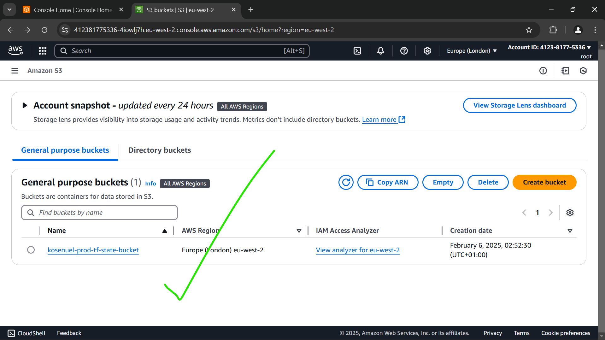
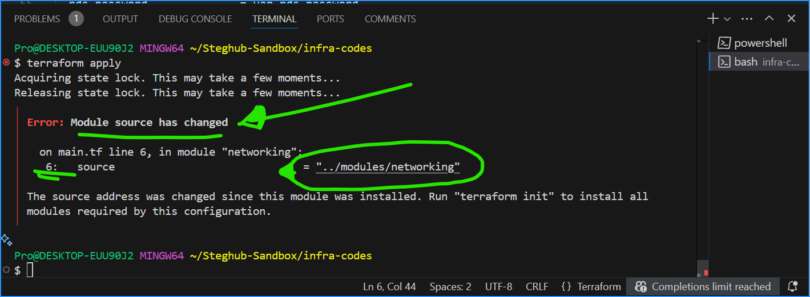

# Automating AWS Infrastructure with Terraform – Part 3: Advanced Backend Configuration & Code Refactoring

Welcome to **Part 3** of our Infrastructure as Code (IaC) journey using Terraform! Here, we will be building upon the foundational knowledge from [Part 2](../17.(Iac)_Automating_Infrastructure_Using_Terraform_Part_2/README.md), now we will be going through advanced Terraform configurations, including setting up remote backends, refactoring code with dynamic blocks and modules, and implementing best practices for security and cost optimization.

> **Our Objectives are to:** Enhance our Terraform setup by:
> - Centralizing state management using AWS S3 and DynamoDB.
> - Refactoring Terraform code for scalability and maintainability.
> - Implementing security and cost optimization best practices.
> - Troubleshooting common issues encountered during infrastructure deployment.

---

## Table of Contents

1. [Prerequisites](#prerequisites)
2. [Terraform Backends](#terraform-backends)
   - [S3 Backend for Remote State Storage](#s3-backend-for-remote-state-storage)
   - [DynamoDB for State Locking](#dynamodb-for-state-locking)
3. [Refactoring Terraform Code](#refactoring-terraform-code)
   - [Dynamic Blocks for Security Groups](#dynamic-blocks-for-security-groups)
   - [Maps and Lookup Functions for AMI Selection](#maps-and-lookup-functions-for-ami-selection)
4. [Conditional Expressions in Terraform](#conditional-expressions-in-terraform)
5. [Terraform Modules](#terraform-modules)
   - [Creating and Using Modules](#creating-and-using-modules)
   - [Best Practices for Module Development](#best-practices-for-module-development)
6. [Security Considerations](#security-considerations)
7. [Cost Optimization Strategies](#cost-optimization-strategies)
8. [Troubleshooting & Common Issues](#troubleshooting--common-issues)
9. [Conclusion and Best Practices](#conclusion-and-best-practices)
10. [Appendix: Useful Commands](#appendix-useful-commands)

---

## Prerequisites

Before we begin this project, if you are following along, ensure you have done the following:

- **Completed [Part 2](../17.(Iac)_Automating_Infrastructure_Using_Terraform_Part_2/README.md):** Familiarity with basic Terraform configurations and AWS services.
- **Have The Required Tools:**
  - **Terraform:** Version 1.0 or later.
  - **AWS CLI:** Version 2 or later.
  - **Git:** Latest version for version control.
  - **Code Editor:** VS Code or equivalent.
- **Have an Active AWS Account:** With administrative access to create and manage resources.
- **Have at Least a Basic Knowledge of AWS Services:** VPC, Subnets, EC2, RDS, EFS, IAM, etc.

> 💡**Tip:** You can verify your tool versions by running `terraform version`, `aws --version`, and `git --version` in your terminal.

---

## Terraform Backends

Terraform backends determine how state is loaded and how operations are performed. By default, Terraform uses a local backend, but for team environments and enhanced security, it's recommended to use remote backends like AWS S3 combined with DynamoDB for state locking.

### S3 Backend for Remote State Storage

Storing your Terraform state in an AWS S3 bucket offers several advantages such as:

- **Durability & Availability:** State files are stored redundantly across multiple AZs.
- **Collaboration:** Multiple team members can access and manage the same state.
- **Versioning:** Track changes over time and revert if necessary.
- **Security:** Encrypt state files to protect sensitive data.

**Configuring an S3 Bucket and Enabling Versioning & Encryption**
Create a file named `backend.tf` and add the following code:`

````hcl
# AWS S3 Bucket for storing Terraform state
resource "aws_s3_bucket" "terraform_state" {
  bucket         = "kosenuel-prod-tf-state-bucket"  # ❗ Ensure that your bucket name is globally unique.
  acl            = "private"
  force_destroy  = true

  tags = merge(
    var.tags,
    {
      Name = "TerraformStateBucket"
    }
  )
}

# Enable versioning on the S3 bucket
resource "aws_s3_bucket_versioning" "state_versioning" {
  bucket = aws_s3_bucket.terraform_state.id

  versioning_configuration {
    status = "Enabled"
  }
}

# Enforce server-side encryption for the S3 bucket
resource "aws_s3_bucket_server_side_encryption_configuration" "state_encryption" {
  bucket = aws_s3_bucket.terraform_state.id

  rule {
    apply_server_side_encryption_by_default {
      sse_algorithm = "AES256"
    }
  }
}
````
  
> 💡**Tip:** Always enable versioning and encryption on your S3 bucket to help you ensure state file integrity and security.



*Fig: AWS S3 Bucket with Versioning and Encryption Enabled*

### DynamoDB for State Locking

To prevent concurrent Terraform operations that could corrupt the state file, we use DynamoDB for state locking.

**Setting Up DynamoDB Table for State Locking**

Create a file named `dynamodb.tf` and add the following code:
````hcl
# DynamoDB Table for Terraform state locking
resource "aws_dynamodb_table" "terraform_locks" {
  name         = "terraform-locks"
  billing_mode = "PAY_PER_REQUEST"
  hash_key     = "LockID"

  attribute {
    name = "LockID"
    type = "S"
  }

  tags = merge(
    var.tags,
    {
      Name = "TerraformLocksTable"
    }
  )
}
````
  


*Fig: DynamoDB Table for Terraform Locking*

### Configuring the Remote Backend Block

After provisioning the S3 bucket and DynamoDB table, update your Terraform configuration to use the remote backend.

**Add the Remote Backend Configuration**

In your `backend.tf` file, add the following code to configure the remote backend:
```hcl
terraform {
    backend "s3" {
        bucket         = "kosenuel-prod-tf-state-bucket"
        key            = "global/s3/terraform.tfstate"
        region         = "eu-west-2"
        dynamodb_table = "terraform-locks"
        encrypt        = "true"
    }
}
```
  
> **Important:** After updating the backend block, run `terraform init` to reinitialize the backend. Confirm any prompts by typing `yes`, then run `terraform plan` to review your changes and `terraform apply` to apply the changes. After the changes are applied run `terraform init` again to reinitialize the backend.


*Fig: Terraform Initialization Showing Backend Configuration*

---

## Refactoring Terraform Code

As your infrastructure grows, maintaining a well-organized Terraform codebase becomes essential. Refactoring enhances readability, maintainability, and scalability.

### Dynamic Blocks for Security Groups

Security groups often have repetitive ingress and egress rules. Dynamic blocks helps you to define these rules programmatically, thereby, reducing code duplication.

**Now We Refactor Our Inbounds and Outbounds Rules in Our Security Groups Using Dynamic Blocks**

````hcl
# Path: modules/security/security_groups.tf

# Create Kms key
resource "aws_kms_key" "project-kms" {
    description     = "KMS key for EFS"
    key_usage       = "ENCRYPT_DECRYPT"
}

# Security group for external ALB
resource "aws_security_group" "ext-alb-sg"{
    name            = "ext-alb-sg"
    vpc_id          = var.vpc_id
    description     = "Allow HTTP/HTTPS/SSH inbound traffic"
    
    dynamic "ingress" {
        for_each = var.sg_rules["ext-alb-sg"]
        content {
            description = ingress.value.description
            from_port   = ingress.value.from_port
            to_port     = ingress.value.to_port
            protocol    = ingress.value.protocol
            cidr_blocks = ingress.value.cidr_blocks
        }
    }
    
    egress {
        description = "Allow all traffic"
        from_port   = 0
        to_port     = 0
        protocol    = "-1"
        cidr_blocks = ["0.0.0.0/0"]
    }

    tags = merge(
        var.tags,
        {
            Name = "ext-alb-sg"
        }
    )

}

# Security group for Bastion Host
resource "aws_security_group" "bastion-sg"{
    name            = "bastion-sg"
    vpc_id          = var.vpc_id
    description     = "Security group for Bastion Host"

    dynamic "ingress" {
        for_each = var.sg_rules["bastion-sg"]
        content {
            description = ingress.value.description
            from_port   = ingress.value.from_port
            to_port     = ingress.value.to_port
            protocol    = ingress.value.protocol
            cidr_blocks = ingress.value.cidr_blocks
        }
    }

    egress {
        description = "Allow all traffic"
        from_port   = 0
        to_port     = 0
        protocol    = "-1"
        cidr_blocks = ["0.0.0.0/0"]
    }

    tags = merge(
        var.tags,
        {
            Name = "bastion-sg"
        }
    )

}

# Security group for Nginx EC2 instances
resource "aws_security_group" "nginx-sg"{
    name            = "nginx-sg"
    vpc_id          = var.vpc_id

    egress {
        description = "Allow all traffic"
        from_port   = 0
        to_port     = 0
        protocol    = "-1"
        cidr_blocks = ["0.0.0.0/0"]
    }

    tags = merge(
        var.tags,
        {
            Name = "nginx-sg"
        }
    )
}

# Security group rules for Nginx EC2 instances
resource "aws_security_group_rule" "inbound-nginx-https" {
    type              = "ingress"
    from_port         = 443
    to_port           = 443
    protocol          = "tcp"
    source_security_group_id = aws_security_group.ext-alb-sg.id # Allow traffic from external ALB security group
    security_group_id = aws_security_group.nginx-sg.id
}

resource "aws_security_group_rule" "inbound-bastion-ssh" {
    type              = "ingress"
    from_port         = 22
    to_port           = 22
    protocol          = "tcp"
    source_security_group_id = aws_security_group.bastion-sg.id # Allow traffic from Bastion Host security group 
    security_group_id = aws_security_group.nginx-sg.id
}

# Security group for Internal ALB 
resource "aws_security_group" "int-alb-sg"{
    name              = "int-alb-sg"
    vpc_id            = var.vpc_id

    egress {
        from_port     = 0
        to_port       = 0
        protocol      = "-1"
        cidr_blocks   = ["0.0.0.0/0"]
    }

    tags = merge(
        var.tags,
        {
            Name = "int-alb-sg"
        }
    )
}

# Security group rules for Internal ALB
resource "aws_security_group_rule" "inbound-ialb-https"{
    description        = "Allow HTTPS traffic from nginx security group"
    type               = "ingress"
    from_port          = 443
    to_port            = 443
    protocol           = "tcp"
    source_security_group_id = aws_security_group.nginx-sg.id # Allow traffic from Nginx security group 
    security_group_id  = aws_security_group.int-alb-sg.id
}

resource "aws_security_group_rule" "inbound-ialb-http"{
    description        = "Allow  traffic from nginx security group"
    type               = "ingress"
    from_port          = 80
    to_port            = 80
    protocol           = "tcp"
    source_security_group_id = aws_security_group.nginx-sg.id # Allow traffic from Nginx security group 
    security_group_id  = aws_security_group.int-alb-sg.id
}

# Security group for Webserver EC2 instances
resource "aws_security_group" "webserver-sg"{
    name               = "webserver-sg"
    vpc_id             = var.vpc_id

    egress {
        description    = "Allow all traffic"
        from_port      = 0
        to_port        = 0
        protocol       = "-1"
        cidr_blocks    = ["0.0.0.0/0"]
    }
}

# Security group rules for Webserver EC2 instances
resource "aws_security_group_rule" "inbound-web-https" {
    description        = "Allow HTTPS traffic from Internal ALB" 
    type               = "ingress"
    from_port          = 443
    to_port            = 443
    protocol           = "tcp"
    source_security_group_id = aws_security_group.int-alb-sg.id # Allow traffic from Internal ALB security group 
    security_group_id  = aws_security_group.webserver-sg.id
}

resource "aws_security_group_rule" "inbound-web-http" {
    description        = "Allow HTTP traffic from bastion Security group for testing purposes" 
    type               = "ingress"
    from_port          = 80
    to_port            = 80
    protocol           = "tcp"
    source_security_group_id = aws_security_group.bastion-sg.id # Allow Http traffic from Bastion security group 
    security_group_id  = aws_security_group.webserver-sg.id
}

resource "aws_security_group_rule" "inbound-web-http-intAlb" {
    description        = "Allow HTTP traffic from Internal application load balancer Security group" 
    type               = "ingress"
    from_port          = 80
    to_port            = 80
    protocol           = "tcp"
    source_security_group_id = aws_security_group.int-alb-sg.id # Allow Http traffic from Bastion security group 
    security_group_id  = aws_security_group.webserver-sg.id
}

resource "aws_security_group_rule" "inbound-web-ssh" {
    description        = "Allow SSH traffic from Bastion Host"
    type               = "ingress"
    from_port          = 22
    to_port            = 22
    protocol           = "tcp"
    source_security_group_id = aws_security_group.bastion-sg.id # Allow traffic from Bastion Host security group
    security_group_id  = aws_security_group.webserver-sg.id
}

# Security group for Data Layer
resource "aws_security_group" "datalayer-sg" {
    name                = "datalayer-sg"
    vpc_id              = var.vpc_id

    egress {
        from_port       = 0
        to_port         = 0
        protocol        = "-1"
        cidr_blocks     = ["0.0.0.0/0"]
    }

    tags = merge(
        var.tags,
        {
            Name        = "datalayer-sg"
        }
    )
}

# Security Group Rules for Data Layer Security Group
resource "aws_security_group_rule" "inbound-nfs-port" {
    description          = "Allow NFS traffic from Webserver" 
    type                 = "ingress"
    from_port            = 2049
    to_port              = 2049
    protocol             = "tcp"
    source_security_group_id = aws_security_group.webserver-sg.id # Allow traffic from webserver security group 
    security_group_id    = aws_security_group.datalayer-sg.id
}

resource "aws_security_group_rule" "inbound-mysql-bastion" {
    description          = "Allow MySQL traffic from Bastion Host"
    type                 = "ingress"
    from_port            = 3306
    to_port              = 3306
    protocol             = "tcp"
    source_security_group_id = aws_security_group.bastion-sg.id # Allow traffic from Bastion Host security group
    security_group_id    = aws_security_group.datalayer-sg.id
}

resource "aws_security_group_rule" "inbound-mysql-webserver" {
    description          = "Allow MySQL traffic from Webserver"
    type                 = "ingress"
    from_port            = 3306
    to_port              = 3306
    protocol             = "tcp"
    source_security_group_id = aws_security_group.webserver-sg.id # Allow traffic from Webserver security group 
    security_group_id    = aws_security_group.datalayer-sg.id
}
 
````
  
**variables.tf: Defining Security Group Rules and other variables (below)**

````hcl
# Path: modules/security/variables.tf
variable "sg_rules" {
    description         = "Map of security group rules"
     type = map(list(object({
        description              = string
        from_port                = number
        to_port                  = number
        protocol                 = string
        cidr_blocks              = optional(list(string))
        source_security_group_id = optional(string)
    })))
}

variable "tags" {
    description = "Tags to be assigned to resources"
    type        = map(string)
}

variable "domain_name" {
    description = "This is the domain name that would be used in the ACM cetificate"
    type        = string
}

variable "ext-alb-dns_name" {
    description = "DNS name of the external application load balancer"
    type        = string
}

variable "ext-alb-zone_id" {
    description = "Zone ID of the external application load balancer"
    type        = string
}

variable "vpc_id" {
    description = "ID of the VPC where the security groups would be created in"
    type        = string
}
````
  
> **Making sense of Dynamic Blocks:** Dynamic blocks are just like factories/companies that can help you produce gadgets of varying specifications, and it ensures consistency and efficiency while at it without manual repetition.


### Maps and Lookup Functions for AMI Selection

Different AWS regions have different AMIs. We can use the maps and the `lookup` function to assist us with the dynamic selection of the appropriate AMI based on the region.

**Code Example: Dynamic AMI Selection**

````hcl:
# Path: modules/compute/variables.tf

variable "images" {
  description = "Map of region to AMI IDs"
  type        = map(string)
  default = { 
    "us-east-1" = "ami-0c55b159cbfafe1f0"
    "us-west-2" = "ami-0d5d9d301c853a04a"
    # You can add more regions and AMIs as you want/please
  }
}

variable "region" {
  description = "AWS region"
  type        = string
  default     = "us-east-1"
}
````
  
````hcl
# Path: modules/compute/launch_templates.tf, ec2-instance.tf, etc...

# Create Nginx Launch Template
resource "aws_launch_template" "nginx-launch-template" {
    name                    = "nginx-launch-template"
    image_id                = lookup(var.images, var.region, "ami-0aa938b5c246ef111")
    instance_type           = var.instance_type
    vpc_security_group_ids  = [var.webserver-sg_id]
    key_name                = var.key_name

    iam_instance_profile {
        name = var.iam-instance-profile_name
    }

    placement {
        availability_zone = random_shuffle.az_list.result[0]
    }

    lifecycle {
        create_before_destroy = true
    }

    tag_specifications {
        resource_type = "instance"
        tags = merge(
            var.tags,
            {
                Name = "nginx-launch-template"
            }
        )
    }

    user_data = base64encode(local.nginx_userdata)
}
````
  
> 💡 **Tip:** When/If you provide a default AMI in the `lookup` function, it helps you to ensure that Terraform doesn't fail if a region key is missing.


---

## Conditional Expressions in Terraform

Conditional expressions helps you to create resources based on specific conditions, similar to "if-else" statements in programming languages.

**Code Example: Conditionally Creating a Read Replica**

```hcl
# Path: modules/networking/subnets.tf

# Dynamically Create Public Subnets
resource "aws_subnet" "public" {
  count                   = var.preferred_number_of_public_subnets == null ? length(data.aws_availability_zones.available.names) : var.preferred_number_of_public_subnets
  vpc_id                  = aws_vpc.main.id
  cidr_block              = cidrsubnet(var.vpc_cidr, 4, count.index + 4) # We added `+4` to the index to avoid overlapping with the private subnets CIDR blocks 
  map_public_ip_on_launch = true
  availability_zone       = data.aws_availability_zones.available.names[count.index]

  tags = merge(
    var.tags,
    {
      Name = format("Public-Subnet-%s", count.index + 1)

    }
  )
}
```
  
> 💡**Insight:** Conditional expressions are one quick way to handle resource creation dynamically, they help you ensure that your resources are only provisioned when necessary.


---

## Terraform Modules

Modules are reusable, self-contained packages of Terraform configurations. They help youpromote code reusability, maintainability, and separation of concerns.

### Creating and Using Modules

**Our Current Directory Structure:**

````bash
Infra-codes/
.
|-- backend
|   |-- dynamo.tf
|   |-- s3-bucket-matter.tf
|   |-- terraform.tfstate
|   `-- variable.tf
|-- modules
|   |-- compute
|   |   |-- asg-wordpress-tooling.tf
|   |   |-- ec2-instance.tf
|   |   |-- launch-templates.tf
|   |   |-- outputs.tf
|   |   |-- scripts
|   |   |   |-- nginx.sh
|   |   |   |-- tooling.sh
|   |   |   `-- wordpress.sh
|   |   `-- variables.tf
|   |-- load-balancers
|   |   |-- loadbalancers.tf
|   |   |-- outputs.tf
|   |   |-- target-groups.tf
|   |   `-- variables.tf
|   |-- networking
|   |   |-- internet_gateway.tf
|   |   |-- natgateway.tf
|   |   |-- outputs.tf
|   |   |-- route_tables.tf
|   |   |-- subnets.tf
|   |   |-- variables.tf
|   |   `-- vpc.tf
|   |-- security
|   |   |-- certs.tf
|   |   |-- outputs.tf
|   |   |-- roles-and-policy.tf
|   |   |-- security_groups.tf
|   |   |-- variables-backuptfbak
|   |   `-- variables.tf
|   `-- storage
|       |-- efs.tf
|       |-- outputs.tf
|       |-- rds.tf
|       `-- variables.tf
|-- backend.tf
|-- main.tf
|-- terraform.tfstate.backup
|-- terraform.tfvars
`-- variables.tf


````
  
**Importing a Module in Root Configuration**

````hcl
# Path: main.tf
# Here, we call all them modules we have configured/created to our main terraform configuration file
provider "aws" {
  region = var.region
}

module "networking" {
  source                              = "./modules/networking"
  tags                                = var.tags
  preferred_number_of_private_subnets = var.preferred_number_of_private_subnets
  preferred_number_of_public_subnets  = var.preferred_number_of_public_subnets
  vpc_cidr                            = var.vpc_cidr
  enable_dns_hostnames                = var.enable_dns_hostnames
  enable_dns_support                  = var.enable_dns_support
}

module "security" {
  source           = "./modules/security"
  tags             = var.tags
  domain_name      = var.domain_name
  sg_rules         = var.sg_rules
  ext-alb-dns_name = module.load_balancers.ext-alb-dns_name
  ext-alb-zone_id  = module.load_balancers.ext-alb-zone_id
  vpc_id           = module.networking.vpc_id
}

module "load_balancers" {
  source          = "./modules/load-balancers"
  tags            = var.tags
  domain_name     = var.domain_name
  ext-alb-sg_id   = module.security.ext-alb-sg_id
  int-alb-sg_id   = module.security.int-alb-sg_id
  public_subnets  = module.networking.public_subnets
  private_subnets = module.networking.private_subnets
  cert_arn        = module.security.cert_arn
  vpc_id          = module.networking.vpc_id
}

module "storage" {
  source          = "./modules/storage"
  tags            = var.tags
  rds_user        = var.rds_user
  rds_password    = var.rds_password
  kms-key_arn     = module.security.kms-key_arn
  private_subnets = module.networking.private_subnets
  datalayer-sg_id = module.security.datalayer-sg_id
}

module "compute" {
  source                    = "./modules/compute"
  tags                      = var.tags
  region                    = var.region
  instance_type             = var.instance_type
  key_name                  = var.key_name
  domain_name               = var.domain_name
  rds_user                  = var.rds_user
  rds_password              = var.rds_password
  db_user                   = var.db_user
  db_password               = var.db_password
  wordpress-tgt_arn         = module.load_balancers.wordpress-tgt_arn
  nginx-tgt_arn             = module.load_balancers.nginx-tgt_arn
  tooling-tgt_arn           = module.load_balancers.tooling-tgt_arn
  public_subnets            = module.networking.public_subnets
  private_subnets           = module.networking.private_subnets
  bastion-sg_id             = module.security.bastion-sg_id
  webserver-sg_id           = module.security.webserver-sg_id
  efs_id                    = module.storage.efs_id
  wordpress_ap              = module.storage.wordpress_ap
  tooling_ap                = module.storage.tooling_ap
  rds_endpoint              = module.storage.rds_endpoint
  iam-instance-profile_name = module.security.iam-instance-profile_name
  int-alb-dns_name          = module.load_balancers.int-alb-dns_name
}
````
  


### Best Practices for Module Development

- **Single Responsibility:** Each module should manage a single concern (e.g., networking, compute).
- **Version Control:** Tag module versions and reference them to ensure consistency.
- **Input Validation:** Use variables with clear descriptions and default values where applicable. Also, this is where you consume the variables and values that the root or calling module passes to the module.
- **Output Management:** Clearly define outputs for modules to expose necessary information to root configurations.

> 💡**Very very important concept illustration:** Modularizing your Terraform codebase is similar to organizing a shelf of goods, where  you package each item (files) into a carton (module) before packing them on the shelf to ship them to a customer.


I have attached my terraform codebase for you to review and understand what I did here (refactoring) in great details. This is because, If I decide to explain every thing here, it will make this document uncessarily long and bulky.

---

## Security Considerations

Our responsibility as DevOps Engineers in an organization regarding the security of our infrastructure is paramount. This section covers best practices for securing each component configured with Terraform.

### Encryption

- **S3 Buckets:** Enable server-side encryption to protect state files.
- **EBS Volumes:** Encrypt EBS volumes to secure data at rest.
- **RDS Instances:** Enable encryption for RDS to protect database storage.

**Code Example: Enabling Encryption on RDS**

````hcl
# Path: modules/storage/rds.tf

# Create RDS Instance
resource "aws_db_instance" "project-rds" {
    allocated_storage      = 20
    storage_type           = "gp3"
    engine                 = "mysql"
    engine_version         = "8.0.35"
    instance_class         = "db.t3.micro"
    db_name                = "projectdb"
    username               = var.rds_user
    password               = var.rds_password
    parameter_group_name   = "default.mysql8.0"
    db_subnet_group_name   = aws_db_subnet_group.project-rds.name
    skip_final_snapshot    = true
    multi_az               = false
    vpc_security_group_ids = [var.datalayer-sg_id]
    
  storage_encrypted = true  # ❗ Enable encryption

    tags = merge(
        var.tags,
        {
            Name = "project-rds"
        }
    )

}
````
  
> 💡**Security Tip:** Always avoid hardcoding sensitive information like database credentials. Use **Terraform variables** and **AWS Secrets Manager** for managing secrets securely.

### IAM Best Practices

- **Least Privilege:** Grant only the permissions necessary for each role.
- **Avoid Hardcoded Credentials:** Use IAM roles instead of embedding access keys in code.
- **Regular Audits:** Periodically review IAM policies and roles for unnecessary privileges.

**Code Example: Defining an IAM Role with Limited Permissions**

````hcl:modules/security/iam_roles.tf
# Path: modules/security/iam_roles.tf

resource "aws_iam_role" "ec2_instance_role" {
  name = "ec2_instance_role"

  assume_role_policy = jsonencode({
    Version = "2012-10-17"
    Statement = [
      {
        Action    = "sts:AssumeRole"
        Effect    = "Allow"
        Principal = {
          Service = "ec2.amazonaws.com"
        }
      }
    ]
  })

  tags = merge(var.tags, { Name = "EC2InstanceRole" })
}

resource "aws_iam_policy" "ec2_policy" {
  name        = "ec2_instance_policy"
  description = "Policy to allow EC2 instances to describe and manage specific resources"

  policy = jsonencode({
    Version = "2012-10-17"
    Statement = [
      {
        Effect   = "Allow"
        Action   = [
          "ec2:Describe*",
          "s3:GetObject"
        ]
        Resource = "*"
      }
    ]
  })

  tags = merge(var.tags, { Name = "EC2InstancePolicy" })
}

resource "aws_iam_role_policy_attachment" "attach_ec2_policy" {
  role       = aws_iam_role.ec2_instance_role.name
  policy_arn = aws_iam_policy.ec2_policy.arn
}
````
  
> **Best Practice:** Attach policies to roles rather than individual users to manage permissions more effectively.

### Network Security

- **Security Groups:** Restrict inbound and outbound traffic strictly to necessary ports and sources.
- **NACLs:** Implement Network Access Control Lists for an additional layer of security.
- **Private Subnets:** Deploy sensitive resources in private subnets to limit public exposure.

**Code Example: Configuring Security Groups with Limited Ingress Rules**

````hcl:modules/security/security_groups.tf
# Path: modules/security/security_groups.tf

resource "aws_security_group" "datalayer_sg" {
  name        = "datalayer-sg"
  vpc_id      = module.network.vpc_id
  description = "Security group for data layer resources"

  ingress {
    description = "Allow MySQL inbound traffic from ALB"
    from_port   = 3306
    to_port     = 3306
    protocol    = "tcp"
    cidr_blocks = [module.network.private_subnets_cidr]
  }

  ingress {
    description = "Allow EFS inbound traffic from EC2"
    from_port   = 2049
    to_port     = 2049
    protocol    = "tcp"
    cidr_blocks = [module.network.private_subnets_cidr]
  }

  egress {
    from_port   = 0
    to_port     = 0
    protocol    = "-1"
    cidr_blocks = ["0.0.0.0/0"]
  }

  tags = merge(var.tags, { Name = "DataLayerSG" })
}
````
  
> 💡**Important:** Always define minimal ingress and egress rules necessary for your applications to function. Regularly review and update these rules to adapt to changing requirements.

### Data Protection Strategies

- **Backups:** Regularly backup critical data and configurations.
- **Logging & Monitoring:** Implement comprehensive logging and monitoring to detect and respond to incidents.
- **Data Encryption:** Encrypt data both at rest and in transit to protect against unauthorized access.

**Code Example: Enabling RDS Automated Backups**

````hcl:modules/database/main.tf
# Path: modules/database/main.tf

resource "aws_db_instance" "primary" {
  # ...existing configurations...

  backup_retention_period = 7  # ❗ Enable automated backups
  backup_window           = "03:00-04:00"

  tags = merge(var.tags, { Name = "PrimaryRDSInstance" })
}
````
  
> **Security Tip:** Always enable automated backups for databases to ensure data recoverability in case of failures.

---

## Cost Optimization Strategies

Optimizing costs is crucial to ensure efficient use of resources without compromising performance or scalability. These are some strategies to consider:

### Lifecycle Policies for S3

Implement lifecycle rules to transition or delete objects automatically, thus reducing storage costs.

**Code Example: S3 Lifecycle Policy**

````hcl
# Path: ./backend.tf

resource "aws_s3_bucket_lifecycle_configuration" "state_lifecycle" {
  bucket = aws_s3_bucket.terraform_state.id

rule {
    id     = "ExpireOldVersions"
    status = "Enabled"

    noncurrent_version_expiration {
      noncurrent_days = 30  # ❗ Automatically expire non-current versions after 30 days
    }
  }
}
````
  
> **Tip:** Adjust the `noncurrent_days` parameter based on your organization's retention policies.


### Using Spot Instances for Non-Critical Workloads

Spot instances can significantly reduce compute costs. Use them for development, testing, or other non-critical environments.

**Code Example: Launching Spot Instances in Auto Scaling Groups**

````hcl
# Path: modules/compute/asg-wordpress-tooling.tf

resource "aws_autoscaling_group" "web_asg" {
  launch_template {
    id      = aws_launch_template.web_lt.id
    version = "$Latest"
  }

  min_size            = 1
  max_size            = 3
  desired_capacity    = 1
  vpc_zone_identifier = module.network.private_subnets

  mixed_instances_policy {
    instances_distribution {
      spot_allocation_strategy = "prioritized"
      spot_instance_pools     = 2
      spot_max_price          = 0.05  # ❗ Set a maximum price you're willing to pay for spot instances
    }

    launch_template {
      launch_template_specification {
        id      = aws_launch_template.web_lt.id
        version = "$Latest"
      }

      override {
        instance_type = "t2.micro"
      }

      override {
        instance_type = "t3.micro"
      }
    }
  }

  tags = merge(var.tags, { Name = "WebASG" })
}
````
  
> **Cost Saving Tip:** Regularly review and adjust spot bidding strategies to optimize costs without affecting availability.

### Scaling Strategies to Minimize Unnecessary Resource Consumption

Implement auto-scaling policies based on demand to ensure you're only using the necessary resources.

**Code Example: Auto Scaling Policies Based on CPU Utilization**

````hcl
# Path: modules/compute/asg-wordpress-tooling.tf

resource "aws_autoscaling_policy" "scale_up" {
  name                   = "scale-up-policy"
  scaling_adjustment     = 1
  adjustment_type        = "ChangeInCapacity"
  cooldown               = 300
  autoscaling_group_name = aws_autoscaling_group.web_asg.name
}

resource "aws_autoscaling_policy" "scale_down" {
  name                   = "scale-down-policy"
  scaling_adjustment     = -1
  adjustment_type        = "ChangeInCapacity"
  cooldown               = 300
  autoscaling_group_name = aws_autoscaling_group.web_asg.name
}

resource "aws_cloudwatch_metric_alarm" "cpu_high" {
  alarm_name          = "cpu-high-alarm"
  comparison_operator = "GreaterThanOrEqualToThreshold"
  evaluation_periods  = 2
  metric_name         = "CPUUtilization"
  namespace           = "AWS/EC2"
  period              = 120
  statistic           = "Average"
  threshold           = 70

  dimensions = {
    AutoScalingGroupName = aws_autoscaling_group.web_asg.name
  }

  alarm_actions = [aws_autoscaling_policy.scale_up.arn]

  tags = merge(var.tags, { Name = "CPUHighAlarm" })
}

resource "aws_cloudwatch_metric_alarm" "cpu_low" {
  alarm_name          = "cpu-low-alarm"
  comparison_operator = "LessThanOrEqualToThreshold"
  evaluation_periods  = 2
  metric_name         = "CPUUtilization"
  namespace           = "AWS/EC2"
  period              = 120
  statistic           = "Average"
  threshold           = 30

  dimensions = {
    AutoScalingGroupName = aws_autoscaling_group.web_asg.name
  }

  alarm_actions = [aws_autoscaling_policy.scale_down.arn]

  tags = merge(var.tags, { Name = "CPULowAlarm" })
}
````
  
> 💡**Scaling Tip:** Fine-tune the `threshold` and `evaluation_periods` based on application performance and load patterns to optimize scaling actions.

---

## Troubleshooting & Common Issues

Deploying infrastructure with Terraform can sometimes lead to challenges. This ssection is a dedicated troubleshooting section to help you resolve common issues encountered during the setup.

### 1. Backend Initialization Errors

**Problem:** Errors occur during `terraform init` after configuring the remote backend.

**Cause:** 
- The S3 bucket or DynamoDB table specified does not exist.
- Incorrect IAM permissions preventing Terraform from accessing the S3 bucket or DynamoDB table.
- The S3 bucket name is not globally unique.

**Solution:**
1. **Verify Resource Existence:**
   - Ensure that the S3 bucket and DynamoDB table have been created successfully.
   - Use the AWS Console or AWS CLI to confirm their existence.

2. **Check IAM Permissions:**
   - Ensure that the IAM user or role running Terraform has `s3:*` permissions for the state bucket and `dynamodb:*` for the locking table.
   - Example IAM policy snippet:
   
   ````json
   {
     "Version": "2012-10-17",
     "Statement": [
       {
         "Effect": "Allow",
         "Action": [
           "s3:ListBucket",
           "s3:GetObject",
           "s3:PutObject"
         ],
         "Resource": [
           "arn:aws:s3:::your-unique-terraform-state-bucket",
           "arn:aws:s3:::your-unique-terraform-state-bucket/*"
         ]
       },
       {
         "Effect": "Allow",
         "Action": [
           "dynamodb:DescribeTable",
           "dynamodb:GetItem",
           "dynamodb:PutItem",
           "dynamodb:DeleteItem"
         ],
         "Resource": "arn:aws:dynamodb:us-east-1:123456789012:table/terraform-locks"
       }
     ]
   }
   ````
   
3. **Ensure Bucket Name Uniqueness:**
   - S3 bucket names must be globally unique. Verify that your bucket name doesn't already exist by trying to create it manually via the AWS Console.


### 2. State Locking Problems

**Problem:** Terraform reports that the state is locked, preventing further operations.

**Cause:** 
- Previous Terraform operation didn't release the lock due to an unexpected interruption.
- Simultaneous Terraform operations are trying to modify the state.

**Solution:**
1. **Check DynamoDB Table:**
   - Go to the DynamoDB table (`terraform-locks`) and look for any active lock entries.
   
2. **Remove Stale Locks:**
   - If a lock appears stuck, manually delete the corresponding item in the DynamoDB table.
   - Or go on your cli run `terraform force-unlock <put in the lock id of the lock you want to unlock>`
   - After running the above step, you might still be required to reconfigure the digest value of the lock, in the cli  you would see the calculated md5 has of the lock and the current conflicting md5 hash, you have to copy the calculated hash value and paste it in the digest value of the lock in the aws console.
3. **Avoid Concurrent Operations:**
   - Ensure that only one Terraform operation (e.g., `apply`, `destroy`) is running at a time within the team.


### 3. Module Reference Issues

**Problem:** Modules do not load, or variables/outputs are missing, causing Terraform to fail.

**Cause:** 
- Incorrect module source paths.
- Missing or mismatched variables and outputs.
- Syntax errors within module files.

**Solution:**
1. **Verify Module Paths:**
   - Ensure that the `source` attribute in module blocks correctly points to the module directory.

2. **Check Variables and Outputs:**
   - Confirm that all required variables are defined in `variables.tf` within the module.
   - Ensure that the root module is passing necessary variables to child modules.

3. **Validate Syntax:**
   - Run `terraform fmt` and `terraform validate` to check for syntax errors.

4. **Consistent Naming:**
   - Ensure that variable names and output references match between modules and the root configuration.



### 4. Security Group Misconfigurations

**Problem:** Instances cannot communicate as expected due to incorrect security group rules.

**Cause:** 
- Missing or incorrect ingress/egress rules.
- Overly restrictive CIDR blocks.
- Incorrect security group associations.

**Solution:**
1. **Audit Security Group Rules:**
   - Use the AWS Console or AWS CLI to review the rules associated with the affected security groups.
   
2. **Update Rules as Needed:**
   - Add or modify rules to allow necessary traffic (e.g., HTTP, HTTPS, SSH).
   
3. **Ensure Correct Associations:**
   - Verify that security groups are correctly attached to the intended instances or load balancers.


---

## Conclusion and Best Practices

Congratulations! You have finally successfully boosted/improved your Terraform setup by implementing remote state management, refactoring your codebase with dynamic blocks and modules, and adhering to security and cost optimization best practices. Find below a summary of "take-aways" from this project:

| **Best Practice**                         | **Description**                                                                         |
|-------------------------------------------|-----------------------------------------------------------------------------------------|
| **Remote State Storage**                  | Use AWS S3 (with versioning and encryption) to securely store Terraform state files.    |
| **State Locking**                         | Utilize DynamoDB to prevent concurrent Terraform operations that could corrupt the state.|
| **Code Organization with Modules**        | Break down Terraform configurations into reusable modules for better maintainability.    |
| **Dynamic and Conditional Logic**         | Implement dynamic blocks and conditional expressions to reduce code duplication.         |
| **Security Enhancements**                 | Apply IAM best practices, encrypt data, and secure network configurations.              |
| **Cost Optimization**                     | Implement lifecycle policies, use spot instances for non-critical workloads, and scale efficiently.|
| **Regular Validation and Formatting**     | Use `terraform validate` and `terraform fmt` to ensure code quality and consistency.    |

> 💡 **Final Note:** When it comes to infrastructure management, consistency, combined with adherence to best practices would greatly help you in ensuring scalable, secure, and cost-effective deployments. 


---

## Appendix: Useful Commands

Some of the essential Terraform commands to manage your infrastructure effectively:

````bash
# Initialize Terraform and configure the backend
terraform init

# Validate the Terraform configuration files
terraform validate

# Format the Terraform files for consistency
terraform fmt

# Preview the changes Terraform will make to your infrastructure
terraform plan

# Apply the Terraform configuration to create/update infrastructure
terraform apply

# Destroy the Terraform-managed infrastructure
terraform destroy

# List all resources in the Terraform state
terraform state list

# Show details about a specific resource in the state
terraform state show <resource_address>

# Import existing infrastructure into Terraform state
terraform import <resource_address> <resource_id>
````
  
> 💡**Tip:** Regularly use `terraform init` after you have made any backend changes, so that you can be sure that your backend is properly configured. Also, run `terraform plan` before `terraform apply` so that you can review your changes and avoid unintended modifications.

---

## References

- [Terraform Documentation](https://developer.hashicorp.com/terraform/docs)
- [AWS Terraform Provider](https://registry.terraform.io/providers/hashicorp/aws/latest/docs)
- [AWS Best Practices](https://aws.amazon.com/architecture/well-architected/)
- [Terraform Modules Registry](https://registry.terraform.io/browse/modules)

---
