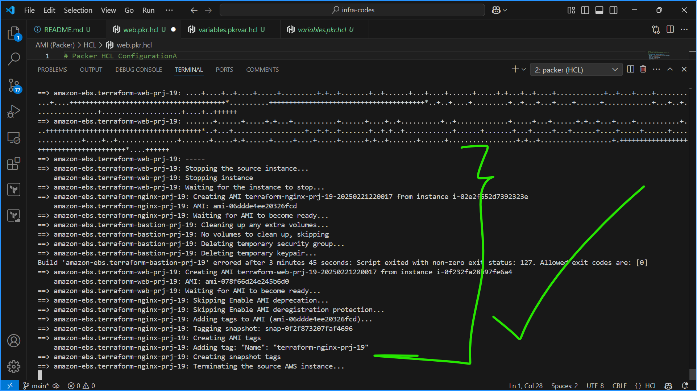
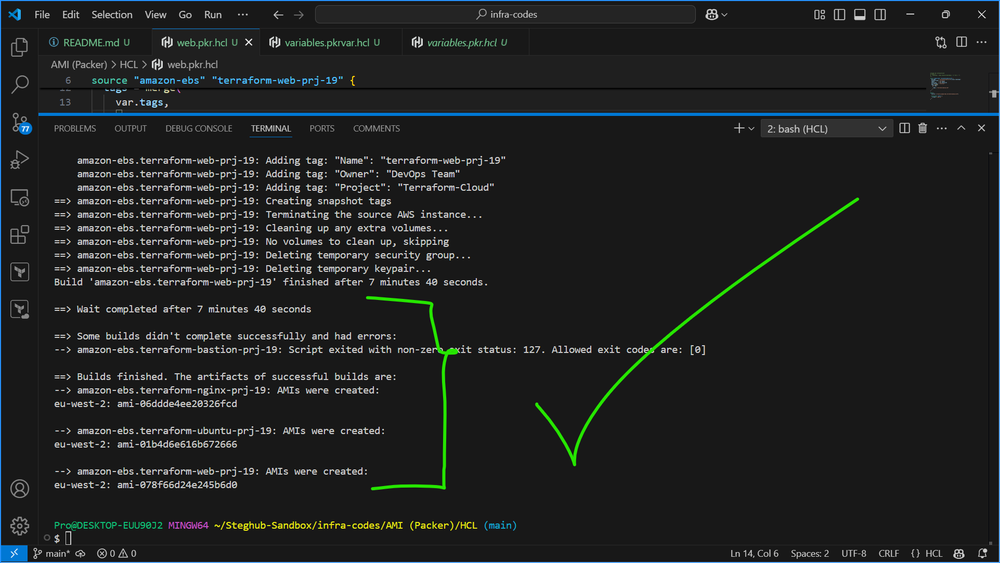
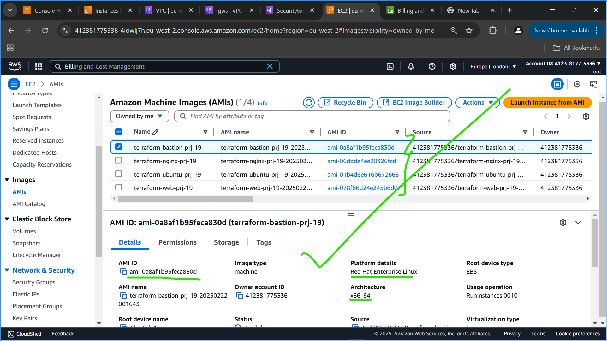

# Packer AWS AMI Builder for Project 19

This project automates the creation of custom AWS AMIs using Packer. It Majorly includes configurations for:
- **WordPress** (`terraform-web-prj-19`)
- **NGINX** (`terraform-nginx-prj-19`)
- **Bastion Host** (`terraform-bastion-prj-19`)

## Table of Contents
1. [Prerequisites](#prerequisites)
2. [Project Structure](#project-structure)
3. [Getting Started](#getting-started)
4. [Configuration Details](#configuration-details)
5. [Building AMIs](#building-amis)
6. [Best Practices](#best-practices)
7. [Troubleshooting](#troubleshooting)
8. [FAQs](#faqs)
9. [References](#references)

---

## Prerequisites
1. **AWS Account**: With IAM credentials (Access Key + Secret Key).
2. **Packer**: [Install Packer](https://developer.hashicorp.com/packer/downloads).
3. **AWS CLI**: [Install and configure](https://docs.aws.amazon.com/cli/latest/userguide/cli-chap-configure.html).
4. **SSH Key Pair**: Create one in your AWS region (e.g., `my-keypair.pem`).

---

## Project Structure
```bash
.
├── README.md
├── variables.pkr.hcl          # Shared variables (region, etc.)
├── web.pkr.hcl                # WordPress AMI configuration
├── nginx.pkr.hcl              # NGINX AMI configuration
├── bastion.pkr.hcl            # Bastion Host AMI configuration
├── scripts/
│   ├── web.sh                 # WordPress setup script
│   ├── nginx.sh               # NGINX setup script
│   └── bastion.sh             # Bastion Host setup script
└── outputs/                   # (Auto-generated) Packer logs/AMIs
```

---

## Getting Started
### 1. Clone the Repository

```bash
git clone https://github.com/kosenuel/terraform-cloud.git
cd terraform-cloud/AMI\ \(Packer\)/
```

### 2. Configure AWS Credentials
```bash
aws configure
# Enter your AWS Access Key, Secret Key, and default region (e.g., `eu-west-2`)
```

### 3. Update AMI IDs
Replace placeholder AMI IDs (e.g., `ami-0123456789abcdef0`) in the HCL files with valid base AMIs for your region:
- **RHEL AMI** (for WordPress/Bastion):
  ```bash
  Go to your Amazon console > EC2 > Launch Instance > Copy the ami id of the latest RHEL AMI
  ```
- **Ubuntu AMI** (for NGINX):
  ```bash
  Go to your Amazon console > EC2 > Launch Instance > Copy the ami id of the latest Ubuntu AMI
  ```

---

## Configuration Details
### HCL vs. JSON
- **HCL (Recommended)**: Human-readable with comments and variables (e.g., `web.pkr.hcl`).
- **JSON (Legacy)**: Is not human reading friendly, and can easily become cryptic when troubeshooting complex stuff. 

### Key Files
1. **`variables.pkr.hcl`**: Shared variables (region, tags).
2. **`web.pkr.hcl`/`nginx.pkr.hcl`/`bastion.pkr.hcl`**: Image-specific configurations.
3. **`scripts/*.sh`**: Provisioning scripts (install packages, configure services).

---

## Building AMIs
### Build All AMIs
```bash
# Initialize Packer plugins (first time only)
packer init .

# Build All AMIs at once
packer build -var-file=variables.pkrvar.hcl .

# Build WordPress AMI
packer build web.pkr.hcl -var-file=variables.pkrvar.hcl

# Build NGINX AMI
packer build nginx.pkr.hcl -var-file=variables.pkrvar.hcl

# Build Bastion Host AMI
packer build bastion.pkr.hcl -var-file=variables.pkrvar.hcl

# Build Ubuntu Host AMI
packer build ubuntu.pkr.hcl -var-file=variables.pkrvar.hcl
```

> **Note:** If you would like to build them one by one, you must understand that this setup was created with the intention of building all at once, and as such, to enable you build individually, you would need to copy the variables content from the `variables.pkr.hcl` file and paste it somewhere in the content of the `.pkr.hcl` file you are trying to build so that it can run successfully.
> After you are done, kindly remove the variables you just introduced to the packer file.


*Fig: Building all images using packer*


*Fig: Building all images using packer*


*Fig: Building all images using packer*


*Fig: Final Images created by packer*
### Build Options
- **Override Variables**:
  ```bash
  packer build -var 'region=eu-west-2' web.pkr.hcl
  ```
- **Debug Mode**:
  ```bash
  PACKER_LOG=1 packer build web.pkr.hcl
  ```

---

## Best Practices
1. **Version Control**: Track changes to HCL files and scripts using tools like github.
2. **Use Variables**: Avoid hardcoding values (e.g., AMI IDs, regions).
3. **Tagging**: Add AWS tags for cost tracking and organization.
4. **Test Scripts**: Validate `*.sh` scripts locally before building AMIs.
5. **Security**: Use `ansible-vault` or AWS Secrets Manager for sensitive data.

---

## Troubleshooting
| Issue | Solution |
|-------|----------|
| **Permission denied** | Ensure your IAM user has `EC2FullAccess` permissions. |
| **AMI not found** | Verify the base AMI ID and region compatibility. |
| **SSH connection failed** | Check the `ssh_username` (e.g., `ec2-user` for RHEL). |
| **Script errors** | Run scripts manually on a test instance. |

---

## FAQs
### Q: Why use HCL instead of JSON?
- **HCL** supports comments, variables, and is easier to read. JSON is legacy.

### Q: How do I share AMIs across AWS accounts?
Use `aws ec2 modify-image-attribute` after building the AMI.

### Q: What if my script fails mid-build?
Packer will halt and destroy the temporary instance. Fix the script and retry.

---

## References
1. [Packer Official Documentation](https://developer.hashicorp.com/packer)
2. [AWS CLI User Guide](https://docs.aws.amazon.com/cli/latest/userguide/)
3. [Sample Provisioning Scripts](https://github.com/orgs/community/discussions/26139)

---

**Thanks!** 
*For issues, open a GitHub ticket or contact [kosenuel@gmail.com](mailto:kosenuel@gmail.com).*
