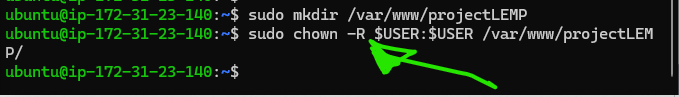

## WEB (LEMP) STACK IMPLEMENTATION IN AWS

### Introduction:
__the LEMP Stack is a very well known web development stack/platform and it is made up of four components (hence its name 'LEMP'): Linux, Engine-x (Nginx), MySQLL, and Php (or Perl/Python). We will now walk you through the configuration and usage of the LEMP Stack in this documentation.__


## Step 0: Prerequisites
__1.__ Launch an EC2 Instance (the t2.micro type was used in our case) or any compute engine on any cloud platform of your choice. Ensure that it is running Ubuntu 24.04 LTS (HVM) or later and is configured in the region closest to where your target audience would be accessing its content. _(The AWS platform was used in this project and would be referred to. If you are not using AWS, then you can search for how to perform the equivalent action on your cloud service provider)_.


__2.__ Ensure to create an SSH key pair named __`my-ec2-key`__ or whatever name you like to give it, this key is to facilitate your accessing the instance on port 22 (SSH port).

__3.__ Configure the security group of the instance to reflect the following inboud rules:
- Allow traffic on the HTTP port (80) from any source in the internet.
- Allow traffic on the HTTPS port (443) from any source in the internet.
- Allow traffic on the SSG port (22) from any source in the internet. (this rule is enabled by default).


__4.__ Leave the default VPC and Subnet (which your instance is configured to use by default) as is.    


__5.__ Locate and download the private ssh key that was created during `Step 0.2` if you are using a linux or mac OS, you would need to change the permission of the key before using it, but if you are a windows user, you can start using it right off-the-box.
```
#to change the permissions for Linux and or mac OS user(s)
chmod 400 my-ec2-key.pem
```
```
#Then connect to the instance using this key:
ssh -i "my-ec2-key.pem" <user>@<host/instance-ip>
```

Where (in our case:)
__user=ubuntu__ and __host/instance-ip=35.178.88.186__


## Step 1 - Install nginx web server

__1.__ __Update and upgrade the server's instance package manager's indices by running this command.__

```
sudo apt update
sudo apt ugrade -y
```


__2.__ __Install nginx__

```
sudo apt install nginx -y
```


__3.__ __Ensure that nginx is active and is running by running this command__

```
sudo systemctl status nginx
```
If you see the green indication and the word `active, running`, then be rest assured that the nginx service is running.


__4.__ __Further test the accessibility of nginx__

```
# run this command to further test and know that nginx is actually running on the machine.
curl http://localhost:80
```

__5.__ __Test to see if nginx can be accessed by a browser through the ec2 machine's public IP__

```
http://35.178.88.186
```


When it shows you this page, then be rest assured that your nginx software was installed and set up correctly.

__6.__ __Get your machine's IP address using the CLI (Command Line interface)__

The other way to retrieve your machine's IP address other than looking through your aws console, is by running this commmand on your ubuntu terminal:
```
curl -s http://169.254.169.254/latest/meta-data/public-ipv4
```

## Step 2 - Install MySQL

__1.__ __Install a database (Relational database like MySQL)__

MySQL is a well-known relational database management system that integrates well in Php environments. You can install it into your ec2 machine by running this command:
```
sudo apt install mysql-server
```


__2.__ __Login to mysql console and start applying changes__

```
sudo mysql
```
This tells your shell to connect to the `MySQL server` as the administrative database user (because of the `sudo` that is attached to running this command).


__3.__ __Set a password for the root user using mysql_native_password as the default mode of authentication.__

You can achieve the above by running this command:
```
ALTER USER 'root'@'localhost' IDENTIFIED WITH mysql_native_password BY 'RootPass.3';
```


After running that you would need to log out of the mysql console, and sign back in to continue the process. Log out by running this command:
```
EXIT
```

__4.__ __Run the Interactive script that comes with mysql to help secure your software configurations__

This script comes alongside mysql during installation. With this script, you can remove and ensure that settings/configurations of your 'mysql' software are secure and it would also help you lock down access to the dbms.
Run this script and navigat through it by running:
```
# Log into the mysql console by running:
sudo mysql -p
# After running this command, you would be prompted to supply your password, input the password you created when you ran that  `ALTER USER 'root'...` command.

# Then run the script by typing:
sudo mysql_secure_installation
```


__5.__ __After applying those changes, test to confirm that you can log into the MySQL console.__

Test this by running:
```
sudo mysql -p
```


Once you have verified that you can log in to the MySQL console successfully, exit the console by running the command:
```
EXIT
```

## Step 3 - Install Php

__1.__ __Install Php__

You would need to start by installing `php-fpm` (this is Php fastCGI process manager.) and configure nginx to route php request to this software for processing. Also, you would need to install `php-mysql` (this is a software/module that helps php in communicating with MySQL-based databases). Core php packages would be automatically installed as dependencies.
Install these programs by running:
```
sudo apt install php-fpm php-mysql -y
```


## Step 4 - Configure nginx to use Php Processor when necessary.

__1.__ __Create a root web directory for your project__

```
sudo mkdir /var/www/projectLEMP
```

__2.__ __Assign the directory's ownership to the current user__

Do this by running the command:
```
sudo chown -R $USER:$USER /var/www/projectLEMP
```


__3.__ __Configure Nginx by creating and configuring a new configuration file in the Nginx's "sites-avalable" directory__

```
sudo vi /etc/nginx/sites-available/projectLEMP
```
Then, paste the bare-bones configurations below in the new configuration file:
```
server {
    listen 80;
    server_name projectLEMP www.projectLEMP;
    root /var/www/projectLEMP;

    index index.html index.php;

    location / {
        try_files $uri $uri/ =404;
    }

    location ~ \.
    php$ {
        include snippets/fastcgi-php.conf;
        fastcgi_pass unix:/var/run/php/php8.1-fpm.sock;
    }
}
```


### This is what eacch line in the above configuration file mean:

- __listen__ - This indicates what port that nginx should listen on. In our case, we told nginx to listen on port 80 (which is the defaullt port for HTTP)

- __root__ - This element informs nginx about the location of the document root (where the files that are being served by this website are being stored) of the website.

- __index__ - This line of code informs nginx about the priority level it should categorize each file type by when it receives a request to serve a given file type. It is a common practice to list index.html fies with a higher precedennce than an index.php files to allow for a fast deployment of a maintenance page for php applications. 

- __server_name__ - This clause holds the domain name and/or IP address(es) the server block should respond to. when configuring nginx, point this directive to your domain name or your public IP address.

- __location /__ - The first 'location' block contains the 'try_files' directive, this checks for the existence of the file or directories that are being requested, and if Nginx cannot find the files, it would then return a `404` error.

- __location ~ \\.php$__ -  This is the location that handles the actual Php processing. It achieves this by pointing Nginx to the `fastcgi-php.conf` configuration file and the `php8.3-fpm.sock` file, which declares what socket is associated with `php-fpm`.

- __location ~ /\\.ht__ - This last location block handles the `.htaccess` files, which Nginx does not process. By adding all these directive, if any `.htaccess` files mistakenly or intentionally finds its way to the document root, it would not be served to any client.

__4.__ __Activate the configuration by linking your project's config file to the `sites-enabled` directory__

```
sudo ln -s /etc/nginx/sites-available/projectLEMP /etc/nginx/sites-enabled/
```


__5.__ __Test the configuration for syntax error__

```
sudo nginx -t
```


__6.__ __Disable the default Nginx configurations directives__

By default, nginx has a configuration with directives to serve a sample site upon installation, if you leave this enabled, it might override your configurations and thereby making your project unavailable to visitors. To disable this default config by nginx, run this command:
```
sudo unlink /etc/nginx/sites-enabled/default
```
__8.__ __Create a new index.html to be served by your projectLEMP configuration through nginx__

```
sudo echo 
'Hello LEMP from hostname:' $(curl -s http://169.254.169.254/latest/meta-data/public-hostname) ' with public IP ' $(curl -s http://169.254.169.254/latest/meta-data/public-ipv4) > /var/www/projectLEMP/index.html
```

### After running the above command, open the site by inputing the public IP address of your ec2 instance in your web browser to see how it looks


### Create a custom landing page for the web server (this is optional)

Just for fun, I added a custom landing page to simulate deploying a real site and making it accessible on the internet.


This file can be left in place as a temporary landing page for the application until the main `index.php` file is put in place to replace this one.


## Step 5 - Test that Nginx can handle php requests 

Now we have to test that our newly deployed LEMP Stack is able to handle php requests off the Php processor.

__1.__ __Create a sample php file in the root of the document to simulate a real php file.__ 

```
sudo nano /var/www/projectLEMP/info.php
```
after running the above, you would now have to paste in this text into the new `php` file:
```
<?php
phpinfo();
```

__2.__ __Try to access the machine's public IP address via your browser, and append this line `/info.php` along the IP address and click OK__

After you have done that, you should see a webpage detailing the relevant information about the server.
After you are now contented with viewing the content of the page, it is best to remove the `php` file as those details shown on that page are very sensitive.

Remove the file using this command:
```
sudo rm /var/www/projectLEMP/info.php
```

## Step 6 - Create data and retreive data from MySQL database Php

### First you have to create a new user who's going to log into the mysql database using the `mysql_native_password` authentication option.

Create a database with the name: "todo_database" and Create a user named "user1"

__1.__ __Connect to the MySQL console as the root user.__

```
sudo mysql -p
```


__2.__ __Create a new database__

You can create a new database by running this command:
```
CREATE DATABASE todo_database;
```


__3.__ __Create a new user that would have full privileges/access to this newly created database__
```
CREATE USER 'user1'@'%' IDENTIFIED WITH mysql_native_password BY 'RootPass.3';

# Give this new user full access to the database by running this command:
GRANT ALL ON todo_database * TO 'user1'@'%';
```


__4.__ __Login to the mysql console as this newly created user and confirm that you (as the new user) have been granted access to this database.__

```
mysql -u user1 -p

# After running the above command and supplying the required credentials, List the databases that you (now logged in as the new user) are allowed access to by running this command below:
SHOW DATABASES;
```


__5.__ __Create a test table named 'todo_list'.__

Run the commands below via MySQL console to create a new table:
```
# First, specify the table you want to apply this change to by running this command:
USE todo_database;

# Then create the table inside the database by running this command:
CREATE TABLE todo_database.todo_list (
    item_id INT AUTO_INCREMENT
    content VARCHAR(255),
    PRIMARY KEY (item_id)

);
```

__6.__ __Populate this newly created table with some records.__

Run these commands to populate the new table with records.
```
INSERT INTO todo_database.todo_list (content) VALUES ("This is the first most important task I have to do for the day");

INSERT INTO todo_database.todo_list (content) VALUES ("This is the second task I have to do for the day - in order of hierarchy");

INSERT INTO todo_database.todo_list (content) VALUES ("This is the third task I have to do for the day - in order of hierarchy");

INSERT INTO todo_database.todo_list (content) VALUES ("Let me quickly add this one more item to my to do list before I forget");
```

__7.__ __View the table's content to verify/ensure that the data ypu populated it with were done successfully__

Run the command below to ensure that the table was populated properly:
```
SELECT * FROM  todo_database.todo_list;
```


Now when you are satisfied with your result, run this command below to exit from mysql console:
```
EXIT
```

### Now we will create a php script that would connect to our `todo_database` and pull/retreive records from it to display in the webpage

Articulated below is the steps we are going to take to make this happen:

__1.__ __Create a new php file in our custom web root directory__
```
sudo nano /var/www/projectLEMP/todo_list.php
```

As stated earlier, the purpose of creating this script is to have a webpage that connects to our MySQL database, queries it for its contents and displays the results in a list (in our webpage). Now if at any point of writing this script, there was an error? then we would get an exception error, else, it would fly smoothly.

Copy the block of code below into your `/var/www/projectLEMP/todo_list.php` directory.
```
<?php
$user = "user1"; 
$password = "RootPass.3"
$database = "todo_database";
$table= "todo_list";

try {
    $db = new PDO ("mysql:host=localhost;
    dbname=$database", $user, $password
    );
    echo 
    "<h2>TODO List</h2><ol>";
    foreach ($db->query ("SELECT content FROM $table" )as $row) {
        echo "<li>" . $row ['content']
        . "</li>";
    } 
    echo "</ol>";
} catch (PDOException $e) {
    print "Error!: " . $e->getMessage() . "<br/>";
    die();
}
?>
```

__2.__ __Now we would try to access this page that we just created from the public IP of the server:__

Input the public IP of your server on your web-browser followed by `/todo_list.php`
```
# Example:
http://35.178.88.186/todo_list.php
```


## Conclusion

This LEMP stack (just like the LAMP stack) provides a solid platform for hosting and serving web apps. If you as a developer want to deploy scalable solutions that can be relied upon, then you would need to seriously consider one of these stacks as they have been tested, tried and proven to meet expectations.


