# MERN Web Stack Implementation in AWS

## Introduction

The MERN stack (MongoDB, Express, React, and Node.js) is a popular technology stack used to build robust, full-stack JavaScript web applications. This study guide will walk you through setting up a basic project using the MERN stack, covering installation, environment configuration, and key components of a to-do app. The project highlights essential skills for developing, testing, and deploying web applications using the stack.

## Prerequisites

Before we proceed, ensure you have the following software installed:

- **MongoDB**: This is a No SQL database that offers flexible, document-based storage.
- **Express.js**: This framework that helps Node.js to communicate, it helps in simplifying the creation of robust APIs and web applications.
- **React.js**: This is the framework that holds the front-end together, and in place. Here, we can paint interactive user interfaces with the great efficiency.
- **Node.js**: This one is the  backstage software that helps in orchestrating server-side JavaScript execution efficiently.

Now, we have known what we need to have in place inorder to be able to start, now let's go in.

## Step 0: Setting the environment for development

Before we go into the code, let's set up our development environment. 

1. **Launching the EC2 Instance**: We're going for the t3.small instance running Ubuntu 24.04 LTS (HVM) in the us-east-2 region. Why, because:
   - It has more memory than its smaller sibling, (the t2.micro) and it is perfect for our memory-hungry todo-app.
   - It has a flexible burst model that allows for sustained performance during those intense coding sessions.
   - It offers better baseline performance, thus, giving our applications the boost they need.

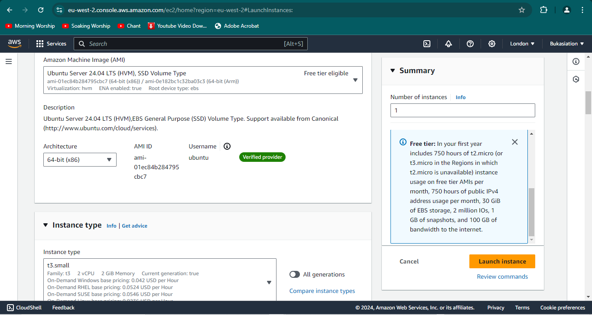

2. **SSH Key**: We've attached our `ssh-key` to access the instance - whilst creating the instance. This helps us to access the instance securely without the need for a password.

3. **Security Group Configuration**: When we are creating the instance, we set up a digital bouncer (the security group) to allow the right traffic in:
   - Port 80 (HTTP): The front door for web traffic.
   - Port 443 (HTTPS): The secure entrance for those who value privacy.
   - Port 22 (SSH): Our backdoor for maintenance.
   - Ports 5000 and 3000: These ports were not enabled at first, but later during the course of deploying the app, was opened.
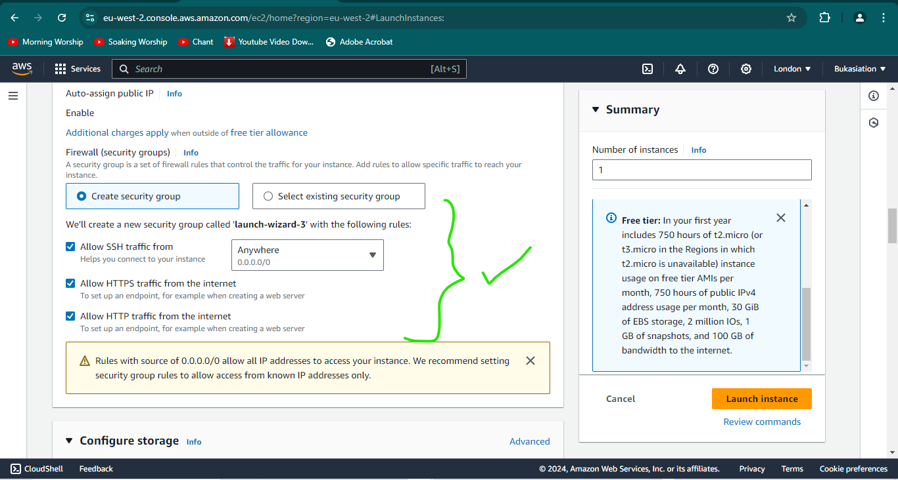

4. **Connecting to the Instance**: To connect to the instance, I implemented the `Terminal` windows app for this and I ran:

```bash
ssh -i "ssh-key.pem" ubuntu@<instance:IP>
```

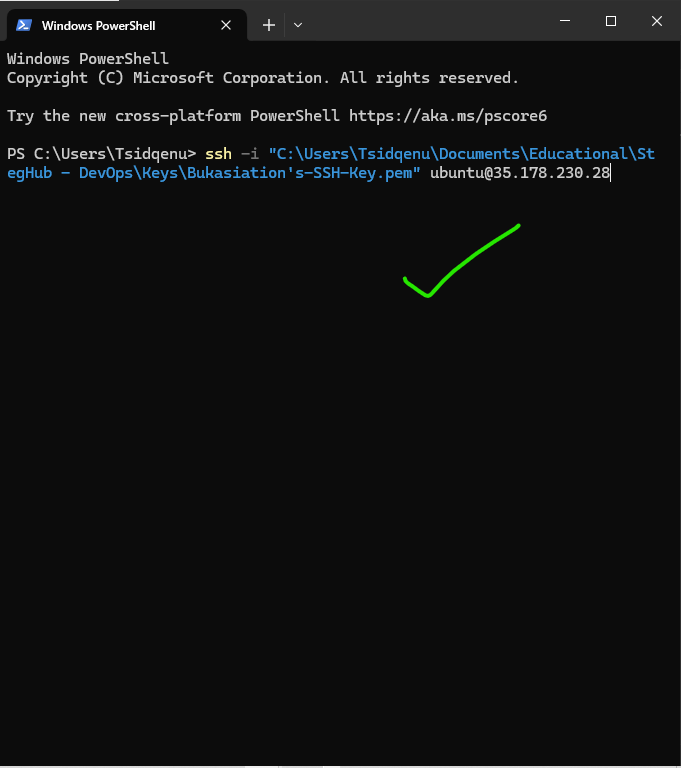

And it will load a short while, and take you into your digital environment for some serious MERN stack activity.

## Step 1 - Backend Configuration: This is where we start planning out the logic

Now that we have set the environment, it's time to start building the backbone of our application. Let's go into the backend configuration, where we would start putting in some fun logic!

1. **Updating and Upgrading**: To get our backend environment started, we have to first install Node. To begin, let's make sure our server is up-to-date with the latest packages.

```bash
sudo apt update && sudo apt upgrade -y
```

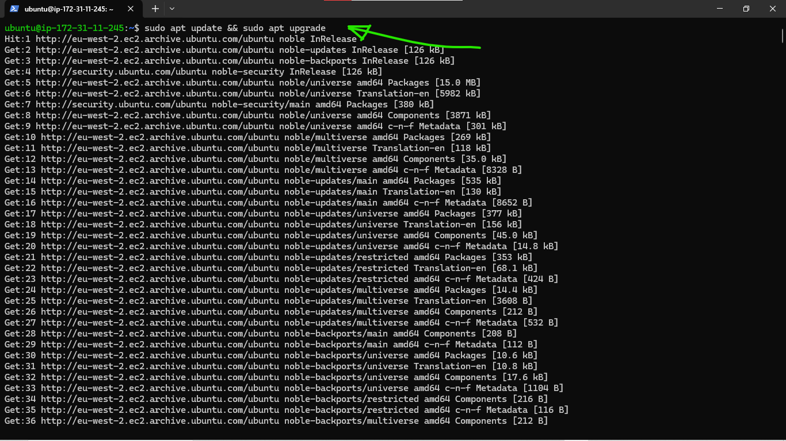

2. **Introducing Node.js**: Now, we would have to install the first software which is going to be `Nodejs`  by grabbing it from the Ubuntu repositories using this command (below):

```bash
curl fsSL https://deb.nodesource.com/setup_18.x | sudo -E bash -
```

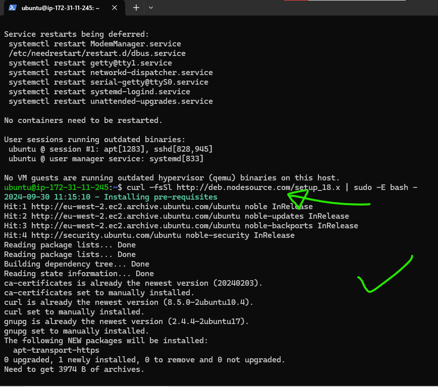

3. **Installing Node.js**: With a simple command, we can both install Node.js and npm (Node Package Manager). npm acts like apt in terms of managing repository.:

```bash
sudo apt-get install nodejs -y
```

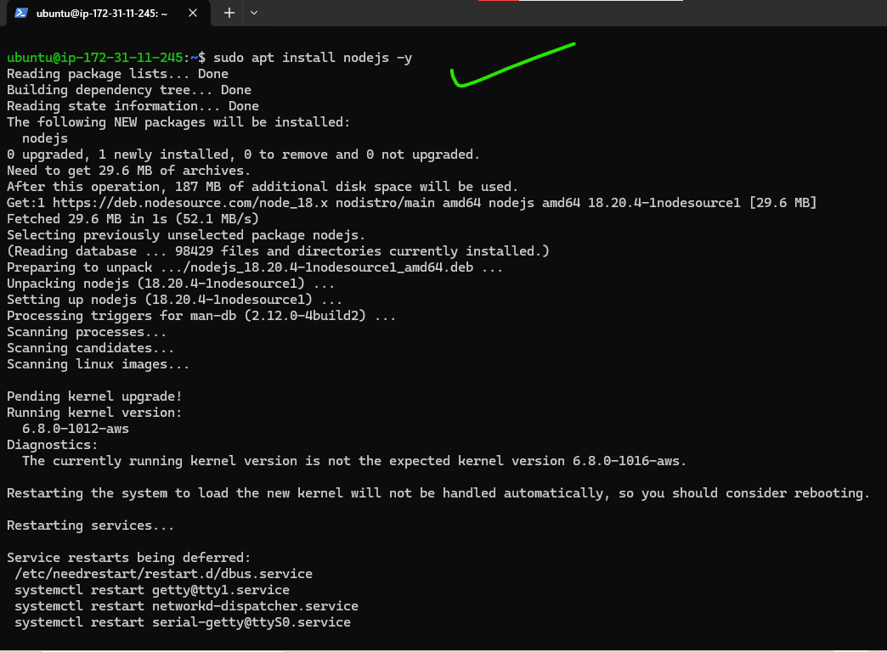

4. **Verifying the Installation**: Let us make sure our new tools are ready to be used (by running these commands):

```bash
node -v
npm -v
```

Cool, now that we have all the necessary prerequisites set up, its now, let's start building our application!

### Application Code Setup:
1. **Creating the Project Directory**: Create a new directory for the Todo project and switch it. Then initialize the project directory 

```bash
mkdir Todo && ls && cd Todo
npm init
```


This creates a `package.json` file, which will be the blueprint for our project, it contains a list of all its dependencies and scripts.

### Installing Express: 

Express is a framework for Node.js. It simplifies development and abstracts a lot of low level details. For example, express helps to define routes of your application based on HTTP methods and URLs.

1. **Install Express using npm**:

```bash
npm install express
```

2. **Create the Entry Point**: Let's create an `index.js` file, this would be the starting point of our application and run ls to confirm the existence of the file:

```bash
#Note: the location where you are to create all these is in your `Todo` directory.
touch index.js && ls
```

3. **Install dotenv**: This  module is very important, as it will help us manage environment variables (keeping them secret in the app.):

```bash
npm install dotenv
```

4. **Setting Up index.js**: Open up `index.js` and let us pour some life into our application (i.e: a little bit functional):

```bash
vim index.js
```

Paste in this code:

```javascript
const express = require('express');
require('dotenv').config();

const app = express();

const port = process.env.PORT || 5000;

app.use((req, res, next) => {
  res.header("Access-Control-Allow-Origin", "*");
  res.header("Access-Control-Allow-Headers", "Origin, X-Requested-With, Content-Type, Accept");
  next();
});

app.use((req, res, next) => {
  res.send('Welcome to Express');
});

app.listen(port, () => {
  console.log(`Server running on port ${port}`);
});
```

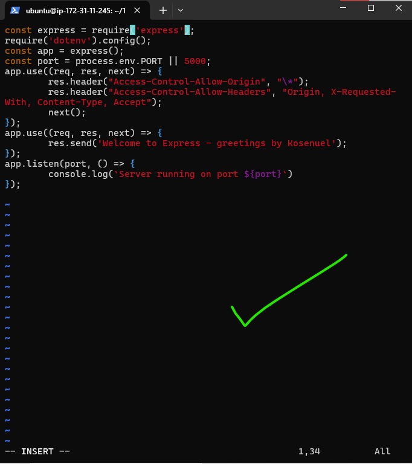

5. **Start the Server**: Let us start the server and see if it works as planned.

```bash
node index.js
```

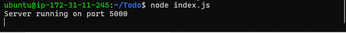

Now, if you navigate to `http://54.175.65.60:5000` in your browser, you should see your Express application live!

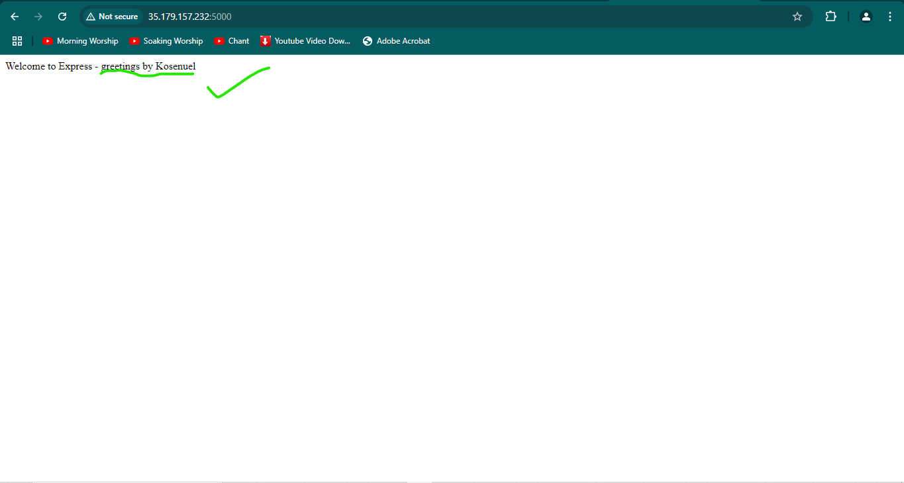

Congratulations! At this point, you have just set up the skeleton of the backend. In the next sections, we would be putting some flesh on it with routes, models, and connect it to a database. 

## Routes: Mapping the Path to Success

Now that we have our basic Express server up and running, it's time to add some structure to our application. We are going to create routes that will handle the three main actions of our To-Do app:

1. Creating a new task
2. Displaying a list of all tasks
3. Deleting a completed task

These actions will be tied to specific endpoints (i.e: touch points for communications between two or more systems) and they would use different HTTP methods: __POST__, __GET__, and __DELETE__ to crud senesitive databases and or collection

1. **Create the Routes Directory**:

```bash
mkdir routes && cd routes && touch api.js
```

2. **Set Up the Routes**: Open `api.js` and add the following code:

```javascript
const express = require('express');
const router = express.Router();

router.get('/todos', (req, res, next) => {
  // This will handle GET requests to retrieve all todos
});

router.post('/todos', (req, res, next) => {
  // This will handle POST requests to add a new todo
});

router.delete('/todos/:id', (req, res, next) => {
  // This will handle DELETE requests to remove a specific todo
});

module.exports = router;
```

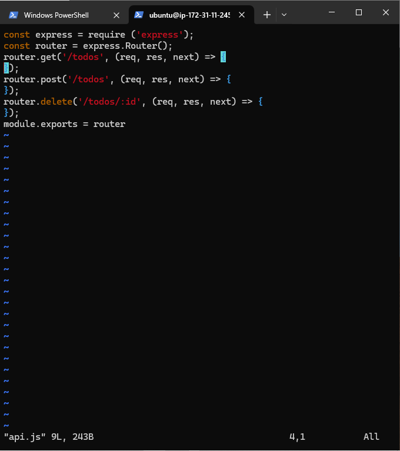

Cool! Now that we have laid out the blueprint for our API routes. But these routes don't do anything yet. To bring them to life, we need to create models that will interact with our database.

## Models: Blueprinting Our Data

Models are the heart of any JavaScript-based application. They define the structure of the data we will be working with and how it's stored in the database. For our To-Do app, we will use Mongoose to create a schema and model for our tasks.

1. **Install Mongoose**:

```bash
cd .. # Move back to the Todo directory
npm install mongoose
```

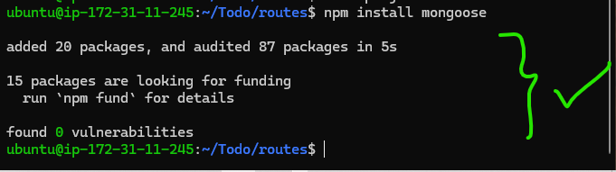

2. **Create the Model**:

```bash
mkdir models && cd models && touch todo.js
```

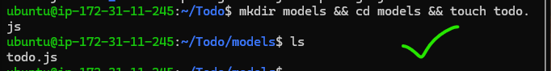

Open `todo.js` and add the following code:

```javascript
const mongoose = require('mongoose');
const Schema = mongoose.Schema;

// Create schema for todo
const TodoSchema = new Schema({
  action: {
    type: String,
    required: [true, 'The todo text field is required']
  }
});

// Create model for todo
const Todo = mongoose.model('todo', TodoSchema);

module.exports = Todo;
```

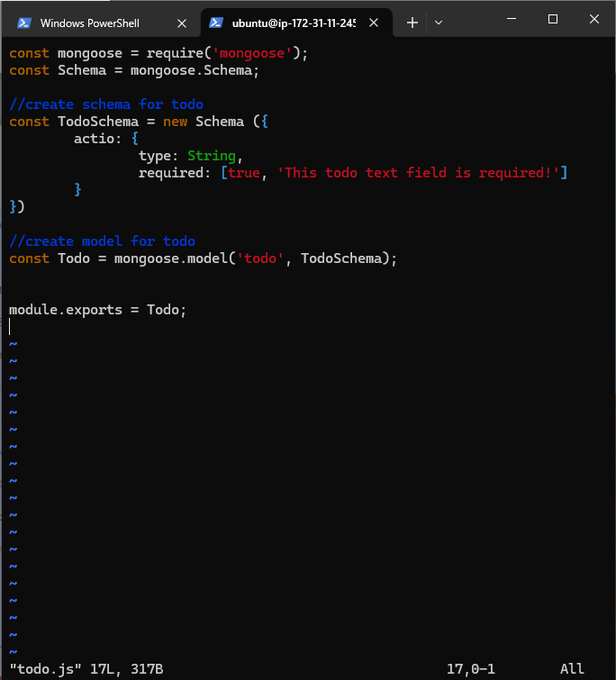

3. **Update the Routes**: Now that we have our model, let's update our routes to use it. Open `routes/api.js` and replace its contents with:

```javascript
const express = require('express');
const router = express.Router();
const Todo = require('../models/todo');

router.get('/todos', (req, res, next) => {
  // This will return all the data, exposing only the id and action field to the client
  Todo.find({}, 'action')
    .then(data => res.json(data))
    .catch(next);
});

router.post('/todos', (req, res, next) => {
  if (req.body.action) {
    Todo.create(req.body)
      .then(data => res.json(data))
      .catch(next);
  } else {
    res.json({
      error: "The input field is empty"
    });
  }
});

router.delete('/todos/:id', (req, res, next) => {
  Todo.findOneAndDelete({"_id": req.params.id})
    .then(data => res.json(data))
    .catch(next);
});

module.exports = router;
```

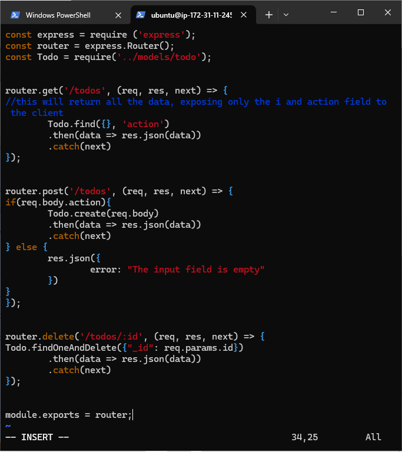

Okay! Now, we have set up our routes to interact with our MongoDB database using Mongoose. But we haven't actually set up our database yet. Let's do that next!

## MongoDB Database: Our Data's New Home

For our database, we'll be using MongoDB Atlas, a cloud-based database service that will host our To-Do items. Here's how to set it up:

1. **Create a MongoDB Account and Cluster inside mLab (or Atlas - they are the same thing)**: 
   - Sign up for a free account on MongoDB Atlas.
   - Create a new cluster in the AWS cloud, choosing the Paris (eu-west-3) region.
   - For testing purposes, we'll allow access from anywhere (not recommended for production!).

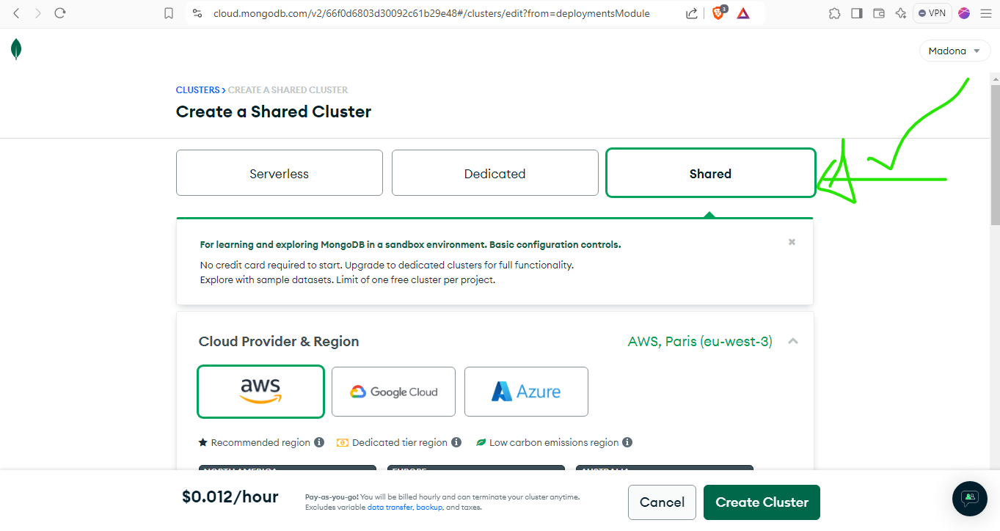
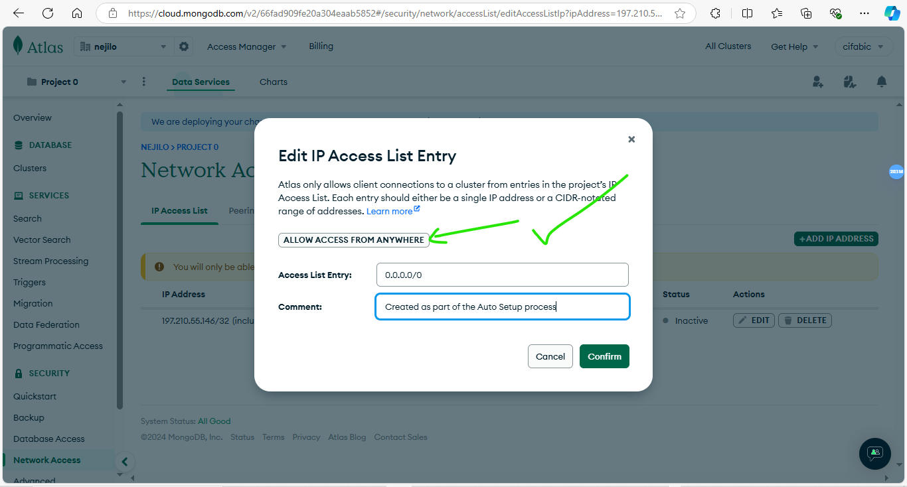

2. **Create Database and Collection**:
   - Create a database named `todo_db`.
   - Inside it, create a collection named `todos`.

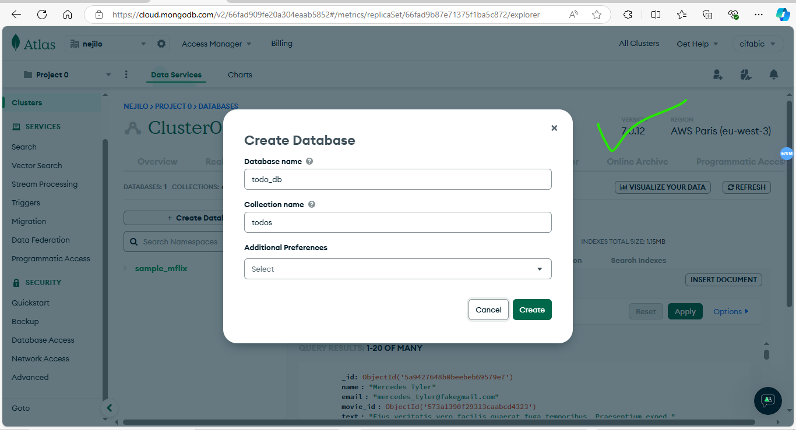

3. **Set Up Environment Variables**:
   Create a `.env` file in your Todo directory:

```bash
touch .env && vim .env
```

Add your MongoDB connection string:

```bash
DB = 'mongodb+srv://<username>:<password>@<network-address>/<dbname>?retryWrites=true&w=majority'
```


4. **Update index.js**:
   Open `index.js` and replace its contents with:

```javascript
const express = require('express');
const bodyParser = require('body-parser');
const mongoose = require('mongoose');
const routes = require('./routes/api');
const path = require('path');
require('dotenv').config();

const app = express();

const port = process.env.PORT || 5000;

// Connect to the database
mongoose.connect(process.env.DB, { useNewUrlParser: true, useUnifiedTopology: true })
  .then(() => console.log(`Database connected successfully`))
  .catch(err => console.log(err));

// Since mongoose promise is deprecated, we override it with Node's promise
mongoose.Promise = global.Promise;

app.use((req, res, next) => {
  res.header("Access-Control-Allow-Origin", "*");
  res.header("Access-Control-Allow-Headers", "Origin, X-Requested-With, Content-Type, Accept");
  next();
});

app.use(bodyParser.json());

app.use('/api', routes);

app.use((err, req, res, next) => {
  console.log(err);
  next();
});

app.listen(port, () => {
  console.log(`Server running on port ${port}`);
});
```
We do this to reflect the use of `.env` in our `index.js` so that Node.js can connect to the database instance that we created earlier.

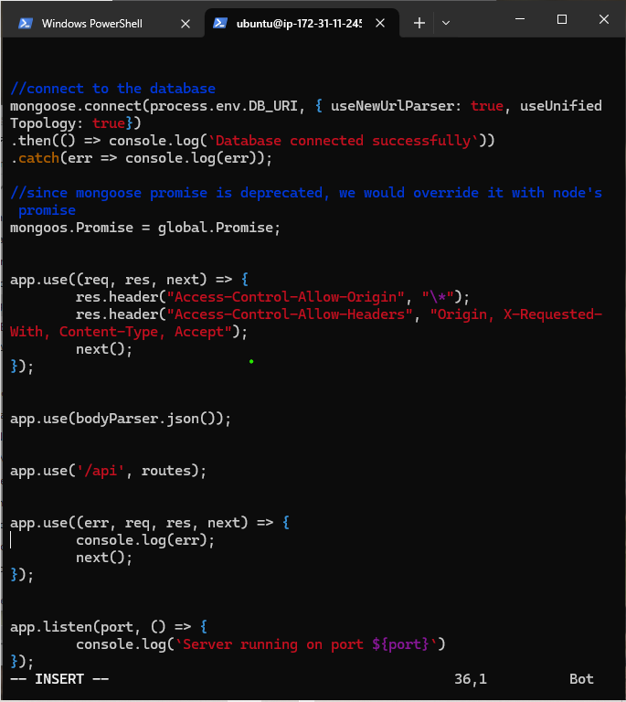

5. **Start Your Server**:

```bash
node index.js
```

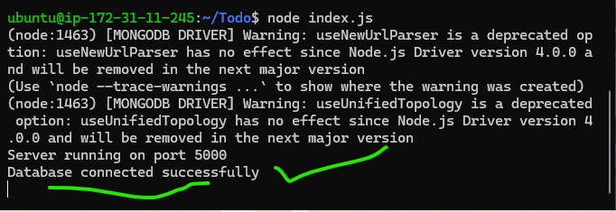

If you see a deprecation warning, you can remove `{ useNewUrlParser: true, useUnifiedTopology: true }` from the `mongoose.connect()` call to silence it.

Very cool. Now that we have set up our backend with Express, created our data model with Mongoose, and connected it all to a MongoDB Atlas database. In the next section, we'll test our API endpoints to make sure everything's working as expected.

## Testing Our Backend: Bringing the API to Life

Now that we've set up our backend, it's time to put it to several tests. We'll use Postman, a powerful API testing tool, to ensure our endpoints are working correctly. Let's go!

1. **Open Postman and Set the Header**:
   We would be sending requests to `http://35.178.230.28:5000/api/todos`
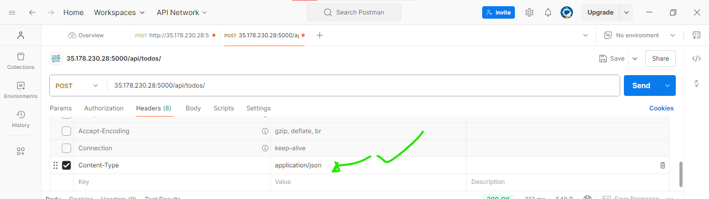

2. **Create POST Requests**:
   Let's add some tasks to our To-Do list:

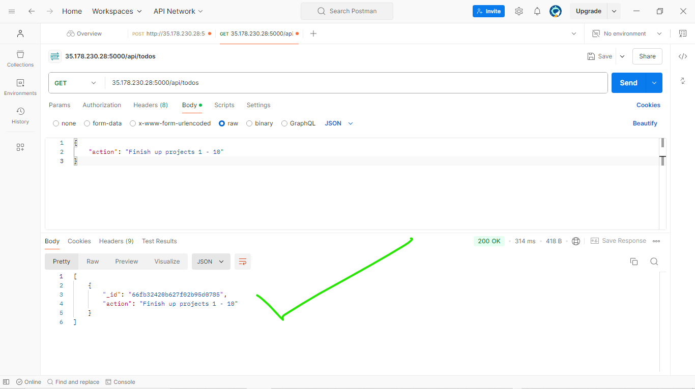
Make several post requests as seen in the image above

3. **Check Database Collections**:
   Now, Let's look into our MongoDB to see if our tasks have been saved:

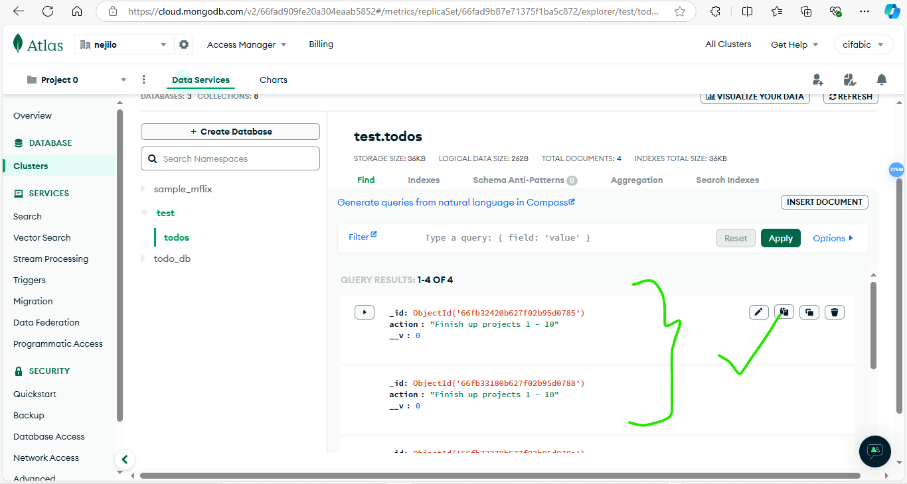

4. **Make GET Requests**:
   Now, let's retrieve all our tasks:

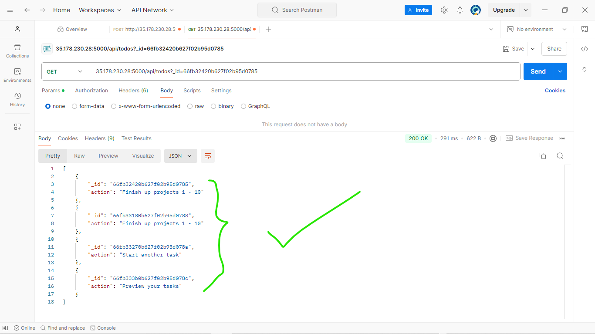

5. **Create DELETE Requests**:
   Time to cross off a completed task:

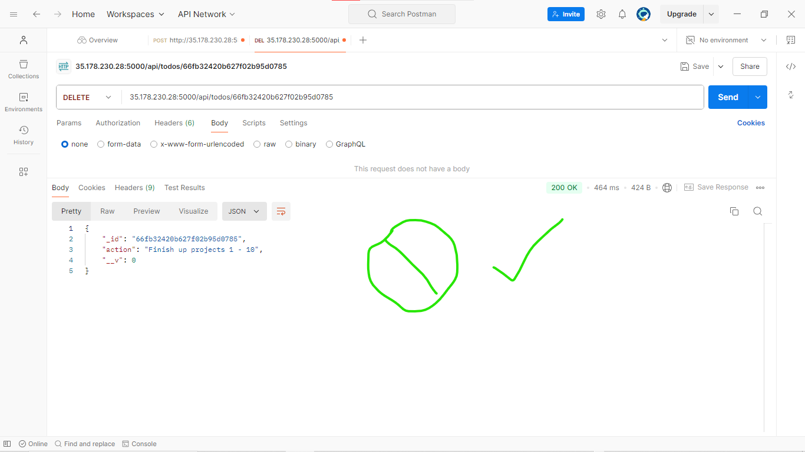

6. **Check Database Collections Again**:
   Let's make sure our task was really deleted:


Cool, Now our backend is fully functional. We can create tasks, retrieve them, and delete them. The API is responding exactly as we designed it to. Now, it's time to create a user-friendly frontend that will interact with this robust backend. 

## Step 2 - Frontend Creation: Bringing Our App to Life

Now that we have a solid backend, it's time to create a sleek and intuitive user interface. we will be using React for this, React is a powerful library for building dynamic user interfaces. 

1. **Create the React App**:
   In the same root directory as your backend code (the Todo directory), run:
.

   ```bash
   npx create-react-app client
   ```

   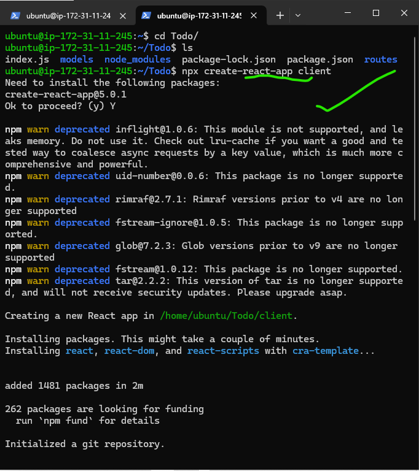

   This command will automatically create a new folder called 'client', where all our React files for the frontend would be stored.

### Setting Up for Development: 

Before we start crafting our React frontend, we need to set up a few tools to make our development process smooth and efficient.

1. **Install Concurrently**:
   This useful package allows us to run multiple commands simultaneously from a single terminal window
. 
   ```bash
   npm install concurrently --save-dev
   ```

   

2. **Install Nodemon**:
   Nodemon is utility tool that assist in watching over our server code and automatically restarting it whenever changes are detected 
.
   ```bash
   npm install nodemon --save-dev
   ```

   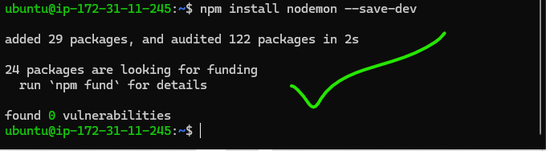

3. **Update Package.json**:
   Open the `package.json` file in your Todo folder and replace the "scripts" section with:

   ```json
   "scripts": {
     "start": "node index.js",
     "start-watch": "nodemon index.js",
     "dev": "concurrently \"npm run start-watch\" \"cd client && npm start\""
   }
   ```

   

   This sets up our development environment to run both our backend and frontend concurrently. It's like conducting an orchestra where the backend and frontend play in perfect harmony!

### Configuring the Proxy: Building Bridges

To seamlessly connect our React frontend with our Express backend, we need to set up a proxy. This will allow us to make API calls without having to specify the full URL every time.

1. **Navigate to the Client Directory**:
.
   ```bash
   cd client
   ```

2. **Open the Package.json File**:
.
   ```bash
   vim package.json
   ```


3. **Add the Proxy Configuration**:
   Add this line to your `package.json`:

   ```json
   "proxy": "http://localhost:5000"
   ```

   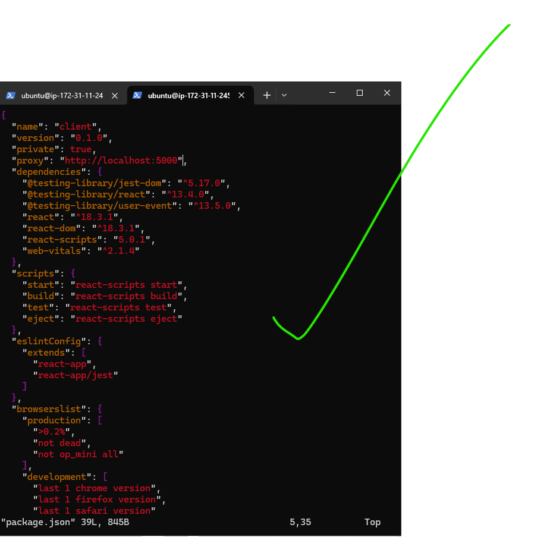

   This little line of code acts like a secret tunnel, that is allowing our frontend to communicate directly with our backend.

Now, from your Todo directory, you can start both your backend and frontend with a single command:

```bash
npm run dev
```

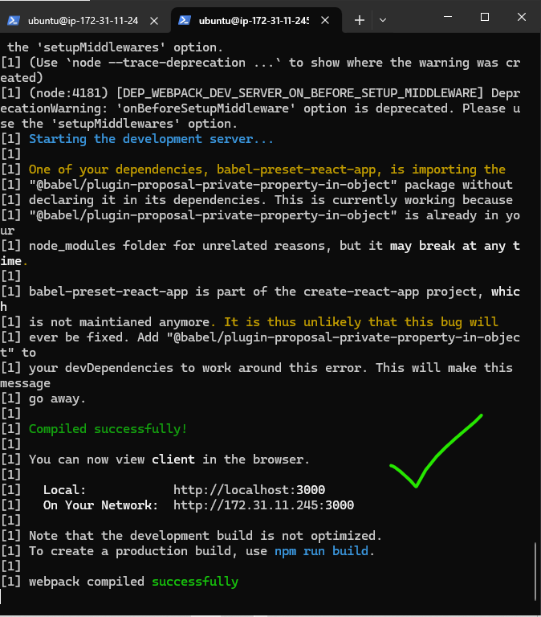

Cool, Your app should now be running on `localhost:3000`. Remember, we have opened port 3000 on our EC2 instance, (`ensure you have this port open in yours too. You can achieve this by going to your Ec2 instance page -> select your instance -> click on the Security tab -> click on your security group displayed there -> click on 'Edit inbound rule' -> add a new record: This record is a custom TCP record that you would have to specify that port 3000 should be open for connection from any location`)   so you can access your app from the internet.

## Creating React Components: Building Our UI

One of the strengths of React is its component-based architecture. It allows us to create reusable, modular pieces of UI. For our To-Do app, we would create two stateful components and one stateless component.

1. **Navigate to the Source Directory**:
   ```bash
   cd client/src
   ```

2. **Create a Components Folder**:
   ```bash
   mkdir components
   cd components
   ```

3. **Create Component Files**:
   ```bash
   touch Input.js ListTodo.js Todo.js
   ```
   These files will be the blueprints for our UI components. Let us create their functionality one by one!

4. **Craft the Input Component**:
   Open `Input.js` and paste in the following code:

   ```jsx
   import React, { Component } from 'react';
   import axios from 'axios';

   class Input extends Component {
     state = {
       action: ""
     }

     handleChange = (event) => {
       this.setState({ action: event.target.value });
     }

     addTodo = () => {
       const task = { action: this.state.action };

       if (task.action && task.action.length > 0) {
         axios.post('/api/todos', task)
           .then(res => {
             if (res.data) {
               this.props.getTodos();
               this.setState({ action: "" });
             }
           })
           .catch(err => console.log(err));
       } else {
         console.log('Input field required');
       }
     }

     render() {
       let { action } = this.state;
       return (
         <div>
           <input type="text" onChange={this.handleChange} value={action} />
           <button onClick={this.addTodo}>add todo</button>
         </div>
       );
     }
   }

   export default Input;
   ```

   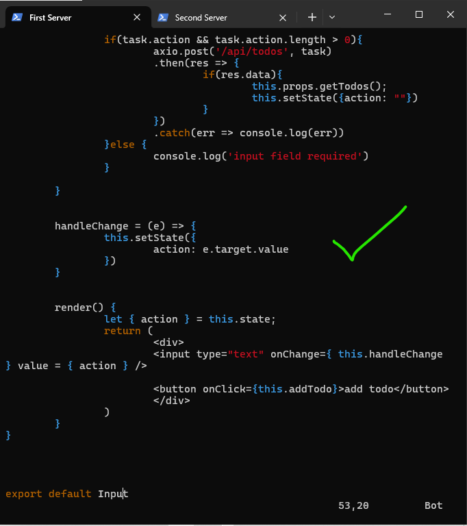

   This component is like a hard worker that repeatedly takes on new tasks and sending them off to be added to our (todo) list.

5. **Install Axios**:
   Axios is our messenger, carrying data back and forth between our frontend and backend. Let us bring it on board by running:

   ```bash
   cd ../..  # Navigate back to the client folder
   npm install axios
   ```

   

6. **Create the ListTodo Component**:
   Back in the components directory, open `ListTodo.js` and add:

   ```jsx
   import React from 'react';

   const ListTodo = ({ todos, deleteTodo }) => {
     return (
       <ul>
         {
           todos && todos.length > 0 ? (
             todos.map(todo => {
               return (
                 <li key={todo._id} onClick={() => deleteTodo(todo._id)}>
                   {todo.action}
                 </li>
               );
             })
           ) : (
             <li>No todo(s) left</li>
           )
         }
       </ul>
     );
   }

   export default ListTodo;
   ```

   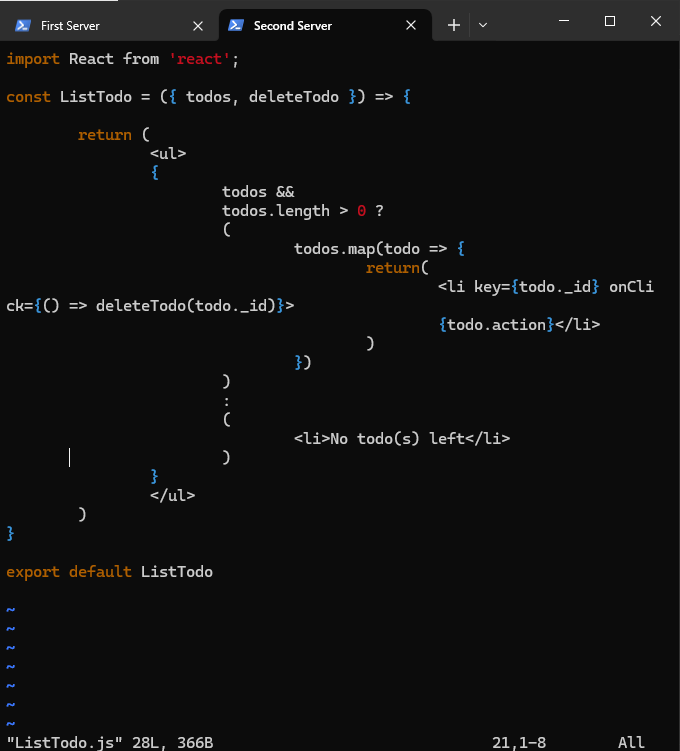

   This component is like our town crier, it helps to announce all our tasks to the world _(or at least to our app)_.

7. **Assemble the Todo Component**:
   In `Todo.js`, we would now bring everything together using this code below:

   ```jsx
   import React, { Component } from 'react';
   import axios from 'axios';

   import Input from './Input';
   import ListTodo from './ListTodo';

   class Todo extends Component {
     state = {
       todos: []
     }

     componentDidMount() {
       this.getTodos();
     }

     getTodos = () => {
       axios.get('/api/todos')
         .then(res => {
           if (res.data) {
             this.setState({
               todos: res.data
             });
           }
         })
         .catch(err => console.log(err));
     }

     deleteTodo = (id) => {
       axios.delete(`/api/todos/${id}`)
         .then(res => {
           if (res.data) {
             this.getTodos();
           }
         })
         .catch(err => console.log(err));
     }

     render() {
       let { todos } = this.state;
       return (
         <div>
           <h1>My Todo(s)</h1>
           <Input getTodos={this.getTodos} />
           <ListTodo todos={todos} deleteTodo={this.deleteTodo} />
         </div>
       );
     }
   }

   export default Todo;
   ```

   

   This component can be likened to a coordinator that helps us to coordinate all the moving parts of our To-Do app.

8. **Update App.js**:
   Now, let's update our main `App.js` file to use our new Todo component. Navigate back to the `src` folder and open `App.js`:

   ```jsx
   import React from 'react';
   import Todo from './components/Todo';
   import './App.css';

   const App = () => {
     return (
       <div className="App">
         <Todo />
       </div>
     );
   }

   export default App;
   ```

   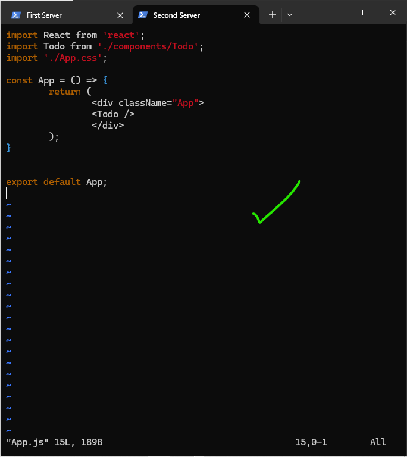

9. **Style Our App**:
   This is one of the coolest moment, where we get to give our app some steeze! Open `App.css` and paste in this beautiful style:

   ```css
   .App {
     text-align: center;
     font-size: calc(10px + 2vmin);
     width: 60%;
     margin-left: auto;
     margin-right: auto;
   }

   input {
     height: 40px;
     width: 50%;
     border: none;
     border-bottom: 2px #101113 solid;
     background: none;
     font-size: 1.5rem;
     color: #787a80;
   }

   input:focus {
     outline: none;
   }

   button {
     width: 25%;
     height: 45px;
     border: none;
     margin-left: 10px;
     font-size: 25px;
     background: #101113;
     border-radius: 5px;
     color: #787a80;
     cursor: pointer;
   }

   button:focus {
     outline: none;
   }

   ul {
     list-style: none;
     text-align: left;
     padding: 15px;
     background: #171a1f;
     border-radius: 5px;
   }

   li {
     padding: 15px;
     font-size: 1.5rem;
     margin-bottom: 15px;
     background: #282c34;
     border-radius: 5px;
     overflow-wrap: break-word;
     cursor: pointer;
   }

   @media only screen and (min-width: 300px) {
     .App {
       width: 80%;
     }

     input {
       width: 100%
     }

     button {
       width: 100%;
       margin-top: 15px;
       margin-left: 0;
     }
   }

   @media only screen and (min-width: 640px) {
     .App {
       width: 60%;
     }

     input {
       width: 50%;
     }

     button {
       width: 30%;
       margin-left: 10px;
       margin-top: 0;
     }
   }
   ```

   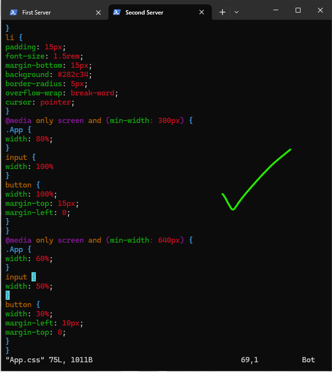

10. **Update index.css**:
    Finally, we are going to add some global styles. Open the`index.css` and add this style:

    ```css
    body {
      margin: 0;
      padding: 0;
      font-family: -apple-system, BlinkMacSystemFont, "Segoe UI", "Roboto", "Oxygen", "Ubuntu", "Cantarell", "Fira Sans", "Droid Sans", "Helvetica Neue", sans-serif;
      -webkit-font-smoothing: antialiased;
      -moz-osx-font-smoothing: grayscale;
      box-sizing: border-box;
      background-color: #282c34;
      color: #787a80;
    }

    code {
      font-family: source-code-pro, Menlo, Monaco, Consolas, "Courier New", monospace;
    }
    ```

    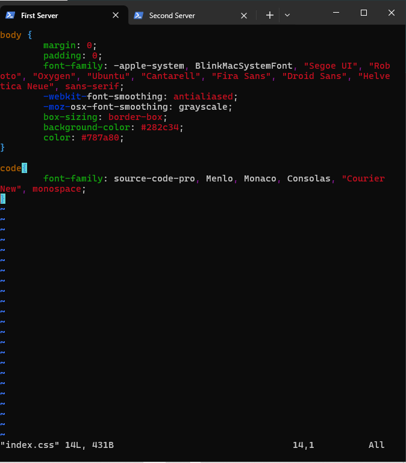

And there you have it! We've built a complete frontend for our To-Do app. Now, let's see it in action!

## Finally: Running Our Full Stack App

Cool, Now let us bring together all the pieces built in the previouus steps, by (what I would like to call: compiling&running ) running the app and monitoring the progress

1. **Start the App**:
   Navigate back to your Todo directory and run:

   ```bash
   npm run dev
   ```

   

   This command helps us in starting both our backend and frontend concurrently.

2. **View the App in Your Browser**:
   Open your web browser and navigate to your EC2 instance's public IP address on port 3000. You should see your beautiful To-Do app ready for to start taking or deleting todo entries, cool right?
   I know :)

   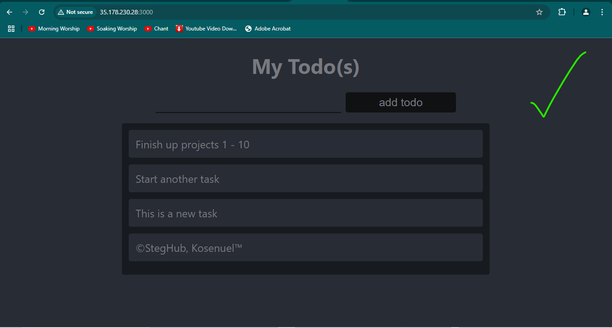

3. **Add Some Todos**:
   Proceed to add a few tasks to your list. Watch as they appear instantly, this is because of the real-time communication between your React frontend and Express backend.

4. **Check the MongoDB Database**:
   If you look into your MongoDB Atlas dashboard, you will see your todos safely stored in the cloud database.

   

## Conclusion: Your MERN Stack Journey

Congratulations to you bro/sis. You have built a full-stack MERN application from scratch. So far, these are the things that we did to make this possible:

```bash
1. We started off by setting up a solid backend with Node.js and Express, and built a RESTful API for our To-Do app.
    
2. we connected our backend to a MongoDB Atlas database, to give our app a flexible and scalable home/store for data. 

3. We then created a dynamic frontend with React, we designed reusable components that really helped to bring our app to life.

4. Finally, we linked everything together whilst we ensure smooth communication between the frontend and backend.
```
Congratulation for making it this far.
