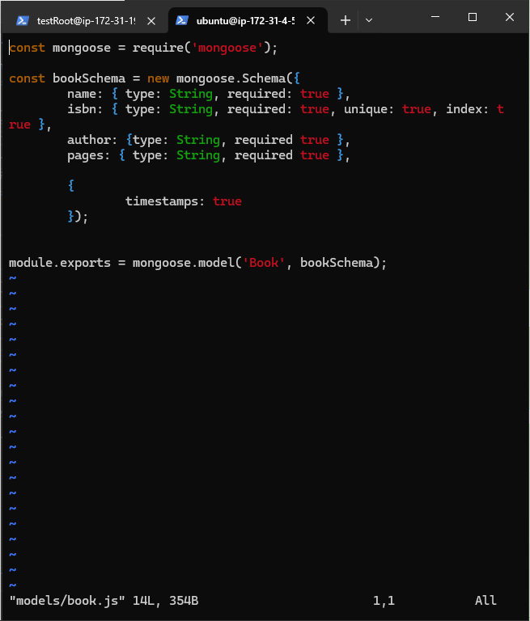

# MEAN STACK IMPLEMENTATION: Building a Book Register app  with MEAN Stack

One of the most popular JavaScript stack used for building web applications is the MEAN Stack (Not mean as in "he is a very mean person" :D). It stands for MongoDB, Express.js, AngularJS (or Angular), and Node.js. 

## What is this MEAN stack all about?

MEAN is like a suite of web technologies. Each letter stands for a different tool:

- **M**ongoDB: it is a-flexible digital filing cabinet or container for your data.
- **E**xpress.js: It is the very helpful software that manages how your app talks to the internet.
- **A**ngularJS: This is the artist/framework-of-arts of this group, it helps your web pages to look good and work smoothly.
- **N**ode.js: This is the engine that powers everything behind the scenes (the backyard).

These tools comes together to help build amazing web applications and one of the best thing about these group of tools is that they all speak one language = JavaScript, making life easier for developers!

## Let's Get Started!

### Step 0: Setting Up Your Workspace

First things first, we need a place to work. Let us set up an EC2 computer in the cloud (via AWS).

1. We'll launch an EC2 instance using AWS..

   
   

2. We'll set up a special key to access our cloud computer securely.

3. We will also set up some security rules to specify what ports to allow and what to deny.

   

4. Finally, we'll connect to our cloud computer using a tool called SSH.
   

### Step 1: Installing Node.js

Node.js is like the center of our operation. follow the steps below to get it installed on your machine:

1. First, we'll update our cloud computer to make sure it has the latest information by running this command on our cli:

   ```bash
   sudo apt update && sudo apt upgrade -y
   ```
   

2. Next thing, we will add some security certificates. 
   ```bash
   sudo apt -y install curl dirmngr apt-transport-https lsb-release ca-certificates
   ```
   
   ```bash
   curl -sL https://deb.nodesource.com/setup_18.x | sudo -E bash -
   ```

3. Now, let us install Node.js:

   ```bash
   sudo apt-get install -y nodejs
   ```
   

### Step 2: Setting Up MongoDB

MongoDB is where we would store all our book information. Let's get set it up and make sure that it is running:

1.  We would start by downloading a special key for MongoDB:

   ```bash
   curl -fsSL https://pgp.mongodb.com/server-7.0.asc | sudo gpg --dearmor -o /usr/share/keyrings/mongodb-archive-keyring.gpg
   ```

2. Then, we will point out to our computer where to find MongoDB for installation by running this command:

   ```bash
   echo "deb [ signed-by=/usr/share/keyrings/mongodb-archive-keyring.gpg ] https://repo.mongodb.org/apt/ubuntu jammy/mongodb-org/7.0 multiverse" | sudo tee /etc/apt/sources.list.d/mongodb-org-7.0.list
   ```


3. Now, let us update our computer's knowledge of where to get apps, then we will proceed and install MongoDB:

   ```bash
   sudo apt-get update
   ```
   .png)

   ```bash
   sudo apt-get install -y mongodb-org
   ```

4. It is now time to start MongoDB and make sure it runs every time we turn on our computer:

   ```bash
   sudo systemctl start mongod
   sudo systemctl enable mongod
   sudo systemctl status mongod
   ```
   
5. We'll also install a helper tool called body-parser:

   ```bash
   sudo npm install body-parser
   ```
   

6. Let's create a special folder for our project:

   ```bash
   mkdir Books && cd Books
   npm init
   ```

   we would also create a file called `server.js` and put our special code in it:

   ```bash
   vim server.js
   ```
   

### Step 3: Setting Up Express and Our Routes

Express is the traffic controller for our app. It helps direct information to where it needs to go.

1. Let's install Express and a tool called Mongoose:

   ```bash
   sudo npm install express mongoose
   ```

2. We will now create a new folder called 'apps' and a file inside it called 'routes.js':

   ```bash
   mkdir apps && cd apps
   vim routes.js
   ```
   

3. We'll also create a 'models' folder and a file called 'book.js' inside it:

   ```bash
   mkdir models && cd models
   vim book.js
   ```
   

### Step 4: Creating Our Web Page with AngularJS

We will now implement AngularJS to help us create a nice-looking, interactive web page for our Book Register web application.

1. First, Let's create a 'public' folder and add a file called 'script.js':

   ```bash
   cd ../..
   mkdir public && cd public
   vim script.js
   ```
   

2. Now, let us create our main web page file, 'index.html':

   ```bash
   vim index.html
   ```
   

3. We will now start our server and see what we have done.

   ```bash
   cd ..
   node server.js
   ```
   


Congratulations! Your Book Register app is now up and running. You can access it using your computer's public address on port 3300.


Go ahead and add some books to your register:


You can even see all your book data in a special format called JSON:


## Conclusion

The purpose of this documentation is to help/guide you through building a full-fledged web application using the MEAN stack! This powerful combination of MongoDB, Express.js, AngularJS, and Node.js would help you to you to create modern, efficient web apps all using JavaScript.
