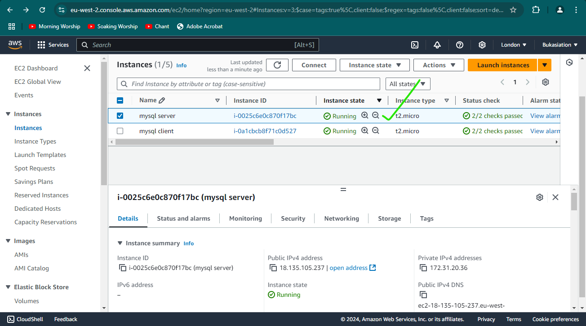
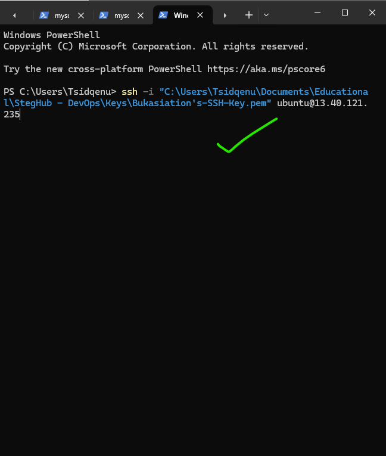

# Building a MySQL Client-Server Setup
This project is all about the communication happening between clients and servers in a network (internet in our case).
What We are going to do here is set up a MySQL Client-Server architecture using Amazon's cloud services and test to see things for ourselves.


## Let's Get Started!

### Step 1: Setting Up Our Virtual Machines

First, we need to create two virtual computers in the cloud. We will call one the "MySQL Server" and the other the "MySQL Client".

1. We will use Amazon's EC2 service to create these virtual computers:

   

   This is what our MySQL Server looks like:
   

   And here's our MySQL Client:
   

2. We will now set up some security rules:

   

### Step 2: Setting Up Our MySQL Server

Now, let's set up the machine environment (our MySQL Server):

1. After creatiing the ec2 instance and doing all the preliminaries stated earlier, we will now connect to our server using a special key:

   ```bash
   chmod 400 my-ec2-key.pem
   ssh -i "my-ec2-key.pem" ubuntu@3.87.82.40
   ```
   

2. Let's make sure our ec2 environment has all the latest packages referenced correctly:

   ```bash
   sudo apt update && sudo apt upgrade -y
   ```
   

3. Time to install MySQL Server – this is the service that we would like to access from the client machine which we would be setting up soon.

   ```bash
   sudo apt install mysql-server -y
   ```
   

4. We'll make sure MySQL starts up every time we open our ec2 machine:

   ```bash
   sudo systemctl enable mysql
   ```
   

### Step 3: Setting Up Our MySQL Client

Now for the supposed user that would be connecting and requesting access to the mysql server (our MySQL Client):

1. Let's connect to our client machine:

   ```bash
   ssh -i "my-ec2-key.pem" ubuntu@54.242.30.171
   ```
   

2. Update everything, just like we did for the server:

   ```bash
   sudo apt update && sudo apt upgrade -y
   ```

3. Install MySQL Client – this action arms our client machine with the ability to connect, make requests and perform sql-like operations on our mysql-server instance/database:

   ```bash
   sudo apt install mysql-client -y
   ```
   

### Step 4: Letting Our Client talk to our Server.

Now, we need to tell our server (MySQL Server) that it's okay for the client (MySQL Client) to peek inside and if necessary, perfom some operation. We can do this by changing some security settings:


### Step 5: Making Our Server More Welcoming

Let's set up our server to accept visitors:

1. Firstly, we will run a security script to make sure our server's configurations is safe and secure:

   ```bash
   sudo mysql_secure_installation
   ```
   Proceed with the prompts to set up the mysql-server with the security settings that pleases you.
2. Now, let us go inside our MySQL server:

   ```bash
   sudo mysql
   ```

3. We will now create a special member card (user account) for our client and a cool database as well:

   ```sql
   CREATE USER 'client'@'%' IDENTIFIED WITH mysql_native_password BY 'NewU$er.3';
   CREATE DATABASE test_db;
   GRANT ALL ON test_db.* TO 'client'@'%' WITH GRANT OPTION;
   FLUSH PRIVILEGES;
   ```
   

4. Let us tell our server to listen for visitors and attend to them:

   ```bash
   sudo vim /etc/mysql/mysql.conf.d/mysqld.cnf
   ```
   Change `bind-address = 127.0.0.1` to `bind-address = 0.0.0.0`

   
 

### Step 6: Visiting Our Server from the Client

Now, from our MySQL Client, let us try to access  our MySQL Server:

```bash
sudo mysql -u client -h 172.31.20.36 -p
```


### Step 7: Playing in Our New Server (accessed from the client)

Let us now make sure we can actually do stuff in our server from our client:

1. First, let us see what cool rooms (databases) we have:

   ```sql
   show databases;
   ```
   

2. Now, let's create a fun table and add some data:

   ```sql
   CREATE TABLE test_db.test_table (
     item_id INT AUTO_INCREMENT,
     content VARCHAR(255),
     student_name VARCHAR(255),
     student_age INT,
     student_class VARCHAR(255),
     student_grade VARCHAR(255),
     PRIMARY KEY(item_id)
   );
   ```
   

   Insert items into this new table by running this command:
   ```sql
   INSERT INTO test_db.schoolRegister (content, student_name, student_age, student_class, student_grade) 
   VALUES ("GOD Has Helped me greatly", "Emmanuel Okose", "777", "Life-long Learning", "EXCELLENT"); 
   ```
   

   Now, to confirm that our command worked successfullly, we will now show the content of the table that we just created and inserted items into, run this command.
   ```sql
   SELECT * FROM test_db.test_table;
   ```
   

### Challenges Faced:

I did face some challenges along the way. One notable issue was configuring the MySQL server to listen for client connections. This challenge arose because I wasn't familiar with Amazon Linux, as I had primarily worked with other Linux distributions. After some research, I discovered the location of the MySQL configuration file for Amazon Linux (/etc/mysql/mysql.conf.d/mysql.cnf) and was able to set the bind address correctly, which resolved the issue.

Another issue came while I was securing the MySQL environment. I was trying to create a user for client access and data manipulation, but I encountered a problem: the default root user had been assigned a password that I wasn’t aware of, since I hadn’t specified one during installation. Through further research, I learned that if you don’t set a password for the root user when running the mysql_secure_installation script on Amazon Linux, a default password is generated which can be gotten by running this command:
```bash 
 sudo cat /var/log/mysqld.log | grep 'temporary password'
 ```
 which you need to change before proceeding with creating a MySQL user.


## Conclusion
Congratulations, bro/sis, You have just built a fully functional MySQL Client-Server setup. this project has helped you to understand how to setup a server database (mysql in our cas) and setup a client to access and perform operations on the server db. How cool is that?


