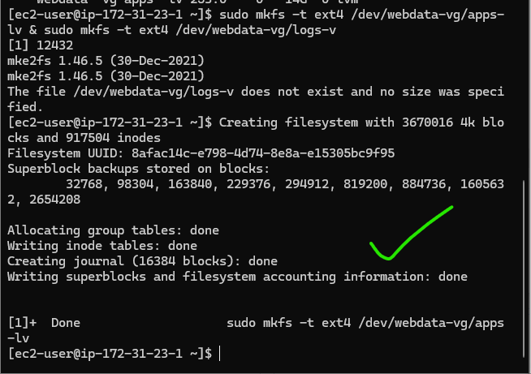
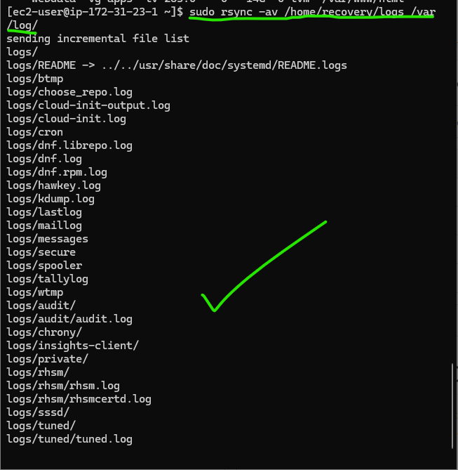
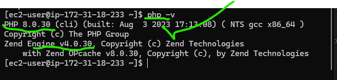

# Setting Up WordPress on AWS: A Step-by-Step Guide

### Introduction
This project is about setting up WordPress on Amazon Web Services (AWS). In further sections of this documentation, we will be using separate EC2 instances for our web server and database, this is a setup that offers improved security and scalability.
In this documentation, you will be shown how I:

Configure EC2 instances with custom storage solutions using Logical Volume Manager (LVM)
Set up a LAMP (Linux, Apache, MySQL, PHP) stack on Red Hat Enterprise Linux
Install and configure WordPress to work with a remote database
Implement basic security measures to protect your setup


## Step 1: Preparing Your Web Server

We would start by setting up our web server. We will use a RedHat EC2 instance for this.

1. Launch a RedHat EC2 instance to serve as your Web Server. Create three 10GB volumes in the same Availability Zone (AZ) as your EC2 instance and attach them one by one.


2. Now we will go into the Linux terminal! Connect to your instance using SSH:

```bash
ssh -i "ec2key.pem" ec2-user@54.174.233.24
```


3. Let's see what storage devices we're working with. Use `lsblk` to check the block devices:

```bash
lsblk
```


You should see your new devices, probably named `xvdf`, `xvdg`, and `xvdh`.

4. If you want to see your current disk space. Use `df -h`:

```bash
df -h
```

5. Now, let's partition those new disks using `gdisk`:

```bash
sudo gdisk /dev/xvdf
sudo gdisk /dev/xvdg
sudo gdisk /dev/xvdh
```


After partitioning, check your work with `lsblk`:

```bash
lsblk
```


6. Time to install LVM (Logical Volume Manager). This will help us to manage our storage more flexibly:

```bash
sudo yum install lvm2 -y
```


7. Let's create physical volumes (PVs) from our partitions:

```bash
sudo pvcreate /dev/xvdf1 /dev/xvdg1 /dev/xvdh1
sudo pvs
```


8. Next, we will group these PVs into a volume group (VG). we will call it `webdata-vg`:

```bash
sudo vgcreate webdata-vg /dev/xvdf1 /dev/xvdg1 /dev/xvdh1
sudo vgs
```


9. Now for the logical volumes (LVs). We will create two: `apps-lv` for our website data, and `logs-lv` for our logs:

```bash
sudo lvcreate -n apps-lv -L 14G webdata-vg
sudo lvcreate -n logs-lv -L 14G webdata-vg
sudo lvs
```


10. Let's double-check our setup:

```bash
sudo vgdisplay -v
lsblk
```


Now, let us format these volumes with ext4 filesystem:

```bash
sudo mkfs.ext4 /dev/webdata-vg/apps-lv
sudo mkfs.ext4 /dev/webdata-vg/logs-lv
```


11. We need directories to mount our volumes. Let us create them:

```bash
sudo mkdir -p /var/www/html
sudo mkdir -p /home/recovery/logs
```

12. Before we mount our logs volume, let's back up the existing log data:

```bash
sudo rsync -av /var/log /home/recovery/logs
```


13. Time to mount our volumes:

```bash
sudo mount /dev/webdata-vg/apps-lv /var/www/html
sudo mount /dev/webdata-vg/logs-lv /var/log
```

14. Now, let's restore our backed-up log files:

```bash
sudo rsync -av /home/recovery/logs/log/ /var/log
```


15. We want these mounts to persist after reboots, so let's update the `/etc/fstab` file:

```bash
sudo blkid
sudo vi /etc/fstab
```


16. Finally, let's test our configuration and make sure everything's working:

```bash
sudo mount -a
sudo systemctl daemon-reload
df -h
```


Great job! You've successfully set up your web server's storage. In the next step, we'll prepare the database server.

## Step 2: Preparing the Database Server

Now, let's set up our database server. The process is similar to the web server, but with a few key differences.

1. Launch another RedHat EC2 instance for your DB Server. Create and attach three 10GB volumes, just like before.


2. SSH into your new instance:

```bash
ssh -i "ec2key.pem" ec2-user@18.209.18.145
```


3. Check your block devices:

```bash
lsblk
```


4. Partition the new disks:

```bash
sudo gdisk /dev/xvdf
sudo gdisk /dev/xvdg
sudo gdisk /dev/xvdh
```


Check your work:
```bash
lsblk
```


5. Install LVM:

```bash
sudo yum install lvm2 -y
```


6. Create PVs and VG:

```bash
sudo pvcreate /dev/xvdf1 /dev/xvdg1 /dev/xvdh1
sudo pvs
sudo vgcreate database-vg /dev/xvdf1 /dev/xvdg1 /dev/xvdh1
sudo vgs
```


7. Create a single LV for our database:

```bash
sudo lvcreate -n db-lv -L 20G database-vg
sudo lvs
```


8. Format and mount the LV:

```bash
sudo mkfs.ext4 /dev/database-vg/db-lv
sudo mount /dev/database-vg/db-lv /db
```


9. Update `/etc/fstab` for persistent mounting:

```bash
sudo blkid
sudo vi /etc/fstab
```


10. Test your configuration:

```bash
sudo mount -a
sudo systemctl daemon-reload
df -h
```


Excellent! Your database server is now set up and ready to go. Let's move on to installing WordPress.

## Step 3: Installing WordPress on the Web Server

Now that our servers are set up, it's time to install WordPress on our web server.

1. First, let's update our system:

```bash
sudo yum -y update
```

2. Install Apache and its dependencies:

```bash
sudo yum install wget httpd php-fpm php-json
```


3. Now, let's install PHP. We'll use the Remi repository for this:

```bash
sudo dnf install https://dl.fedoraproject.org/pub/epel/epel-release-latest-9.noarch.rpm
sudo dnf install dnf-utils http://rpms.remirepo.net/enterprise/remi-release-9.rpm
```


Check available PHP modules:
```bash
sudo dnf module list php
```


Enable PHP 8.2:
```bash
sudo dnf module reset php
sudo dnf module enable php:remi-8.2
```


Install PHP and its modules:
```bash
sudo dnf install php php-opcache php-gd php-curl php-mysqlnd
```


Verify the PHP version:
```bash
php -v
```


Start and enable PHP-FPM:
```bash
sudo systemctl start php-fpm
sudo systemctl enable php-fpm
sudo systemctl status php-fpm
```


4. Configure SELinux policies:

```bash
sudo chown -R apache:apache /var/www/html
sudo chcon -t httpd_sys_rw_content_t /var/www/html -R
sudo setsebool -P httpd_execmem 1
sudo setsebool -P httpd_can_network_connect=1
sudo setsebool -P httpd_can_network_connect_db=1
```
_communicate_to_db_and_network.png)

Restart Apache:
```bash
sudo systemctl restart httpd
```

5. Download and set up WordPress:

```bash
sudo mkdir wordpress && cd wordpress
sudo wget http://wordpress.org/latest.tar.gz
sudo tar xzvf latest.tar.gz
cd wordpress/
sudo cp -R wp-config-sample.php wp-config.php
cd ..
sudo cp -R wordpress/. /var/www/html/
```


6. Now, let's set up MySQL on our DB Server:

Update the system:
```bash
sudo yum update -y
```


Install MySQL Server:
```bash
sudo yum install mysql-server -y
```


Start and enable MySQL:
```bash
sudo systemctl start mysqld
sudo systemctl enable mysqld
sudo systemctl status mysqld
```


7. Configure the database for WordPress:

Secure your MySQL installation:
```bash
sudo mysql_secure_installation
```


Create the WordPress database and user:
```bash
sudo mysql -u root -p

CREATE DATABASE wordpress_db;
CREATE USER 'wordpress'@'172.31.31.27' IDENTIFIED WITH mysql_native_password BY 'Admin123$';
GRANT ALL PRIVILEGES ON wordpress_db.* TO 'wordpress'@'172.31.31.27' WITH GRANT OPTION;
FLUSH PRIVILEGES;
show databases;
exit
```


Set the bind address in MySQL configuration:
```bash
sudo vi /etc/my.cnf
sudo systemctl restart mysqld
```


8. Configure WordPress to connect to the remote database:

Open MySQL port 3306 on the DB Server EC2 instance, allowing access only from the Web Server's internal IP address.


Install MySQL client on the Web Server:
```bash
sudo yum install mysql-server
sudo systemctl start mysqld
sudo systemctl enable mysqld
sudo systemctl status mysqld
```


Edit the WordPress configuration:
```bash
cd /var/www/html
sudo vi wp-config.php
sudo systemctl restart httpd
```


Disable the Apache default page:
```bash
sudo mv /etc/httpd/conf.d/welcome.conf /etc/httpd/conf.d/welcome.conf_backup
```

Test the connection to the DB Server:
```bash
sudo mysql -h 172.31.30.142 -u wordpress -p
show databases;
exit;
```


Now, access your WordPress site using your Web Server's public IP address. You should see the WordPress installation page.


## Congratulations! 
You have successfully set up WordPress on AWS using separate Web and DB servers. Your WordPress site is now ready for content creation and customization.