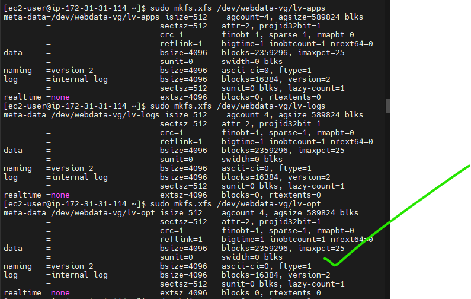
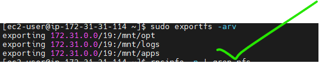
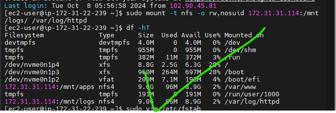

# DevOps Tooling Website Solution

## Introduction

This project implements a solution comprising the following components:

- Infrastructure: AWS
- Web Server Linux: Red Hat Enterprise Linux 9
- Database Server: Ubuntu Linux + MySQL
- Storage Server: Red Hat Enterprise Linux 9 + NFS Server
- Programming Language: PHP
- Code Repository: GitHub

The diagram below illustrates the architecture of the solution.


## Step 1 - Preparing the NFS Server

### 1. First, Spin up an EC2 instance with RHEL Operating System


### 2. Configure Logical Volume Management on the Server

We will format the LVM as XFS and create three Logical Volumes: lv-opt, lv-apps, and lv-logs. Then, we'll create mount points on the /mnt directory for these logical volumes:

- Mount lv-apps on /mnt/apps - To be used by web servers
- Mount lv-logs on /mnt/logs - To be used by web server logs
- Mount lv-opt on /mnt/opt - To be used by Jenkins server in the next project

#### Create and Attach Volumes

First, let's create 3 volumes in the same Availability Zone as the NFS Server EC2, each of 10GB, and attach them one by one to the NFS Server.


#### Configure the Server

Now, let's access the Linux terminal to begin configuration:

```bash
ssh -i "my-devec2key.pem" ec2-user@18.224.38.96
```


Use `lsblk` to inspect the block devices attached to the server:

```bash
lsblk
```


All devices in Linux reside in the /dev/ directory. Inspect it with `ls /dev/` and ensure all 3 newly created devices are there. Their names will likely be `xvdf`, `xvdg`, and `xvdh`.

#### Create Partitions

We'll use the `gdisk` utility to create a single partition on each of the 3 disks:

```bash
sudo gdisk /dev/xvdf
sudo gdisk /dev/xvdg
sudo gdisk /dev/xvdh
```


Now, let's view the newly configured partitions:

```bash
lsblk
```


#### Install LVM2

Install the `lvm2` package:

```bash
sudo yum install lvm2 -y
```


#### Create Physical Volumes

Use the `pvcreate` utility to mark each of the 3 disks as physical volumes (PVs) to be used by LVM:

```bash
sudo pvcreate /dev/xvdf1 /dev/xvdg1 /dev/xvdh1
sudo pvs
```


#### Create Volume Group

Use the `vgcreate` utility to add all 3 PVs to a volume group (VG). We'll name the VG `webdata-vg`:

```bash
sudo vgcreate webdata-vg /dev/xvdf1 /dev/xvdg1 /dev/xvdh1
sudo vgs
```


#### Create Logical Volumes

Now, let's use the `lvcreate` utility to create 3 logical volumes: `lv-apps`, `lv-logs`, and `lv-opt`:

```bash
sudo lvcreate -n lv-apps -L 9G webdata-vg
sudo lvcreate -n lv-logs -L 9G webdata-vg
sudo lvcreate -n lv-opt -L 9G webdata-vg

sudo lvs
```


#### Verify the Setup

To view the complete setup of VG, PV, and LV:

```bash
sudo vgdisplay -v
lsblk
```


#### Format Logical Volumes

We'll use `mkfs.xfs` to format the logical volumes with XFS filesystem:

```bash
sudo mkfs.xfs /dev/webdata-vg/lv-apps
sudo mkfs.xfs /dev/webdata-vg/lv-logs
sudo mkfs.xfs /dev/webdata-vg/lv-opt
```



#### Create Mount Points

Create mount points on the `/mnt` directory:

```bash
sudo mkdir -p /mnt/{apps,logs,opt}
sudo mount /dev/webdata-vg/lv-apps /mnt/apps
sudo mount /dev/webdata-vg/lv-logs /mnt/logs
sudo mount /dev/webdata-vg/lv-opt /mnt/opt
```


### 3. Install NFS Server

Install NFS Server, configure it to start on reboot, and ensure it's running:

```bash
sudo yum update -y
sudo yum install nfs-utils -y
sudo systemctl start nfs-server.service
sudo systemctl enable nfs-server.service
sudo systemctl status nfs-server.service
```


### 4. Export the Mounts for Webservers' Subnet CIDR to Connect as Clients

Set up permissions that will allow the Web Servers to read, write, and execute files on NFS:

```bash
sudo chown -R nobody: /mnt/{apps,logs,opt}
sudo chmod -R 777 /mnt/{apps,logs,opt}
sudo systemctl restart nfs-server.service
```


Configure access to NFS for clients within the same subnet (example Subnet CIDR - 172.31.32.0/20):

```bash
sudo vi /etc/exports

/mnt/apps 172.31.0.0/20(rw,sync,no_all_squash,no_root_squash)
/mnt/logs 172.31.0.0/20(rw,sync,no_all_squash,no_root_squash)
/mnt/opt 172.31.0.0/20(rw,sync,no_all_squash,no_root_squash)

sudo exportfs -arv
```




### 5. Check Which Port is Used by NFS and Open It Using Security Group

```bash
rpcinfo -p | grep nfs
```


**Note**: For NFS Server to be accessible from the client, we must open the following ports: TCP 111, UDP 111, UDP 2049, and TCP 2049. Set the Web Server subnet CIDR as the source in the security group.


## Step 2 - Configure the Database Server

### Launch an Ubuntu EC2 Instance for DB Server


Access the instance to begin configuration:

```bash
ssh -i "my-devec2key.pem" ubuntu@18.116.87.242
```


Update and upgrade Ubuntu:  

```bash
sudo apt update && sudo apt upgrade -y
```


### 1. Install MySQL Server

Install MySQL server:

```bash
sudo apt install mysql-server -y
```


Run MySQL secure installation script:

```bash
sudo mysql_secure_installation
```


### 2. Create a Database Named `tooling`

### 3. Create a Database User Named `webaccess`

### 4. Grant Permission to `webaccess` User on `tooling` Database

Connect to MySQL and execute the following commands:

```sql
sudo mysql

CREATE DATABASE tooling;
CREATE USER 'webaccess'@'172.31.0.0/20' IDENTIFIED WITH mysql_native_password BY 'Admin123$';
GRANT ALL PRIVILEGES ON tooling.* TO 'webaccess'@'172.31.0.0/20' WITH GRANT OPTION;
FLUSH PRIVILEGES;
SHOW DATABASES;

USE tooling;
SELECT host, user FROM mysql.user;
EXIT;
```


Set Bind Address and restart MySQL:

```bash
sudo vi /etc/mysql/mysql.conf.d/mysqld.cnf

sudo systemctl restart mysql
sudo systemctl status mysql
```


Open MySQL port 3306 on the DB Server EC2. Access to the DB Server should be allowed only from the Subnet CIDR configured as the source.


## Step 3 - Prepare the Web Servers

We need to ensure that our Web Servers can serve the same content from a shared storage solution - NFS Server and MySQL database. 

In this step, we will do the following:
- Configure NFS client (This step will be done on all three servers)
- Deploy a Tooling application to our Web Servers into a shared NFS folder
- Configure the Web Servers to work with a single MySQL database

### Web Server 1

#### 1. Launch a New EC2 Instance with RHEL Operating System


#### 2. Install NFS Client

```bash
sudo yum install nfs-utils nfs4-acl-tools -y
```


#### 3. Mount /var/www/ and Target the NFS Server's Export for apps

NFS Server private IP address = 172.31.1.209

```bash
sudo mkdir /var/www
sudo mount -t nfs -o rw,nosuid 172.31.1.209:/mnt/apps /var/www
```

#### 4. Verify NFS Mount and Ensure Persistence After Reboot

```bash
df -h
sudo vi /etc/fstab
```

Add the following line:
```
172.31.1.209:/mnt/apps /var/www nfs defaults 0 0
```


#### 5. Install Remi's Repository, Apache and PHP

```bash
sudo yum install httpd -y

sudo dnf install dnf-utils http://rpms.remirepo.net/enterprise/remi-release-9.rpm
sudo dnf module reset php
sudo dnf module enable php:remi-8.2
sudo dnf install php php-opcache php-gd php-curl php-mysqlnd
sudo systemctl start php-fpm
sudo systemctl enable php-fpm
sudo setsebool -P httpd_execmem 1
sudo setsebool -P httpd_can_network_connect=1
sudo setsebool -P httpd_can_network_connect_db=1
```


### Web Server 2

Repeat the same steps as Web Server 1, with the following changes:

#### 1. Launch Another New EC2 Instance with RHEL Operating System


#### 2-5. Follow the Same Steps as Web Server 1

The commands and processes will be the same, but the output might differ slightly.

### Web Server 3

Repeat the same steps as Web Server 1 and 2, with the following changes:

#### 1. Launch Another New EC2 Instance with RHEL Operating System


#### 2-5. Follow the Same Steps as Web Server 1 and 2

The commands and processes will be the same, but the output might differ slightly.

#### 6. Verify Apache Files and Directories

Verify that Apache files and directories are available on the Web Servers in `/var/www` and also on the NFS Server in `/mnt/apps`. If the same files are present in both locations, it means NFS was mounted correctly.

Create a test file on Web Server 1 and verify its presence on Web Server 2:


#### 7. Mount Log Folder to NFS Server

Locate the log folder for Apache on the Web Server and mount it to the NFS server's export for logs. Ensure the mount point persists after reboot:

```bash
sudo vi /etc/fstab
```

Add the following line:
```
172.31.1.209:/mnt/logs /var/log/httpd nfs defaults 0 0
```




#### 8. Fork the Tooling Source Code

Fork the tooling source code from the StepHub GitHub Account:


#### 9. Deploy the Tooling Website's Code to the Web Server

Ensure that the `html` folder from the repository is deployed to `/var/www/html`

Install Git:


Initialize the directory and clone the tooling repository:


**Note**: To access the website on a browser:
- Ensure TCP port 80 is open on the Web Server.
- If a 403 Error occurs, check permissions to the `/var/www/html` folder and also disable SELinux:

```bash
sudo setenforce 0
sudo vi /etc/sysconfig/selinux

# Set SELINUX=disabled

sudo systemctl restart httpd
```


#### 10. Update Website's Configuration to Connect to the Database

Update the `/var/www/html/functions.php` file:

```bash
sudo vi /var/www/html/functions.php
```


Apply the `tooling-db.sql` script:

```bash
sudo mysql -h 172.31.8.129 -u webaccess -p tooling < tooling-db.sql
```


Access the database server from the Web Server:

```sql
sudo mysql -h 172.31.8.129 -u webaccess -p
```


#### 11. Create a New Admin User in MySQL

Create a new admin user with the username: `myuser` and password: `password`:

```sql
INSERT INTO users (id, username, password, email, user_type, status) 
VALUES (2, 'myuser', '5f4dcc3b5aa765d61d8327deb882cf99', 'user@mail.com', 'admin', '1');
```

.png)

#### 12. Access the Website

Open a browser and access the website using the Web Server's public IP address: `http://<Web-Server-public-IP-address>/index.php`. Log into the website with the `myuser` user.

**From the first Web Server:**


**Accessed from the the second web server:**


**Accessed from the the third web server:**


## Conclusion

We have now successfully set up a multi-tier web application architecture using:
- An NFS server for shared storage
- A MySQL database server
- Multiple web servers running Apache and PHP

This setup was done in such a way that allows/permits for a scalable and distributed web application, with shared storage for consistency across web servers and a centralized database for data management.

Some of the vital highlight from this project are:
1. Proper configuration of NFS for shared storage across multiple servers
2. Setting up and securing a MySQL database server
3. Configuring web servers with Apache and PHP to work with NFS and MySQL
4. The importance of security configurations, including firewall rules and SELinux settings

This project provides a solid foundation for hosting web applications in a scalable and maintainable infrastructure.